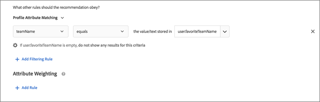
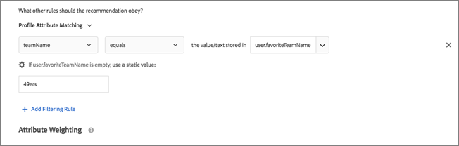

#  Utilizzare regole di inclusione dinamiche e statiche{#use-dynamic-and-static-inclusion-rules}

Informazioni su come creare regole di inclusione per criteri e promozioni e come aggiungere regole di filtro dinamiche o statiche per ottenere migliori risultati.

Le regole di inclusione per i criteri e le promozioni possono essere create e utilizzate con processi simili, così come sono simili i rispettivi casi ed esempi di utilizzo. Questo argomento tratta i criteri e le promozioni, nonché l’utilizzo delle regole di inclusione.

## Aggiunta di regole di filtro ai criteri {#section_CD0D74B8D3BE4A75A78C36CF24A8C57F}

Durante la [creazione di criteri](../../c-recommendations/c-algorithms/create-new-algorithm.md#task_8A9CB465F28D44899F69F38AD27352FE), fai clic su **[!UICONTROL Aggiungi regola di filtro]** in **[!UICONTROL Regole di inclusione]**.


Le opzioni disponibili dipendono dal settore verticale selezionato e della chiave consiglio.

## Aggiunta di regole di filtro alle promozioni {#section_D59AFB62E2EE423086281CF5D18B1076}

Durante la [creazione di una promozione](../../c-recommendations/t-create-recs-activity/adding-promotions.md#task_CC5BD28C364742218C1ACAF0D45E0E14), seleziona **[!UICONTROL Promuovi per attributo]**, quindi fai clic su **[!UICONTROL Aggiungi regola filtro]**.


## Tipi di filtro {#section_0125F1ED10A84C0EB45325122460EBCD}

Nella tabella seguente sono elencati i tipi di opzioni di filtro per criteri e promozioni:

| Tipo | Opzione | Operatori disponibili |
|--- |--- |--- |
| **Filtraggio dinamico** | **Corrispondenza attributo di entità:** consente di filtrare in modo dinamico confrontando un pool di potenziali articoli consigliati con un articolo specifico con cui gli utenti hanno interagito.<br>Ad esempio, per consigliare solo gli articoli con lo stesso marchio dell’articolo corrente. | uguale a<br>non uguale a<br>compreso tra<br>contiene<br>non contiene<br>inizia con<br>termina con<br>valore presente<br>valore non presente<br>maggiore o uguale a<br>minore o uguale a |
|  | **Corrispondenza attributo profilo:** consente di filtrare dinamicamente confrontando gli articoli (entità) con un valore presente nel profilo dell’utente.<br>Ad esempio, per consigliare solo gli articoli del marchio preferito del visitatore. | uguale a<br> non uguale a<br>contiene<br>non contiene<br>inizia con<br>termina con<br>maggiore o uguale a<br>minore o uguale a<br>compreso tra |
|  | **Corrispondenza parametro:** consente di filtrare dinamicamente confrontando gli articoli (entità) con un valore nella richiesta (API o mbox).<br>Ad esempio, per consigliare solo i contenuti che corrispondono al parametro di pagina “settore”.<br>**Importante:** se l’attività è stata creata prima del 31 ottobre 2016, la sua consegna avrà esito negativo se si utilizza il filtro “Corrispondenza parametro”. Per risolvere questo problema:<ul><li>Crea una nuova attività e aggiungi i relativi criteri.</li><li>Utilizza un criterio che non contenga il filtro “Corrispondenza parametro”.</li><li>Rimuovi il filtro “Corrispondenza parametro” dai criteri.</li></ul> | è uguale a<br>non uguale a<br>contiene<br>non contiene<br>inizia con<br>termina con<br>maggiore o uguale a<br>minore o uguale a<br>compreso tra |
| **Filtra per valore** | **Filtro statico:** consente di immettere manualmente uno o più valori statici da utilizzare come filtro.<br>Ad esempio, per consigliare solo i contenuti con una classificazione MPAA di “G” o “PG”. | uguale a<br>non uguale a<br>contiene<br>non contiene<br>inizia con<br>termina con<br>valore presente<br>valore non presente<br>maggiore o uguale a<br>minore o uguale a |

>[!NOTE]
>
>Se hai dimestichezza con la configurazione delle regole di inclusione prima della versione di Target 17.6.1 (giugno 2017), noterai che alcune delle opzioni e degli operatori sono cambiati. Vengono visualizzati solo gli operatori applicabili all’opzione selezionata; alcuni altri operatori sono stati rinominati (“corrisponde a” è ora “è uguale a”), per maggiore coerenza e intuitività. Tutte le regole di esclusione esistenti create prima di questa versione sono state automaticamente convertite nella nuova struttura. Non è necessaria alcuna modifica da parte dell’utente.

È possibile creare tutte le regole di inclusione necessarie. Le regole di inclusione vengono collegate mediante un operatore E. Gli articoli verranno inclusi in un consiglio solo se vengono soddisfatte tutte le regole.

I criteri e le promozioni dinamici sono molto più potenti dei criteri e delle promozioni statici; producono risultati migliore e un maggiore coinvolgimento del visitatore. I seguenti esempi ti daranno idee su come utilizzare le promozioni dinamiche nelle tue attività di marketing:

**È uguale a:** utilizzando l'operatore “è uguale a” nelle promozioni dinamiche, quando un visitatore sta visualizzando un articolo sul tuo sito web (ad esempio un prodotto, un articolo o un filmato), puoi promuovere altri oggetti appartenenti a:

* lo stesso marchio
* la stessa categoria
* la stessa categoria E lo stesso marchio
* lo stesso store

**È diverso da:** utilizzando l'operatore “è diverso da” nelle promozioni dinamiche, quando un visitatore sta visualizzando un articolo sul tuo sito web (ad esempio un prodotto, un articolo o un filmato), puoi promuovere altri articoli appartenenti a:

* una serie TV diversa
* un genere diverso
* una serie di prodotti diversi
* un ID di stile diverso

**È tra:** utilizzando l'operatore “è tra” nelle promozioni dinamiche, quando un visitatore sta visualizzando un articolo sul tuo sito web (ad esempio un prodotto, un articolo o un filmato), puoi promuovere altri articoli che sono:

* più costosi
* meno costosi
* più o meno costosi del 30%
* episodi successivi nella stessa stagione
* libri precedenti in una collana

## Gestione dei valori vuoti durante l’applicazione di filtri per corrispondenza attributo entità, attributo profilo e parametri {#section_7D30E04116DB47BEA6FF840A3424A4C8}

È possibile scegliere diverse opzioni per gestire i valori vuoti durante l'applicazione di filtri per corrispondenza attributo entità, corrispondenza attributo profilo e corrispondenza parametro per i criteri e le promozioni di uscita.

In precedenza, non veniva restituito alcun risultato se un valore era vuoto. L'elenco a discesa “Se *x* è vuoto” consente di scegliere l'azione da eseguire se i criteri hanno valori vuoti, come illustrato di seguito:


Per selezionare l’azione desiderata, passa il puntatore sull’icona ingranaggio (), quindi scegli l’azione desiderata:

| Azione | Disponibile per | Dettagli |
|--- |--- |--- |
| Ignora questa regola di filtro | Corrispondenza attributo profilo<br>Corrispondenza parametro | Questa è l'azione predefinita per Corrispondenza attributo profilo e Corrispondenza parametro.<br>Questa opzione specifica che la regola viene ignorata. Ad esempio, se sono presenti tre regole di filtro e la terza regola non passa alcun valore, invece di non restituire alcun risultato si può semplicemente ignorare la terza regola con valori vuoti. |
| Non mostrare alcun risultato per questo criterio | Corrispondenza attributo entità<br>Corrispondenza attributo profilo<br>Corrispondenza parametro | Questa è l'azione predefinita per Corrispondenza attributo entità.<br>Corrisponde al modo in cui Target gestiva i valori vuoti prima dell’aggiunta di questa opzione, ossia non verrà visualizzato alcun risultato per questo criterio. |
| Usa un valore statico | Corrispondenza attributo entità<br>Corrispondenza attributo profilo<br>Corrispondenza parametro | Se un valore è vuoto, è possibile scegliere di utilizzare un valore statico. |

Come esempio di gestione dei valori vuoti, considera lo [Scenario 9](../../c-recommendations/c-algorithms/use-dynamic-and-static-inclusion-rules.md#section_9873E2F22E094E479569D05AD5BB1D40) qui sotto:

## Scenari di filtri dinamici {#section_9873E2F22E094E479569D05AD5BB1D40}

**Scenario 1:** invece di associare un articolo di un catalogo ad altri articoli di un catalogo utilizzando un filtro statico, è possibile utilizzare un filtro dinamico per associare un articolo di un catalogo a un attributo del profilo del visitatore.

Ad esempio, con l’opzione [!UICONTROL Corrispondenza attributo profilo] puoi creare una regola che consigli solo gli articoli il sui marchio è uguale al valore o al testo memorizzato in `profile.favoritebrand`. Con tale regola, se un visitatore cerca dei pantaloncini da corsa di una data marca, i consigli che verranno visualizzati proporranno articoli della marca preferita dell’utente (in base al valore memorizzato in `profile.favoritebrand` nel profilo del visitatore).

**Scenario 2:** prima che Target offrisse la possibilità di utilizzare le informazioni sugli attributi del profilo di un visitatore, per creare annunci di lavoro da presentare solo a chi era in cerca di lavoro da un luogo specifico e con un titolo di studio specifico, avresti dovuto impostare molte attività con tipi di pubblico diversi (una per ogni città e titolo di studio). Per annunci di lavoro in molte città, questo compito poteva diventare molto gravoso.

Ora puoi utilizzare le regole di inclusione per associare il luogo e il titolo di studio dal profilo del visitatore che cerca lavoro a un'offerta di lavoro, come mostrato nell’esempio seguente:


L'offerta di lavoro a sinistra richiede che il visitatore sia a San Francisco, New York o Los Angeles (`entity.jobCity`) e che abbia come titolo di studio una laurea in informatica o un master in business administration (`entity.requiredDegree`).

La persona che cerca lavoro, a destra, è a Los Angeles (`profile.usersCity`) e ha un master in business administration (`profile.degree`).

Con un filtro dinamico per Corrispondenza attributo profilo, puoi creare il filtro riportato nella parte inferiore dell’illustrazione precedente che consiglierà al visitatore solo gli annunci di lavoro idonei in base al luogo in cui si trova e al suo titolo di studio.

I criteri per questi filtri sono i seguenti:

```
entity.jobCity - equals - the value/text stored in - profile.usersCity
```

e

```
entity.requiredDegree - equals - the value/text stored in - profile.degree
```

I filtri dinamici che utilizzano la corrispondenza attributo profilo consentono di ottenere di più con un minor numero di attività, come mostrato di seguito:


Il diagramma nella parte superiore dell'illustrazione qui sopra mostra come funzionano i filtri dinamici che utilizzano gli attributi del profilo. È possibile creare un pubblico che utilizza criteri (nell’esempio precedente, città e titolo di studio) tali da presentare un annuncio di lavoro pertinente per il visitatore. Questo filtro funziona per un numero quasi infinito di possibilità per quanto riguarda la posizione e il titolo di studio.

I diagrammi nella parte inferiore dell'illustrazione rappresentano solo due dei diversi tipi di pubblico che si sarebbero dovuti impostare in assenza di un criterio o una promozione con filtri dinamici basati sugli attributi del profilo. Avresti dovuto impostare un pubblico diverso per ogni città e per ogni titolo di studio. Ben presto ti saresti ritrovato con una quantità di tipi di pubblico ingestibile, soprattutto se avessi avuto a che fare con una gran mole di annunci in varie città.

Senza utilizzare gli attributi del profilo, il pubblico e le esperienze appariranno come la metà superiore dell'illustrazione seguente, ma con coppie di pubblico/esperienze aggiuntive per ogni scenario immaginabile.


I filtri dinamici basati su attributi di profilo che corrispondono agli attributi dell'utente consentono di impostare un pubblico che dinamicamente, offre al volo l'esperienza desiderata, come mostrato nella metà inferiore dell'illustrazione precedente.

Con le informazioni richieste incorporate in ogni annuncio di lavoro e i dati necessari registrati nei profili utente, la creazione e la gestione dei tipi di pubblico e delle esperienze è notevolmente semplificata.

**Scenario 3:** una società sportiva vuole mostrare ai visitatori gli articoli del suo sito web pertinenti per le squadre preferite di ciascun visitatore. Ogni articolo potrebbe quindi avere un campo con `entity.featuredTeams` che include tutte le squadre idonee per l’articolo in questione. Ogni attributo di profilo potrebbe avere un elenco di squadre per le quali l’utente esprime la sua preferenza, tramite “sottoscrizione”.

Una regola di inclusione potrebbe ad esempio presentarsi così:

Includere solo quando uno o più valori di `entity.featuredTeam` corrispondono a `profile.favoriteTeams`.

Considera gli esempi seguenti tenendo presente che almeno un intero valore di stringa deve corrispondere (completamente). Non esiste alcuna corrispondenza se nessuna delle stringhe corrisponde. Osserva come gli attributi entità sono considerati separatamente nelle regole corrispondenti. Questo consente di cercare una corrispondenza tra diversi campi di metadati.

Esempi/descrizioni

`"entity.featuredTeam" - "Athletics,Red Sox" equals "profile.favoriteTeams" - "Athletics"`

Corrispondenza, perché “Athletics” è uguale, anche se “Red Sox” non lo è.

`"entity.featuredTeam" - "Athletics,Red Sox" equals "profile.favoriteTeams" - "Athletics,Red Sox"`

Corrispondenza, perché sia “Athletics” che “Red Sox” sono uguali, anche se non è necessario la corrispondenza di entrambe le squadre.

`"entity.featuredTeam" - "Athletics" equals "profile.favoriteTeams" - "Athletics,Red Sox"`

Corrispondenza, perché “Athletics” è uguale, anche se “Red Sox” non lo è.

`"entity.featuredTeam" - "Athletics" equals "profile.favoriteTeams" - "Athletic"`

Nessuna corrispondenza, perché “Athletics” (plurale) non è uguale ad “Athletic” (singolare).

In alternativa, è possibile utilizzare “contiene” invece di “è uguale a” per rendere effettiva questa corrispondenza.

`"entity.featuredTeam" - "Athletic" equals "profile.favoriteTeams" - "Athletics"`

Nessuna corrispondenza, perché “Athletic” (singolare) non è uguale ad “Athletics” (plurale).

In alternativa, è possibile utilizzare “inizia con” invece di “è uguale a” per rendere effettiva questa corrispondenza.

**Scenario 4:** nell'illustrazione seguente viene mostrato come utilizzare gli operatori “è uguale a” ed “è tra” per promuovere oggetti più costosi provenienti dalla stessa categoria e dallo stesso marchio. Ad esempio, una società di abbigliamento sportivo può promuovere scarpe da corsa più costose, nel tentativo di attuare una strategia di up-selling per un visitatore in cerca di pantaloncini da corsa.


In questo esempio vengono utilizzate le regole seguenti:

```
category - equals - current item's - category 
And 
brand - equals - current item's - brand 
And 
value - is between - 100% and 1000% of - current item's - value
```

>[!NOTE]
>
>Non è possibile modificare la chiave in una promozione dinamica con più regole (il terzo elenco a discesa nelle prime due regole; in questa illustrazione si tratta di “Dell’articolo corrente”).

**Scenario 5:** nella seconda illustrazione viene mostrato come utilizzare gli operatori “è uguale a” ed “è tra” per promuovere articoli più costosi della stessa categoria, dello stesso marchio e del marchio del distributore. Ad esempio, una società di forniture per ufficio può promuovere cartucce di toner più costose, sia della stessa marca che del proprio marchio, nel tentativo di attuare una strategia di up-selling per un visitatore in cerca di stampanti.


In questo esempio vengono utilizzate le regole seguenti:

```
category - equals - current item's - category 
And 
IsHouseBrand - equals - true 
And 
value - is between - 100% and 1000% of - current item's - value
```

Osserva che in questo esempio vengono utilizzate due regole dinamiche e una regola statica.

**Scenario 6:** nella terza illustrazione viene mostrato come utilizzare l'operatore “è diverso da” per promuovere una serie che non sia uguale a quella che il visitatore sta guardando. Ad esempio, un sito web multimediale potrebbe promuovere una serie televisiva diversa dalla serie che il visitatore sta guardando.


In questo esempio viene utilizzata la regola seguente:

```
series - does not equal - current item's - series
```

**Scenario 7:** nella quarta illustrazione viene mostrato come promuovere articoli compatibili con l'ultimo articolo acquistato dal visitatore. Ad esempio, se un visitatore ha acquistato un nuovo televisore, è possibile promuovere dinamicamente un cavo HDMI.


In questo esempio vengono utilizzate le regole seguenti:

```
id - equals - last purchased item's - compatibleAccessoryids
```

**Scenario 8:** nell'illustrazione successiva viene illustrato come promuovere gli articoli in offerta con un prezzo tra il 90 e 110% dell'articolo attualmente visualizzato dal visitatore. Ad esempio, se un visitatore sta osservando un televisore, si potrebbero promuovere dinamicamente televisori simili che sono in offerta e che rientrano nella stessa fascia di prezzo.


In questo esempio vengono utilizzate le regole seguenti:

```
salesPrice - is between - 90% and 110% of - current item's - price
```

**Scenario 9:** consideriamo lo scenario seguente per un sito di notizie sportive su come gestire i valori vuoti, come spiegato in [Gestione dei valori vuoti durante l'applicazione di filtri per corrispondenza attributo entità, corrispondenza attributo profilo e corrispondenza dei parametri](../../c-recommendations/c-algorithms/use-dynamic-and-static-inclusion-rules.md#section_7D30E04116DB47BEA6FF840A3424A4C8), qui sopra:

Il team responsabile dei contenuti di un sito di notizie sportive vuole presentare agli utenti contenuti specifici sulle loro squadre preferite. Se un utente ha specificato una squadra preferita, il team vuole che per tale utente vengano visualizzati i contenuti pertinenti per tale squadra. Se un utente non ha specificato alcuna squadra preferita, il team può utilizzare l'elenco a discesa “Se *x* è vuoto” per eseguire una delle operazioni seguenti:

* Utilizzare l'opzione [!UICONTROL Ignora questa regola di filtro] per ignorare completamente il filtro della squadra, come illustrato di seguito:

   

* Utilizzare l'opzione [!UICONTROL Non mostrare alcun risultato per questo criterio] per non mostrare alcun contenuto come parte di questo criterio, come illustrato si seguito:

   

* Utilizzare l'opzione [!UICONTROL Usa valore statico] per visualizzare i contenuti per una squadra specifica (ad esempio, 49ers), come illustrato di seguito:

   

## Avvertenze {#section_A889FAF794B7458CA074DEE06DD0E345}

>[!IMPORTANT]
>
>Gli attributi di tipi di dati diversi potrebbero non essere compatibili nelle promozioni o nei criteri dinamici in fase di esecuzione con gli operatori “è uguale a” e “è diverso da”. Si consiglia di utilizzare con attenzione i valori Valore, Margine, Inventario e Ambiente sul lato destro se a sinistra sono presenti attributi predefiniti o personalizzati.


Nella tabella seguente vengono mostrate regole efficaci e regole che potrebbero invece non essere compatibili in fase di esecuzione:

| Regole compatibili | Regole potenzialmente incompatibili |
|--- |--- |
| value - è tra - 90% e 110% dell’articolo corrente - salesValue | salesValue - è tra - 90% e 110% dell’articolo corrente - value |
| value - è tra - 90% e 110% dell’articolo corrente - value | clearancePrice - è tra - 90% e 110% dell’articolo corrente - margin |
| margin - è tra - 90% e 110% dell’articolo corrente - margin | storeInventory - è uguale a - dell’articolo corrente - inventory |
| inventory - è uguale a - dell’articolo corrente - inventory |  |