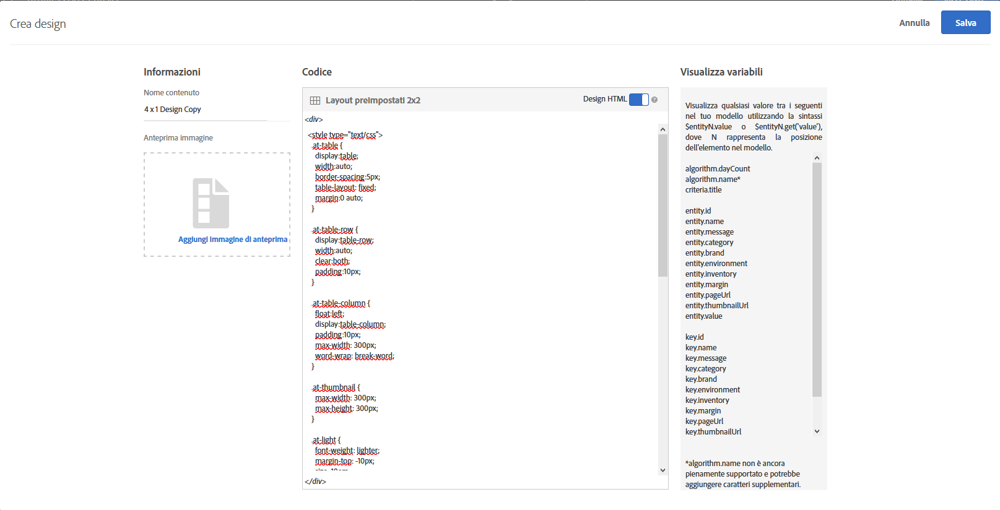
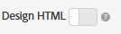

#  Creare una progettazione {#create-a-design}

Una progettazione definisce come i consigli verranno visualizzati su una pagina.

È possibile creare una progettazione [!UICONTROL Consigli] utilizzando una progettazione predefinita o creandone una personalizzata. Nella schermata **[!UICONTROL Recommendations > Progettazione]** sono visualizzate sia le schede di progettazione predefinite che tutte le progettazioni create nel vostro account.

Quando lavorate con le progettazioni, tenete presenti le seguenti informazioni:

* Potete creare una progettazione di raccomandazioni utilizzando una progettazione predefinita oppure una progettazione personalizzata.
* Non è possibile modificare o eliminare una progettazione predefinita.
* Potete modificare, copiare o eliminare una progettazione personalizzata.
* Per creare una progettazione basata su una progettazione predefinita, dovete prima copiare la progettazione e quindi modificare la copia.

Questa illustrazione mostra la progettazione predefinita di 1 x 4:


Questa illustrazione mostra una progettazione personalizzata:


Potete creare una progettazione durante il processo di creazione dell&#39;attività dall&#39;interno di Visual Experience Composer (VEC) o dalla libreria di progettazione all&#39;esterno della creazione dell&#39;attività. Le sezioni seguenti presumono che si stiano creando strutture dalla libreria, ma i passaggi sono simili.

## Creare progettazioni

Potete creare una progettazione basata su una progettazione predefinita oppure su una progettazione personalizzata.

### Creare una progettazione basata su una progettazione predefinita

1. Fare clic su **[!UICONTROL Recommendations]** > **[!UICONTROL Progettazione]** per visualizzare la libreria [!UICONTROL Progettazione] .

   

1. Passate il puntatore del mouse sulla scheda per la progettazione da creare, quindi fate clic sull&#39;icona **[!UICONTROL Copia]** .

   

   Viene visualizzata la finestra di dialogo [!UICONTROL Crea struttura] .

   

1. Nel pannello **[!UICONTROL Informazioni]** , aggiungete un nome **** contenuto e un&#39;immagine di anteprima facoltativa da visualizzare sulla scheda grafica.

   When you use a default design, the design name and &quot;Copy&quot; appears in the **[!UICONTROL Content Name]** field. È possibile modificare il nome. Potete anche selezionare un&#39;immagine da visualizzare sulla scheda grafica.

1. (Condizionale) Modificate il **[!UICONTROL Codice]** di progettazione come desiderate.

   Le progettazioni per consigli utilizzano il linguaggio di progettazione open-source Velocity. Per informazioni su Velocity, consultate [https://velocity.apache.org](https://velocity.apache.org) e [Personalizzare un progetto con Velocity](/help/c-recommendations/c-design-overview/customizing-a-template.md).

   Una progettazione può essere HTML o non HTML. Per impostazione predefinita, le progettazioni HTML sono racchiuse da un tag `<div>` per consentire il tracciamento dei clic in un ambiente web. Le progettazioni non HTML sono per ambienti non web in cui non è possibile effettuare il monitoraggio dei clic. Fate scorrere l&#39;opzione Progettazione  HTML nella posizione &quot;disattivata&quot; per utilizzare codice non HTML.

   >[!NOTE]
   >
   >Il numero massimo di entità a cui è possibile fare riferimento in una progettazione, tramite hardcoded o loop, è 99.

1. Fai clic su **[!UICONTROL Salva]**.

### Creare una progettazione personalizzata

1. Fare clic su **[!UICONTROL Recommendations]** > **[!UICONTROL Progettazione]** per visualizzare la libreria [!UICONTROL Progettazione] .

1. Fate clic su **[!UICONTROL Crea struttura]**.

   Se desiderate basare la nuova progettazione personalizzata su una progettazione esistente, passate il puntatore del mouse sulla progettazione desiderata, quindi fate clic sull&#39;icona [!UICONTROL Copia] . Potete quindi modificare la copia per creare una nuova progettazione personalizzata.

1. Aggiungete un nome **** contenuto e un’immagine di anteprima facoltativa.

1. (Condizionale) Modificate il **[!UICONTROL Codice]** di progettazione come desiderate.

   Per ulteriori informazioni, fare riferimento alle informazioni del punto 4 precedente.

1. Fai clic su **[!UICONTROL Salva]**.

## Modificare, copiare o eliminare una progettazione

Non potete modificare o copiare una progettazione predefinita; è possibile copiare solo le strutture predefinite.

Passate il puntatore del mouse sulla progettazione desiderata nella libreria [!UICONTROL Progettazione] , quindi fate clic sull&#39;icona appropriata: modificare, copiare o eliminare.


Potete copiare una progettazione esistente per creare una progettazione duplicata da modificare. Questo consente di creare un design simile con meno sforzi.

Tenete presente che le progettazioni sono disponibili per l&#39;intero account. Considerate questo aspetto prima di eliminare una progettazione. I disegni eliminati non possono essere recuperati.

## Esempio JSON {#section_75BFB2537CFF4FBD9B560F59EB32C8DD}

L&#39;esempio seguente mostra come è possibile restituire le risposte JSON quando si configura un&#39;attività tramite l&#39;editor basato su modulo.

1. Creare una progettazione dall&#39;interno della libreria Progettazione o nel flusso di lavoro basato su moduli. Se tenti di eseguire questa operazione all’interno del flusso di lavoro del Compositore esperienza visivo, puoi creare solo una struttura HTML, che viene racchiusa in un elemento `<div>` a scopo di tracciamento dei clic.

1. Assicurati che l&#39;opzione “Progettazione HTML” sia disattivata:

   

1. Di seguito è riportato un esempio di ciò che è possibile incollare nella progettazione:

   ```
       #* 
       * "Return a simple list of recommended entity ids"   
       *#
   
       {   
         "notes":{   
         "purpose": "Return a simple list of recommended entity ids",   
         "use-case": "Use this approach if you prefer to do a real-time lookup of entity attribute details (such as inventory, price, rating) from another system (such as a CMS, PIM or ecommerce platform)",   
         "version": "01"   
         },   
         "recommendedItems": {   
           "key": "$key.id",   
           "slot-01": "$entity1.id",   
           "slot-02": "$entity2.id",   
           "slot-03": "$entity3.id",   
           "slot-04": "$entity4.id",   
           "slot-05": "$entity5.id",   
           "slot-06": "$entity6.id",   
           "slot-07": "$entity7.id",   
           "slot-08": "$entity8.id",   
           "slot-09": "$entity9.id",   
           "slot-10": "$entity10.id"   
         }   
       }  
   ```

1. Set up a form-based [!DNL Recommendations] activity that uses this design.

   1. Navigate to the **[!UICONTROL Activities]** page.
   1. Fai clic su **[!UICONTROL Crea attività]** > **[!UICONTROL Consigli]**.
   1. In **[!UICONTROL Scegli Experience Composer (Compositore esperienza)]**, seleziona **[!UICONTROL Modulo]**, quindi fai clic su **[!UICONTROL Avanti]**.
   1. In posizione, immetti il testo: “Sample_Recs_Response”
   1. In **[!UICONTROL Contenuto predefinito]** fai clic sulla freccia giù, poi su **[!UICONTROL Aggiungi consiglio]**.
   1. Scegli un Tipo di pagina. Questo determina il filtraggio iniziale della schermata successiva.
   1. Seleziona una scheda Criteri, poi fai clic su **[!UICONTROL Avanti]**.
   1. Select the design you created in the previous step, then click **[!UICONTROL Next]**.
   1. Completa il processo di impostazione.
   1. Fai clic sulla freccia destra accanto a **[!UICONTROL Inattivo]**, poi seleziona **[!UICONTROL Attiva]**.

1. Dopo aver impostato e attivato l&#39;attività, è possibile impostare una richiesta di esempio per ottenere la risposta JSON pulita.

   From the time that you save your activity, [!DNL Target] will need to build a model to support the selected criteria configuration. A seconda di una serie di fattori, questo potrebbe richiedere del tempo. Una volta generato il modello vengono visualizzati i risultati.

   Ad esempio:

   ```
   https://[YOUR_CLIENT_CODE].tt.omtrdc.net/m2/YOUR_CLIENT_CODE/ubox/raw?mbox=[YOUR_MBOX_NAME]&mboxContentType=text/html&mboxXDomain=disabled&entity.id=[ENTITY_ID]&mboxHost=rawbox_sample&at_property=[AT_PROPERTY_TOKEN]&mboxNoRedirect=true&mboxPC=1234-4321&mboxSession=9876-7000
   ```

   dove

   | Parametro | Valore |
   |--- |--- |
   | `[YOUR_CLIENT_CODE]` | Codice client di destinazione (disponibile in /help/target/products.html#recsSettings > Token API Recommendations > Codice client. |
   | `[YOUR_MBOX_NAME]` | Nome selezionato nella sezione &quot;percorsi&quot; dell&#39;Recommendations basato su modulo, in questo caso Sample_Recs_Response. |
   | `[ENTITY_ID` | L&#39;`entity.id` di un elemento nel catalogo. |
   | `[AT_PROPERTY_TOKEN]` | (Facoltativo) Aggiungi se hai selezionato una Proprietà (parte delle autorizzazioni dell&#39;azienda) durante l&#39;impostazione dell&#39;attività. |

Dopo che l&#39;algoritmo è stato eseguito e si dispone dei risultati, la risposta dovrebbe essere simile a questa:

{width=&quot;575px&quot;}

## Additional JSON object tips and tricks {#section_C305673C68944749969DB239E3221DC2}

È inoltre possibile inviare un semplice elenco di elementi delimitato da virgole impostando una progettazione con la seguente sintassi:

```
entity1.id, $entity2.id, $entity3.id, $entity4.id, $entity5.id, 
```

In alternativa, è possibile inviare ulteriori informazioni nella risposta. Il file di codice seguente è un esempio più complesso che restituisce molto di più degli ID di entità con gli spazi associati (ordine). This design example also returns activity details, Target Profile details (as applicable), and other `entity.attributes` associated with the items returned.

```
    {   
     "adobeRecommendations": {   
      "notes": {   
       "purpose": "Return a list of entity ids with their associated entity.attributes",   
       "use-case": "Use this approach to avoid looking up attribute details after receiving a response from Target",   
       "version": "01"   
      },   
      "recommendedItems": {   
       "slot-01": "$entity1.id",   
       "slot-02": "$entity2.id",   
       "slot-03": "$entity3.id",   
       "slot-04": "$entity4.id",   
       "slot-05": "$entity5.id",   
       "slot-06": "$entity6.id",   
       "slot-07": "$entity7.id",   
       "slot-08": "$entity8.id",   
       "slot-09": "$entity9.id",   
       "slot-10": "$entity10.id"   
      },   
      "activityDetails": {   
       "mbox.name": "email-mbox",   
       "campaign.name": "\${campaign.name}",   
       "campaign.id": "\${campaign.id}",   
       "campaign.recipe.name": "\${campaign.recipe.name}",   
       "campaign.recipe.id": "\${campaign.recipe.id}",   
       "offer.name": "\${offer.name}",   
       "offer.id": "\${offer.id}",   
       "criteria.title": "$criteria.title",   
       "algorithm.name": "$algorithm.name",   
       "algorithm.dayCount": "$algorithm.dayCount"   
      },   
      "visitorProfile": {   
       "profile.favorite-category": "\${profile.favorite-category}",   
       "profile.test": "\${profile.test}",   
       "user.endpoint.lastPurchasedEntity": "\${user.endpoint.lastPurchasedEntity}",   
       "user.endpoint.lastViewedEntity": "\${user.endpoint.lastViewedEntity}",   
       "user.endpoint.mostViewedEntity": "\${user.endpoint.mostViewedEntity}",   
       "user.endpoint.categoryAffinity": "\${user.endpoint.categoryAffinity}",   
       "profile.geolocation.city": "\${profile.geolocation.city}",   
       "profile.geolocation.dma": "\${profile.geolocation.dma}",   
       "profile.geolocation.state": "\${profile.geolocation.state}",   
       "profile.geolocation.country": "\${profile.geolocation.country}",   
       "profile.sessionCount": "\${profile.sessionCount}",   
       "profile.averageDaysBetweenVisits": "\${profile.averageDaysBetweenVisits}",   
       "profile.browserTime": "\${profile.browserTime}",   
       "user.activeActivities": "\${user.activeActivities}",   
       "user.pcId": "\${user.pcId}",   
       "user.isFirstSession": "\${user.isFirstSession}",   
       "user.isNewSession": "\${user.isNewSession}",   
       "user.header": "\${user.header}",   
       "user.parameter": "\${user.parameter}"   
      },   
      "recKey": {   
       "recKeyDetails": {   
        "id": "$key.id",   
        "name": "$key.name",   
        "category": "$key.category",   
        "pageUrl": "$key.pageUrl",   
        "thumbnailUrl": "$key.thumbnailUrl"   
       }   
      },   
      "recDetailedResults": {   
       "recEntity1Details": {   
        "id": "$entity1.id",   
        "name": "$entity1.name",   
        "category": "$entity1.category",   
        "pageUrl": "$entity1.pageUrl",   
        "thumbnailUrl": "$entity1.thumbnailUrl"   
       },   
       "recEntity2Details": {   
        "id": "$entity2.id",   
        "name": "$entity2.name",   
        "category": "$entity2.category",   
        "pageUrl": "$entity2.pageUrl",   
        "thumbnailUrl": "$entity2.thumbnailUrl"   
       },   
       "recEntity3Details": {   
        "id": "$entity3.id",   
        "name": "$entity3.name",   
        "category": "$entity3.category",   
        "pageUrl": "$entity3.pageUrl",   
        "thumbnailUrl": "$entity3.thumbnailUrl"   
       },   
       "recEntity4Details": {   
        "id": "$entity4.id",   
        "name": "$entity4.name",   
        "category": "$entity4.category",   
        "pageUrl": "$entity4.pageUrl",   
        "thumbnailUrl": "$entity4.thumbnailUrl"   
       },   
       "recEntity5Details": {   
        "id": "$entity5.id",   
        "name": "$entity5.name",   
        "category": "$entity5.category",   
        "pageUrl": "$entity5.pageUrl",   
        "thumbnailUrl": "$entity5.thumbnailUrl"   
       },   
       "recEntity6Details": {   
        "id": "$entity6.id",   
        "name": "$entity6.name",   
        "category": "$entity6.category",   
        "pageUrl": "$entity6.pageUrl",   
        "thumbnailUrl": "$entity6.thumbnailUrl"   
       },   
       "recEntity7Details": {   
        "id": "$entity7.id",   
        "name": "$entity7.name",   
        "category": "$entity7.category",   
        "pageUrl": "$entity7.pageUrl",   
        "thumbnailUrl": "$entity7.thumbnailUrl"   
       },   
       "recEntity8Details": {   
        "id": "$entity8.id",   
        "name": "$entity8.name",   
        "category": "$entity8.category",   
        "pageUrl": "$entity8.pageUrl",   
        "thumbnailUrl": "$entity8.thumbnailUrl"   
       },   
       "recEntity9Details": {   
        "id": "$entity9.id",   
        "name": "$entity9.name",   
        "category": "$entity9.category",   
        "pageUrl": "$entity9.pageUrl",   
        "thumbnailUrl": "$entity9.thumbnailUrl"   
       },   
       "recEntity10Details": {   
        "id": "$entity10.id",   
        "name": "$entity10.name",   
        "category": "$entity10.category",   
        "pageUrl": "$entity10.pageUrl",   
        "thumbnailUrl": "$entity10.thumbnailUrl"   
       }   
      }   
     }   
    }  
```

## Training video: Create custom designs in Recommendations (3:20) 

Questo video contiene le seguenti informazioni:

* Creare una progettazione personalizzata
* Comprendere come inserire nelle progettazioni un riferimento a variabili di visualizzazione

>[!VIDEO](https://video.tv.adobe.com/v/27687)
