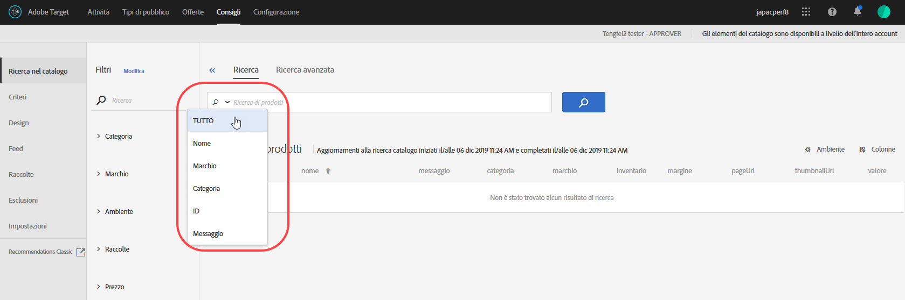

#  Ricerca nel catalogo {#catalog-search}

La ricerca nel catalogo consente di individuare prodotti o contenuti all’interno del catalogo.

To access catalog search, click **[!UICONTROL Recommendations]** > **[!UICONTROL Catalog Search]**.

Puoi limitare la ricerca selezionando un’opzione di ricerca dal menu delle opzioni visualizzato facendo clic sulla freccia rivolta verso il basso nel campo di ricerca.

Le opzioni di ricerca includono:

* TUTTO
* Nome
* Marchio
* Categoria
* ID
* Messaggio

**[!UICONTROL TUTTO]** esegue la ricerca in tutti gli altri criteri di ricerca, utilizzando l’operatore logico OR.

Nei risultati della ricerca, fai clic sul filtro **[!UICONTROL Ambiente]** per specificare l’[ambiente del gruppo di host](/help/administrating-target/hosts.md) di produzione di cui stai visualizzando il catalogo. Puoi inoltre scorrere tra gli elementi nei risultati di ricerca per visualizzare le miniature e altre informazioni sui prodotti.

Il numero visualizzato accanto a &quot;Prodotti&quot; è il numero di prodotti corrispondenti al termine di ricerca, sul totale disponibile nell’ambiente specificato.

Il catalogo viene aggiornato automaticamente quando si ricevono aggiornamenti tramite file di feed, API o aggiornamenti di mbox. In genere, gli aggiornamenti vengono completati entro un’ora. Se sono in corso degli aggiornamenti, viene visualizzata l’ora di inizio dell’aggiornamento più recente. Se non vi sono aggiornamenti in corso, viene visualizzata l’ora di inizio e di fine dell’aggiornamento più recente.

## Creare una raccolta o un’esclusione in base alla ricerca avanzata

Puoi creare [raccolte](/help/c-recommendations/c-products/collections.md) o [esclusioni](/help/c-recommendations/c-products/exclusions.md) utilizzando la Ricerca avanzata nella pagina Ricerca nel catalogo ([!UICONTROL Consigli] > [!UICONTROL Ricerca nel catalogo] > [!UICONTROL Ricerca avanzata]).

Dopo aver creato una ricerca utilizzando “id > contiene”, ad esempio, puoi fare clic su [!UICONTROL Salva come] > [!UICONTROL Raccolta o Esclusione].

>[!IMPORTANT]
>
>La funzionalità di Ricerca avanzata non distingue tra maiuscole e minuscole, tuttavia, i prodotti restituiti al momento della consegna si basano sulla ricerca con distinzione tra maiuscole e minuscole. Questa mancata corrispondenza potrebbe creare confusione. Assicurati di considerare la distinzione tra maiuscole e minuscole quando crei raccolte o esclusioni in base ai risultati utilizzando la funzionalità Ricerca avanzata. Ad esempio, se esegui una ricerca per “Vacanza”, i risultati della ricerca iniziale contengono “Vacanza” e “vacanza”. Se poi crei un catalogo con l’intento di restituire i prodotti contenenti “vacanza”, verranno restituiti solo i prodotti contenenti “vacanza”. ma non quelli contenenti “Vacanza”. Le esclusioni sono gestite in modo simile.
