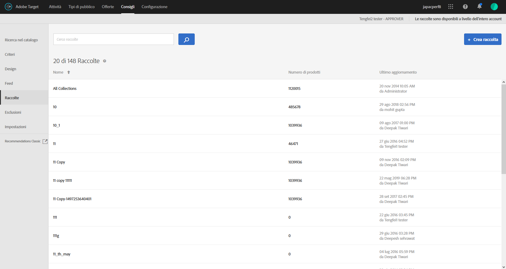

#  Raccolte

Una raccolta è un insieme di prodotti o elementi che sono considerati idonei per essere proposti come consigli. Una raccolta è definita specificando le condizioni che devono essere soddisfatte dagli elementi per farne parte.

Solitamente, una raccolta è un insieme di elementi simili o correlati, come una raccolta di prodotti singoli. Tuttavia, puoi raggruppare qualsiasi elemento in una categoria che ha senso per la tua attività, ad esempio prodotti in una determinata fascia di prezzo o colore o articoli che potrebbero essere interessanti in una particolare area geografica.

Utilizza le raccolte per organizzare i prodotti in raggruppamenti logici. Ad esempio, se alcuni elementi sono disponibili in un’area geografica ma non in un’altra, puoi creare una raccolta che escluda gli elementi non disponibili nell’area del visitatore. Puoi inoltre utilizzare le raccolte per organizzare gli elementi stagionali o qualsiasi altro parametro organizzativo applicabile al tuo business.

Anche i [consigli di backup](/help/c-recommendations/c-algorithms/backup-recs.md) generati per ogni criterio all’interno del consiglio utilizzano questa raccolta, in modo da includere nel consiglio di backup solo gli elementi della raccolta. Le raccolte consentono di garantire la visualizzazione dei soli prodotti che ha senso mostrare in una determinata posizione.

Le raccolte vengono ricreate o aggiornate a ogni esecuzione di ciascun criterio.

Puoi raggruppare gli elementi in cataloghi e quindi creare consigli separati per ogni raccolta.

I criteri di inclusione consentono di eseguire operazioni simili su una raccolta, ma devono essere impostati ogni volta che si crea una attività. Le raccolte consentono di creare un insieme di elementi e quindi di riutilizzarlo ogni volta che sia opportuno.

Quando crei o modifichi un’attività di [!DNL Recommendations], il nome della raccolta viene visualizzato accanto all’etichetta [!UICONTROL Criteri] sul diagramma dell’attività.

>[!NOTE]
>
>Le raccolte non vengono applicate quando si utilizza la chiave di consiglio [!UICONTROL Articoli visualizzati di recente].

## Creazione di una raccolta {#task_1256DFF6842141FCAADD9E1428EF7F08}

Crea una raccolta per organizzare i prodotti o i contenuti che desideri mostrare nei consigli.

1. Fai clic su **[!UICONTROL Consigli]** > **[!UICONTROL Raccolte]** per visualizzare l&#39;elenco delle raccolte esistenti.

   

   Nella pagina [!UICONTROL Raccolte] viene visualizzato un elenco delle raccolte esistenti. Per creare nuove raccolte, fai clic sul pulsante [!UICONTROL Crea raccolta] . Puoi anche modificare, copiare ed eliminare le raccolte esistenti passando il cursore sulla raccolta desiderata e facendo clic sull’icona desiderata.

   

   Il “Numero di elementi” segnalato per ogni raccolta nella visualizzazione elenco [!UICONTROL Raccolte] è il numero di prodotti che corrispondono alle regole per tale raccolta all’interno del [gruppo host](/help/administrating-target/hosts.md) Consigli (ambiente) predefinito configurato. Consulta [Impostazioni](/help/c-recommendations/plan-implement.md#concept_C1E1E2351413468692D6C21145EF0B84) per modificare il gruppo host predefinito.

1. Fai clic su **[!UICONTROL Crea raccolta]**.

1. (Facoltativo) Scegli un ambiente dal filtro **[!UICONTROL Ambiente]** quando crei (o aggiorni) una raccolta per visualizzare in anteprima i contenuti della raccolta in tale ambiente. Per impostazione predefinita, sono visualizzati i risultati del gruppo di host predefinito.

   

1. Digita un **[!UICONTROL Nome]** per la raccolta.

   È inoltre possibile immettere una **[!UICONTROL Descrizione facoltativa]**.

1. Imposta le regole utilizzate per compilare la raccolta.

   Ad esempio, la raccolta potrebbe essere basata su un ID o categoria di prodotto, un margine, o qualsiasi altro parametro nell’elenco.

   È possibile aggiungere regole per utilizzare più parametri con cui definire una raccolta. Più regole sono collegate con un operatore AND. Tutte le regole specificate devono essere soddisfatte perché la raccolta venga applicata.

1. Fai clic su **[!UICONTROL Salva]**.

## Creare una raccolta utilizzando Ricerca avanzata

Puoi anche creare le raccolte mediante la funzione Ricerca avanzata nella pagina [Ricerca nel catalogo](/help/c-recommendations/c-products/catalog-search.md#save-as) ([!UICONTROL Consigli] > [!UICONTROL Ricerca nel catalogo] > [!UICONTROL Ricerca avanzata]).

Dopo aver creato una ricerca utilizzando “id > contiene”, ad esempio, puoi fare clic su [!UICONTROL Salva come] > [!UICONTROL Raccolta].

>[!IMPORTANT]
>
>La funzionalità di Ricerca avanzata non distingue tra maiuscole e minuscole, tuttavia, i prodotti restituiti al momento della consegna si basano sulla ricerca con distinzione tra maiuscole e minuscole. Questa mancata corrispondenza potrebbe creare confusione. Assicurati di considerare la distinzione tra maiuscole e minuscole quando crei raccolte in base ai risultati utilizzando la funzionalità Ricerca avanzata. Ad esempio, se esegui una ricerca per “Vacanza”, i risultati della ricerca iniziale contengono “Vacanza” e “vacanza”. Se poi crei un catalogo con l’intento di restituire i prodotti contenenti “vacanza”, verranno restituiti solo i prodotti contenenti “vacanza”. ma non quelli contenenti “Vacanza”.

## Modificare, copiare o eliminare una raccolta

Passa il puntatore del mouse sulla raccolta desiderata nell’elenco, quindi fai clic sull’icona appropriata: modificare, copiare o eliminare elementi.

Puoi copiare una raccolta esistente per creare una raccolta duplicata da modificare. Questo ti consente di creare un’esclusione simile con meno sforzo.

Tieni presente che le raccolte sono disponibili nell’intero account. Considera questo aspetto prima di eliminare una raccolta. Impossibile recuperare le raccolte eliminate.

## Utilizzare una raccolta in un’attività Recommendations

1. Crea una raccolta utilizzando uno dei metodi indicati in precedenza.

1. Fai clic su **[!UICONTROL Attività]** e [crea una nuova attività Recommendations](/help/c-recommendations/t-create-recs-activity/create-recs-activity.md) o modifica un&#39;attività esistente.

1. Dopo aver selezionato un criterio e una progettazione, nella pagina [!UICONTROL Opzioni] viene visualizzata la selezione della raccolta desiderata.

   

1. (Condizionale) Per modificare un&#39;impostazione di raccolta esistente, nella pagina **[!UICONTROL Esperienze]** (passaggio 2 del flusso di lavoro guidato in tre parti) fai clic su una posizione in cui hai inserito i consigli, fai clic su **[!UICONTROL Modifica raccolta]**, quindi seleziona la raccolta desiderata.

   

## Video di formazione: Creare raccolte ed esclusioni in Recommendations (7:05) 

Questo video contiene le seguenti informazioni:

* Creare una raccolta
* Creare un’esclusione

>[!VIDEO](https://video.tv.adobe.com/v/27689)
