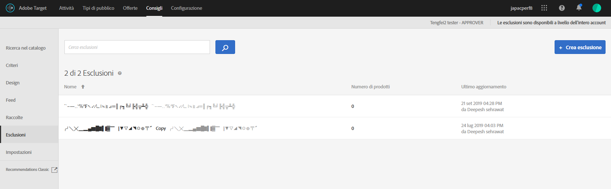

# Esclusioni{#exclusions}

Per evitare che determinati elementi vengano consigliati, crea un elenco di esclusione.

>[!IMPORTANT]
>
>Le regole di esclusione statica e dinamica sono funzioni molto efficaci che possono esserti utili nelle iniziative di marketing. Per informazioni dettagliate, esempi e scenari di utilizzo, consulta [Utilizzare regole di inclusione dinamiche e statiche](../../c-recommendations/c-algorithms/use-dynamic-and-static-inclusion-rules.md#concept_4CB5C0FA705D4E449BD0B37B3D987F9F).

**Per creare un’esclusione:**

1. Fai clic su **[!UICONTROL Consigli]** > **[!UICONTROL Esclusioni]** per visualizzare l&#39;elenco delle esclusioni esistenti.

   

   Il “Numero di elementi” segnalato per ogni esclusione nella visualizzazione elenco [!UICONTROL Esclusioni] è il numero di prodotti che corrispondono alle regole per tale esclusione all’interno del [gruppo di host](/help/administrating-target/hosts.md) Consigli (ambiente) predefinito configurato. Consulta [Impostazioni](../../c-recommendations/plan-implement.md#concept_C1E1E2351413468692D6C21145EF0B84) per modificare il gruppo host predefinito.

1. Fai clic su **[!UICONTROL Crea esclusione]**.

1. (Facoltativo) Scegli un ambiente dal filtro **[!UICONTROL Ambiente]** quando crei (o aggiorni) un’esclusione per visualizzare in anteprima i contenuti dell’esclusione tale ambiente. Per impostazione predefinita, sono visualizzati i risultati del gruppo di host predefinito.

   

1. Digita un **[!UICONTROL Nome]** per l’esclusione e immetti una descrizione facoltativa.

1. Utilizza il generatore di regole per creare le esclusioni.

   Seleziona un parametro nell’elenco delle regole, seleziona un operatore, quindi immetti uno o più valori per identificare i prodotti. Separa i valori con le virgole.

1. Fai clic su **[!UICONTROL Salva]**.

## Creare un’esclusione utilizzando Ricerca avanzata

Puoi creare esclusioni anche utilizzando la ricerca avanzata nella pagina di ricerca nel catalogo ([!UICONTROL Consigli] > [!UICONTROL Ricerca nel catalogo] > [!UICONTROL Ricerca avanzata]).

Dopo aver creato una ricerca utilizzando “id > contiene”, ad esempio, è possibile fare clic su [!UICONTROL Salva con nome] > [!UICONTROL Esclusione]. Per ulteriori informazioni, consulta [Ricerca nel catalogo](/help/c-recommendations/c-products/catalog-search.md).

>[!IMPORTANT]
>
>La funzionalità di Ricerca avanzata non distingue tra maiuscole e minuscole, tuttavia, i prodotti restituiti al momento della consegna si basano sulla ricerca con distinzione tra maiuscole e minuscole. Questa mancata corrispondenza potrebbe creare confusione. Assicurati di considerare la distinzione tra maiuscole e minuscole quando crei esclusioni in base ai risultati utilizzando la funzionalità Ricerca avanzata. Ad esempio, se esegui una ricerca per “Vacanza”, i risultati della ricerca iniziale contengono “Vacanza” e “vacanza”. Se poi crei un’esclusione con l’intento di escludere i prodotti contenenti “vacanza”, verranno esclusi solo i prodotti contenenti “vacanza”. ma non quelli contenenti “Vacanza”.

## Video di formazione: Crea raccolte ed esclusioni in Recommendations (7:05) 

Questo video contiene le seguenti informazioni:

* Creare una raccolta
* Creare un’esclusione

>[!VIDEO](https://video.tv.adobe.com/v/27689)