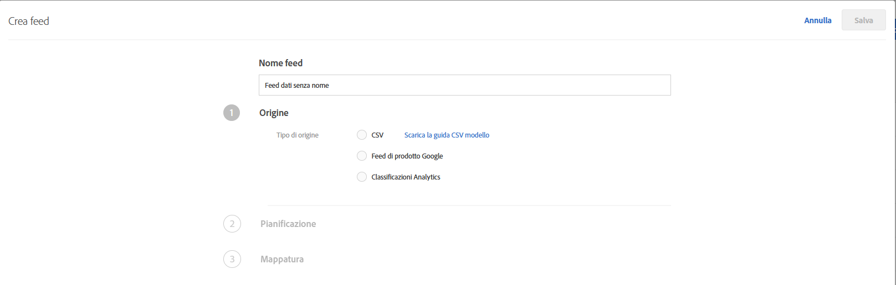
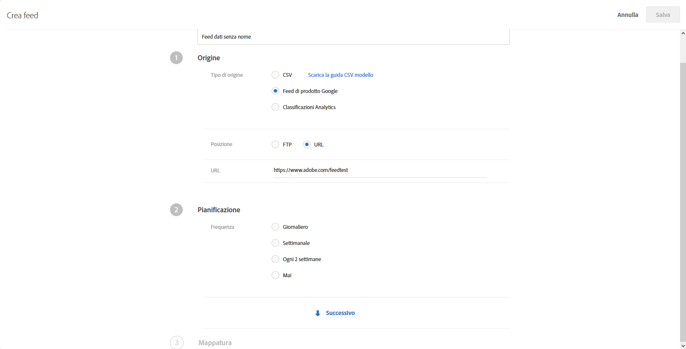
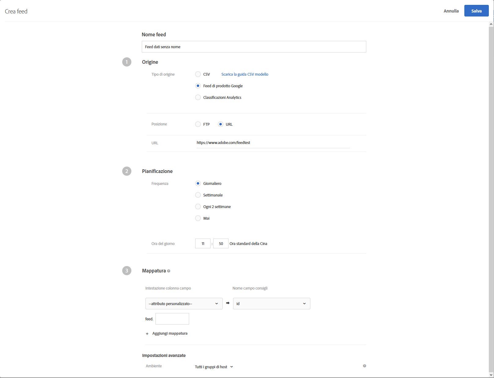

#  Feed{#feeds}

I feed consentono di importare le entità in [!DNL Recommendations]. Le entità possono essere inviate tramite file CSV, il formato feed di Google Product Search e le classificazioni di prodotto Adobe Analytics.

## Panoramica dei feed {#concept_D1E9C7347C5D4583AA69B02E79607890}

I feed consentono di trasmettere le [Entità](/help/c-recommendations/c-products/products.md) o di implementare i dati mbox con informazioni non disponibili nella pagina o per le quali l’invio diretto dalla pagina non è sicuro, ad esempio margine, costo del venduto e così via.

Dal file di classificazioni di prodotto di [!DNL Target] o da quello di Google Product Search puoi selezionare le colonne che desideri inviare al server di [!DNL Recommendations]. Questi dati su ciascun elemento possono quindi essere utilizzati nella visualizzazione modello e per il controllo dei consigli.

Se i dati vengono raccolti sia da un feed di entità sia da una mbox, viene data priorità ai dati più recenti. Solitamente i dati più recenti provengono da una mbox, in quanto questa viene visualizzata più spesso. Nel raro caso in cui i dati del feed di entità e i dati della mbox vengano inviati contemporaneamente, verranno utilizzati i secondi.

Nell’elenco dei [!UICONTROL feed], accessibile da **[!UICONTROL Consigli]** > **[!UICONTROL Feed]**, sono incluse informazioni su eventuali feed creati.


La pagina Feed contiene le colonne seguenti:

* **Nome**: nome del feed specificato durante la creazione. Per modificare il nome di un feed, dovrai modificare il feed stesso. Quando si salva con il nuovo nome, il feed viene aggiornato.
* **Tipo**: i tipi includono [CSV](/help/c-recommendations/c-products/feeds.md#section_65CC1148C7DD448FB213FDF499D35FCA), [Feed di prodotto Google](/help/c-recommendations/c-products/feeds.md#section_8EFA98B5BC064140B3F74534AA93AFFF) e [Classificazioni Analytics](/help/c-recommendations/c-products/feeds.md#section_79E430D2C75443BEBC9AA0916A337E0A).
* **Stato**: lo [stato](/help/c-recommendations/c-products/feeds.md#concept_E475986720D1400999868B3DFD14A7A0) corrente del feed.
* **Pianificazione**: visualizza la pianificazione di aggiornamento del feed: Giornaliero, Settimanale, Ogni 2 settimane o Mai.
* **Elementi**: visualizza il numero di elementi presenti nel feed.
* **Ultimo aggiornamento**: visualizza la data e l’ora dell’ultimo aggiornamento del feed e il nome della persona che lo ha eseguito. Se per [!UICONTROL Ultimo aggiornamento] è riportata la dicitura “indefinito”, il feed proviene da [!DNL Recommendations Classic] e non può essere modificato in [!DNL Target Premium Recommendations].

>[!IMPORTANT]
>
>Le entità caricate e gli attributi di entità scadono dopo 61 giorni. Ciò significa:
>
>* Il feed deve essere eseguito almeno mensilmente per garantire che il contenuto del catalogo non scada.
>* La rimozione di un elemento dal file del feed non rimuove tale elemento dal catalogo. Per rimuovere l&#39;elemento dal catalogo, eliminate manualmente l&#39;elemento tramite l&#39;interfaccia utente o l&#39;API di Target. In alternativa, modificate gli attributi articolo (ad esempio magazzino) per assicurare che l&#39;articolo sia escluso dal corrispettivo.


## CSV {#section_65CC1148C7DD448FB213FDF499D35FCA}

Puoi creare un file con estensione `.csv` con il formato di caricamento CSV di Adobe. Nel file sono contenute informazioni sulla visualizzazione degli attributi riservati e personalizzati per i prodotti. Per caricare attributi specifici nell’implementazione, sostituisci `CustomN` nella riga di intestazione con il nome dell’attributo che desideri utilizzare. Nell’esempio di seguito, `entity.Custom1` è stato sostituito da: `entity.availability`. Successivamente, puoi utilizzare il metodo di caricamento collettivo per caricare il file nel server della funzionalità [!DNL Recommendations].

L’utilizzo del formato .csv presenta i seguenti vantaggi rispetto al formato feed di Google:

* Non richiede la mappatura dei campi.
* Supporta gli attributi con più valori (vedi l’esempio di seguito).
* Supporta fino a 100 attributi personalizzati. Se ti servono più di 100 attributi personalizzati, puoi specificarne un altro set con un secondo file di feed.

Se sulla pagina non sono presenti mbox o se desideri completare le informazioni di visualizzazione con elementi non disponibili sul sito, utilizza il metodo di caricamento collettivo per inviare tali informazioni. Ad esempio, puoi inviare informazioni di inventario non pubblicate sul sito.

I dati caricati dal file .csv, dal feed di prodotto Google o dal feed di classificazione di prodotto di Analytics sovrascrivono il valore dell’attributo dell’entità esistente nel nostro database. Se invii informazioni sul prezzo tramite richieste mbox e poi invii diversi valori prezzo nel file, questi valori sovrascrivono quelli impostati con la richiesta mbox. Fa eccezione l’attributo dell’entità `categoryId` dove i valori della categoria vengono aggiunti invece di essere sovrascritti fino al limite di 250 caratteri.

>[!IMPORTANT]
>
>Non racchiudere i valori tra virgolette doppie (&quot;) nel file .csv, a meno che queste non siano intenzionali. Se racchiudi i valori tra virgolette doppie, dovrai racchiuderli in una seconda serie di virgolette. In caso contrario, il feed dei consigli non verrà caricato correttamente.

Ad esempio, la sintassi seguente non è corretta:

```
"Apples "Bananas" Grapes"",
```

La sintassi corretta è:

```
"Apples ""Bananas"" Grapes""",
```

>[!NOTE]
>
>Non è possibile sovrascrivere un valore esistente con un valore vuoto. Per sovrascrivere un valore, è necessario indicarne uno sostitutivo. Nel caso del prezzo di vendita, una soluzione comune è quella di indicare &quot;NULL&quot; o un altro messaggio. Puoi quindi scrivere una regola di modello per escludere gli elementi con tale valore.

Il prodotto è disponibile nell’interfaccia di amministrazione circa due ore dopo il corretto caricamento della relativa entità.

Di seguito è riportato un codice di esempio per un file .csv:

```
## RECSRecommendations Upload File 
## RECS''## RECS'' indicates a Recommendations pre-process header. Please do not remove these lines. 
## RECS 
## RECSUse this file to upload product display information to Recommendations. Each product has its own row. Each line must contain 19 values and if not all are filled a space should be left. 
## RECSThe last 100 columns (entity.custom1 - entity.custom100) are custom. The name 'customN' can be replaced with a custom name such as 'onSale' or 'brand'. 
## RECSIf the products already exist in Recommendations then changes uploaded here will override the data in Recommendations. Any new attributes entered here will be added to the product''s entry in Recommendations. 
## RECSentity.id,entity.name,entity.categoryId,entity.message,entity.thumbnailUrl,entity.value,entity.pageUrl,entity.inventory,entity.margin,entity.last_updated_by,entity.multi_english,entity.availability,entity.tax_country,entity.tax_region,entity.tax_rate,entity.product_type,entity.item_group_id,entity.color,entity.size,entity.brand,entity.gtin 
na3456,RipCurl Watch with Titanium Dial,Watches & Sport,Cutting edge titanium with round case,https://example.com/s7/na3456_Viewer,425,https://example.com/shop/en-us/na3456_RipCurl,24,0.25,csv,"[""New"",""Web"",""Sales"",""[1,2,34,5]""]",in stock,US,CA,9.25,Shop by Category > Watches,dz1,Titanium,44mm,RipCurl,"075380 01050 5" 
na3457,RipCurl Watch with Black Dial,Watches & Sport,Cutting edge matte black with round case,https://example.com/s7/na3457_Viewer,275,https://example.com/shop/en-us/na3457_RipCurl,24,0.27,csv,"[""New"",""Web"",""Sales"",""[1,2,34,5]""]",in stock,US,CA,9.25,Shop by Category > Watches,dz1,Black,44mm,RipCurl,"075340 01060 7"
```

## Google {#section_8EFA98B5BC064140B3F74534AA93AFFF}

Il tipo di feed di Google Product Search utilizza il formato di Google. Questo è diverso dal formato di upload CSV di Adobe.

Se disponi di un feed di prodotto Google, puoi utilizzarlo come file di importazione.

>[!NOTE]
>
>Non è necessario utilizzare i dati di Google. [!DNL Recommendations] utilizza semplicemente lo stesso formato di Google. Puoi utilizzare questo metodo per caricare qualsiasi dato a tua disposizione e utilizzare le funzioni di pianificazione disponibili. Tuttavia, quando imposti il file dovrai mantenere i nomi degli attributi predefiniti di Google.

La maggior parte dei venditori caricano i prodotti in Google per far sì che questi vengano visualizzati quando un visitatore utilizza Google Product Search. [!DNL Recommendations] segue esattamente le specifiche di Google per i feed di entità. Entity feeds can be sent to [!DNL Recommendations] via [!DNL .xml], [!DNL .txt], or [!DNL .tsv], and can use the [attributes defined by Google](https://support.google.com/merchants/answer/188494?hl=en&amp;topic=2473824&amp;ctx=topic#US). È possibile cercare i risultati nelle [pagine di Google Shopping](https://www.google.com/prdhp).

>[!NOTE]
>
>È necessario consentire il metodo POST sul server che ospita il contenuto del feed di Google.

Poiché gli utenti di [!DNL Recommendations] configurano già feed [!DNL .xml] o [!DNL .txt] per l’invio a Google tramite URL o FTP, i feed di entità accettano questi dati di prodotto e li utilizzano per creare il catalogo dei consigli. Specifica la posizione di tale feed per fare in modo che il server dei consigli recuperi i dati.

Se utilizzi Google Product Search per il caricamento del feed di entità, dovrà essere presente una mbox sulla pagina in cui desideri mostrare i consigli o monitorare le visualizzazioni dei prodotti per gli algoritmi di distribuzione basati sulle visualizzazioni.

I feed di Google non supportano valori multipli per un attributo personalizzato.

Il feed viene eseguito al momento in cui viene salvato e attivato. Viene eseguito al momento del salvataggio del feed, e successivamente ogni giorno un’ora dopo.

Di seguito è riportato il codice di esempio per un file feed .xml di Google Product Search:

```
<?xml version="1.0" encoding="UTF-8" standalone="yes"?> 
<feed xmlns="https://www.w3.org/2005/Atom" xmlns:ns2="https://base.google.com/ns/1.0" xmlns:ns3="https://base.google.com/cns/1.0"> 
    <title>Product Feed</title> 
    <link href="https://example.com"/> 
    <updated>2017-12-13T08:45:04.918-08:00</updated> 
    <author> 
        <name>Product Feed Author</name> 
    </author> 
    <id>https://example.com</id> 
    <entry> 
        <title>RipCurl Watch with Titanium Dial</title> 
        <description>Cutting edge Titanium with Round case</description> 
        <ns2:id>na3452</ns2:id> 
        <ns2:link>https://example.com/shop/en-us/na3452_RipCurl</ns2:link> 
        <ns2:availability>in stock</ns2:availability> 
        <ns2:condition>NEW</ns2:condition> 
        <ns2:google_product_category>Watches &amp; Sport</ns2:google_product_category> 
        <ns2:gtin>075380 01050 5</ns2:gtin> 
        <ns2:image_link>https://example.com/s7/na3452_Viewer</ns2:image_link> 
        <ns2:mobile_link>https://m.example.com/s7/na3452_Viewer</ns2:mobile_link> 
        <ns2:mpn>71050</ns2:mpn> 
        <ns2:price>425</ns2:price> 
        <ns2:product_review_average>5.0</ns2:product_review_average> 
        <ns2:product_review_count>30</ns2:product_review_count> 
        <ns2:product_type>Shop by Category > Watches </ns2:product_type> 
        <ns2:brand>RipCurl</ns2:brand> 
        <ns2:sale_price>375</ns2:sale_price> 
        <ns2:tax> 
          <ns2:country>US</ns2:country> 
          <ns2:region>CA</ns2:region> 
          <ns2:rate>9.25</ns2:rate> 
          <ns2:tax_ship>y</ns2:tax_ship> 
        </ns2:tax> 
        <ns2:is_bundle>N</ns2:is_bundle> 
    </entry> 
    <entry> 
        <title>RipCurl Watch with Black Dial</title> 
        <description>Cutting edge matte black with Round case</description> 
        <ns2:id>na3453</ns2:id> 
        <ns2:link>https://example.com/shop/en-us/na3453_RipCurl</ns2:link> 
        <ns2:availability>in stock</ns2:availability> 
        <ns2:condition>NEW</ns2:condition> 
        <ns2:google_product_category>Watches &amp; Sport</ns2:google_product_category> 
        <ns2:gtin>075380 013450 5</ns2:gtin> 
        <ns2:image_link>https://example.com/s7/na3453_Viewer</ns2:image_link> 
        <ns2:mobile_link>https://m.example.com/s7/na3453_Viewer</ns2:mobile_link> 
        <ns2:mpn>71050</ns2:mpn> 
        <ns2:price>275</ns2:price> 
        <ns2:product_review_average>4.8</ns2:product_review_average> 
        <ns2:product_review_count>23</ns2:product_review_count> 
        <ns2:product_type>Shop by Category > Watches </ns2:product_type> 
        <ns2:brand>RipCurl</ns2:brand> 
        <ns2:sale_price>249</ns2:sale_price> 
        <ns2:tax> 
          <ns2:country>US</ns2:country> 
          <ns2:region>CA</ns2:region> 
          <ns2:rate>9.25</ns2:rate> 
          <ns2:tax_ship>y</ns2:tax_ship> 
        </ns2:tax> 
        <ns2:is_bundle>N</ns2:is_bundle> 
    </entry> 
</feed> 
```

Di seguito è riportato il codice di esempio per un file feed .tsv di Google Product Search:

```
id    title    description    link    price    condition    availability    image_link    tax    shipping_weight    shipping    google_product_category    product_type    item_group_id    color    size    gender    age_group    pattern    brand    gtin    mpn 
na3454    RipCurl Watch with Titanium Dial    Cutting edge titanium with round case    https://example.com/shop/en-us/na3454_RipCurl    425    new    in stock    https://example.com/s7/na3452_Viewer    US:CA:9.25:y    1.5 oz    US:::0.00 USD    Watches & Sport    Shop by Category > Watches    dz1    Black    44mm    male    adult    Solid    RipCurl    075380 01050 5    DZ1437 
na3455    RipCurl Watch with Black Dial    Cutting edge matte black with round case    https://example.com/shop/en-us/na3455_RipCurl    275    new    in stock    https://example.com/s7/na3452_Viewer    US:CA:9.25:y    1.5 oz    US:::0.00 USD    Watches & Sport    Shop by Category > Watches    dz1    Black    44mm    male    adult    Solid    RipCurl    075340 01060 7    DZ1446
```

## Classificazioni di prodotto Analytics {#section_79E430D2C75443BEBC9AA0916A337E0A}

La classificazione di prodotto Analytics è l’unica classificazione disponibile per i consigli. For more information about this classification file, see [About classifications](https://docs.adobe.com/content/help/en/analytics/components/classifications/c-classifications.html) in the *Analytics Components* guide. È possibile che non tutte le informazioni necessarie per i consigli siano disponibili nell’implementazione corrente. Per aggiungere elementi al file delle classificazioni, fai quindi riferimento a questa guida.

>[!IMPORTANT]
>
>Tieni presente che importare i dati di entità in Consigli con le classificazioni di prodotto Analytics non rappresenta il metodo ottimale.
>
> In particolare, tieni conto dei seguenti aspetti:
>* Gli aggiornamenti agli attributi di entità subiscono un ritardo aggiuntivo fino a 24 ore.
>* Target supporta solo le classificazioni di prodotto. Il codice SKU del prodotto Analytics deve essere mappato sullo stesso livello di `entity.id` della funzione Consigli. Le classificazioni personalizzate di Analytics possono essere progettate tramite Adobe Consulting Services. Per eventuali domande, contatta il tuo Account Manager.


## Creazione di un feed {#steps}

Crea un feed per inserire le informazioni sui prodotti o i servizi in [!DNL Recommendations].

1. Nell’interfaccia di Target, fai clic su **[!UICONTROL Consigli]** > **[!UICONTROL Feed]** > **[!UICONTROL Crea feed]**.

   

1. Specifica un nome descrittivo per il feed.
1. Seleziona il **[!UICONTROL tipo di origine]**.

   * CSV
   * Feed di prodotto Google
   * Classificazioni Analytics

   Per informazioni sui tipi di feed di prodotto Google e CSV, consulta [Panoramica sui feed](../../c-recommendations/c-products/feeds.md#concept_D1E9C7347C5D4583AA69B02E79607890). You can also [download a model CSV guide](https://recspm2.experiencecloud.adobe.com/content/mac/default/target/files/EntityFileUploadTemplate.csv) to help you format the feed correctly.

1. (Condizionale) Se hai selezionato **[!UICONTROL CSV]** o **[!UICONTROL Feed prodotto Google]**, specifica il percorso in cui il feed è accessibile.

   * **FTP**: se hai selezionato FTP, indica le informazioni relative al server FTP, le credenziali di accesso, il nome del file e la directory FTP. Per caricamenti più sicuri, puoi utilizzare il protocollo FTP con SSL (FTPS).

      Impostazioni del server FTP supportate:

      * FTP e FTPS devono essere impostati per FTP passivo.
      * Per FTPS, configura il server per l’accettazione di connessioni FTPS esplicite.
      * SFTP non è supportato.
      * Puoi specificare manualmente una porta su cui avviare la connessione (ad esempio, `ftp://ftp.yoursite.com:2121`). Se non specifichi una porta, viene usata la porta FTP o FTPS predefinita.
   * **URL**: se selezioni la voce URL, specifica l’URL.


1. (Condizionale) Se hai selezionato **[!UICONTROL Classificazioni Analytics]**, scegli la suite di rapporti dal relativo elenco a discesa.

1. Fai clic sulla freccia **[!UICONTROL Successivo]** per visualizzare le opzioni di [!UICONTROL Pianificazione].

   

1. Seleziona un’opzione di aggiornamento:

   * Giornaliero
   * Settimanale
   * Ogni 2 settimane
   * Mai: non pianificare un aggiornamento. Scegli questa opzione se non desideri eseguire il feed.

1. Specifica l’ora in cui desideri eseguire il feed.

   Questa opzione si basa sul fuso orario utilizzato nel browser. Se desideri utilizzare l’orario di un fuso orario diverso, dovrai calcolarlo in base al tuo fuso orario attuale.

1. Fai clic sulla freccia **[!UICONTROL Successivo]** per visualizzare le opzioni di [!UICONTROL Mappatura], quindi specifica come eseguire la mappatura dei dati per le definizioni di [!DNL Target].

   

1. (Facoltativo) Se desideri che il feed appartenga a un ambiente (gruppo di host), seleziona il gruppo di host.

   Per impostazione predefinita, il feed appartiene a tutti i gruppi di host. Gli elementi contenuti in questo feed saranno quindi sempre disponibili, in qualsiasi ambiente. Per ulteriori informazioni, consulta [Host](../../administrating-target/hosts.md#concept_516BB01EBFBD4449AB03940D31AEB66E).

1. Fai clic su **[!UICONTROL Salva]**.

Dopo aver creato o modificato un feed, questo viene eseguito immediatamente e aggiornato in seguito in base ai parametri impostati. È necessario del tempo affinché tutte le informazioni siano disponibili. Innanzitutto, prima di essere pubblicato e reso disponibile, il feed deve essere sincronizzato, elaborato e indicizzato. Lo stato corrente viene visualizzato in [Stato feed](/help/c-recommendations/c-products/feeds.md#status) nell’elenco dei feed. È possibile chiudere [!DNL Target] prima del completamento del processo; questo continuerà ad essere in esecuzione.

Durante l’indicizzazione, prodotti e intestazioni dei feed vengono visualizzati prima dell’effettiva indicizzazione dei singoli valori. Questo ti consente di cercare e visualizzare i prodotti per poter creare raccolte, esclusioni, progettazioni e attività prima del completamento dell’indicizzazione.

Lo stato “Completato” indica che il file è stato trovato e analizzato correttamente. Le informazioni non sono disponibili per l’utilizzo all’interno di [!DNL Recommendations] finché il file non viene indicizzato, operazione che può richiedere un po’ di tempo, a seconda della dimensione del file. Se il processo non riesce, il file non è stato trovato (ad esempio, hai utilizzato un URL o informazioni FTP errati), o si è verificato un errore di analisi.

## Stati e indicatori dei feed {#concept_E475986720D1400999868B3DFD14A7A0}

Informazioni sui possibili stati dei feed e sui relativi indicatori.

### Stato dei feed {#status}

Di seguito sono riportati gli stati possibili per un feed:

| Stato | Descrizione |
|--- |--- |
| Sincronizzazione | I dettagli della configurazione dei feed vengono salvati in Target. |
| Sincronizzazione non riuscita | Impossibile salvare i dettagli di configurazione dei feed su Target. Riprova. |
| Nessuna esecuzione di feed | Hai creato un feed, ma non è stato pianificato (la frequenza è impostata su Mai). |
| Pianificato per *data e ora* | Il feed non è stato eseguito, ma è pianificato per essere eseguito alla data e all’ora specificate. |
| Attesa del download | Target si sta preparando per il download del file di feed. |
| Download del file di feed | Target sta eseguendo il download del file di feed. |
| Importazione elementi | Target sta eseguendo l’importazione di elementi dal file di feed. |
| Feed importato correttamente alle *ora* | Target ha importato il file di feed nel suo sistema di distribuzione dei contenuti. Le modifiche apportate agli attributi degli elementi sono state inserite nel sistema di distribuzione dei contenuti e presto saranno visibili nei consigli distribuiti. Qualora non lo fossero, riprova più tardi e aggiorna la pagina contenente i consigli.<br>*Nota 1:* se le modifiche apportate agli attributi di un elemento ne determinano l’esclusione dai consigli, tale esclusione viene applicata immediatamente. Se un elemento è stato aggiunto di recente, oppure se a causa delle modifiche apportate agli attributi un elemento *non viene più* escluso dai consigli, questo verrà applicato al successivo aggiornamento dell’algoritmo, che si verifica entro 24 ore.<br>*Nota 2:* quando viene visualizzato questo stato, è possibile che gli aggiornamenti non risultino ancora visibili nell’interfaccia utente di Ricerca nel catalogo. In Ricerca nel catalogo viene visualizzato uno stato separato che indica quando è avvenuto l’ultimo aggiornamento del catalogo ricercabile. |
| Impossibile indicizzare | L’operazione di indicizzazione non è riuscita. Riprova. |
| Server non trovato | I percorsi FTP o URL non sono validi o sono irraggiungibili. |

Per aggiornare un feed (ad esempio, per apportare modifiche alla configurazione del feed o al file di feed), aprilo, apporta le modifiche desiderate e fai clic su **[!UICONTROL Salva]**.

>[!IMPORTANT]
>
>Le entità caricate scadono dopo 61 giorni. Significa che il file di feed deve essere caricato almeno ogni 60 giorni per evitare un’interruzione delle attività di Consigli. Se un elemento non è incluso in un file di feed (o in un altro metodo di aggiornamento entità) almeno una volta ogni 60 giorni, Adobe Target deduce l’elemento non è più rilevante e lo rimuove dal catalogo.

### Indicatori di stato dei feed {#section_3C8A236C5CB84C769A9E9E36B8BFABA4}

I seguenti indicatori di stato dei feed vengono visualizzati nella colonna [!UICONTROL Stato]:

| Indicatore di stato | Descrizione |
|--- |--- |
| Indicatore di stato verde | Quando l’indicizzazione del feed viene terminata con successo, viene visualizzato un indicatore di stato verde. |
| Indicatore di stato giallo | Quando un feed o l’indice di un feed viene ritardato del 25% rispetto alla sua frequenza, viene visualizzato un indicatore di stato giallo. L’indicatore di colore giallo viene visualizzato se, ad esempio, l’indice di una serie di feed da eseguire giornalmente non è stato completato sei ore dopo l’orario pianificato.   Nota: una volta che lo stato del feed è “In attesa della coda indice”, i valori appena aggiornati sono disponibili nell’elaborazione della consegna e dei criteri. |
| Indicatore di stato bianco | Quando un feed non è pianificato, viene visualizzato un indicatore di stato bianco a indicare che il feed non è ancora stato eseguito. |
| Indicatore di stato rosso | Se il caricamento dei dati sul server da parte del feed non va a buon fine, viene visualizzato un indicatore di stato rosso. |
Prendi in considerazione gli esempi seguenti:

**Esempio 1:**

* Giorno 1: il feed giornaliero viene elaborato alle 09.00 del fuso orario PST.
* Giorno 2: sono le 15.30 e il feed non viene eseguito da ieri alle 09.00.

Lo stato visualizzato sarà giallo, perché l’indice doveva essere eseguito circa 6 ore e 30 minuti fa. 6 ore e 30 minuti + 24 ore rappresentano il 127% della finestra del feed.

**Esempio 2:**

* 1 gennaio: il feed mensile viene elaborato alle 09.00 del fuso orario PST.
* 3 febbraio: sono le 10.00 e il feed non viene eseguito da un mese, un giorno e un’ora.

Lo stato visualizzato sarà giallo, perché l’indice doveva essere eseguito circa un giorno e un’ora fa. Anche se questo rappresenta solo l’1,03% delle impostazioni di frequenza [(31 + (1/25))/30 = 1,03%], il ritardo massimo di un giorno è stato superato.

## Video di formazione

I video seguenti contengono ulteriori informazioni sui concetti descritti in questo articolo.

### Informazioni sui feed in Recommendations (3:01) 

Questo video contiene le seguenti informazioni:

* Comprendere lo scopo dei feed
* Comprendere il valore dei feed

>[!VIDEO](https://video.tv.adobe.com/v/27695)

### Creare un feed (6:44) 

Questo video contiene le seguenti informazioni:

* Impostare un feed
* Quale tipo di feed usare

>[!VIDEO](https://video.tv.adobe.com/v/27696)
