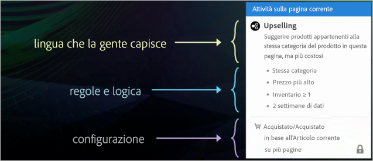
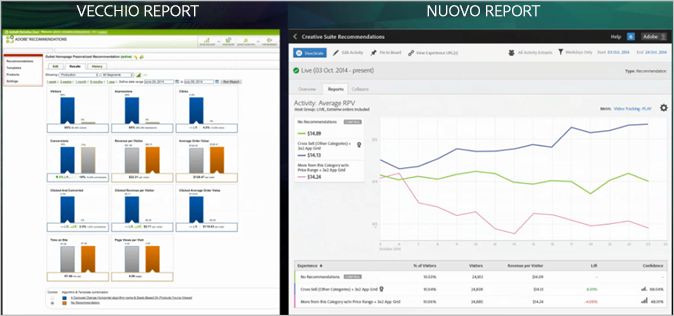

#  Confronto tra Recommendations Classic e le attività Consigli di Target Premium{#recommendations-classic-versus-recommendations-activities-in-target-premium}

Informazioni per aiutarti a scegliere tra Recommendations Classic e le attività Consigli di Target Premium.

>[!NOTE]
>
>Le attività Consigli sono disponibili come parte della soluzione [!DNL Target Premium]. Non sono disponibili in [!DNL Target Standard] senza una licenza [!DNL Target Premium].

Nel prodotto classico [!DNL Recommendations], la visualizzazione dei consigli passava attraverso la creazione di una mbox di raccolta dei dati su una pagina e l&#39;aggiunta di una mbox di visualizzazione in una posizione specifica della pagina. L’attività di [!DNL Recommendations] in [!DNL Target Premium] consente di raccogliere informazioni sui visitatori e di creare i tuoi consigli in qualsiasi punto della pagina senza la necessità di creare una mbox per ogni posizione in cui desideri consigliare prodotti o contenuti. Un semplice riferimento JavaScript nell&#39;intestazione della pagina consente di abilitare i consigli in qualsiasi punto della pagina. Utilizza questo riferimento JavaScript per passare alla mbox globale di [!DNL Target] le chiavi, come quelle `entity.id` e `entity.categoryId`.

[!DNL Recommendations Classic] ha la propria scheda nell’interfaccia utente di [!DNL Experience Cloud]. Un’attività di [!DNL Recommendations] è disponibile all’interno del flusso di lavoro di [!DNL Target Premium].

Gli utenti [!DNL Recommendations Classic] possono continuare a utilizzare le mbox [!DNL Recommendations] in [!DNL Target Recommendations]. Possono anche combinare l’approccio classico e quello di [!DNL Target] mantenendo le loro mbox e utilizzando il codice JavaScript nell’intestazione per attivare la funzionalità [!DNL Recommendations] per gli altri elementi della pagina. Per ottenere la piena funzionalità di [!DNL Target], tuttavia, gli utenti di [!DNL Recommendations Classic] potrebbero voler cancellare le vecchie mbox per affidarsi solo a [!DNL Target Recommendations].

L’attività di [!DNL Recommendations] in [!DNL Target] migliora [!DNL Recommendations Classic] nei seguenti ambiti principali:

## Consigli come offerta

Puoi includere i consigli nelle attività di [!UICONTROL test A/B] (tra cui [!UICONTROL Allocazione automatica] e [!UICONTROL Targeting automatico]) e [!UICONTROL targeting delle esperienze] (XT).

Questo apre a funzionalità tutte nuove, ad esempio:

* Contenuto relativo e non relativo a consigli di test e targeting all’interno della stessa attività.
* Facile sperimentazione con il posizionamento di consigli sulla pagina, tra cui l’ordine di più consigli.
* Invio automatico di traffico all&#39;esperienza di consigli con le prestazioni migliori tramite [!UICONTROL Allocazione automatica].
* Assegnazione dinamica di visitatori a esperienze di consigli su misura in base al loro profilo tramite [!UICONTROL Targeting automatico].

Per iniziare, crea un’attività [!UICONTROL Test A/B] o [!UICONTROL Targeting delle esperienze] tramite il [!UICONTROL Compositore esperienza visivo] e utilizza l’azione [!UICONTROL Inserisci prima], [!UICONTROL Inserisci dopo] o [!UICONTROL Sostituisci con] per aggiungere consigli a un’esperienza.

Per ulteriori informazioni, consulta [Consigli come offerta](/help/c-recommendations/recommendations-as-an-offer.md).

## Criteri {#section_117709846DAA404580EBE879FFCBD9BA}

[!DNL Target Recommendations]In è inclusa una libreria di criteri che contiene insiemi preconfigurati di regole e configurazioni. In [!DNL Recommendations Classic], per costruire ogni consiglio dovevi compilare manualmente un modulo e scegliere da un lungo elenco di regole. Ora, quando crei un’attività di [!DNL Recommendations], ti basta scegliere un set di criteri pre-configurati. Puoi ancora creare consigli personalizzati, ma la libreria di criteri contiene molte delle configurazioni più comuni, precompilate per semplificare il processo e utilizzando un linguaggio chiaro per tutti. Questi criteri preconfigurati possono essere utilizzati così come sono, oppure copiati e modificati per soddisfare esigenze specifiche.

I criteri sono preconfigurati e ordinati per settori verticali, tipi di pagina e implementazione. Ad esempio, puoi cercare i criteri che si applicano al settore verticale, per l&#39;utilizzo in una pagina del prodotto, mostrando prodotti all&#39;interno di una determinata categoria (come definito dal parametro `entity.categoryID`).

Per ulteriori informazioni sull’utilizzo e la creazione dei criteri, vedi [Criteri](/help/c-recommendations/c-algorithms/algorithms.md).

## Flusso di lavoro {#section_76B4A26297BF422382DE2C79A2713D3C}

Il flusso di lavoro di [!DNL Recommendations] è stato semplificato. Anziché compilare moduli complicati, puoi seguire un flusso di lavoro visivo che consente di:

1. Selezionare i criteri.
1. Selezionare una [progettazione](/help/c-recommendations/c-design-overview/create-design.md#task_CC5BD28C364742218C1ACAF0D45E0E14).
1. Visualizzare in anteprima i consigli risultanti.

## Anteprima visiva {#section_639B9E38C9EC4093BF9023EE0F2A15AC}

È possibile visualizzare in anteprima i consigli dopo averli impostati e apportare le modifiche necessarie senza doverli prima creare nella pagina. Le anteprime sono disponibili all&#39;interno di [!DNL Target].

## Targeting {#section_93295EA0DBA14210B8518AF4802A459F}

In [!DNL Recommendations Classic] c&#39;erano sei opzioni di targeting. Per le attività di Consigli viene utilizzata l&#39;intera gamma di opzioni di targeting di Target. Definisci un pubblico utilizzando [!DNL Target] o altri gruppi di pubblico di [!DNL Adobe Experience Cloud] (ad esempio [!DNL Audience Manager] e [!DNL Analytics]), quindi seleziona la percentuale di partecipanti all’attività che visualizzano ogni progetto e le percentuali che vedono il controllo.

## Generazione di rapporti {#section_25C2FCCE4BC1488496C517C0470B5CD6}

In [!DNL Target], [!DNL Recommendations] fornisce una funzione di creazione di rapporti migliorata che sfrutta le funzionalità offerte da [!DNL Target] e [!DNL Experience Cloud]. Anziché mostrare semplicemente l’incremento previsto da [!DNL Recommendations] rispetto ai risultati privi di consigli, puoi visualizzare informazioni complete relative all’attività di [!DNL Recommendations].

