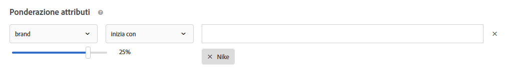

#  Domande frequenti relative ai consigli

Elenco delle domande frequenti sulle attività relative alle attività di [!DNL Adobe Target] [!DNL Recommendations].

## Perché la [!UICONTROL ricerca nel catalogo] non mostra i risultati corretti quando eseguo una ricerca su un attributo personalizzato con un valore numerico?

Quando esegui sul catalogo la ricerca di un attributo personalizzato con un valore numerico, l’attributo personalizzato viene considerato come di tipo stringa anziché come valore numerico.

Attualmente, non è disponibile alcuna funzionalità che consenta ai clienti di modificare il tipo di un attributo. Per apportare una modifica, [apri un problema cliente](/help/cmp-resources-and-contact-information.md#reference_ACA3391A00EF467B87930A450050077C) facendo riferimento agli attributi che richiedono la modifica del tipo da stringa a numerico.

## Quanto tempo trascorre prima che gli aggiornamenti degli articoli nel catalogo vengano rispecchiati nel sito?

L’intervallo di tempo e i risultati variano a seconda di come vengono aggiornati gli elementi.

| Origine | Dettagli |
| --- | --- |
| Attributi degli articoli aggiornati tramite mbox o API | <ul><li>I consigli vengono aggiornati entro 15 minuti.</li><li>I consigli e gli attributi degli elementi esistenti vengono visualizzati finché non sono disponibili aggiornamenti.</li><li>La ricerca nel catalogo viene aggiornata dopo l’indicizzazione del catalogo (3-8 ore).</li></ul> |
| Attributi degli elementi aggiornati tramite feed | <ul><li>I consigli vengono aggiornati dopo l’acquisizione dei feed (2-8 ore).</li><li>I consigli e gli attributi degli elementi esistenti vengono visualizzati finché non sono disponibili aggiornamenti.</li><li>La ricerca nel catalogo viene aggiornata dopo l’acquisizione dei feed (2-8 ore) e dopo la successiva indicizzazione del catalogo (3-8 ore). La ricerca nel catalogo viene aggiornata entro 5-16 ore totali.</li></ul> |
| Elemento eliminato dal catalogo tramite API o interfaccia utente di [!DNL Target] | <ul><li>I consigli vengono aggiornati entro 15 minuti.</li><li>I consigli e gli attributi degli elementi esistenti vengono visualizzati finché non sono disponibili aggiornamenti.</li><li>La ricerca nel catalogo viene aggiornata dopo l’indicizzazione del catalogo (3-8 ore).</li></ul> |
| Elemento aggiunto al catalogo tramite mbox o API | <ul><li>I consigli vengono aggiornati dopo l’esecuzione dell’algoritmo. Le esecuzioni degli algoritmi sono pianificate ogni 12 ore per gli algoritmi a 1-2 giorni e ogni 24 ore per gli algoritmi a 7+ giorni.</li><li>I consigli esistenti vengono visualizzati finché non sono disponibili aggiornamenti se l’elemento aggiunto non è una chiave richiesta.</li><li>I consigli di backup vengono visualizzati finché non sono disponibili aggiornamenti se l’elemento aggiunto è una chiave richiesta.</li><li>La ricerca nel catalogo viene aggiornata dopo l’indicizzazione del catalogo (3-8 ore).</li></ul> |
| Elemento aggiunto al catalogo tramite feed | <ul><li>I consigli vengono aggiornati dopo l’acquisizione del feed (2-8 ore). Le esecuzioni successive degli algoritmi vengono pianificate ogni 12 ore per gli algoritmi a 1-2 giorni e ogni 24 ore per gli algoritmi a 7+ giorni. I consigli vengono aggiornati entro 2-32 ore totali.</li><li>I consigli esistenti vengono visualizzati finché non sono disponibili aggiornamenti se l’elemento aggiunto non è una chiave richiesta.</li><li>I consigli di backup vengono visualizzati finché non sono disponibili aggiornamenti se l’elemento aggiunto è una chiave richiesta.</li><li>La ricerca nel catalogo viene aggiornata dopo l’inserimento dei feed (2-8 ore) e dopo l’indicizzazione del catalogo (3-8 ore). La ricerca nel catalogo viene aggiornata entro 5-16 ore totali.</li></ul> |

Dopo aver importato un file di feed, o ricevuto aggiornamenti di entità tramite API o mbox, le seguenti modifiche verranno riportate in meno di 60 minuti:

* Se un elemento è stato escluso in precedenza ma ora deve essere incluso, verrà incluso nella successiva esecuzione dell’algoritmo (12-24 ore).

   Questa situazione si verifica perché [!DNL Target] applica le esclusioni sia online che offline. Quando un elemento viene escluso di recente, l’esclusione online viene applicata rapidamente. Quando un elemento è stato incluso di recente, l’esclusione online viene applicata rapidamente mentre quella offline viene applicata solo alla successiva esecuzione dell’algoritmo.

* Se un elemento è stato incluso in precedenza ma ora deve essere escluso, l’elemento viene escluso secondo la tempistica “Attributi elemento aggiornati…” di cui sopra a seconda della sorgente dei feed (15 minuti tramite mbox/API o 12-24 ore tramite feed).

Le modifiche seguenti vengono applicate solo dopo l’esecuzione dell’algoritmo successivo (entro 12-24 ore):

* Attributi degli articoli utilizzati nelle regole di raccolta utilizzate per l’attività.
* Attributi degli articoli utilizzati in una promozione in base a una raccolta o un attributo associato all’attività.
* Categoria di articoli in cui l’articolo viene visualizzato, per “Categoria corrente” o “Categoria preferita” nell’algoritmo “Articoli più venduti” o “Articoli più visualizzati”.
* Classificazione degli articoli consigliati quando l’attributo modificato è un attributo personalizzato utilizzato come chiave personalizzata per un algoritmo.
* Classificazione degli articoli consigliati in base a uno o più attributi modificati quando la logica dei consigli è “Articoli con attributi simili”, quando vengono utilizzati i fattori di ponderazione “Somiglianza del contenuto” o quando vengono utilizzati i fattori “Ponderazione degli attributi”.

>[!NOTE]
>
>Un file di feed viene considerato importato quando il suo stato cambia da “Importazione elementi” a “Preparazione aggiornamenti indice di ricerca”. Possono trascorrere più di 60 minuti prima che gli aggiornamenti vengano rispecchiati nell’interfaccia utente di Ricerca nel catalogo. La funzione Ricerca nel catalogo è aggiornata quando lo stato del feed diventa “Aggiornamenti completati”. Anche se la funzione Ricerca nel catalogo non risulta ancora aggiornata, gli aggiornamenti vengono visualizzati nel sito in base alle tempistiche riportate qui sopra. Nella pagina Ricerca nel catalogo viene indicata l’ora dell’ultimo aggiornamento dell’indice di Ricerca nel catalogo.

## Quanto tempo ci vuole affinché una modifica alla configurazione delle impostazioni di attività, offerte, promozioni o criteri della funzione [!UICONTROL Consigli] venga riportata sul sito?

* Una modifica alle impostazioni di promozione può richiedere fino a cinque ore per essere visualizzata sul sito.
* Una modifica alle impostazioni di altri criteri potrebbe essere applicata solo alla successiva esecuzione dell’algoritmo:

   * Alcune impostazioni di criteri (ad esempio, “aggiunta di una regola di inclusione dinamica”) vengono applicate subito.
   * Non è possibile incorporare altre impostazioni di criteri (ad esempio “rimozione di una regola di inclusione dinamica”, modifica dell’intervallo di lookback e così via) fino alla successiva esecuzione dell’algoritmo.
   * Le esecuzioni dell’algoritmo vengono attivate da queste modifiche, ma il loro completamento può richiedere fino a 24 ore. Inoltre, gli algoritmi vengono eseguiti su base pianificata ogni 12-24 ore.

## Quanto tempo ci vuole affinché il comportamento di un utente (ad esempio, clic sul prodotto A e acquisto del prodotto B) si rifletta nei consigli *ricevuti dall&#39;utente*?

* Il prodotto/contenuto attualmente visualizzato/acquistato influisce sui consigli che l’utente riceve sulla stessa richiesta di contenuto pageview/[!DNL Target].
* Con tale richiesta viene aggiornato il comportamento storico degli utenti, ad esempio “ultimo prodotto visualizzato”, “prodotto più visualizzato” e la cronologia generale di visualizzazione/acquisto, influenzando i consigli ricevuti dall’utente sulla successiva richiesta di contenuto pageview/[!DNL Target]. Ad esempio, gli algoritmi “Articoli visualizzati di recente” e “Consigliati per te” vengono aggiornati con ogni visualizzazione/acquisto di prodotto e si riflettono sulla successiva richiesta di contenuto.

## Quanto tempo ci vuole affinché il comportamento di un utente (ad esempio, clic sul prodotto A e acquisto del prodotto B) si rifletta nei consigli *ricevuti dagli altri utenti*?

Il comportamento degli utenti in aggregato viene incorporato nell’elaborazione offline dell’algoritmo ogni volta che l’algoritmo viene eseguito, ogni 12-24 ore.

## Cosa devo fare se l’array è interrotto dalla presenza di caratteri speciali? {#section_D27214116EE443638A60887C7D1C534E}

Utilizza i valori di escape in JavaScript. Le virgolette (&quot;) possono interrompere l’array. Lo snippet di codice seguente è un esempio di valori di escape:

```
#set($String='') 
#set($escaper=$String.class.forName('org.apache.commons.lang.StringEscapeUtils')) 
<script type="text/javascript"> 
console.log("$escaper.escapeJavaScript($entity1.name)") 
console.log("$escaper.escapeJavaScript($entity2.name)") 
console.log('$escaper.escapeJavaScript($entity3.name)') 
names.push("$escaper.escapeJavaScript($entity4.name)") 
</script>
```

## Perché non tutti i criteri, inclusi i criteri personalizzati, sono disponibili per la selezione durante la creazione di un’attività Consigli? {#section_B2265AC8B8A94E0298D495A05C5D817F}

I criteri disponibili si basano sulla categoria corrente. Quando si creano offerte di consigli, il selettore di algoritmi visualizza i criteri in base all’ID di categoria.

Se la posizione in cui stai applicando questo criterio non contiene l’ID di categoria, sono disponibili solo alcuni criteri nella selezione algoritmi.

Se utilizzi una posizione in cui l’ID di categoria è presente nella mbox, il selettore di criteri contiene tutti i criteri applicabili.

L’impostazione [Filtra criteri incompatibili](/help/c-recommendations/plan-implement.md#concept_C1E1E2351413468692D6C21145EF0B84) di [!DNL Target] consente di controllare il filtraggio intelligente del selettore dell’algoritmo.

>[!NOTE]
>
>Questa impostazione è valida solo per le attività create nel Compositore esperienza visivo. Questa impostazione non è applicabile alle attività create nel Compositore esperienza basato su moduli ([!DNL Target] non dispone di contesto di posizione).

Per accedere all’impostazione [!UICONTROL Filtra criteri incompatibili], fai clic su [!UICONTROL Consigli] > [!UICONTROL Impostazioni]:


Se l’impostazione [!UICONTROL Filtra criteri incompatibili] non è abilitata, [!DNL Target] non filtra gli algoritmi nel Selettore degli algoritmi e vengono visualizzati tutti gli algoritmi.

Se l’impostazione [!UICONTROL Filtra criteri incompatibili] è abilitata, nelle attività del Compositore esperienza visivo, [!DNL Target] legge il codice entityId e l’ID di categoria dalla posizione selezionata, quindi visualizza gli algoritmi basati su `currentItem|currentCategory` (se i rispettivi valori sono presenti in tale posizione). Di conseguenza, per impostazione predefinita, solo gli algoritmi compatibili per la posizione selezionata vengono visualizzati nel selettore algoritmi.

Se l’impostazione [!UICONTROL Filtra criteri incompatibili] è abilitata, è comunque possibile visualizzare gli algoritmi non compatibili deselezionando la casella [!UICONTROL Compatibile] durante la selezione dei criteri.


L’elenco seguente contiene casi speciali in cui [!DNL Target] non visualizza la casella [!UICONTROL Compatibile]:

* Sia entityId che l’ID di categoria sono presenti nella posizione, quindi non viene filtrato nulla.
* Stai utilizzando [!DNL mbox.js] versione 55 o precedente.
* La pagina non genera chiamate mbox (!config.isAutoCreateGlobalMbox &amp;&amp; !config.isRegionalMbox)
* I parametri di [!DNL Target] non sono definiti.

## Cosa devo fare se una raccolta in Consigli va a zero (0)? {#section_E2DB2FE67CF24EEC81412BFF3FA6385D}

Considera le seguenti informazioni se noti che una raccolta, che in precedenza non lo era, va a zero:

* Puoi salvare nuovamente la raccolta e vedere se il numero si aggiorna. Salvando nuovamente, la raccolta esegue nuovamente tutti gli algoritmi che la utilizzano.
* Stai guardando nell’ambiente giusto? Vai su [!DNL /target/products.html#recsSettings] e controlla (come mostrato di seguito).

   

* L’indice è aggiornato? Vai su [!DNL /target/products.html#productSearch] e controlla da quante ore esiste l’indice (per esempio, “indicizzato 3 ore fa”). Se necessario, puoi aggiornare l’indice.
* Hai modificato qualcosa nel livello di feed o di dati che ha comportato la mancata corrispondenza delle entità alle regole di raccolta? Assicurati che le maiuscole e le minuscole corrispondano.
* Il feed è stato eseguito correttamente? Qualcuno ha cambiato la directory FTP, la password e così via?
* [!DNL Target]In gli aggiornamenti alla consegna (sulla pagina o nell’app del cliente) accadono il più rapidamente possibile. Tuttavia, [!DNL Target] deve anche fornire una rappresentazione nell’interfaccia utente per l’addetto marketing. [!DNL Target] non ritarda gli aggiornamenti di consegna per attendere la sincronizzazione con gli aggiornamenti dell’interfaccia utente. Puoi usare [mboxTrace](/help/c-activities/c-troubleshooting-activities/content-trouble.md) per vedere cosa c’è nel sistema nel momento in cui arriva una richiesta.

## Qual è la differenza tra Ponderazione attributi generale e Ponderazione attributi relativa alle somiglianze di contenuti? {#section_FCD96598CBB44B16A4C6C084649928FF}

La ponderazione degli attributi esiste in due forme: “ponderazione attributi standard” e “ponderazione attributi per somiglianza di contenuti”.

La “ponderazione attributi standard” si applica, se non a tutti, alla maggior parte di tipi di criteri (non solo alla Somiglianza contenuti). Questo tipo di ponderazione dà più peso a determinati valori di attributo. Nell’esempio seguente, i prodotti Nike ottengono un aumento dei consigli in uscita.



La “ponderazione attributi per somiglianza contenuto” si applica solo ai criteri di Somiglianza contenuti.

Questo tipo di ponderazione è più dinamico e si basa sull’attuale “chiave dei consigli” (l’elemento attualmente visualizzato). Nel seguente esempio (marca x 16), a un visitatore che ha visualizzato le sneaker Nike, verranno probabilmente consigliati altri prodotti Nike (non necessariamente solo sneaker), invece di scarpe di altre marche. A un visitatore che visualizza delle sneaker Adidas, verranno probabilmente consigliati prodotti Adidas.


## Perché talvolta [!DNL Target] non è in grado di mostrare i consigli? {#section_DB3F40673AED42228E407C05437D99E9}

[!DNL Target] a volte non può mostrare consigli a causa del basso numero di consigli disponibili.

Il numero di valori generati per criterio è pari a tre volte il numero di entità specificato nel modello. Il filtro runtime (ad esempio inventario, corrispondenza degli attributi mbox) viene applicato dopo la generazione di valori 3x, quindi è possibile finire con meno di 3x valori al momento della consegna. Per limitare questa situazione, aumenta il numero di entità nel modello nascondendo altre entità.

Il seguente JavaScript può essere utilizzato all&#39;inizio del modello per aumentare il numero di entità richieste. In questo esempio, il numero di entità richieste è 30 (3x10).

```
#foreach($entity in $entities) 
 #if( $foreach.count > 10 ) 
  #break 
 #end 
 #set ($foo = $entity.id) 
#end 
```

## Qual è il limite di dimensione di una chiamata API per inserire/aggiornare prodotti? È possibile aggiornare 50.000 prodotti con una chiamata utilizzando l’API al posto di un feed? {#section_434FE1F187B7436AA39B7C14C7895168}

[!DNL Target] impone un limite per i post di 50 MB a livello di applicazione; tuttavia, ciò si verifica solo quando trasmetti l’intestazione del tipo di contenuto `application/x-www-form-urlencoded`.

Potresti sicuramente provare a inviare 50.000 prodotti con una sola chiamata. Se questa avesse esito negativo, puoi suddividerla in batch. Adobe consiglia ai clienti di suddividere le chiamate in 5.000 o 10.000 batch di prodotto per diminuire la possibilità di un timeout dovuto al carico del sistema.

## È necessario specificare il nome mbox per creare criteri, promozioni o regole di test di modelli per Consigli? {#section_FFA42ABCC5954B48A46526E32A3A88A2}

Durante la creazione di un criterio, promozioni o una regola di test di modelli per Consigli basato su un parametro mbox, `mboxParameter` non richiede più di specificare `mboxName`. Il nome dell’elemento mbox è ora facoltativo. Questa modifica consente di utilizzare parametri da più elementi mbox o di fare riferimento a un parametro che non è ancora stato registrato nella rete Edge.

Per selezionare il parametro desiderato:

* Durante la creazione di un criterio, una promozione o una regola di test del modello, seleziona un nome di parametro dall’elenco. Inizia a digitare i primi caratteri del nome del parametro desiderato o il suo nome completo.
* Se ricordi il nome mbox ma non il nome del parametro, usa la casella di controllo per filtrare una mbox nota trasmettendo il parametro desiderato.

Con uno di questi metodi, non esiste alcun collegamento tra mbox e il parametro. Il criterio, la promozione o la regola di test del modello funzionano sulla base del parametro su tutte le mbox che trasmettono tale parametro.

Se modifichi una regola di test di criteri, una promozione o un criterio, i criteri di filtraggio vengono visualizzati con il nome mbox fornito durante la creazione.

## Perché non riesco a salvare la mia attività di consigli legacy dopo aver definito un nuovo pubblico? {#section_1E47C40B1FE7479BAC3EE0F50CE7C2C4}

Assicurati che il pubblico abbia un nome univoco. Se hai assegnato al pubblico lo stesso nome di un pubblico esistente, non puoi salvare l&#39;attività di Consigli legacy (attività di Consigli creata prima di ottobre 2016).

## Qual è la dimensione massima di un file CSV per un caricamento del feed? {#section_20F1AF4839A447B9889B246D6E873538}

Non vi è alcun limite stabilito sul numero di righe o sulle dimensioni del file per il caricamento del file CSV di un feed. Tuttavia, come best practice, Adobe consiglia di limitare le dimensioni del file CSV a 1 GB per evitare errori durante il processo di caricamento dei file. Se le dimensioni del file superano 1 GB, idealmente può essere suddiviso in più file di feed. Il numero massimo di colonne di attributi personalizzati è 100 e gli attributi personalizzati sono limitati a 4096 caratteri. Nella pagina Limitazioni di [[!DNL Target]  sono disponibili altri limiti per la lunghezza delle colonne richieste](/help/r-troubleshooting-target/target-limits.md#reference_BEFE60C3AAA442FF94D4EBFB9D3CC9B1). 

## È possibile escludere un’entità in modo dinamico? {#exclude}

Nella stringa di query, puoi trasmettere gli ID per le entità da escludere dai consigli. Ad esempio, puoi escludere gli articoli già presenti nel carrello.

Per abilitare la funzionalità di esclusione, utilizzate il parametro mbox `excludedIds`. Questo parametro punta a un elenco di ID di entità separati da virgola. Ad esempio, `mboxCreate(..., "excludedIds=1,2,3,4,5")`. Il valore viene inviato al momento della richiesta delle raccomandazioni.

L’esclusione viene eseguita solo per la chiamata [!DNL Target] corrente; gli elementi non vengono esclusi nelle chiamate [!DNL Target] successive a meno che il valore `excludedIds` non venga nuovamente trasmesso. Per escludere gli elementi nel carrello dai consigli su ogni pagina, continua a trasmettere il valore `excludedIds` su ogni pagina.

>[!NOTE]
>
>Se escludi troppe entità, i consigli si comportano come se non ci fossero abbastanza entità per riempire il modello di consigli.

Per escludere `entityIds` aggiungi in coda il token `&excludes=${mbox.excludedIds}` per l’URL di contenuto dell’offerta. Quando l&#39;URL di contenuto viene estratto, i parametri necessari vengono sostituiti mediante i parametri di richiesta mbox correnti.

Per impostazione predefinita, questa funzione è attiva per i consigli appena creati. I consigli esistenti devono essere salvati per supportare le entità a esclusione dinamica.

## Cosa significa la risposta NO_CONTENT a volte restituita nella traccia di contenuto di Recommendations?

NO_CONTENT viene restituito quando i consigli non sono disponibili per la combinazione di algoritmo e chiave richiesta. In generale, questa situazione si verifica quando i backup vengono disabilitati per l’algoritmo e si verifica anche una o più delle seguenti situazioni:

* I risultati non sono ancora pronti.

   Questa situazione si verifica in genere al primo salvataggio di un’attività appena creata o dopo che sono state apportate modifiche alla raccolta, ai criteri o alle promozioni utilizzate nell’attività.

* I risultati sono pronti, ma non ancora memorizzati nella cache del server edge più vicino, per la combinazione di algoritmo/chiave richiesta.

   La richiesta avvia un’operazione di caching, quindi questo problema dovrebbe risolversi da solo dopo alcuni ricaricamenti delle pagine e/o dopo pochi minuti.

* I risultati sono pronti, ma non disponibili per il valore chiave fornito.

   Questa situazione si verifica in genere quando si richiedono raccomandazioni per un elemento aggiunto al catalogo dopo l’esecuzione dell’algoritmo più recente e si risolve da solo dopo l’esecuzione dell’algoritmo successivo.

* Il rendering parziale del modello è disabilitato e non sono disponibili risultati sufficienti per riempire il modello.

   Questa situazione si verifica in genere quando disponi di una regola di inclusione dinamica, che filtra in modo aggressivo molti elementi dai possibili risultati. Per evitare questa situazione, abilita i backup e non applicare la regola di inclusione ai backup, o utilizza i criteri in sequenza con criteri filtrati in modo meno aggressivo.

## I consigli basati sugli elementi visualizzati di recente persistono su più dispositivi per un singolo visitatore? {#persist-across-devices}

Quando un visitatore avvia una sessione, l’ID della sessione è associato a un singolo dispositivo perimetrale su cui viene memorizzata una cache di profilo temporanea. Le richieste successive dalla stessa sessione leggono questa cache del profilo, inclusi gli elementi visualizzati di recente.

Al termine della sessione (generalmente, quando scade dopo 30 minuti di inattività), lo stato della sessione, inclusi gli elementi visualizzati di recente, viene mantenuto in un archivio di profili più permanente nello stesso ambiente edge geografico.

Successive sessioni da diversi dispositivi possono quindi accedere a questi elementi visualizzati di recente, purché la nuova sessione sia collegata al profilo del cliente tramite lo stesso Marketing Cloud ID (MCID), Experience Cloud ID (ECID) o CustomerID/mbox3rdPartyId.

Se un visitatore ha due sessioni attive contemporaneamente, gli elementi visualizzati di recente su un dispositivo non aggiornano quelli sull’altro dispositivo, a meno che i dispositivi non siano costretti a condividere lo stesso ID sessione. Esiste una potenziale soluzione a questo problema, tuttavia [!DNL Target] non supporta direttamente la condivisione dello stesso ID sessione su più dispositivi. Il cliente deve gestire autonomamente tale condivisione di ID.

Questo comportamento si verifica anche se un visitatore è attivo su un dispositivo e poi, qualche minuto dopo, diventa attivo sull’altro dispositivo. La sessione del primo dispositivo non scade per 30 minuti e possono trascorrere fino a cinque minuti prima che lo stato del profilo sia scritto nello stato permanente ed elaborato. Quando esegui il test di questo comportamento, considera che la scadenza della sessione e la memorizzazione del profilo possono quindi richiedere 35 minuti.

Se il visitatore non ha due sessioni attive contemporaneamente, gli elementi visualizzati di recente su un dispositivo aggiornano quelli sull’altro dispositivo, purché la sessione sia terminata. Quando esegui il test di questo comportamento, considera che la scadenza della sessione può richiedere 35 minuti.

## Posso utilizzare in [!DNL Recommendations Premium] un algoritmo creato in [!DNL Adobe Recommendations Classic]?

Gli algoritmi creati in [!DNL Recommendations Classic] non sono supportati in [!DNL Recommendations Premium]. È possibile utilizzare un algoritmo legacy in [!DNL Target Premium]; tuttavia, l’algoritmo potrà creare problemi di sincronizzazione durante la disattivazione o l’eliminazione dell’attività nell’interfaccia utente di [!DNL Target Premium]. Per ulteriori informazioni sulle differenze tra le due soluzioni, consulta Attività [[!DNL Recommendations Classic] versus [!DNL Recommendations] in [!DNL Target Premium]](/help/c-recommendations/c-recommendations-faq/recommendations-classic-versus-recommendations-activities-target-premium.md).


