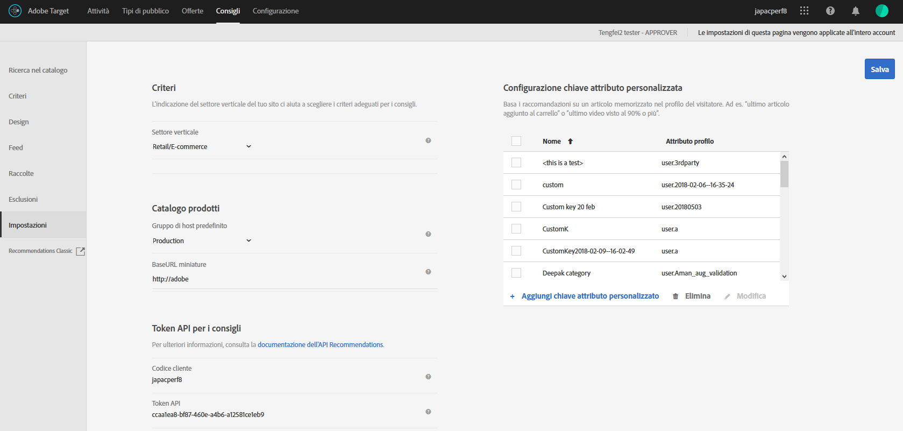

#  e implementazione di raccomandazioni {#plan-and-implement-recommendations}

Che cosa è necessario sapere prima di creare un’attività di Consigli.

## Pianificare e implementare la funzione Consigli {#concept_02AA644A4C7D4D5CB1D9CADA208CF8D1}

Che cosa è necessario sapere prima di creare un’attività di [!DNL Recommendations].

[!DNL Recommendations] richiede la configurazione della seguente gerarchia di informazioni:

| Passaggio | Informazioni | Dettagli |
|--- |--- |--- |
|  | Libreria JavaScript | Ogni pagina richiede un riferimento a at.js versione 0.9.1 (o successiva) o mbox. js versione 55 (o successiva). Questo passaggio di implementazione è obbligatorio in tutte le pagine in cui verrà utilizzata un&#39;attività di Target e può includere chiavi quali un ID di prodotto o di categoria.<BR>Per informazioni su at. js, consulta [Implementazione di at. js](/help/c-implementing-target/c-implementing-target-for-client-side-web/t-mbox-download/c-target-atjs-implementation/target-atjs-implementation.md).<br>Per ulteriori informazioni su mbox.js, consulta [Implementazione di mbox.js](/help/c-implementing-target/c-implementing-target-for-client-side-web/t-mbox-download/mbox-download.md). |
|  | Chiavi | La chiave determina il tipo di prodotto o contenuto visualizzato nei consigli. Ad esempio, la chiave può essere una categoria di prodotti. Consulta [Basare il consiglio su una Chiave consiglio](/help/c-recommendations/c-algorithms/create-new-algorithm.md#task_2B0ED54AFBF64C56916B6E1F4DC0DC3B). |
|  | Attributi | Gli attributi forniscono informazioni più specifiche sui prodotti da mostrare. Ad esempio, potrebbe essere utile mostrare i prodotti entro una determinata fascia di prezzo, o prodotti con un certo livello di scorte. Gli attributi possono essere indicati nella mbox o attraverso un [feed](/help/c-recommendations/c-products/feeds.md).<br>Consulta [Regole di inclusione](/help/c-recommendations/c-algorithms/create-new-algorithm.md#task_28DB20F968B1451481D8E51BAF947079) e [Attributi di entità](/help/c-recommendations/c-products/entity-attributes.md). |
|  | Esclusioni | Le esclusioni determinano quali elementi specifici non includere nei consigli.<br>Consulta [Esclusioni](/help/c-recommendations/c-products/exclusions.md). |
|  | Dettagli di acquisto | I dettagli di acquisto forniscono informazioni sugli elementi acquistati e sull’ordine una volta completato l’acquisto. |

## Implementazione di base {#concept_D1154A3FB0FB4467A29AD2BDD21C82D5}

L’implementazione di base richiede la trasmissione alla pagina di parametri che determinano quali prodotti o servizi visualizzare nei consigli.

Prima di iniziare la configurazione di un’attività di [!DNL Recommendations], è necessario comprendere in che modo i dati dei prodotti vengono trasmessi a [!DNL Recommendations], e stabilire quale sia il metodo ottimale per le tue esigenze.

Esistono due metodi per fornire informazioni sui prodotti e i servizi a [!DNL Recommendations]:

| Metodo | Descrizione |
|--- |--- |
| Trasmettere i parametri direttamente alla pagina | Questo metodo funziona bene per gli elementi che cambiano di frequente. Tuttavia, poiché richiede di applicare delle modifiche direttamente nella pagina, in molte aziende è necessario coinvolgere il reparto informatico e gli addetti all’implementazione delle pagine. |
| Trasmettere i parametri attraverso un feed di Google o CSV | Questo metodo funziona bene per le raccolte che non vengono modificate spesso. Solitamente non è necessario modificare l’implementazione o altro codice di pagina per fornire le informazioni di prodotto attraverso un feed. Tuttavia, l’elenco dei prodotti rimane statico ed è più difficile apportare modifiche rapide. Per ulteriori informazioni, consulta [Feed](/help/c-recommendations/c-products/feeds.md). |

Questi metodi possono essere utilizzati separatamente o insieme, come negli esempi seguenti.

## Esempio 1: combinare pagina e feed {#section_DF6BAE4BF11548BD9C44D0A426BCF5A7}

Un’alternativa comune per l’implementazione di [!DNL Recommendations] utilizza sia parametri di pagina che feed.

Questo metodo potrebbe essere più adatto per un venditore con un catalogo di prodotti relativamente fisso, ma che desidera mettere in evidenza articoli stagionali specifici o in saldo. La maggior parte dei clienti potrebbe fornire le proprie informazioni principalmente attraverso il feed, con solo modifiche occasionali sulla pagina.

Utilizza un feed per fornire informazioni che non sono soggette a modifiche frequenti. Che tu scelga un file CSV o un feed Google, utilizza i seguenti parametri:

* Parametri richiesti

   * `entity.id`

* Parametri utili

   * `entity.name`
   * `entity.categoryId`
   * `entity.brand`
   * `entity.pageUrl`
   * `entity.thumbnailUrl`
   * `entity.message`
   * Tutti gli attributi personalizzati

Una volta che il feed è configurato e trasmesso a [!DNL Recommendations], trasmetti i parametri alla pagina per gli attributi che vengono modificati spesso, ossia più di una volta al giorno.

* Parametri richiesti

   * `entity.id`
   * `entity.categoryId`

* Parametri utili

   * `entity.inventory`
   * `entity.value`

La priorità è attribuita a qualsiasi insieme di dati eseguito più di recente. Se trasmetti prima il feed e poi aggiorni i parametri della pagina, verranno visualizzate le modifiche apportate nei parametri della pagina, sostituendo le informazioni dell’articolo trasmesse nel feed.

## Esempio 2: trasmettere tutti i parametri alla pagina dei dettagli del prodotto (o contenuto) {#section_D5A4F69457604CA7AACFD7BFF79B58A9}

Se trasmetti tutti i parametri sulla pagina, puoi eseguire rapidamente gli aggiornamenti modificando la pagina. In alcune aziende, questo richiede il coinvolgimento del reparto IT o del team di progettazione web.

Questo esempio potrebbe essere particolarmente utile per un’azienda nel settore dei media, con contenuti che cambiano costantemente.

* Parametri richiesti

   * `entity.id`
   * `entity.categoryId`
   * Tutti gli altri attributi

## Codice di esempio {#section_6E8A73376F30468BB549F337C4C220B1}

Ad esempio, è possibile utilizzare il codice seguente nella sezione dell’intestazione delle pagine dei prodotti o dei contenuti:

```
function targetPageParams() {
 return {
    "entity": {
       "id": "32323",
       "categoryId": "My Category",
       "value": 105.56,
       "inventory": 329
    }
 }
}
```

Per ulteriori esempi di codice per diversi tipi di pagine, consulta [Implementazione in base al tipo di pagina](../c-recommendations/plan-implement.md#reference_DE38BB07BD3C4511B176CDAB45E126FC).

## Implementazione in base al tipo di pagina {#reference_DE38BB07BD3C4511B176CDAB45E126FC}

Il tipo di pagina influenzerà l’implementazione di [!DNL Recommendations].

Ad esempio, i tipi di consigli che si desidera presentare possono essere diversi in una pagina di prodotto rispetto a una pagina di categoria o alla pagina principale. Per ogni pagina, puoi eseguire funzioni specifiche prima della chiamata mbox per visualizzare i consigli appropriati.

Per informazioni sugli attributi negli esempi, consulta [Attributi di entità](../c-recommendations/c-products/entity-attributes.md#reference_3BCC1383FB3F44F4A2120BB36270387F).

È richiesta una formattazione JSON valida.

La funzione `targetPageParams` mostrata di seguito è particolarmente utile se utilizzi una soluzione di gestione tag per implementare le pagine. [!DNL Adobe Launch] o [!DNL Adobe Dynamic Tag Manager] (DTM) colloca il riferimento at.js/mbox.js e la funzione `targetPageParams` nella pagina e consente di configurare i valori. È opportuno inserire la funzione prima della chiamata at.js/mbox.js, oppure collocarla nella sezione JavaScript Extra della at.js/mbox.js.

## Tutte le pagine {#section_A22061788BAB42BB82BA087DEC3AA4AD}

Tutte le pagine che contengono consigli richiedono un riferimento [!DNL at.js] o [!DNL mbox.js] nella pagina. Aggiungi uno dei seguenti riferimenti a tutte le pagine con consigli:

```
<script src="../at.js /></script>
```

```
<script src="../mbox.js /></script>
```

Questa implementazione richiede:

* [!DNL at.js] versione 0.9.2 (o successiva) o [!DNL mbox.js] versione 55 (o successiva)

* [!DNL mbox.js] deve includere il riferimento a [!DNL target.js] ([!DNL at.js] non richiede un riferimento a [!DNL target.js])

Per ulteriori informazioni sull’implementazione di [!DNL at.js], consulta [Come distribuire at.js](../c-implementing-target/c-implementing-target-for-client-side-web/how-to-deployatjs/how-to-deployatjs.md#topic_ECF2D3D1F3384E2386593A582A978556).

Per ulteriori informazioni sull’implementazione di [!DNL mbox.js], consulta [Implementazione di mbox.js](../c-implementing-target/c-implementing-target-for-client-side-web/t-mbox-download/mbox-download.md#task_4EAE26BB84FD4E1D858F411AEDF4B420).

Per ulteriori informazioni sulle differenze tra le due librerie JavaScript di Target, consulta [Vantaggi di at.js](/help/c-implementing-target/c-implementing-target-for-client-side-web/t-mbox-download/c-target-atjs-implementation/target-atjs-implementation.md#benefits).

## Pagina categoria {#section_F51A1AAEAC0E4B788582BBE1FEC3ABDC}

In una pagina categoria, sarà probabilmente utile limitare i consigli ai prodotti o al contenuto all&#39;interno della categoria in questione. Per impostare una pagina categoria, configura le chiavi utilizzate dalla pagina. Per ulteriori informazioni sulle chiavi, consulta  [Basare il consiglio su una Chiave consiglio](../c-recommendations/c-algorithms/create-new-algorithm.md#task_2B0ED54AFBF64C56916B6E1F4DC0DC3B).

```
function targetPageParams() { 
   return { 
      "entity": { 
         "categoryId": "My Category" 
      } 
   } 
}
```

## Pagina di prodotto {#section_205B3953C9664125A17CA8574FA6B2A3}

In una pagina di prodotto, potrebbe essere utile raccomandare elementi specifici, oppure gli elementi con un prezzo o con un livello di scorte particolare. Per una pagina di prodotto, potrebbe essere necessario impostare attributi che si modificano frequentemente (come il valore e l&#39;inventario), oltre alle chiavi necessarie per una pagina di categoria.

```
function targetPageParams() { 
   return { 
      "entity": { 
         "id": "32323", 
         "categoryId": "My Category", 
         "value": 105.56, 
         "inventory": 329 
      } 
   } 
}
```

## Pagina del carrello {#section_D37E48700F074556B925D0CA0291405E}

In una pagina del carrello, è probabile che si vogliano escludere alcuni elementi dai consigli, ad esempio quelli già presenti nel carrello.

```
<script type="text/javascript">
function targetPageParams() {
   return {
      "excludedIds": [352, 223, 23432, 432, 553]
      }
}
</script>
```

## Pagina di ringraziamento {#section_C6126A4517A1478693AB7EC2A1D4ACCA}

Nella pagina di ringraziamento può essere utile mostrare il totale dell&#39;ordine e l&#39;ID ordine, nonché i prodotti che sono stati acquistati, senza raccomandare elementi aggiuntivi. È possibile implementare un secondo elemento mbox per acquisire le informazioni sull&#39;ordine.

* Se utilizzi at.js, consulta [Tracciare le conversioni](../c-implementing-target/c-implementing-target-for-client-side-web/how-to-deployatjs/implementing-target-without-a-tag-manager.md#task_E85D2F64FEB84201A594F2288FABF053).
* Se utilizzi mbox.js, consulta [Creare una mbox di conferma d’ordine - mbox.js](../c-implementing-target/c-implementing-target-for-client-side-web/t-mbox-download/orderconfirm-create.md#task_0036D5F6C062442788BB55E872816D82).

## Impostazioni {#concept_C1E1E2351413468692D6C21145EF0B84}

Utilizza le impostazioni per gestire l’implementazione di [!DNL Recommendations].

To access the [!UICONTROL Recommendations Settings] options, open [!DNL Target] in the [!DNL Adobe Experience Cloud], then click **[!UICONTROL Recommendations]** > **[!UICONTROL Settings]**.



Sono disponibili le seguenti opzioni:

| Impostazione | Descrizione |
|--- |--- |
| Mbox globale personalizzata | (Facoltativo) Specifica la mbox globale personalizzata utilizzata per le attività di [!DNL Target]. Per impostazione predefinita, la mbox globale utilizzata da [!DNL Target} viene utilizzata per la funzione [!DNL Recommendations].<br>Nota: Questa opzione è impostata nella pagina [!DNL Target][!UICONTROL Amministrazione] . Aprite [!DNL Target], quindi fate clic su [!UICONTROL Amministrazione] > [!UICONTROL Visual Experience Composer (Compositore esperienza visivo)]. |
| Settore verticale | Il settore verticale è utilizzato per aiutare a categorizzare i criteri per i consigli. Questo consente ai membri del gruppo di individuare criteri rilevanti per una determinata pagina, ad esempio quelli più adatti per la pagina del carrello o per una pagina con contenuti multimediali. |
| Filtra criteri incompatibili | Abilita questa opzione per mostrare solo i criteri per i quali la pagina selezionata trasmette i dati richiesti. Non tutti i criteri vengono eseguiti correttamente su ogni pagina. La pagina o mbox deve passare `entity.id` o `entity.categoryId` per rendere compatibili i consigli per l’elemento o la categoria corrente. In generale, è consigliabile mostrare solo i criteri compatibili. Per fare in modo che i criteri incompatibili siano disponibili per l’attività, deseleziona questa opzione.<br>È consigliabile disattivare l’opzione se utilizzi una soluzione di gestione tag.<br>Per ulteriori informazioni su questa opzione, consulta [Domande frequenti su Recommendations](/help/c-recommendations/c-recommendations-faq/recommendations-faq.md). |
| Gruppo host predefinito | Seleziona il gruppo host predefinito.<br>Il gruppo di host può essere utilizzato per separare gli elementi disponibili nel catalogo per usi diversi. Ad esempio, puoi utilizzare i gruppi di host per ambienti di sviluppo e produzione, marchi diversi o diverse aree geografiche. Per impostazione predefinita, i risultati dell&#39;anteprima in Ricerca nel catalogo, Raccolte ed Esclusioni si basano sul gruppo di host predefinito. Puoi anche selezionare un gruppo di host diverso per visualizzare in anteprima i risultati, utilizzando il filtro Ambiente. Per impostazione predefinita, gli elementi appena aggiunti sono disponibili in tutti i gruppi di host, a meno che non sia specificato un ID ambiente al momento della creazione o dell&#39;aggiornamento dell&#39;elemento. I consigli distribuiti dipendono dal gruppo di host specificato nella richiesta.<br>Se i prodotti non vengono visualizzati, assicurati di utilizzare il gruppo host corretto. Ad esempio, se imposti che il consiglio usi un ambiente di gestione temporanea e imposti il gruppo host su Gestione temporanea, potrebbe essere necessario ricreare le raccolte nell&#39;ambiente di gestione temporanea perché si visualizzino i prodotti. Per visualizzare i prodotti disponibili in ogni ambiente, utilizza Ricerca catalogo con ogni ambiente. Puoi anche visualizzare in anteprima il contenuto delle raccolte ed esclusioni di Recommendations per un ambiente selezionato (gruppo di host).<br>**Nota:**dopo aver modificato l’ambiente selezionato, fai clic su Cerca per aggiornare i risultati restituiti.<br>Il filtro[!UICONTROL Ambiente]è disponibile nelle seguenti posizioni nell’interfaccia utente[!DNL Target]:<ul><li>Ricerca nel catalogo ([!UICONTROL Recommendations > Ricerca nel catalogo)</li><li>Finestra di dialogo Crea raccolta ([!UICONTROL Recommendations > Raccolte > Crea nuova])</li><li>Finestra di dialogo Aggiorna raccolta ([!UICONTROL Recommendations > Raccolte > Modifica])</li><li>Finestra di dialogo Crea esclusione ([!UICONTROL Recommendations > Esclusioni > Crea nuova])</li><li>Finestra di dialogo Aggiorna esclusione ([!UICONTROL Recommendations > Esclusioni > Modifica])</li></ul>Per ulteriori informazioni, consulta [Host](/help/administrating-target/hosts.md). |
| URL di base per le miniature | L&#39;impostazione di un URL di base per il catalogo dei prodotti rende possibile l’utilizzo di URL relativi quando specifichi le miniature dei prodotti fornendo l’URL della miniatura.<br>Ad esempio:<br>`"entity.thumbnailURL=/Images/Homepage/product1.jpg"`<br>imposta un URL relativo all’URL di base della miniatura. |
| Token API per consigli | Utilizza questo token nelle chiamate API per la funzione Consigli, ad esempio l’API di download. |
