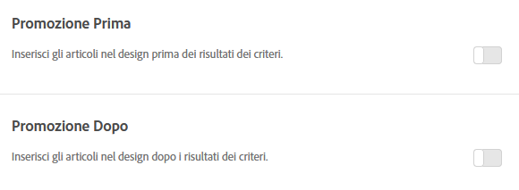

#  Aggiungere promozioni

Aggiungi articoli in promozione e controllane il posizionamento nelle progettazioni di Adobe Target Recommendations. Puoi aggiungere promozioni statiche e dinamiche.

>[!IMPORTANT]
>
>Le regole di esclusione statica e dinamica sono funzioni molto efficaci che possono esserti utili nelle iniziative di marketing. Per informazioni dettagliate, esempi e scenari di utilizzo, consulta [Utilizzare regole di inclusione dinamiche e statiche](/help/c-recommendations/c-algorithms/use-dynamic-and-static-inclusion-rules.md#concept_4CB5C0FA705D4E449BD0B37B3D987F9F).

Quando si crea un’attività di [!DNL Recommendations], è possibile includere gli elementi promossi nel progetto di [!DNL Recommendations]. Le promozioni utilizzano gli slot disponibili in una progettazione e hanno la precedenza sui risultati dei criteri e sui consigli di backup. Ad esempio, se il progetto dispone di sei slot e ne utilizzi due per le promozioni, sono disponibili quattro slot per gli articoli consigliati in base ai criteri.

Le promozioni vengono deduplicate rispetto agli articoli consigliati dai criteri per l’attività, in modo che un dato articola non venga visualizzato due volte in una singola barra di consigli.

È possibile promuovere articoli specifici, promuovere gli articoli dinamicamente, promuoverli in base agli attributi o promuovere delle raccolte.

>[!NOTE]
>
>Utilizzando le promozioni cambiano la struttura e l’output CSV. Queste modifiche potrebbero avere un impatto su tutti i processi esterni che coinvolgono CSV, ad esempio le e-mail.

1. Nella pagina **[!UICONTROL Opzioni]**, scegli tra le opzioni **[!UICONTROL Promozione prima]** o **[!UICONTROL Promozione dopo]**.

   L’illustrazione seguente mostra l’opzione [!UICONTROL Promozione prima] attivata.

   

   È possibile inserire promozioni sia prima *sia* dopo i risultati dei criteri.
1. Impostare il numero di slot di progettazione da utilizzare per gli elementi promossi.

   È possibile utilizzare fino a 20 slot, a seconda del progetto di [!DNL Recommendations]. Ogni slot utilizzato diventa non disponibile per i consigli restituiti in base ai criteri.

1. Imposta una data di inizio e una data di fine per gli articoli promossi.

   Se non si imposta una data di inizio, la promozione inizia immediatamente. Se non si imposta una data di fine la promozione viene eseguita indefinitamente.

1. Seleziona un **[!UICONTROL Tipo di promozione]**.

   * Seleziona **[!UICONTROL Elenco di voci]** e immetti i valori `entity.id`, separati da virgole, degli articoli specifici che desideri promuovere.

   * Seleziona **[!UICONTROL Promuovi per attributo]** e aggiungi regole per definire gli attributi degli elementi che desideri promuovere.

      Se si seleziona Promuovi per attributo, è possibile creare corrispondenze dinamiche. Per ulteriori informazioni, consulta [Utilizzare regole di inclusione dinamiche e statiche](/help/c-recommendations/c-algorithms/use-dynamic-and-static-inclusion-rules.md#concept_4CB5C0FA705D4E449BD0B37B3D987F9F).

   * Seleziona **[!UICONTROL Promuovi una raccolta]** e scegli la raccolta di elementi che desideri promuovere.

      È possibile creare nuove raccolte da utilizzare per le promozioni. Consulta [Creare una raccolta](/help/c-recommendations/c-products/collections.md#task_1256DFF6842141FCAADD9E1428EF7F08) per ulteriori informazioni.
   Se scegliete **[!UICONTROL Elenco di articoli]** come Tipo **[!UICONTROL di]** promozione, potete selezionare la casella di controllo Ordine **[!UICONTROL articolo]** casuale, se lo desiderate.

   L&#39;ordinamento predefinito per [!UICONTROL Elenco di elementi] si basa sull&#39;ordine immesso nell&#39;interfaccia utente o nell&#39;API di Target. If your list includes more items than the number of slots you set for promotions, the [!UICONTROL Randomize Item Order] option randomizes the promoted items that are displayed in your design. Choosing this option results in [!DNL Target] randomly selecting the items enabled for promotions in the template from the entire promotion set on each hit.

   Se le entità non dispongono di un `entity.value` attributo (ad esempio, non si vendono prodotti), è possibile trasmettere un valore numerico all&#39; `entity.value` attributo, ad esempio la data di pubblicazione. In questo caso, gli elementi promossi possono essere promossi in base alla data di pubblicazione più recente, in ordine decrescente. L&#39; `entity.value` attributo è di tipo doppio; non accetta le stringhe.

   Se avete selezionato l&#39;opzione **[!UICONTROL Promuovi per attributo]** o **[!UICONTROL Promuovi una raccolta]** , l&#39;opzione per randomizzare l&#39;ordine non è applicabile.

   Quando si promuovono elementi specifici utilizzando le opzioni [!UICONTROL Promuovi per attributo] o [!UICONTROL Promuovi una raccolta] , l&#39;ordine predefinito in cui sono presentati gli elementi è basato sull&#39; `entity.value` attributo, in ordine numerico decrescente.

   Nella tabella seguente sono illustrate le differenze tra queste opzioni:

   | Tipo di promozione | Ordinamento predefinito | Backup | Opzione filtro dinamico |
   | --- | --- | --- | --- |
   | Elenco di elementi | Ordine immesso nell&#39;interfaccia utente/API di Target | Casuale (se selezionato tramite interfaccia utente/API) | No |
   | Promuovi per attributo | `entity.value` (ordine decrescente) | Randomized su ogni richiesta (quando non è presente alcun `entity.value` attributo) | Sì |
   | Promozione di una raccolta | `entity.value` (ordine decrescente) | Randomized su ogni richiesta (quando non è presente alcun `entity.value` attributo) | No |

1. Fai clic su **[!UICONTROL Salva]**.

Le promozioni sono applicate a tutte le esperienze nell&#39;attività.
