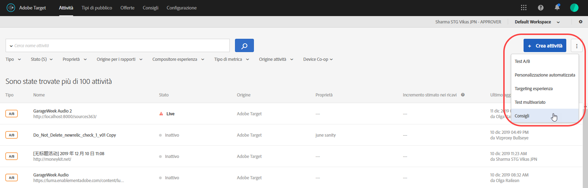
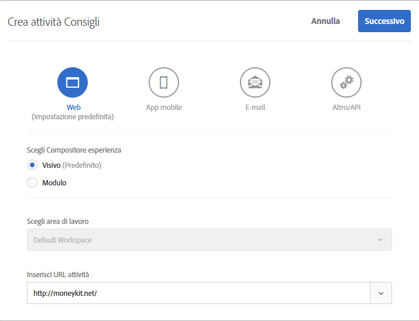
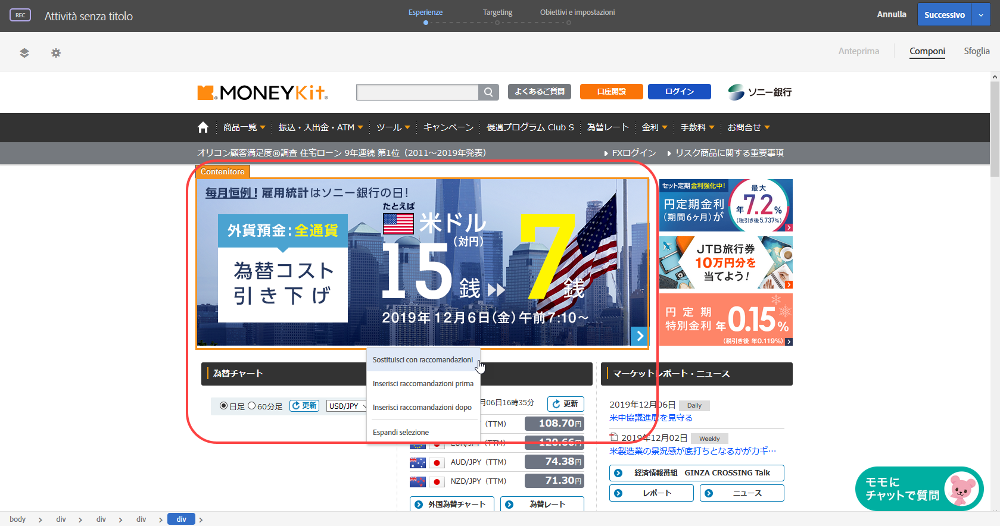
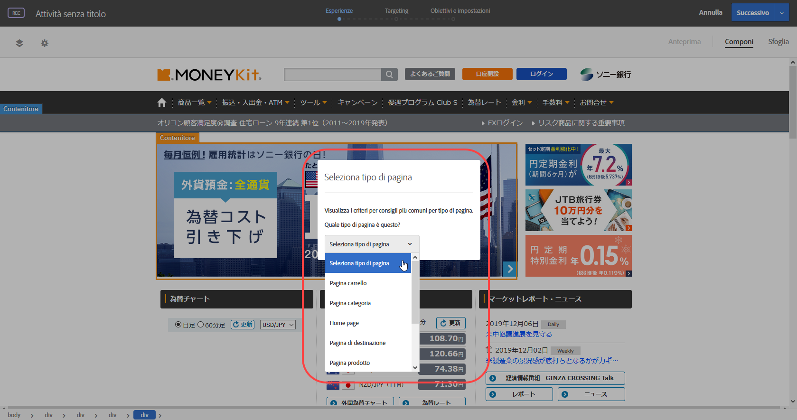
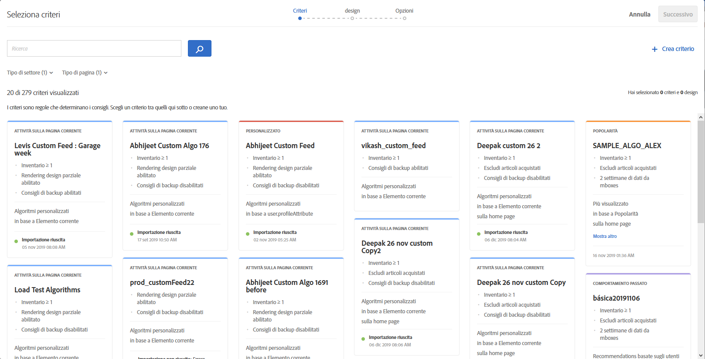
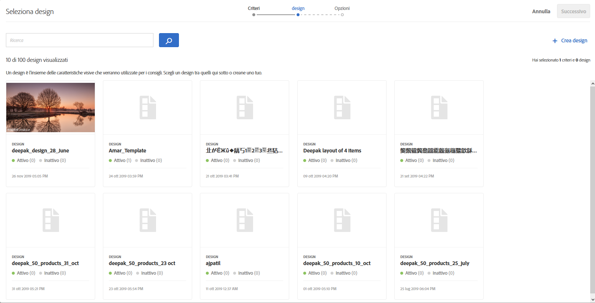
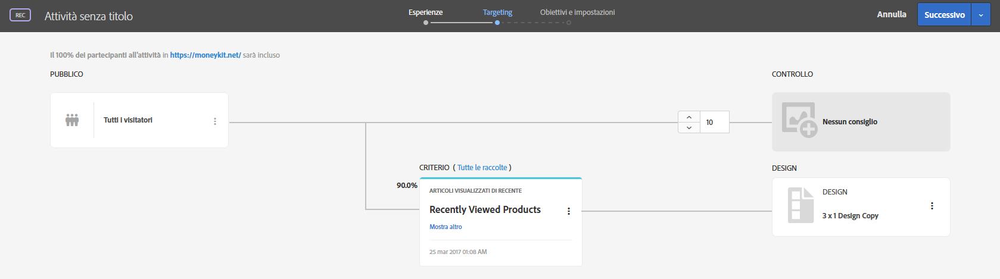

#  Creare un’attività Consigli{#create-a-recommendations-activity}

Utilizza il Compositore esperienza visivo di Target per creare attività Consigli direttamente su una pagina abilitata per Target e modificare parti della pagina in Target.

1. Fai clic su **[!UICONTROL Crea attività]** &gt; **[!UICONTROL Consigli]**.

   

1. Specifica un URL attività, quindi fai clic su **[!UICONTROL Avanti]**.

   >[!NOTE]
   >
   >[!DNL Target] non distingue tra protocolli URL ([!DNL https] e [!DNL http]). Di conseguenza, [!DNL `http://www.adobe.com`] e [!DNL `https://wwww.adobe.com`] sono entrambi validi.

   L’URL dell’attività è la pagina in cui verranno visualizzati i consigli.

   

   Se preferisci utilizzare il Compositore esperienza basato su moduli, seleziona tale opzione. Consulta [Compositore esperienza basato su moduli](https://marketing.adobe.com/resources/help/it_IT/target/target/t_form_experience_composer.html).

   Quando fai clic su [!UICONTROL Avanti], il Compositore esperienza visivo si apre e mostra la pagina. Puoi sostituire un elemento corrente con i consigli oppure inserirli.

   Per informazioni sulla risoluzione dei problemi relativi al Compositore esperienza visivo, consulta [Risoluzione dei problemi relativi al Compositore esperienza visivo](../../c-experiences/c-visual-experience-composer/r-troubleshoot-composer/troubleshoot-composer.md#reference_77743144F10143A3A89D56E116D296E4).
1. Fai clic su un elemento nella pagina; quindi, se i consigli sono disponibili nella posizione in cui si trova l’elemento, fai clic su **[!UICONTROL Sostituisci con Consigli]** o su **[!UICONTROL Inserisci Consigli]** prima o dopo l’elemento selezionato.

   

   La sostituzione di un elemento con i consigli elimina il contenuto corrente e lo sostituisce con i consigli.
1. Seleziona un tipo di pagina.

   

1. Seleziona uno o più criteri.

   I criteri vengono visualizzati sotto forma di schede contenenti informazioni su ciascun criterio. Per impostazione predefinita, nella schermata [!UICONTROL Seleziona criteri] sono visualizzati i criteri compatibili con il settore verticale e il tipo di pagina selezionato. Puoi modificare queste opzioni per visualizzare altri criteri.

   >[!NOTE]
   >
   >Non tutti i criteri vengono eseguiti correttamente su ogni pagina. La pagina o mbox deve passare `entity.id` o `entity.categoryId` per rendere compatibili i consigli per l’elemento o la categoria corrente. In generale, è consigliabile mostrare solo i criteri compatibili. Tuttavia, se desideri che i criteri non compatibili siano disponibili per l’attività, deseleziona la casella di controllo **[!UICONTROL Compatibile]**. L’opzione [!UICONTROL Compatibile] potrebbe non essere visualizzata, a seconda delle impostazioni dei Consigli (**[!UICONTROL Consigli]** &gt; **[!UICONTROL Impostazioni]** &gt; **[!UICONTROL Criteri non compatibili]**). Per ulteriori informazioni, consulta [Impostazioni](../../c-recommendations/plan-implement.md#concept_C1E1E2351413468692D6C21145EF0B84).

   

   Se selezioni più criteri, il traffico viene suddiviso in modo uniforme tra i criteri selezionati. Ad esempio, se hai selezionato due criteri e l’attività è progettata per mostrare il contenuto predefinito al 20% dei partecipanti all’attività, il 40% dei partecipanti vedrà i consigli controllati da ogni criterio. Non c’è modo di modificare le percentuali per ogni criterio.

* Per cercare un criterio esistente (ad esempio, se sono visualizzate numerose schede di criteri), digita nel campo di ricerca fino a visualizzare i criteri desiderati, quindi selezionali e fai clic su **[!UICONTROL Fine]**.

   Alcuni criteri sono forniti con [!DNL Recommendations]. Con il tuo team puoi inoltre creare criteri personalizzati.

* Per creare un nuovo criterio, fai clic su **[!UICONTROL Crea nuovo]** &gt; **[!UICONTROL Crea criterio]**, quindi inserisci le informazioni per i nuovi criteri. Per informazioni sulla creazione di un nuovo criterio, consulta [Creazione di criteri](../../c-recommendations/c-algorithms/create-new-algorithm.md#task_8A9CB465F28D44899F69F38AD27352FE).
* È inoltre possibile raggruppare i criteri in sequenze. Per creare una nuova sequenza di criteri, fai clic su **[!UICONTROL Crea nuovo]** &gt; **[!UICONTROL Crea sequenza di criteri]**. Consulta [Creazione di sequenze di criteri](../../c-recommendations/c-algorithms/create-criteria-sequence.md#task_8A9CB465F28D44899F69F38AD27352FE) per ulteriori informazioni.

1. Fai clic su **[!UICONTROL Successivo]**.
1. Seleziona una progettazione.

   Una progettazione è un modello che determina l’aspetto delle posizioni sulla pagina. [!DNL Target] include diverse progettazioni preconfigurate. Puoi anche creare progettazioni personalizzate. Per ulteriori informazioni, consulta [Creare una progettazione](../../c-recommendations/c-design-overview/create-design.md#task_CC5BD28C364742218C1ACAF0D45E0E14) e [Personalizzazione di una progettazione](../../c-recommendations/c-design-overview/customizing-a-template.md#concept_94F1554C3F2E4CDB9A2C3D78F10EDA59).

   

   Ogni progettazione mostra una rappresentazione grafica di come apparirà; viene inoltre indicato da quante attività attive e inattive è attualmente utilizzata la progettazione.

* Per selezionare una o più progettazioni esistenti, fai clic sulle progettazioni e quindi su **[!UICONTROL Fine]**.

   Se hai selezionato più criteri, puoi selezionare solo una progettazione.

* Per creare una progettazione personalizzata, fai clic su **[!UICONTROL Crea nuovo]**, quindi indica il nome e il codice per la nuova progettazione. Fai clic su **[!UICONTROL Avanti]**, quindi seleziona o carica un’immagine e fai clic su **[!UICONTROL Fine]** &gt; **[!UICONTROL Fine]**. Per informazioni sulla creazione di una nuova progettazione, consulta [Creare una progettazione](../../c-recommendations/c-design-overview/create-design.md#task_CC5BD28C364742218C1ACAF0D45E0E14).

1. Fai clic su **[!UICONTROL Successivo]**.

   Puoi aggiungere delle promozioni ai consigli. Per ulteriori informazioni sull’aggiunta di promozioni prima e dopo, consulta [Aggiunta di promozioni](../../c-recommendations/t-create-recs-activity/adding-promotions.md#task_CC5BD28C364742218C1ACAF0D45E0E14).
1. Fai clic su **[!UICONTROL Salva]**.

   La schermata del Compositore esperienza visivo mostra la progettazione dei consigli sulla tua pagina.
1. (Facoltativo) Fai clic su **[!UICONTROL Anteprima]** per vedere come verrà visualizzata l’attività ai visitatori.

La modalità [!UICONTROL Anteprima] consente di interagire con i consigli, proprio come farebbe un visitatore.

Una volta terminata la visualizzazione in anteprima dei consigli, fai clic su **[!UICONTROL Componi]**.
1. Esamina i consigli nel Compositore esperienza visivo, quindi fai clic su **[!UICONTROL Successivo]**.

   Viene mostrato il diagramma di flusso. 1.Rivedi l’attività di [!DNL Recommendations] nel diagramma di flusso e apporta le eventuali modifiche necessarie.

   

   Il diagramma di flusso ti guida attraverso le fasi di selezione del pubblico per l’attività, di configurazione delle esperienze e di specificazione delle metriche di successo. Nel diagramma di flusso puoi eseguire le operazioni seguenti:

* Cambiare il pubblico che vedrà i consigli

   >[!NOTE]
   >
   >Oltre a selezionare un pubblico esistente, puoi [creare un pubblico per sola attività](../../c-target/creating-activity-only-audience.md#concept_A6BADCF530ED4AE1852E677FEBE68483) o [combinare più tipi di pubblico](../../c-target/combining-multiple-audiences.md#concept_A7386F1EA4394BD2AB72399C225981E5) per creare tipi di pubblico ad hoc anziché crearne uno nuovo.

   Per impostazione predefinita, tutti gli utenti visualizzano i consigli. Tuttavia, puoi eseguire il targeting dei consigli per un pubblico specifico.

   Per un’attività di [!DNL Recommendations], il gruppo di controllo visualizza la pagina senza gli eventuali consigli.

* Visualizzare i criteri
* Modificare la raccolta (accanto all’etichetta [!UICONTROL Criteri])
* Modificare la percentuale di partecipanti che visualizzano l’esperienza di controllo
* Visualizzare il codice di progettazione
* Modificare o rimuovere una progettazione

1. Al termine, fai clic su **[!UICONTROL Successivo]**.
1. Specifica le impostazioni dell’attività.

   Digita, ad esempio, un nome (obbligatorio) e una finalità (facoltativa) per l’attività. Per informazioni sulle impostazioni, consulta [Impostazioni delle attività Consigli](../../c-recommendations/t-create-recs-activity/recs-activity-settings.md#reference_3FDA8388CEEC4159949151C1829E2FBB).

   >[!NOTE]
   >
   >Se specifichi un nome di attività di [!DNL Recommendation] già esistente per un’altra attività in [!DNL Recommendations Classic], la nuova attività viene risincronizzata con un nuovo nome. Il nuovo nome è composto dal nome originale più una marca temporale per renderlo univoco. Questo nuovo nome viene visualizzato in entrambi [!DNL Target Standard/Premium] e [!DNL Recommendations Classic].

1. Al termine, fai clic su **[!UICONTROL Salva]**.

   Viene visualizzata una panoramica dell’attività. Dalla pagina [!UICONTROL Panoramica], puoi:

* Attivare l’attività
* Modificare l’attività
* Aggiungere l’attività alla bacheca di Experience Cloud
* Visualizzare gli URL dell’esperienza
* Scaricare dati
* Modificare la percentuale di partecipanti all’attività che visualizzano l’esperienza di controllo
* Mostrare o nascondere i dettagli dei criteri
* Visualizzare il codice delle progettazioni

1. (Facoltativo) Apri la pagina dei [!UICONTROL Rapporti] per visualizzare le prestazioni dell’attività di [!DNL Recommendations].
1. (Facoltativo) Apri la pagina [!UICONTROL Conflitti] per visualizzare eventuali [conflitti tra attività](https://marketing.adobe.com/resources/help/it_IT/target/target/c_activity_collisions.html).

   I conflitti tra attività si verificano quando più attività sono impostate per consegnare il contenuto sulla stessa pagina e possono causare la visualizzazione di contenuto imprevisto.
