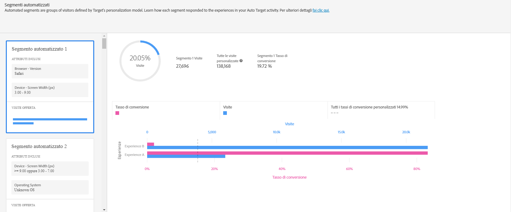
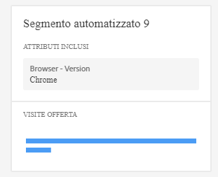
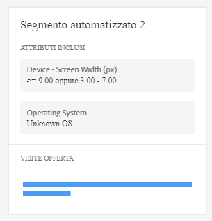

#  Rapporto Segmenti automatizzati{#automated-segments-report}

Informazioni sul rapporto Segmenti automatizzati, uno dei due rapporti specializzati disponibili per gli utenti delle attività di Personalizzazione automatizzata (AP) e Targeting automatico (AT).

>[!NOTE]
>
>Quando usi i rapporti Personalization Insights, prendi in considerazione quanto segue:
>
>* Le attività di AP e AT sono disponibili come parte della soluzione [!DNL Target Premium]. Non sono disponibili in [!DNL Target Standard] senza una licenza di [!DNL Target Premium].
   >
   >
* [!UICONTROL I rapporti di Approfondimenti personalizzazione sono disponibili solo per le attività di AP e AT che utilizzano un obiettivo di ottimizzazione delle conversioni. ] Anche le attività in cui l&#39;obiettivo di ottimizzazione è stato modificato in conversione da ricavi dopo che l&#39;attività era già attiva non sono supportate.
   >
   >
* [!UICONTROL I rapporti Personalization Insights] (Approfondimenti sulla personalizzazione) sono disponibili solo se l&#39;obiettivo  principale è selezionato dall&#39;elenco a discesa [!UICONTROL Report Metric (Metrica] report).
   >
   >
* I rapporti Approfondimenti personalizzati sono supportati solo nell’[ambiente predefinito](../../administrating-target/hosts.md).
   >
   >
* [!UICONTROL I rapporti sugli approfondimenti] di personalizzazione sono generati solo per le attività che si trovano nello stato [!UICONTROL Live] e sono state attivate e ricevono traffico per almeno 15 giorni.

I vari visitatori rispondono in modo diverso alle offerte/esperienze nell&#39;attività di AP/AT. Questo rapporto mostra come i diversi segmenti automatizzati definiti dai modelli di personalizzazione di Target rispondono alle offerte/esperienze dell&#39;attività.

## Accedere al rapporto Segmenti automatizzati {#section_8E8F997AAAF44A1B9EE06EB6FB652801}

1. Click **[!UICONTROL Activities]**, then click the desired [Automated Personalization](../../c-activities/t-automated-personalization/automated-personalization.md#task_8AAF837796D74CF893CA2F88BA1491C9) or [Auto-Target](../../c-activities/auto-target-to-optimize.md#concept_67779E5B7F67427A97D7EA2A6FB919B3) activity from the list.

   If you have many activities, you can filter the list by selecting options from the [!UICONTROL Type], [!UICONTROL Status], [!UICONTROL Property], [!UICONTROL Reporting Source], [!UICONTROL Experience Composer], [!UICONTROL Metrics Type], and [!UICONTROL Activity Source] drop-down lists.

1. Fai clic su **[!UICONTROL Rapporto]**.

   The [Automated Personalization Summary](/help/c-reports/reports-ap.md) or [Auto-Target Summary](/help/c-reports/auto-target-summary-report.md) report displays, which provides information about the performance of your activities, represented by the first screen icon. Le altre due icone rappresentano i due rapporti di Registri di personalizzazione: Segmenti automatizzati e Attributi importanti. Tieni presente che Targeting automatico ha un&#39;ulteriore icona di grafico per la visualizzazione grafica del rapporto di [!UICONTROL Riepilogo].

   

   >[!IMPORTANT]
   >
   >Il rapporto [!UICONTROL Segmenti automatizzati] non sarà disponibile per almeno 15 giorni dopo l’attivazione dell’attività. Durante questo periodo iniziale, non potrai accedere a questo rapporto o fare clic sull’icona di [!UICONTROL Segmenti automatizzati]. Trascorsi 15 giorni, supponendo che la tua attività abbia un traffico personalizzato sufficiente, sarà disponibile il rapporto [!UICONTROL Segmenti automatizzati].

1. A 15 giorni dall&#39;attivazione dell&#39;attività, puoi fare clic sull&#39;icona **[!UICONTROL Segmenti automatizzati]**.

   

1. Seleziona l&#39;intervallo di date desiderato.

   A differenza del rapporto di [!UICONTROL Riepilogo] (rapporto sulle prestazioni), [!UICONTROL Registri di personalizzazione], incluso [!UICONTROL Segmenti automatizzati], è disponibile solo per intervalli di date fissi: 15 giorni, 30 giorni, 45 giorni, 60 giorni e 90 giorni. Questi intervalli di date fissi consentono a [!UICONTROL Registri di personalizzazione] di utilizzare una gamma di dati abbastanza ampia da ridurre la probabilità di trarre informazioni da un modello di breve durata all&#39;interno dell&#39;attività. Le due decisioni che puoi prendere per l&#39;intervallo di date sono “Data di fine” e “Durata”. Noterai che “Start” è inattivo. La data di inizio cambia automaticamente in base alla data di fine e alla durata selezionate.

   

   Puoi accedere agli intervalli di date fissi disponibili dall&#39;elenco a discesa [!UICONTROL Scegli la durata].

   

1. Esamina i dati del rapporto [!UICONTROL Segmenti automatizzati].

   

1. (Facoltativo) [Scarica il rapporto in formato CSV](../../c-reports/c-report-settings/report-settings.md#section_77E65C50BAAF4AB79242DB3A8778ADEF) per l&#39;analisi in Excel e altri programmi.

   >[!NOTE]
   >
   >Il rapporto dell’interfaccia utente di Registri di personalizzazione contiene informazioni selezionate. Il file CSV scaricabile per il rapporto Segmenti automatizzati contiene ulteriori dettagli. Il file scaricabile del rapporto di Segmenti automatizzati comprende altri Segmenti automatizzati oltre ai segmenti principali inclusi nell&#39;interfaccia utente, così come le prestazioni di quei segmenti rispetto alle offerte o esperienze.

## Interpretare il rapporto Segmenti automatizzati

La tabella seguente spiega come interpretare il rapporto e ne descrive gli elementi:

| Elemento | Dettagli |
|--- |--- |
| Pannello laterale sinistro | Nel pannello laterale sinistro sono elencati i 20 “segmenti automatizzati” più grandi identificati dai modelli di personalizzazione di Target per questa attività. Un “segmento automatizzato” è una sorta di pubblico, che però è definito dai modelli di personalizzazione di Target anziché dall’addetto al marketing. Ciascun segmento automatizzato è composto da valori specifici (o intervalli di valore) di attributi specifici. Tieni presente che i segmenti automatizzati possono sovrapporsi. I segmenti automatizzati possono essere definiti da uno, due, tre o quattro attributi. Per ulteriori informazioni, consulta gli esempi seguenti. Per ulteriori informazioni sui modelli di personalizzazione di Target, consulta [Algoritmo Foresta casuale](/help/c-activities/t-automated-personalization/algo-random-forest.md). Per ulteriori informazioni sugli attributi utilizzati dai modelli di personalizzazione di Target per creare i segmenti automatizzati, consulta [Raccolta di dati per gli algoritmi di personalizzazione di Target](/help/c-activities/t-automated-personalization/ap-data.md). |
| Grafico centrale | I grafici centrali mostrano le prestazioni del contenuto dell&#39;attività per il segmento automatico evidenziato. Quando fai clic sui vari segmenti nel pannello a sinistra, si aggiornano i grafici centrali. |
| Grafici a torta | I grafici a torta nella parte superiore del pannello centrale mostrano le dimensioni del segmento automatizzato e il numero totale di visite personalizzate nell&#39;attività (ad esempio, il traffico verso l&#39;attività gestito dal modello di personalizzazione. Non include il traffico di controllo o il traffico gestito dal modello vincitore complessivo). Tieni presente che le dimensioni del segmento sono basate esclusivamente sulle visite personalizzate.  |
| Istogramma a doppio asse | L&#39;istogramma a doppio asse include le informazioni sulle visite e sulle conversioni dell&#39;offerta o esperienza per quel segmento automatizzato specifico. |
| Barra rosa | La barra rosa rappresenta il tasso di conversione e utilizza l&#39;asse inferiore del grafico. Posiziona il puntatore sulla barra per ulteriori informazioni |
| Barra blu | La barra blu rappresenta il numero di visite e utilizza l&#39;asse superiore del grafico. Posiziona il puntatore sulla barra per ulteriori informazioni. |
| Linea punteggiata grigia | La linea punteggiata grigia rappresenta il tasso di conversione per tutte le visite personalizzate nell&#39;attività, in tutte le offerte/esperienze e nei segmenti automatizzati. |

**Segmento automatizzato, esempio 1**

Questo segmento automatizzato viene definito in base a un solo attributo. I visitatori inclusi nel segmento automatizzato hanno visualizzato questa attività di Personalizzazione automatizzata in un giorno feriale al di fuori del normale orario lavorativo o in un weekend.

**Segmento automatizzato, esempio 2**

Questo segmento automatizzato viene definito in base a due attributi. I visitatori inclusi in questo segmento automatizzato che hanno visualizzato questa attività di Personalizzazione automatizzata hanno effettuato meno di tre visualizzazioni nella visita in questione ed erano geograficamente localizzati a una latitudine tra 42.57 e 47.29 (all&#39;incirca tra New Hampshire/Oregon e Washington/Maine per una società con sede negli Stati Uniti).

## Domande frequenti sui Segmenti automatizzati {#section_740910A52FA646B4AC9452F98C2F5719}

**I rapporti Registri di personalizzazione non sono ancora disponibili per la mia attività. Perché?**

Ci sono vari motivi per cui i rapporti di [!UICONTROL Registri di personalizzazione] non sono ancora disponibili per la tua attività:

* non sono trascorsi 15 giorni dall&#39;attivazione dell&#39;attività. I rapporti di Segmenti automatizzati e Attributi importanti non saranno disponibili per almeno 15 giorni dopo l&#39;attivazione dell&#39;attività. Durante questo periodo iniziale, non potrai accedere a questi rapporti o fare clic sulle icone di Segmenti automatizzati e Attributi importanti.
* L&#39;attività non ha avuto traffico a sufficienza durante il periodo di tempo specificato. Trascorsi 15 giorni, supponendo che la tua attività abbia un traffico personalizzato sufficiente, saranno disponibili i rapporti Segmenti automatizzati e Attributi importanti.
* L&#39;attività ha un obiettivo di ottimizzazione dei profitti. Attualmente, [!UICONTROL Registri di personalizzazione] è disponibile solo per le attività con obiettivo di ottimizzazione della conversione. Il supporto per le attività di ottimizzazione dei profitti verrà aggiunto in una versione futura.

**Cos&#39;è un attributo?**

Un attributo è un&#39;informazione su un visitatore o sulla sua visita specifica che gli algoritmi di personalizzazione utilizzano per imparare a personalizzare il traffico. Gli attributi possono essere, ad esempio, il tipo di browser, la posizione, l&#39;orario della visita e così via.

Per ulteriori informazioni sugli attributi utilizzati da [!DNL Target] nei modelli di personalizzazione, consulta [Raccolta di dati per gli algoritmi di personalizzazione di Target](../../c-activities/t-automated-personalization/ap-data.md#reference_255BD3DE7AD04DC9B766E0BC78961058). Per ulteriori informazioni su come caricare in Target nuovi attributi da utilizzare nei modelli di personalizzazione di Target, vedi [Metodi per immettere i dati in Target](../../c-implementing-target/c-considerations-before-you-implement-target/c-methods-to-get-data-into-target/methods-to-get-data-into-target.md#concept_0069C0EFB56C4700BB33F2F35C2B9B17).

**Cos&#39;è un segmento automatizzato?**

Un “segmento automatizzato” è una sorta di pubblico, che però è definito dai modelli di personalizzazione di Target anziché dall’addetto al marketing.

Un segmento automatizzato è composto da valori specifici (o intervalli di valore) di attributi specifici. Consulta il passaggio 5 sopra per esempi di segmenti automatizzati. Tieni presente che i segmenti automatizzati possono sovrapporsi.

Per ulteriori informazioni sull’algoritmo di personalizzazione della foresta casuale, ovvero la base dei modelli di personalizzazione di Target, consulta [Algoritmo Foresta casuale](../../c-activities/t-automated-personalization/algo-random-forest.md#concept_48F3CDAA16A848D2A84CDCD19DAAE3AA).

**Da cosa è determinato l&#39;ordine dei segmenti automatizzati? **

Per ogni segmento viene calcolato un punteggio in base alle sue dimensioni e prestazioni nel contenuto dell&#39;attività. La combinazione di questi input determina l&#39;ordine dei segmenti automatizzati, in modo tale che i segmenti più grandi e con maggiori differenze di prestazione in rapporto ai vari contenuti appaiano in cima all&#39;elenco.

**Perché nel rapporto di Segmenti automatizzati non sono visibili tutte le offerte/esperienze?**

Le attività di Personalizzazione automatizzata (AP) e Targeting automatico (AT) creano un modello per ogni offerta (nel caso di AP) e un modello per esperienze (nel caso di AT). Queste attività iniziano a gestire il traffico personalizzato e a creare [!UICONTROL Registri di personalizzazione] a partire da due modelli. Se in [!UICONTROL Registri di personalizzazione] non vengono visualizzate tutte le offerte/esperienze, è probabile che non siano stati creati modelli specifici per queste offerte/esperienze. Controlla il rapporto del [!UICONTROL Riepilogo] dell&#39;attività e verifica se accanto quell&#39;offerta o esperienza è presente l&#39;icona dell&#39;orologio. Questa icona indica che i modelli per quell&#39;offerta/esperienza non sono ancora stati creati.

**Perché alcune offerte/esperienze con un tasso di conversione inferiore ricevono una maggiore quantità di traffico rispetto ad altre per un determinato segmento automatizzato?**

Vi sono vari motivi per cui potresti vedere più visite a un&#39;offerta o esperienza a basso tasso di conversione in un segmento automatizzato, tra cui:

* Un basso numero di visualizzazioni per alcune o tutte le offerte/esperienze per un determinato segmento automatizzato.
* Le attività a volume ridotto in cui alcune offerte/esperienze non dispongono di modelli o in cui i modelli sono stati creati prima per certe offerte/esperienze rispetto ad altre.
* Le regole di Targeting su un&#39;offerta specifica che selezionano i visitatori che possono visualizzare una determinata offerta/esperienza.

**Le informazioni nei rapporti di[!UICONTROL Segmenti automatizzati]e[!UICONTROL Attributi importanti]sono le stesse del file CSV scaricabile?**

No, il rapporto dell&#39;interfaccia utente contiene specifiche informazioni. Il file CSV scaricabile contiene ulteriori dettagli. Il download del rapporto di Registri di segmento automatizzato comprende altri Segmenti automatizzati oltre ai segmenti principali inclusi nell&#39;interfaccia utente, così come le prestazioni di quei segmenti rispetto alle offerte o esperienze. Il rapporto di Attributi importanti include i principali 100 attributi dei visitatori e l&#39;importanza relativa, mentre l&#39;interfaccia utente include solo i 10 attributi principali.

**Posso visualizzare[!UICONTROL Registri di personalizzazione]per un intervallo di date personalizzato?**

Il rapporto di Registri di personalizzazione (sia per [!UICONTROL Segmenti automatizzati] sia per [!UICONTROL Attributi importanti]) è disponibile solo per intervalli di date fissi: 15 giorni, 30 giorni, 45 giorni, 60 giorni e 90 giorni. Questi intervalli di date fissi consentono a [!UICONTROL Registri di personalizzazione] di utilizzare una gamma di dati abbastanza ampia da ridurre la probabilità di trarre informazioni da un modello di breve durata all&#39;interno dell&#39;attività. Puoi selezionare queste durate per qualsiasi data di fine (laddove vi siano dati a sufficienza per soddisfare la durata).

**Come viene creato[!UICONTROL Registri di personalizzazione]?**

[!UICONTROL Registri di personalizzazione] viene creato tramite una tecnica di Adobe in attesa di licenza denominata MAGIX (Model Agnostic Globally Interpretable Explanations). Per ulteriori informazioni su MAGIX, consulta il documento pubblicato del team di ricerca Adobe sul sito [arXiv.org](https://arxiv.org/abs/1706.07160).

**Perché i dati sul traffico totale dei visitatori nel rapporto[!UICONTROL Segmenti automatizzati]non corrispondono al rapporto di riepilogo/prestazioni di Personalizzazione automatizzata (AP) o Targeting automatico (AT)?**

I rapporti di [!UICONTROL Registri di personalizzazione] includono solo quei visitatori che hanno visto un contenuto selezionato dai modelli di personalizzazione di Target (cioè non considera il traffico di controllo o il traffico gestito dal modello vincitore complessivo). Questo tipo di traffico è detto traffico “personalizzato”. Il rapporto sulle prestazioni di riepilogo in AP/AT include il controllo rispetto al traffico “mirato”. Il traffico mirato include il traffico personalizzato, nonché quello gestito tramite il modello vincitore complessivo e quello gestito in modo casuale utilizzato per continuare l&#39;apprendimento.

**I segmenti automatizzati si escludono a vicenda?**

No, c&#39;è una sovrapposizione tra i segmenti automatizzati.

**[!UICONTROL Registri di personalizzazione]è disponibile per obiettivi di modeling/obiettivi primari basati sui profitti?**

Attualmente, [!UICONTROL Registri di personalizzazione] è disponibile solo per le attività con obiettivo di ottimizzazione della conversione. Il supporto per le attività di ottimizzazione dei profitti verrà aggiunto in una versione futura.

**Come posso sfruttare le informazioni in Registri di personalizzazione?**

* Scopri un nuovo gruppo di destinatari: se vedi un segmento automatizzato dalle prestazioni particolarmente buone, puoi creare un gruppo di destinatari per riutilizzare il segmento in altri rapporti.
* Verifica le tue ipotesi sui tipi di visitatori che risponderanno a determinate esperienze.
* Scopri i contenuti che hanno funzionato per determinati tipi di visitatori: le offerte che hanno avuto maggiore riscontro.
* Individua il contenuto con le prestazioni più basse.
* Scopri gli attributi cruciali per l&#39;apprendimento del modello.
* Scopri gli attributi utilizzati nei modelli di personalizzazione e la loro importanza.
* Individua le opportunità per ulteriori punti di dati da trasmettere a Target per informare ulteriormente la tua personalizzazione.

**Esiste una logica per l’ordine di visualizzazione degli attributi in una scheda segmenti?**

No, l’ordine delle schede è basato solo su una classificazione, come precedentemente descritto. L’ordine degli attributi all’interno di una scheda non è basato su alcuna logica.