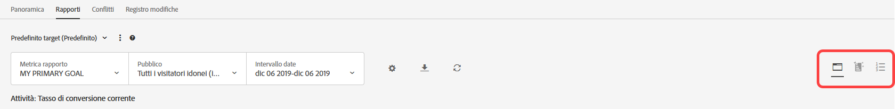
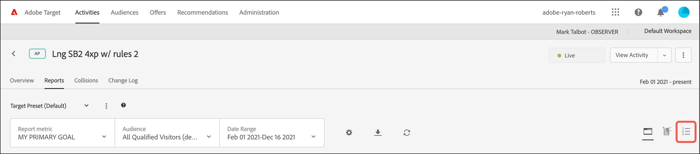
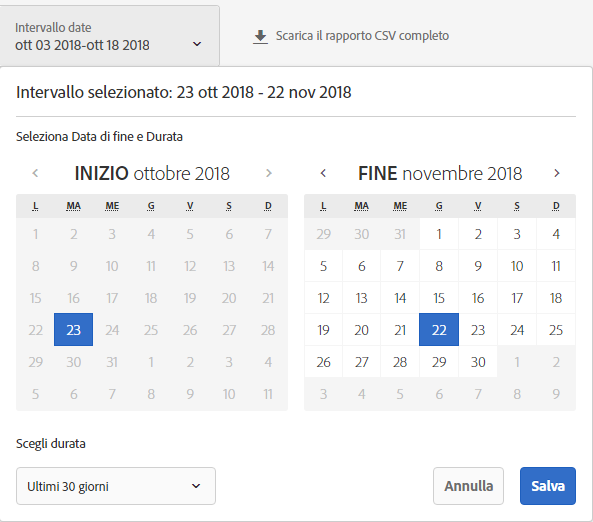
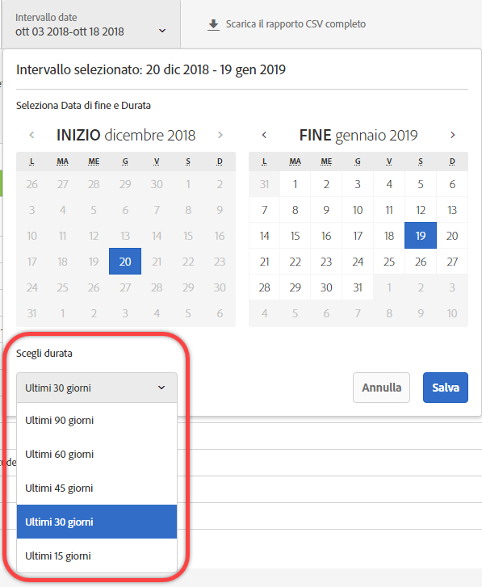
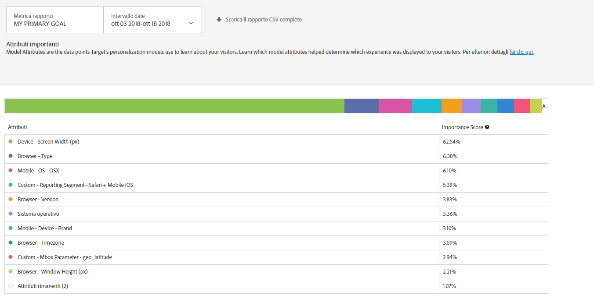

#  Rapporto Attributi importanti{#important-attributes-report}

Informazioni sul rapporto Attributi importanti, uno dei due rapporti specializzati disponibili per gli utenti delle attività di Personalizzazione automatizzata (AP) e Targeting automatico (AT).

>[!NOTE]
>
>Quando usi i rapporti Personalization Insights, prendi in considerazione quanto segue:
>
>* Le attività di AP e AT sono disponibili come parte della soluzione [!DNL Target Premium]. Non sono disponibili in [!DNL Target Standard] senza una licenza di [!DNL Target Premium].
   >
   >
* [!UICONTROL I rapporti di Approfondimenti personalizzazione sono disponibili solo per le attività di AP e AT che utilizzano un obiettivo di ottimizzazione delle conversioni. ] Anche le attività in cui l&#39;obiettivo di ottimizzazione è stato modificato in conversione da ricavi dopo che l&#39;attività era già attiva non sono supportate.
   >
   >
* [!UICONTROL I rapporti ] Insightsreport sulla personalizzazione sono disponibili solo se gli  [!UICONTROL obiettivi ] primari selezionati dall&#39;elenco a discesa  [!UICONTROL Metricia ] report.
   >
   >
* I rapporti Approfondimenti personalizzati sono supportati solo nell’[ambiente predefinito](/help/administrating-target/hosts.md).
   >
   >
* [!UICONTROL I rapporti ] Insightsreporting sulla personalizzazione sono generati solo per le attività che si trovano in   Livestatus e sono state attivate e ricevono traffico per almeno 15 giorni.

Nelle varie attività, i vari attributi possono essere più o meno importanti per il modo in cui il modello decide di personalizzare. Questo rapporto mostra gli attributi principali che hanno influenzato il modello e la loro importanza relativa.

## Accedere al rapporto Attributi importanti {#section_8E8F997AAAF44A1B9EE06EB6FB652801}

1. Fare clic su **[!UICONTROL Activities]**, quindi fare clic sull&#39;attività [ Automated Personalization](/help/c-activities/t-automated-personalization/automated-personalization.md#task_8AAF837796D74CF893CA2F88BA1491C9) o [Auto-Target](/help/c-activities/auto-target/auto-target-to-optimize.md) desiderata dall&#39;elenco.

   Se hai numerose attività, puoi filtrare l’elenco selezionando le opzioni che ti interessano dagli elenchi a discesa [!UICONTROL Tipo], [!UICONTROL Stato], [!UICONTROL Origine per i rapporti], [!UICONTROL Compositore esperienza], [!UICONTROL Tipo di metrica] e [!UICONTROL Origine attività].

1. Fai clic su **[!UICONTROL Rapporto]**.

   Viene visualizzato il report [ Automated Personalization Summary](/help/c-reports/reports-ap.md) o [Auto-Target Summary](/help/c-reports/auto-target-summary-report.md), che fornisce informazioni sulle prestazioni delle attività, rappresentato dall&#39;icona della prima schermata. Le altre due icone rappresentano i due rapporti di Registri di personalizzazione: Segmenti automatizzati e Attributi importanti. Tieni presente che Targeting automatico ha un&#39;ulteriore icona di grafico per la visualizzazione grafica del rapporto di [!UICONTROL Riepilogo].

   

   >[!IMPORTANT]
   >
   >Il rapporto [!UICONTROL Attributi importanti] non sarà disponibile per almeno 15 giorni dopo l’attivazione dell’attività. Durante questo periodo iniziale, non potrai accedere a questo rapporto o fare clic sull’icona di [!UICONTROL Attributi importanti]. Trascorsi 15 giorni, supponendo che la tua attività abbia un traffico personalizzato sufficiente, sarà disponibile il rapporto [!UICONTROL Attributi importanti].

1. A 15 giorni dall&#39;attivazione dell&#39;attività, puoi fare clic sull&#39;icona **[!UICONTROL Attributi importanti]**.

   

1. Seleziona l&#39;intervallo di date desiderato.

   A differenza del rapporto di [!UICONTROL Riepilogo] (rapporto sulle prestazioni), [!UICONTROL Registri di personalizzazione], incluso [!UICONTROL Attributi importanti], è disponibile solo per intervalli di date fissi: 15 giorni, 30 giorni, 45 giorni, 60 giorni e 90 giorni. Questi intervalli di date fissi consentono a [!UICONTROL Registri di personalizzazione] di utilizzare una gamma di dati abbastanza ampia da ridurre la probabilità di trarre informazioni da un modello di breve durata all&#39;interno dell&#39;attività. Le due decisioni che puoi prendere per l&#39;intervallo di date sono “Data di fine” e “Durata”. Noterai che “Start” è inattivo. La data di inizio cambia automaticamente in base alla data di fine e alla durata selezionate.

   

   Puoi accedere agli intervalli di date fissi disponibili dall&#39;elenco a discesa [!UICONTROL Scegli la durata].

   

1. Esamina i dati del rapporto [!UICONTROL Attributi importanti].

   

1. (Facoltativo) [Scarica il rapporto in formato CSV](/help/c-reports/c-report-settings/report-settings.md#section_77E65C50BAAF4AB79242DB3A8778ADEF) per l&#39;analisi in Excel e altri programmi.

   >[!NOTE]
   >
   >Il rapporto dell’interfaccia utente di Registri di personalizzazione contiene informazioni selezionate. Il CSV scaricabile per il rapporto Attributi importanti contiene ulteriori dettagli. Il download del rapporto Attributi importanti include l&#39;elenco completo dei 100 attributi principali, mentre il rapporto dell&#39;interfaccia utente include soltanto i primi 10. Se non trovi un attributo specifico nel rapporto, ciò non significa che questo non sta influenzando l&#39;attività, ma semplicemente che non è rientrato nella lista dei primi 100.

## Interpretare il rapporto Attributi importanti

La tabella seguente spiega come interpretare il rapporto e ne descrive gli elementi:

| Elemento | Dettagli |
|--- |--- |
| Grafico a barre | Il grafico a barre multicolore nella parte superiore dello schermo consente di visualizzare questi punteggi e mappe di importanza relativa con il colore del punto accanto a ciascun attributo nella tabella. Puoi anche posizionare il cursore su un colore specifico nel grafico a barre per visualizzare l&#39;attributo che rappresenta.  I punteggi di importanza dei 100 attributi principali totalizzano il 100%. Per ulteriori informazioni sull’aggiunta di altri attributi utilizzabili dai modelli di personalizzazione di Target, consulta [Caricamento di dati per gli algoritmi di personalizzazione di Target](/help/c-activities/t-automated-personalization/uploading-data-for-the-target-personalization-algorithms.md). |
| Grafico di Classifica Attributi del Modello | Il grafico di Classifica Attributi del Modello include i 10 attributi principali, ovvero i più importanti nel criterio con cui il modello di personalizzazione di Target ha fatto visualizzare un determinato contenuto a ciascun visitatore. Il punteggio di importanza mostra, relativamente ai 100 attributi principali, quanto è stato importante un determinato attributo per i modelli di personalizzazione di Target in questa attività. |

## Domande frequenti sugli attributi importanti {#section_740910A52FA646B4AC9452F98C2F5719}

**I rapporti Registri di personalizzazione non sono ancora disponibili per la mia attività. Perché?**

Ci sono vari motivi per cui i rapporti [!UICONTROL Approfondimenti personalizzazione] potrebbero non essere ancora disponibili per la tua attività:

* non sono trascorsi 15 giorni dall&#39;attivazione dell&#39;attività. I rapporti di Segmenti automatizzati e Attributi importanti non saranno disponibili per almeno 15 giorni dopo l&#39;attivazione dell&#39;attività. Durante questo periodo iniziale, non potrai accedere a questi rapporti o fare clic sulle icone di Segmenti automatizzati e Attributi importanti.
* L&#39;attività non ha avuto traffico a sufficienza durante il periodo di tempo specificato. Trascorsi 15 giorni, supponendo che la tua attività abbia un [traffico personalizzato sufficiente](/help/c-activities/auto-target/auto-target-to-optimize.md#section_BA4D83BE40F14A96BE7CBC7C7CF2A8FB), saranno disponibili i rapporti Segmenti automatizzati e Attributi importanti.
* L&#39;attività ha un obiettivo di ottimizzazione dei profitti. Attualmente, [!UICONTROL Registri di personalizzazione] è disponibile solo per le attività con obiettivo di ottimizzazione della conversione. Il supporto per le attività di ottimizzazione dei profitti verrà aggiunto in una versione futura.

**Cos&#39;è un attributo?**

Un attributo è un&#39;informazione su un visitatore o sulla sua visita specifica che gli algoritmi di personalizzazione utilizzano per imparare a personalizzare il traffico. Gli attributi possono essere, ad esempio, il tipo di browser, la posizione, l&#39;orario della visita e così via.

Per ulteriori informazioni sugli attributi utilizzati da [!DNL Target] nei modelli di personalizzazione, consulta [Raccolta di dati per gli algoritmi di personalizzazione di Target](/help/c-activities/t-automated-personalization/ap-data.md). Per ulteriori informazioni su come caricare in Target nuovi attributi da utilizzare nei modelli di personalizzazione di Target, vedi [Metodi per immettere i dati in Target](/help/c-implementing-target/c-considerations-before-you-implement-target/c-methods-to-get-data-into-target/methods-to-get-data-into-target.md#concept_0069C0EFB56C4700BB33F2F35C2B9B17).

**Le informazioni nei rapporti di [!UICONTROL Segmenti automatizzati] e [!UICONTROL Attributi importanti] sono le stesse del file CSV scaricabile?**

No, il rapporto dell&#39;interfaccia utente contiene specifiche informazioni. Il file CSV scaricabile contiene ulteriori dettagli. Il download del rapporto di Registri di segmento automatizzato comprende altri Segmenti automatizzati oltre ai segmenti principali inclusi nell&#39;interfaccia utente, così come le prestazioni di quei segmenti rispetto alle offerte o esperienze. Il rapporto di Attributi importanti include i principali 100 attributi dei visitatori e l&#39;importanza relativa, mentre l&#39;interfaccia utente include solo i 10 attributi principali.

**Posso visualizzare Registri di personalizzazione per un intervallo di date personalizzato?**

Il rapporto di Registri di personalizzazione (sia per [!UICONTROL Segmenti automatizzati] sia per [!UICONTROL Attributi importanti]) è disponibile solo per intervalli di date fissi: 15 giorni, 30 giorni, 45 giorni, 60 giorni e 90 giorni. Questi intervalli di date fissi consentono a [!UICONTROL Registri di personalizzazione] di utilizzare una gamma di dati abbastanza ampia da ridurre la probabilità di trarre informazioni da un modello di breve durata all&#39;interno dell&#39;attività. Puoi selezionare queste durate per qualsiasi data di fine (laddove vi siano dati a sufficienza per soddisfare la durata).

**Come viene creato [!UICONTROL Registri di personalizzazione]?**

[!UICONTROL Registri di personalizzazione] viene creato tramite una tecnica di Adobe in attesa di licenza denominata MAGIX (Model Agnostic Globally Interpretable Explanations). Per ulteriori informazioni su MAGIX, consulta il documento pubblicato del team di ricerca Adobe sul sito [arXiv.org](https://arxiv.org/abs/1706.07160).

**[!UICONTROL Registri di personalizzazione] è disponibile per obiettivi di modeling/obiettivi primari basati sui profitti?**

Attualmente, [!UICONTROL Registri di personalizzazione] è disponibile solo per le attività con obiettivo di ottimizzazione della conversione. Il supporto per le attività di ottimizzazione dei profitti verrà aggiunto in una versione futura.

**Qual è il punteggio di importanza dell&#39;attributo nel rapporto relativo agli Attributi importanti?**

Il punteggio di importanza nella sezione “Classifica di Importanza degli Attributi” del rapporto fornisce input sulle variabili, utilizzate dall&#39;algoritmo per apprendere, che sono state più importanti nel determinare la suddivisione di tutti i visitatori nei segmenti che identificava. Ha assegnato un punteggio percentuale ai 100 attributi principali utilizzati dal modello.

**Perché alcune offerte/esperienze con un tasso di conversione inferiore ricevono una maggiore quantità di traffico rispetto ad altre per un determinato segmento automatizzato?**

Vi sono vari motivi per cui potresti vedere più visite per un’offerta o esperienza a basso tasso di conversione in un segmento automatizzato, tra cui:

* Un basso numero di visualizzazioni per alcune o tutte le offerte/esperienze per un determinato segmento automatizzato.
* Attività dal volume ridotto con alcune offerte o esperienze prive di modelli.
* Attività dal volume ridotto in cui i modelli sono stati creati prima per alcune offerte o esperienze rispetto ad altre. Questo si verifica, ad esempio, se un modello aggiuntivo è stato creato il giorno 22 e si esaminano i dati relativi ai giorni 10-24.
* Regole di targeting di una particolare offerta in base alle quali alcuni visitatori non possono visualizzare una determinata offerta o esperienza.
* Assenza di intervalli di affidabilità nella generazione dei rapporti Approfondimenti. Tuttavia, se i tassi di conversione non si discostano troppo, è possibile che il modello distribuisca il traffico in modo che sia più elevato nella quantità di punti, ma che i numeri non siano “statisticamente diversi”.

È utile sapere come funziona il modello in base al quale viene distribuito il traffico. Ogni persona riceve i contenuti in base al suo profilo totale. Tuttavia, i rapporti Approfondimenti generalizzano questo comportamento per facilitarne l’interpretazione. Di conseguenza, i segmenti non si escludono a vicenda. Di conseguenza questo tipo di comportamento può interessare singoli segmenti perché una stessa persona può essere inclusa in più segmenti.

**Come posso sfruttare le informazioni in Registri di personalizzazione?**

* Scopri un nuovo gruppo di destinatari: se vedi un segmento automatizzato dalle prestazioni particolarmente buone, puoi creare un gruppo di destinatari per riutilizzare il segmento in altri rapporti.
* Verifica le tue ipotesi sui tipi di visitatori che risponderanno a determinate esperienze.
* Scopri i contenuti che hanno funzionato per determinati tipi di visitatori: le offerte che hanno avuto maggiore riscontro.
* Individua il contenuto con le prestazioni più basse.
* Scopri gli attributi cruciali per l&#39;apprendimento del modello.
* Scopri gli attributi utilizzati nei modelli di personalizzazione e la loro importanza.
* Individua le opportunità per ulteriori punti di dati da trasmettere a Target per informare ulteriormente la tua personalizzazione.