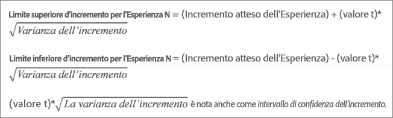
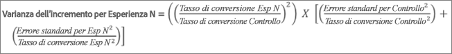
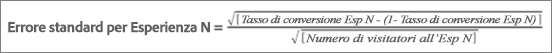
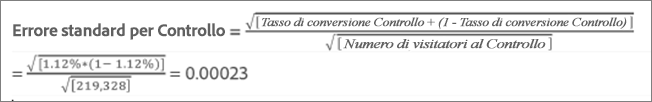
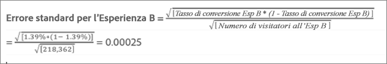
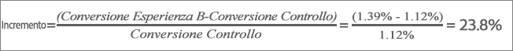
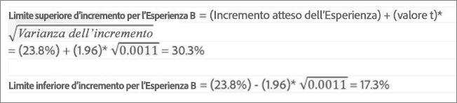

# Incremento medio, limiti di incremento e intervallo di affidabilità

I rapporti includono diversi punti dati e rappresentazioni delle visualizzazioni che consentono di comprendere meglio i limiti di incremento e il livello di confidenza associati all&#39; [!DNL Adobe Target] attività per determinare in modo più accurato il vincitore.

>[!NOTE]
>
>This feature is available only when viewing reports in [!UICONTROL Table] View. Questa funzionalità non è disponibile per le attività che utilizzano [Analytics come origine per la generazione di rapporti (A4T)](/help/c-integrating-target-with-mac/a4t/a4t.md#concept_7540C8C04259434AB6EE33B09F47A1DE).

## Interpretare i dati {#section_62C0D7E76F3D49A7B3C371C82AEF27D5}

The following illustration shows [!UICONTROL Lift Bounds and Confidence Level] information:

The lift and confidence information in the [!DNL Target] reporting UI includes:

### Incremento

Il numero elevato e la freccia riflettono il valore atteso dell’incremento. Questo numero è il punto medio nell’intervallo dei limiti di incremento. La freccia di incremento atteso è grigia fino a quando l’affidabilità non supera il 95%. Superata questa soglia, la freccia diventa rossa o verde, rispettivamente per un incremento negativo o positivo.

### Limiti di incremento

Intervallo di affidabilità dell’incremento del 95%. Viene visualizzato come un intervallo, sotto all’incremento medio. See [Example calculation](#example) below for an example of how these lift bounds are calculated.

### Grafico Boxplot

The boxplot graph in the [!DNL Target] interface represents the expected value and 95% confidence interval of the success metric in question. Immaginalo come una modalità grafica per visualizzare le informazioni sull’incremento e i suoi limiti.

There are a few key ways [!DNL Target] helps you interpret the confidence information, one of which is color. Nel grafico, la sovrapposizione tra l’intervallo di affidabilità di un’esperienza specifica e l’intervallo di affidabilità del controllo è indicata in grigio. L’intervallo di affidabilità di un’esperienza specifica superiore o inferiore rispetto a quello del controllo viene invece indicato rispettivamente in verde o rosso.

La lunghezza della barra box plot rappresenta in modo immediato la grandezza dell’intervallo di affidabilità. A seconda dei dati che vengono raccolti nell’attività, la barra si sposta e cambia. L’intervallo di affidabilità è derivato dalla varianza e dalla dimensione del campione (numero di visitatori). Minore è la varianza e maggiore è la dimensione del campione, più ridotto sarà l’intervallo di affidabilità.

### Affidabilità

L’affidabilità di un’esperienza o di un’offerta rappresenta la probabilità che l’incremento dell’esperienza o dell’offerta a essa associata rispetto all’esperienza o all’offerta di controllo sia “reale” (non casuale). Tipicamente, 95% è il livello consigliato di affidabilità per considerare l’incremento significativo.

## How are lift bounds calculated? {#section_1D360781D972483693680BE0F07AEAD1}

I limiti di incremento rappresentano gli intervalli di affidabilità al 95% dell’incremento per l’esperienza o l’offerta specifica rispetto all’esperienza o all’offerta di controllo. In altre parole, significa che l’incremento reale ha circa il 95% di probabilità di essere compreso tra questi limiti.

I limiti di incremento vengono calcolati con la seguente formula:

Vi sono dei calcoli aggiuntivi per ottenere l’input per i limiti di incremento:

* **Valore-t:** il dato statistico cruciale per il livello di affidabilità al 95% è di 1,96. Ulteriori informazioni sul [valore-t](https://en.wikipedia.org/wiki/T-statistic).
* **Varianza dell’incremento:** l’errore standard della metrica di successo dell’esperienza N e l’errore standard della metrica di successo dell’esperienza di controllo sono necessari per determinare la varianza dell’incremento, la quale è calcolata con la seguente formula (illustrata per un caso in cui la metrica di successo è la conversione).

   

* **Errore standard per tasso di conversione/metrica di successo:** l’errore standard viene calcolato nello stesso modo per l’esperienza N e per il controllo, con la seguente formula (illustrata per un caso in cui la metrica di successo è la conversione). Ulteriori informazioni su [Errore standard](https://en.wikipedia.org/wiki/Standard_error).

   

   >[!NOTE]
   >
   >L’errore standard per le attività con metriche di successo sul ricavo si basa sulla varianza dei ricavi del campione.

## Example calculation {#example}

Consideriamo un’attività di esempio con due esperienze e i seguenti risultati:

| Esperienza | Visitatori | Conversioni | Tasso di conversione |
|--- |--- |--- |--- |
| Esperienza A (controllo) | 219, 328 | 2.466 | 1,12% |
| Esperienza B | 218, 362 | 3.040 | 1,39% |

Basandoci sulle formule, possiamo calcolare gli input necessari per i limiti di incremento.

**Errore standard per l’esperienza A (controllo)**

**Errore standard per l’esperienza B**

**Varianza di incremento per l’esperienza B**

**Limiti di incremento per l’esperienza B**

Incremento atteso per l’esperienza B:

Pertanto, i limiti di incremento per l’esperienza B saranno:

>[!NOTE]
>
>Potrebbero esserci lievi varianze tra i calcoli manuali svolti utilizzando le formule di cui sopra e i numeri visualizzati nel rapporto. La differenza può essere attribuita al fatto che i numeri delle visualizzazioni di pagina utilizzati nei calcoli manuali sono arrotondati. The lift shown in the [!DNL Target] report is based on the exact numbers obtained from the total engagement and the engagement count. I numeri di coinvolgimento possono essere ottenuti tramite l&#39;API di rapporto sulle prestazioni.

## When Are lift bounds not displayed? {#section_C5622E1E94684DAD937249B51A9E42CC}

In certain cases, [!DNL Target] does not display lift bounds:

* Per qualsiasi attività, quando il numero totale di visite o visitatori è inferiore a 30.
* For [!UICONTROL Auto-Allocate] activities, no lift bounds are displayed until one experience has attained 60% confidence.
