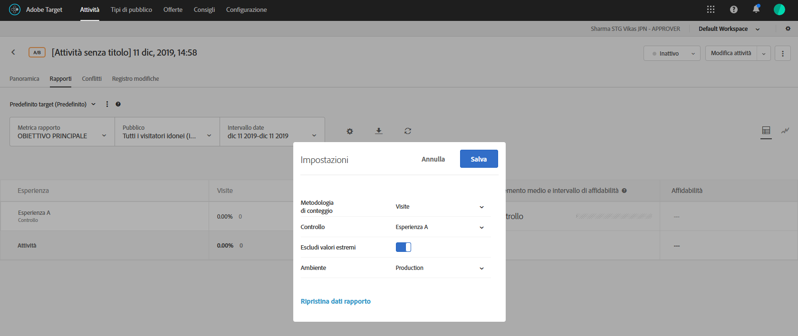

# Escludere i valori estremi

Potete escludere valori estremi dall&#39;influenza dei rapporti in [!DNL Adobe Target], in modo che alcuni ordini insoliti non influenzino i risultati dell&#39;attività. Un esempio di un ordine insolito potrebbe essere un allenatore che acquista le maglie per tutta la squadra, rispetto a singoli acquirenti che acquistano una sola maglia ciascuno.

>[!NOTE]
>
>Il flag [!UICONTROL Escludi valori estremi] si applica solo alle attività con tipi di metrica di ricavi e coinvolgimento.

I valori estremi vengono contrassegnati automaticamente in base alle regole descritte di seguito. Puoi alternare la visualizzazione e l&#39;esclusione dei valori estremi dai rapporti. I estremi di un&#39;attività verranno esclusi, dopo per un&#39;ora di operatività o dopo 15 ordini, se tale condizione si verifica prima.

Un valore è considerato estremo se è superiore a +/-3 deviazioni standard dal valore medio dell&#39;ordine in base all&#39;ultimo mese di dati (fino al momento in cui è stato effettuato il calcolo).

Ad esempio, il filtro di valore estremo è spesso utile quando si utilizza RPV. RPV combina il tasso di conversione e il valore medio dell&#39;ordine e spesso espone la volatilità di tali metriche. Se utilizzi RPV e stabilisci che gli ordini non sembrano essere distribuiti normalmente, potresti osservare risultati più normali applicando il filtro di ordine estremo.

Quando un valore è contrassegnato come estremo, il valore dell&#39;ordine viene sostituito con il valore medio dell&#39;ordine dell&#39;esperienza per l&#39;ultimo mese, esclusi gli estremi. L&#39;ordine è anche contrassegnato come estremo nel report [!UICONTROL Order Details] e nel download CSV per i risultati giornalieri.

**Per escludere i valori estremi dai rapporti:**

1. Apri un’attività che include i tipi di metrica di ricavi o coinvolgimento, quindi fai clic sulla scheda **[!UICONTROL Rapporti]**.
1. Fare clic sull&#39;icona a forma di ingranaggio per visualizzare la finestra di dialogo **[!UICONTROL Impostazioni]**.

   

1. Fate scorrere l&#39;interruttore **[!UICONTROL Escludi valori estremi]** fino alla posizione &quot;on&quot; o &quot;off&quot;, come desiderato.
1. Fai clic su **[!UICONTROL Salva]**.
