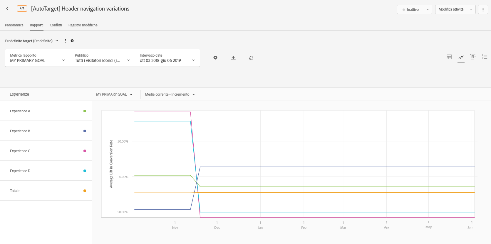
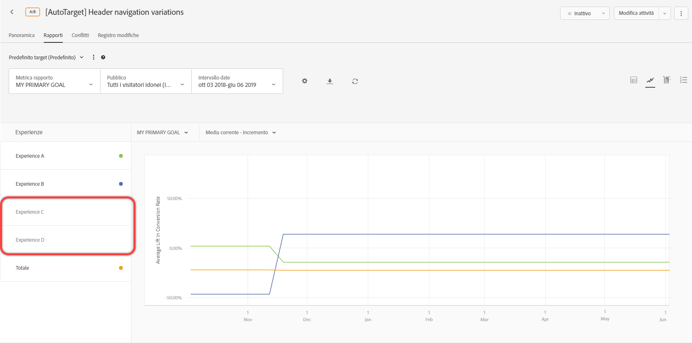
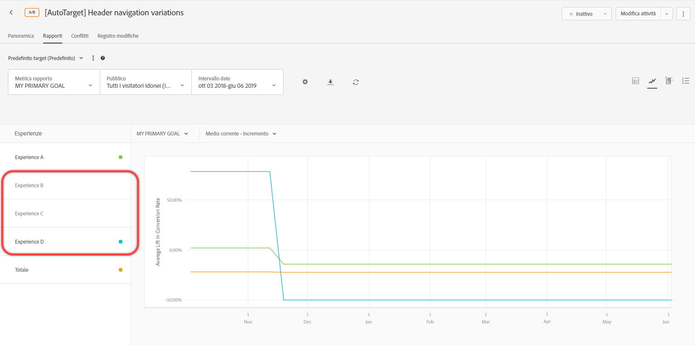

# Impostazioni dei rapporti{#report-settings}

Informazioni utili per impostare gli elementi da visualizzare nel rapporto in [!DNL Adobe Target]. Le impostazioni dei rapporti possono essere salvate per un utilizzo successivo.

Per visualizzare un rapporto:

1. Fai clic su **[!UICONTROL Attività]**, quindi sull’attività desiderata tra quelle elencate.
1. Fai clic sulla scheda **[!UICONTROL Rapporti]**.

   

## Predefinito target {#section_51F67341465045BEB4F1A2FB638A8EB1}

Puoi salvare fino a dieci diversi predefiniti del rapporto di una singola attività dopo averlo configurato come desiderato (metriche, destinatari, impostazioni avanzate e così via). Tutti gli utenti [!DNL Target] possono visualizzare, modificare ed eliminare i vari predefiniti, indipendentemente da chi li ha creati.

Puoi anche configurare il rapporto di una singola attività come desiderato e salvare la configurazione come predefinito di default/preferito. Questa è la vista che compare quando vedi che il rapporto dell&#39;attività sta avanzando.

### Creare un predefinito o un predefinito

1. Configurate il rapporto dell&#39;attività nel modo desiderato.

   Le impostazioni disponibili, incluse metriche, intervalli di date, audience, impostazioni avanzate e così via, sono spiegate di seguito.

1. Accanto a **[!UICONTROL Predefinito target]**, fai clic sull&#39;icona dei tre puntini di sospensione verticali > **[!UICONTROL Salva come nuovo]**.

   

   Viene visualizzata la finestra di dialogo Nuovo predefinito:

   

1. Esaminate le informazioni nelle sezioni **[!UICONTROL Filters]** e **[!UICONTROL Settings]** per verificare che il rapporto sia configurato come desiderato, quindi specificate il **[!UICONTROL Nome predefinito]** (fino a 50 caratteri).
1. (Condizionale) Se desiderate che questa sia la visualizzazione di report predefinita/preferita, fate scorrere l&#39;opzione **[!UICONTROL Imposta come predefinito]** fino alla posizione Attivato.
1. Fai clic su **[!UICONTROL Salva]**.

### Selezionate un altro predefinito

Seleziona il predefinito desiderato dall&#39;elenco a discesa **[!UICONTROL Predefinito target]**.

### Modificare un predefinito

1. Seleziona il predefinito da modificare.
1. Modifica la configurazione del rapporto come preferisci (metriche, intervalli di date, destinatari, impostazioni avanzate e così via).

   Una volta fatto clic su [!UICONTROL Salva] dopo aver modificato la configurazione del report, compare un asterisco (*) dopo il nome della preimpostazione per indicare che è stata modificata, come illustrato di seguito:

   

1. Fai clic sull’icona dei tre puntini di sospensione verticali > **[!UICONTROL Salva come nuovo]** per creare un nuovo predefinito.

   Oppure

   Fai clic sull&#39;icona dei tre puntini di sospensione verticali > **[!UICONTROL Aggiorna]** per aggiornare il predefinito corrente.

   

### Eliminare un predefinito

1. Seleziona il predefinito da eliminare.
1. Fai clic sull&#39;icona dei tre puntini di sospensione verticali > **[!UICONTROL Elimina]**.

   

1. Fate di nuovo clic su **[!UICONTROL Elimina]** per confermare l&#39;eliminazione (i predefiniti eliminati non possono essere recuperati).

### Gestione degli errori dei predefiniti

Gli avvisi e i messaggi all&#39;interno dei rapporti ti consentono di sapere se un predefinito non è più valido. L&#39;avviso o il messaggio indica di scegliere dei destinatari, una metrica, un gruppo di host o un&#39;esperienza differenti per rendere valido il predefinito.

Nell&#39;elenco seguente sono descritte alcune delle situazioni che potrebbero provocare la mancata validità di un predefinito:

* Un gruppo di destinatari di reporting è stato rimosso dall&#39;attività ma è riportato nella definizione del predefinito.
* Una metrica (o più) è stata eliminata ma è riportata nella definizione del predefinito. Ad esempio, potresti eliminare una o più metriche dall&#39;attività e aggiungerne di nuove.
* Un gruppo di host (o più) non esiste ma è riportato nella definizione del predefinito.
* Un&#39;esperienza (o più) è stata eliminata dopo la creazione del predefinito, ma è riportata nella definizione del predefinito.
* Un predefinito non è valido perché le entità riportate esistono ancora ma sono state aggiornate in modo tale da modificare semanticamente la definizione del predefinito. Ad esempio, immagina di creare inizialmente un predefinito denominato “Ricavi da Chrome”. In seguito aggiorni l&#39;attività per misurare la metrica di Conversione anziché Ricavi. Questo aggiornamento alla definizione dell&#39;attività invalida la definizione del predefinito in modo semantico.

## Metrica rapporto {#section_894ABD7148244806B7CE556EBBA2AD62}

Fai clic sull’elenco a discesa **[!UICONTROL Metrica rapporto]** per selezionare una [metrica di successo](/help/c-activities/r-success-metrics/success-metrics.md#reference_D011575C85DA48E989A244593D9B9924) diversa o più metriche da visualizzare nei grafici.

Per impostazione predefinita, la metrica principale è determinata nella configurazione delle metriche di successo quando crei l’attività. Se modifichi la configurazione e salvi di nuovo l’attività, la metrica principale per la generazione dei rapporti si aggiorna.

Per ulteriori informazioni sulla selezione di più metriche da visualizzare nei rapporti, consulta [Visualizzare più metriche in un rapporto](/help/c-reports/c-report-settings/view-multiple-metrics.md#concept_9E3C3F6F3EC1412FAF252975AC0720B7).

## Destinatari {#section_70926EB4618945D9AFF2B0564FF3717B}

Fai clic sull’elenco a discesa [!UICONTROL Pubblico] per modificare il pubblico visualizzato per il rapporto.

Per ulteriori informazioni, consulta [Tipi di pubblico](/help/c-target/target.md#concept_A782F8481A5041EBA75103CB26376522).

## Intervallo date {#section_A410A768403C4E01891F95CB357E63ED}

Nella casella Intervallo date viene visualizzato l&#39;intervallo di date corrente del report. Fai clic sull&#39;icona a discesa per visualizzare un calendario che consente di modificare l&#39;intervallo di date del rapporto.

Seleziona la nuova data di **[!UICONTROL Inizio]** e **[!UICONTROL Fine]** del rapporto. È inoltre possibile utilizzare le caselle di controllo **[!UICONTROL Dall&#39;inizio dell&#39;attività]** e **[!UICONTROL Fino alla fine dell&#39;attività]**.

Fai clic su **[!UICONTROL Date personalizzate]** per selezionare intervalli di date predefiniti: Ultimi 7 giorni, Ultimi 15 giorni o Ultimi 30 giorni. Questi intervalli di date predefiniti sono incrementali. Se la data di inizio è precedente al numero di giorni scelto, il calendario mostrerà l’intervallo da questa data; tuttavia, questo inizierà a scorrere una volta che la data di inizio diventerà successiva al numero di giorni scelto durante l’avanzamento dell’attività..

Per i rapporti sono previste le seguenti limitazioni di data:

* La data di inizio del rapporto deve risalire agli ultimi due anni.
* I rapporti sui gruppi di offerte sono limitati a 99 giorni da oggi.
* I rapporti orari sono limitati a 15 giorni.

## Impostazioni {#section_D99CE462107D45CABE0960F820E1E972}

Per configurare le impostazioni del rapporto:

1. Fate clic sull’icona dell’ingranaggio e apportate le modifiche desiderate (come spiegato di seguito).
1. Al termine, fai clic su **[!UICONTROL Salva]**.

Nell’illustrazione seguente viene mostrata la finestra di dialogo Impostazioni per un’attività A/B:

A seconda del tipo di attività selezionato, le opzioni variano:

### Metodologia di conteggio

Selezionare la metodologia desiderata:

* Visitatori
* Visite
* Impression attività

### Control

Selezionare l&#39;esperienza di controllo da utilizzare per il calcolo e il confronto tra incrementi.

### Ambiente

Selezionare l&#39;ambiente (gruppo di host) da utilizzare per il rapporto. Per ulteriori informazioni, consulta [Host](/help/administrating-target/hosts.md#concept_516BB01EBFBD4449AB03940D31AEB66E).

### Ripristina dati rapporto

Reimposta i dati di reporting per rimuovere i dati obsoleti. I visitatori attuali rimangono nell’attività.  Questa opzione è disponibile solo per coloro che dispongono di autorizzazioni [!UICONTROL Approver].

>[!IMPORTANT]
>
>Questa è un’azione permanente e non può essere annullata.

### Escludere i valori estremi

L&#39;opzione [!UICONTROL Escludi valori estremi] si applica solo alle attività con tipi di metriche Revenue and Engagement. Per ulteriori informazioni, consulta [Esclusione di ordini estremi](/help/c-reports/c-report-settings/excluding-extreme-orders.md#task_2AE7743FFCDD466DAEEB720BE5F33DAA).

## Scarica {#section_77E65C50BAAF4AB79242DB3A8778ADEF}

Fare clic sull&#39;icona **[!UICONTROL Scarica]** per scaricare i dati del rapporto in un formato [!DNL .csv] per l&#39;importazione rapida in Excel, Access o altri programmi di analisi dei dati.

Per ulteriori informazioni, consulta [Download di dati in un file CSV](/help/c-reports/downloading-data-in-csv-file.md#concept_3F276FF2BBB2499388F97451D6DE2E75).

## Aggiorna {#section_E203729F2F314DF3856D2EE67C60B370}

Fate clic sull&#39;icona **[!UICONTROL Aggiorna]** per aggiornare la visualizzazione tabella e grafico di un rapporto senza aggiornare l&#39;intera pagina, la configurazione o l&#39;intervallo di date.

## Altre opzioni {#section_AB1B5C695D7045A0A0AC0E2698D2E7DE}

Fai clic sull’icona Altre opzioni (tre puntini di sospensione verticali) per accedere alle opzioni [!UICONTROL Modifica attività] e [!UICONTROL Visualizza URL esperienza].

## Opzioni di visualizzazione

Potete visualizzare il rapporto in vari formati, a seconda del tipo di attività. Selezionate l’opzione desiderata.

* **Visualizzazione** tabella: Fate clic sull’icona  **[!UICONTROL Visualizzazione]** tabella per visualizzare il rapporto come una tabella.
* **Visualizzazione** grafico: Fate clic sull’icona  **[!UICONTROL Visualizzatore]** grafico per visualizzare il rapporto come grafico.
* **Segmenti** automatizzati: (Disponibile solo per  attività Automated Personalization (AP) e Auto-Target (AT).) Fare clic sull&#39;icona **[!UICONTROL Segmenti automatizzati] per visualizzare il report [Segmenti automatizzati](/help/c-reports/c-personalization-insights-reports/automated-segments-report.md).
* **Attributi** importanti: (Disponibile solo per  attività Automated Personalization (AP) e Auto-Target (AT).) Fare clic sull&#39;icona **[!UICONTROL Attributi importanti] per visualizzare il report [Attributi importanti](/help/c-reports/c-personalization-insights-reports/important-attributes-report.md).

## Incremento medio, limiti di incremento e intervallo di affidabilità {#section_0D87615B1D3344B3858BA494EEBC16FB}

I rapporti includono diversi punti di dati e rappresentazioni di visualizzazione che consentono di comprendere i limiti di incremento e il livello di affidabilità associati all’attività. Ciò consente di determinare più accuratamente un vincitore.

Per ulteriori informazioni, consulta [Incremento medio, limiti di incremento e intervallo di confidenza](/help/c-reports/c-report-settings/average-lift-bounds-and-confidence-interval.md#topic_AFFDC672A8A34D028B100EF6BE5D8129).

Considera i seguenti aspetti:

* Disponibile solo quando i rapporti vengono visualizzati nella vista Tabella.
* Questa funzionalità non è disponibile per le attività che utilizzano [Analytics come origine per la generazione di rapporti (A4T)](/help/c-integrating-target-with-mac/a4t/a4t.md).

## Contributo posizione {#section_5832F126AC114AE1ABFFF4D9B904393B}

Fai clic sull’icona **[!UICONTROL Contributo posizione]** per far sì che il rapporto mostri il contributo in base alla posizione.

## Esperienze {#section_3A450DE1FA7E43F0AAB73165EC3D1C34}

(Disponibile solo quando i rapporti vengono visualizzati nella vista Grafico)

Seleziona o deseleziona le esperienze sul lato sinistro del grafico per visualizzare o nascondere dal grafico le esperienze corrispondenti.

Nell’illustrazione seguente, il rapporto contiene solo le esperienze Default, Mid-East e Total (Predefinito, Medio Oriente, Totale). L’esperienza Asia è nascosta nel grafico.

## Media corrente  {#section_59066693158C4433B87D07402C2BC6CD}

(Disponibile solo quando i rapporti vengono visualizzati nella vista Grafico)

&quot;Media continua&quot; riflette le conversioni cumulative (dall&#39;inizio della finestra di reporting alla data rappresentata nel grafico) divise per i visitatori cumulativi.

Seleziona la vista grafico desiderata:

* Media corrente
* Media corrente - Incremento
* Giornaliero
* Incremento giornaliero

Il nome di questo elenco a discesa varia a seconda della vista selezionata, ma sarà una delle viste elencate sopra.

## Metodologia di conteggio {#section_01B0ED5665C74AE1AE97259800190C3E}

(Disponibile solo quando i rapporti vengono visualizzati nella vista Grafico)

È possibile scegliere la metodologia di conteggio per i grafici del rapporto. Questo non è supportato per le attività [!UICONTROL  Automated Personalization] (AP).

Per accedere all&#39;opzione [!UICONTROL Metodologia di conteggio], durante la visualizzazione di un rapporto in modalità grafico, fare clic sul menu a discesa **[!UICONTROL Il mio obiettivo principale]**, quindi selezionare la metodologia di conteggio.

La metodologia di conteggio sarà la stessa di quella selezionata nella finestra di dialogo [!UICONTROL Impostazioni], sopra descritta.

Per impostazione predefinita, il grafico è tracciato in modalità [!UICONTROL Giornaliero].

È possibile modificare la modalità facendo clic sull&#39;elenco a discesa [!UICONTROL Daily], quindi selezionando un&#39;opzione cumulativa.

>[!NOTE]
>
>Il nome dell’elenco a discesa varia a seconda della modalità selezionata.

Sono disponibili quattro modalità per le attività di targeting automatico: controllo giornaliero, targeting giornaliero, controllo cumulativo e targeting cumulativo.

L’ordine predefinito in cui viene tracciato il grafico è il seguente:

* **Test A/B (inclusi allocazione automatica e  Automated Personalization)**: Ordine di creazione dell&#39;esperienza, in ordine decrescente.
* **Targeting delle esperienze (XT)**: Ordine delle esperienze nell&#39;attività.
* **Test multivariato (MVT)**: Alfabetico in base al nome dell&#39;esperienza.
* **Recommendations**: Ordine di creazione dell&#39;esperienza, in ordine decrescente.

Quando lavori con le opzioni di metodologia di conteggio, considera le seguenti avvertenze:

* Per [Attività con targeting automatico](/help/c-activities/auto-target/auto-target-to-optimize.md), non è possibile selezionare &quot;Visitatori&quot; come metodologia di conteggio. Il targeting automatico è l’unico tipo di attività i cui dati non possono essere visualizzati per visitatori.
* Per le attività che utilizzano [Analytics come origine di reporting (A4T)](/help/c-integrating-target-with-mac/a4t/a4t.md), non è possibile salvare il grafico Visitatore, Visita o Impression in modo cumulativo.

## Utilizzo di grafici con più di 16 esperienze nell&#39;attività

Se le esperienze di un’attività sono meno di 16, ogni esperienza è rappresentata da un colore diverso nel grafico.

Se le esperienze sono più di 16, nel grafico vengono tracciate le linee colorate delle prime 16. Le restanti esperienze appaiono in grigio nel riquadro Esperienze a sinistra e le linee corrispondenti non sono incluse nel grafico. In un dato momento è possibile visualizzare le linee corrispondenti a 16 esperienze.

Se passi il cursore del mouse sopra una delle esperienze in grigio, sul grafico viene visualizzata temporaneamente la corrispondente linea grigia. Per visualizzare con un colore la linea di un’esperienza grigia, fai clic sul nome di un’esperienza visualizzata a colori per deselezionarla, quindi fai clic sul nome dell’esperienza grigia desiderata per selezionarla.

Ad esempio, la figura seguente mostra il grafico di un’attività con 26 esperienze:

Il grafico mostra le linee delle prime 16 esperienze (alcune si sovrappongono, quindi sembra che siano meno di 16). Il punto colorato nel riquadro Esperienze a sinistra indica il colore associato all’esperienza corrispondente.

Se scorri verso il basso nel riquadro Esperienze, puoi notare che i nomi delle esperienze dalla 17 alla 26 sono in grigio, come illustrato nella figura seguente:

Se passi il cursore del mouse sopra una delle esperienze in grigio, sul grafico viene visualizzata temporaneamente la corrispondente linea grigia.

Supponiamo che desideri visualizzare la linea dell’esperienza R e nascondere quella linea dell’esperienza P. Fai clic sul nome dell’esperienza P per deselezionarla, quindi fai clic sul nome dell’esperienza R per selezionarla, come illustrato di seguito:

