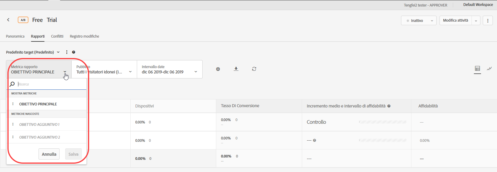
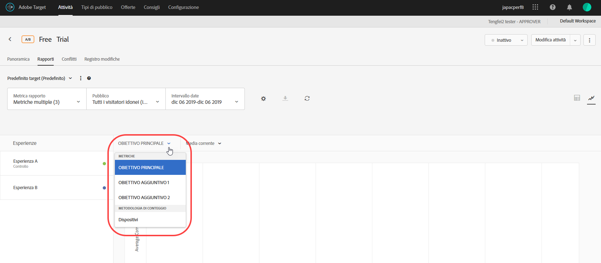

# Visualizzare più metriche in un rapporto{#view-multiple-metrics-in-a-report}

Puoi selezionare più metriche da visualizzare in un [!DNL Adobe Target] rapporto.

Tieni presente le informazioni seguenti quando lavori con più metriche nei rapporti:

* The ability to view multiple metrics is available for [A/B Test](/help/c-activities/t-test-ab/test-ab.md), [Auto-Allocate](/help/c-activities/automated-traffic-allocation/automated-traffic-allocation.md), [Auto-Target](/help/c-activities/auto-target/auto-target-to-optimize.md), and [Experience Targeting](/help/c-activities/t-experience-target/experience-target.md) (XT) activities only.
* You cannot add more than 20 metrics to a report for an activity that uses [Analytics for Target](/help/c-integrating-target-with-mac/a4t/a4t.md) (A4T). You can add as many metrics as you have in your activity to reports for activities that do *not* use A4T.
* Non puoi utilizzare l&#39;opzione Scarica per scaricare i rapporti in formato CSV se sono state selezionate più metriche. Devi selezionare una sola metrica per attivare l’opzione [!UICONTROL Scarica].
* You cannot view multiple metrics for activities created before the July 2015 [!DNL Target] release (July 30, 2015).

**Per selezionare più metriche da visualizzare nel rapporto:**

1. Per visualizzare un rapporto, fai clic su **[!UICONTROL Attività]**, scegli l’attività desiderata dall’elenco, quindi fai clic sulla scheda **[!UICONTROL Rapporti]**.
1. Fai clic sull&#39;elenco a discesa **[!UICONTROL Metrica rapporto]** per visualizzare gli elenchi [!UICONTROL Metriche visualizzate] e [!UICONTROL Metriche nascoste].

   

   Puoi utilizzare la [!UICONTROL casella di ricerca] per trovare rapidamente le metriche disponibili da aggiungere all&#39;elenco [!UICONTROL Metriche visualizzate].

   È possibile selezionare più metriche sia dalla modalità [!UICONTROL Vista tabella] sia dalla modalità [!UICONTROL Vista grafico] del rapporto.

1. Posiziona il puntatore del mouse sulla metrica desiderata nell&#39;elenco [!UICONTROL Metriche nascoste], quindi fai clic su **[!UICONTROL Seleziona]** per spostarle nell&#39;elenco [!UICONTROL Metriche visualizzate].

   Oppure

   Trascina le metriche desiderate dall&#39;elenco [!UICONTROL Metriche nascoste] all&#39;elenco [!UICONTROL Metriche visualizzate].

   Nell&#39;elenco [!UICONTROL Metriche visualizzate] deve essere presente almeno una metrica.

   È possibile ridisporre le metriche trascinandole nell&#39;ordine desiderato nell&#39;elenco [!UICONTROL Metriche visualizzate]. The selected order will be reflected in the [!UICONTROL Table View] and [!UICONTROL Graph View]. Per rimuovere una metrica dall&#39;elenco [!UICONTROL Metriche visualizzate], posiziona il puntatore del mouse sulla metrica, quindi fai clic sull&#39;icona **X**.

1. Al termine, fai clic su **[!UICONTROL Salva]**.
1. (Conditional) While viewing the report in the [!UICONTROL Table View], hover your mouse pointer on any metric&#39;s column header to display a blue arrow. Fai clic sulla freccia per espandere la tabella e visualizzare i parametri di [!UICONTROL Incremento] e [!UICONTROL Affidabilità] per tale metrica.

   

   È possibile espandere solo una metrica/colonna alla volta. Fai nuovamente clic sulla freccia per comprimere le colonne.

1. (Condizionale) Quando visualizzi il rapporto nella visualizzazione grafico, puoi selezionare dall’elenco a discesa singole metriche da visualizzare:

   

