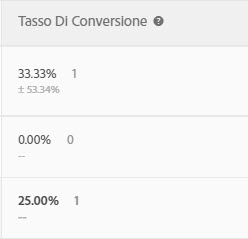

# Tasso di conversione{#conversion-rate}

Per ogni esperienza viene riportato il tasso di conversione, l’incremento, l’affidabilità (rilevanza statistica) e l’intervallo di affidabilità.

Nell’illustrazione seguente viene mostrata l’intestazione del grafico per un’attività di esempio, in cui sono evidenziate le intestazioni [!UICONTROL Tasso di conversione], [!UICONTROL Incremento] e [!UICONTROL Affidabilità].

>[!NOTE]
>
>In tutti i dati, gli ordini duplicati vengono ignorati se viene passato un `orderID`. Nel rapporto di audit vengono elencati gli ordini duplicati ignorati.

## Tasso di conversione {#section_07A36846C4E84D0881906809B9CE5A74}

Mostra il tasso di conversione mediano, l’affidabilità, l’intervallo e il numero di conversioni.

Esamina, ad esempio, la seguente colonna del rapporto sul tasso di conversione:

La prima riga rappresenta l’esperienza di controllo. Mostra un tasso di conversione del 15%, con tre conversioni. La seconda, Esperienza B, mostra un tasso di conversione del 15%, con un intervallo di affidabilità di +/-15,65% e tre conversioni.

>[!NOTE]
>
>Attualmente, l’intervallo di affidabilità viene calcolato solo per le metriche binarie.

## Incremento {#section_0F409572C720433D9378092ABC999982}

Confronta il tasso di conversione per ogni esperienza rispetto all’esperienza di controllo.

Incremento = (TC esperienza - TC controllo) / TS controllo

Se il controllo è uguale a 0, non vi è alcuna percentuale di incremento.

## Affidabilità (rilevanza statistica) {#section_35DB6724813D40C7B0808DE18FE595C1}

Questo numero rappresenta la probabilità che i risultati vengano duplicati se il test venisse eseguito nuovamente. L’affidabilità raggiunge il 100,00%, quando maggiore o uguale a 99,995%.

Consulta [Livello di affidabilità e intervallo di affidabilità](../c-reports/conversion-rate.md#concept_0D0002A1EBDF420E9C50E2A46F36629B).

## Dati retail {#section_30A674731BA6440E9BB93C421BE990EE}

I dati Valore medio dell’ordine, Ricavo per visita e Vendite vengono visualizzati per ogni esperienza se una mbox [Ordine effettuato](/help/c-implementing-target/c-implementing-target-for-client-side-web/t-mbox-download/orderconfirm-create.md) (`orderConfirmPage`) è stata inserita e selezionata come mbox di conversione.

## Livello di affidabilità e intervallo di affidabilità {#concept_0D0002A1EBDF420E9C50E2A46F36629B}

Per ogni esperienza vengono visualizzati il livello di affidabilità e l’intervallo di affidabilità.

Le conversioni e le variabili continue per le metriche basate su Target, ad esempio le metriche di ricavi e di coinvolgimento, vengono calcolate nel modo seguente:

* **Conversione:** sì o no
* **Tutte le altre:** valori compresi in un intervallo

Puoi eseguire calcoli offline per for Target (A4T), ma richiede un passaggio con esportazioni di dati in [!DNL Analytics]Analytics. Per ulteriori informazioni, vedi “Esecuzione di calcoli offline per Analytics for Target (A4T)”, di seguito.

### Livello di affidabilità {#section_26FE5E44BDD5478792A65FCFD83DCCDC}

Il *livello di affidabilità* è rappresentato dalla percentuale più scura nella colonna del Tasso di conversione per ogni esperienza.

  

Il livello di affidabilità, o significatività statistica, indica la probabilità che il successo di un’esperienza non fosse casuale. Un livello di affidabilità elevato indica che:

* Le prestazioni dell’esperienza sono significativamente diverse da quelle dell’esperienza di controllo.
* Le prestazioni dell’esperienza non sono dovute esclusivamente a elementi di disturbo.
* Una ripetizione del test restituirebbe probabilmente gli stessi risultati.

Se il livello di affidabilità è superiore al 90% o al 95%, il risultato può essere considerato statisticamente significativo. Prima di prendere qualsiasi decisione di business, attendi di avere un campione sufficientemente grande e che le quattro barre di affidabilità su una o più esperienze rimangano coerenti per un periodo di tempo continuativo, al fine di garantire che i risultati siano stabili.

>[!NOTE]
>
>L’affidabilità raggiunge il 100,00%, quando maggiore o uguale a 99,995%.

### Intervallo di affidabilità {#section_F582738DFE1648C78B93D81EBC6CACF7}

>[!NOTE]
>
>Attualmente, l’intervallo di affidabilità viene calcolato solo per le metriche binarie.

L’*intervallo di affidabilità* rappresenta l’intervallo in cui si trova il valore effettivo per un determinato livello di affidabilità. L’intervallo di affidabilità viene visualizzato come una percentuale +/- di colore grigio chiaro nella colonna Tasso di conversione. Nell’esempio riportato di seguito, l’intervallo di affidabilità per l’incremento di Esperienza B è +/-15,65%.

**Esempio:** il valore RPV di un’esperienza è 10 $, il suo livello di affidabilità è 95% e il suo **intervallo di affidabilità** è compreso tra 5 e 15 $. Se il test venisse eseguito più volte, il 95% delle volte l’RPV sarebbe compreso tra 5 $ e 15 $.

**Che cosa influisce sull’intervallo di affidabilità?** La formula segue metodi statistici standard per il calcolo degli intervalli di affidabilità.

* **Dimensione del campione:** al crescere del campione l’intervallo si ridurrà. Questo rapporto è quello preferenziale, perché indica che i rapporti si avvicinano al valore effettivo della metrica di successo.
* **Deviazione standard più piccola:** più risultati simili, come AOV simili o numeri simili o visitatori con conversioni ogni giorno, riducono la deviazione standard.

## Calcolo dell’affidabilità e modalità di esecuzione offline {#section_86F7C231943043A5B8B6BFE67B706E3B}

Il [rapporto CSV scaricato](../c-reports/downloading-data-in-csv-file.md#concept_3F276FF2BBB2499388F97451D6DE2E75) include solo dati non elaborati; non include metriche calcolate come ricavi per visitatore, incremento o affidabilità, utilizzate per i test A/B.

To calculate these calculated metrics, download the Target&#39;s [Complete Confidence Calculator](/help/assets/complete_confidence_calculator.xlsx) Excel file to input the activity&#39;s value, or review the [statistical calculations used by Target](/help/assets/statistical-calculations.pdf).

>[!NOTE]
>
>Questo calcolatore è per i rapporti basati su Target e non per la creazioni di rapporti per A4T.

## Esecuzione di calcoli offline per Analytics for Target (A4T) {#section_B34BD016C8274C97AC9564F426B9607E}

Puoi eseguire calcoli offline per A4T, ma è necessario un ulteriore passaggio di esportazione dei dati di [!DNL Analytics].

Per A4T usiamo il calcolo del test t di Student per variabili continue (anziché metriche binarie). In Analytics, un visitatore viene sempre tracciato e ogni azione intrapresa viene conteggiata. Pertanto, se il visitatore effettua più acquisti o visita una metrica di successo più volte, tali hit aggiuntivi vengono conteggiati. Questo rende la metrica una variabile continua. Per eseguire il calcolo del test t di Student, è necessaria la “somma dei quadrati”. Questa può essere recuperata da [!DNL Analytics]. Per ottenere la somma dei quadrati è necessario eseguire un’esportazione a livello del visitatore per la metrica che desideri ottimizzare, per un periodo di tempo campione.

Ad esempio, per ottimizzare le visualizzazioni di pagina per ogni visitatore, devi esportare un campione del numero totale di visualizzazioni di pagina per ogni visitatore per un lasso di tempo specificato, come un paio di giorni (servono solo poche migliaia di punti di dati). Dovresti poi quadrare ogni valore e sommare i totali (è importante eseguire le operazioni in questo ordine). Questo valore di “somma dei quadrati” viene quindi utilizzato nel Calcolatore di affidabilità completo. Per questi valori consulta la sezione “ricavi” del foglio di calcolo.

**Per eseguire la funzione di esportazione dei dati di[!DNL Analytics]:**

1. Accedi a [!DNL Adobe Analytics].
1. Fai clic su **[!UICONTROL Strumenti]** > **[!UICONTROL Data Warehouse]**.
1. Compila i campi nella scheda di **[!UICONTROL Richiesta Data Warehouse]**.

   Per ulteriori informazioni su ogni campo, consulta “Descrizioni di Data Warehouse” in [Data Warehouse](https://docs.adobe.com/content/help/en/analytics/export/data-warehouse/data-warehouse.html).

   | Campo | Istruzioni |
   |--- |--- |
   | Request Name (Nome richiesta) | Specifica un nome per la richiesta. |
   | Reporting Date (Data rapporto) | Specifica un periodo di tempo e una granularità. Per la prima richiesta si consiglia di scegliere non più di un’ora o un giorno di dati.  L’elaborazione dei file di Data Warehouse richiede più tempo per periodo di tempo più lunghi, pertanto è sempre consigliabile richiedere prima dati per un periodo di tempo breve, per assicurarsi che il file restituisca il risultato atteso. Quindi, passa a Request Manager (Gestione richieste), duplica la richiesta e richiedi più dati la seconda volta. Inoltre, se seleziona una granularità diversa da Nessuno, la dimensione del file aumenterà drasticamente.  |
   | Available Segments (Segmenti disponibili) | Applica un segmento, se necessario. |
   | Breakdowns (Suddivisioni) | Seleziona le dimensioni desiderate: le dimensioni standard sono pronte all’uso, mentre quelle personalizzate includono eVar e prop. Si consiglia di utilizzare l’ID visitatore se sono necessarie informazioni a livello dell’ID visitatore, anziché “ID visitatore di Experience Cloud”.<ul><li>ID visitatore è l’ID finale utilizzato da Analytics. Si tratterà di AID (se il cliente è un’azienda) o MID (se il cliente è nuovo o se ha cancellato i cookie da quando è stato avviato il servizio ID visitatore di MC).</li><li>L’ID visitatore di Experience Cloud sarà impostato solo per i clienti che sono nuovi o che hanno cancellato i cookie da quando è stato avviato il servizio ID visitatore di MC.</li></ul> |
   | Metrics (Metriche) | Seleziona la metrica desiderata. La metrica standard è OOTB, mentre quella personalizzata include eventi personalizzati. |
   | Report Preview (Anteprima rapporto) | Rivedi le impostazioni prima di pianificare il rapporto.  |
   | Schedule Delivery (Pianifica consegna) | Immetti l’indirizzo email a cui deve essere consegnato il file, assegna un nome al file, quindi seleziona [!UICONTROL Send Immediately] (Invia subito). Nota: il file può essere consegnato via FTP da [!UICONTROL Opzioni di consegna avanzate] . |

1. Fai clic su **[!UICONTROL Richiedi questo rapporto]**.

   La consegna dei file può richiedere fino a 72 ore, a seconda della quantità di dati richiesti. Puoi controllare l’avanzamento della richiesta in qualsiasi momento facendo clic su [!UICONTROL Tools] > [!UICONTROL Data Warehouse] > [!UICONTROL Request Manager] (Strumenti > Data Warehouse > Gestione richieste).

   Per richiedere nuovamente dati già richiesti in passato, puoi duplicare una richiesta precedente da [!UICONTROL Request Manager] (Gestione richieste).

Per ulteriori informazioni su [!DNL Data Warehouse], consulta i seguenti collegamenti nella documentazione di [!DNL Analytics]:

* [Creare una richiesta di Data Warehouse](https://docs.adobe.com/content/help/en/analytics/export/data-warehouse/t-dw-create-request.html)
* [Best practice di Data Warehouse](https://docs.adobe.com/content/help/en/analytics/export/data-warehouse/data-warehouse-bp.html)

## Metodologia di conteggio {#concept_EC19BC897D66411BABAF2FA27BCE89AA}

È possibile scegliere di visualizzare i rapporti in base a diverse metodologie di conteggio per capire come le attività create influiscono sugli utenti, durante l’intero ciclo di vita o in una singola sessione.

La metodologia di conteggio è supportata per i seguenti tipi di attività:

* Test A/B

   Come eccezione, le attività A/B di targeting automatica supportano solo la metodologia di conteggio predefinita “Visite”.

* Targeting esperienza (XT)
* Test multivariato (MVT)

   Per il rapporto sul contributo degli elementi MVT, Target non supporta l’attività Impression per i tipi di metrica Ricavi.

* Consigli

Per le attività Personalizzazione automatica (AP) al momento è supportata solo la metodologia di conteggio predefinita (Visite).

È possibile visualizzare i rapporti tramite le seguenti metodologie di conteggio:

* **Visitatore:** un partecipante univoco nell’attività, per tutta la durata dell’attività.

   Una persona viene conteggiata come nuovo partecipante se visita il sito da un nuovo computer o un nuovo browser; se elimina il cookie; o se viene convertito e torna all’attività con lo stesso cookie. Un partecipante è identificato dal PCID nel cookie mbox del visitatore. Se il PCID cambia, la persona viene considerata come un nuovo visitatore.

* **Visita:** un partecipante univoco in un’esperienza durante una singola sessione del browser di 30 minuti.

   Se viene realizzata una conversione o se il visitatore ritorna al sito dopo un’assenza di almeno 30 minuti, il visitatore di ritorno viene conteggiato come una nuova visita. Una visita è identificata da `sessionID` nel cookie mbox del visitatore. Quando `sessionID` cambia, la visita viene considerata nuova.

* **Impression/Visualizzazione pagina:** conteggiata ogni volta che un visitatore carica una pagina dell’attività.

   Una singola visita potrebbe includere diverse impression, ad esempio, della home page.

>[!NOTE]
>
>Di solito, questi conteggi sono determinati dai cookie e dalle attività di sessione. Tuttavia, se il visitatore raggiunge il punto di conversione finale di un’attività e quindi accede nuovamente all’attività, viene considerato come un nuovo partecipante e una nuova visita all’attività. Questo vale anche se i valori PCID e `sessionID` non cambiano.