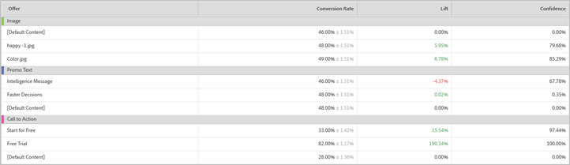

# Rapporto Contributo Posizione (MVT){#location-contribution-report-mvt}

Nel rapporto Contributo posizione sono incluse le prestazioni di ogni elemento e di ogni offerta.

La parte superiore del rapporto mostra la metrica, le date di inizio e fine e il pubblico utilizzato nel rapporto. Puoi modificare ciascuno di questi fattori.

>[!NOTE]
>
>I selettori di pubblico e metriche sono disponibili solo se si utilizza Analytics come origine per la generazione di rapporti.

Nel rapporto Contributo posizione sono incluse due tabelle.

La prima tabella mostra l’influenza relativa di ogni elemento. Questo indica che gli elementi in cui sono state aggiunte offerte determinano il maggior numero di conversioni.

La seconda tabella fornisce un rapporto a livello di offerta. Mostra tasso di conversione, incremento e affidabilità per ogni offerta in ogni elemento. Ciò consente di determinare quali offerte sono più efficaci. La seconda colonna mostra i valori per la metrica selezionata (tasso di conversione, ricavo per visita, valore medio dell’ordine, ordini o metriche di coinvolgimento) dell’offerta e di una standardizzazione.

## Video di formazione: Creare un test MVT 

In questo video viene illustrato come creare un test multivariato utilizzando il flusso di lavoro guidato in tre passaggi di Target. Il rapporto Contributo posizione è descritto a partire dal minuto 8:45.

>[!VIDEO](https://video.tv.adobe.com/v/17395)