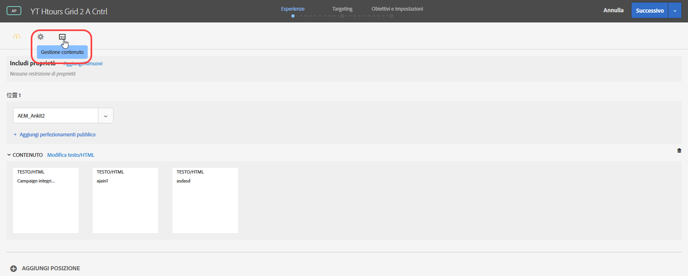
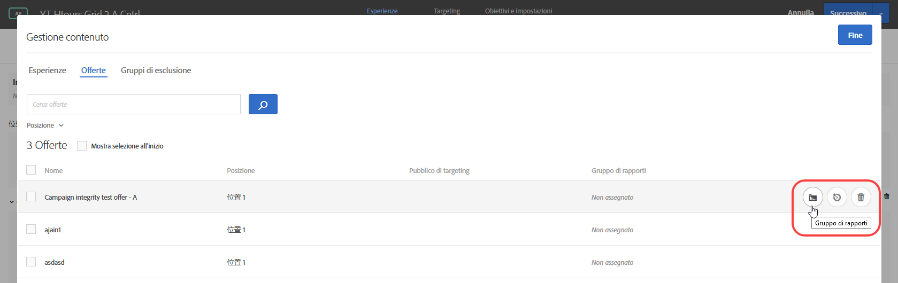
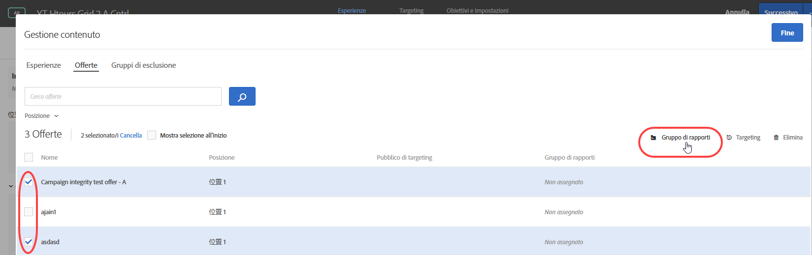
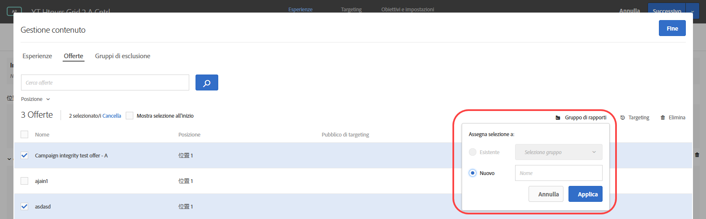

#  Gruppi di creazione di rapporti di offerte in Personalizzazione automatizzata{#offer-reporting-groups-in-automated-personalization}

Informazioni sull&#39;utilizzo dei gruppi di reporting nelle attività di [ Automated Personalization](/help/c-activities/t-automated-personalization/automated-personalization.md) (AP).

I gruppi di reporting svolgono due funzioni chiave:

* Consentono di vedere le offerte raggruppate nel reporting delle attività di AP.
* Essi svolgono un ruolo chiave nel funzionamento dei modelli di personalizzazione [!DNL Target].

Quando utilizzate i gruppi di reporting, [!DNL Target] crea un solo modello di personalizzazione per ciascun gruppo di reporting invece di ogni offerta nell&#39;attività AP utilizzando i dati di tutte le offerte in tale gruppo.

Se la configurazione dell&#39;attività non dispone di dati sufficienti per creare un modello di personalizzazione per ciascuna offerta, i gruppi di reporting possono contribuire a ridurre i requisiti di dati per utilizzare la Personalizzazione automatizzata. I gruppi di reporting consentono inoltre di risolvere il problema “Avvio a freddo” per le nuove offerte raggruppando offerte simili, in modo che ogni modello abbia più dati su cui basarsi. I gruppi di modeling possono essere utilizzati anche per attività in cui le nuove offerte vengono introdotte regolarmente nella tua attività di AP.

Questo approccio funziona bene se i visitatori rispondono allo stesso modo a tutte le offerte di un gruppo. È consigliabile raggruppare offerte a cui gruppi simili di visitatori rispondono in modo simile. In altre parole, offerte per gruppi con tassi di conversione simili. È sconsigliabile mettere tutte le offerte in un unico gruppo di rapporti. Raggruppando tutte le offerte o raggruppando le offerte con tassi di conversione molto diversi è probabile che riduca l&#39;efficacia dei modelli di personalizzazione [!DNL Target].

>[!NOTE]
>
>Se un’offerta viene eliminata o sostituita da un particolare gruppo di modeling, viene rimosso dal gruppo anche il traffico storico relativo a quell’offerta specifica. In altre parole, le offerte eliminate non contribuiscono a determinare i dati utilizzati per i modelli di personalizzazione [!DNL Target] da imparare.

**Per impostare i gruppi di reporting:**

1. Nella pagina [!UICONTROL Esperienze] di un&#39;attività AP, fare clic sull&#39;icona **[!UICONTROL Gestisci contenuto]**.

   

1. Fai clic sulla scheda **[!UICONTROL Offerte]** nella parte superiore della finestra di dialogo [!UICONTROL Gestisci contenuto].
1. (Facoltativo) Aggiungi esperienze specifiche a un gruppo di reporting passando il mouse sull&#39;offerta desiderata e facendo clic sull&#39;icona della cartella **[!UICONTROL Gruppo di rapporti]**.

   

1. (Facoltativo) Si possono raccogliere le esperienze in gruppo di reporting selezionando la casella di spunta relativa alle esperienze desiderate e facendo clic sull&#39;icona della cartella **[!UICONTROL Gruppo di rapporti]** nell&#39;angolo in alto a destra della finestra di dialogo.

   

1. (Condizionale) Per assegnare l&#39;offerta selezionata a un gruppo di rapporti esistente, selezionare **[!UICONTROL Esistente]**, selezionare il gruppo di rapporti desiderato dall&#39;elenco a discesa, quindi fare clic su **[!UICONTROL Applica]**.

   Oppure

   Per creare un nuovo gruppo di reporting a cui assegnare l&#39;offerta selezionata, seleziona **[!UICONTROL Nuovo]**, dai un nome al nuovo gruppo di reporting, quindi fai clic su **[!UICONTROL Applica]**.

   

