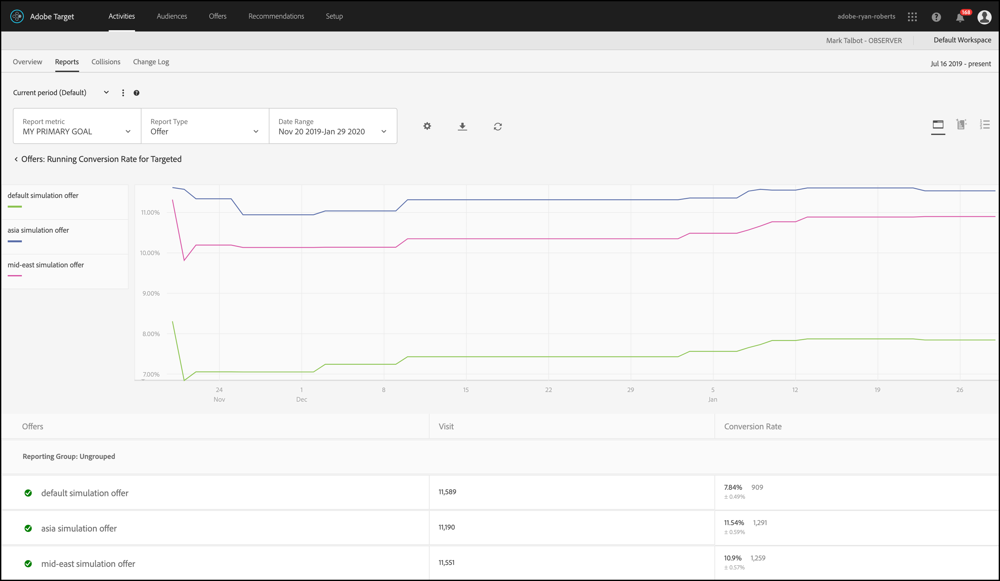

#  Rapporti di riepilogo per Personalizzazione automatizzata{#automated-personalization-summary-reports}

Per gli utenti di Personalizzazione automatizzata sono disponibili rapporti specializzati.

>[!NOTE]
>
>La personalizzazione automatizzata è disponibile come parte della soluzione [!DNL Target Premium]. Non è disponibile in [!DNL Target Standard] senza una licenza [Target Premium](/help/c-intro/intro.md#premium).

1. Fai clic su **[!UICONTROL Attività]**, fai clic sull’attività di [!UICONTROL Personalizzazione automatica] desiderata dall’elenco, quindi fai clic sulla scheda **[!UICONTROL Rapporti]**.

   Se hai numerose attività, puoi filtrare l’elenco selezionando [!UICONTROL Personalizzazione automatizzata] dall’elenco a discesa [!UICONTROL Tipo].

1. (Facoltativo) Fai clic sull&#39;icona [!UICONTROL Scarica] per scaricare il riepilogo (ad esempio, il confronto tra il Controllo e il Traffico mirato) con suddivisione in base a tutte le metriche di successo disponibili.

La funzione [!UICONTROL Personalizzazione automatizzata] fornisce i seguenti rapporti:

## Report Activity Level (Livello di attività){#section_6F72FC5C790B4492B3DCECBFFA971337}

Il rapporto a [!UICONTROL livello di attività] consente di confrontare le prestazioni di aggregazione dell&#39;utilizzo di un algoritmo di [!UICONTROL Personalizzazione automatizzata] per il contenuto fornito in modo casuale (controllo).

Si applicano comunque le regole standard di interpretazione dei risultati per il test A/B, tra cui incremento, affidabilità, trend, durata e così via. Per ulteriori informazioni sull’interpretazione dei risultati, vedi [Tasso di conversione](../c-reports/conversion-rate.md#concept_2D9FEDE8F94A485DAC86D611BFBDC844).

## Report Offer Level (Livello di offerta){#section_CAA6409879E349C6906E2BE8156D87A1}

Il rapporto a [!UICONTROL livello di offerta] per l’esperienza Foresta casuale confronta le prestazioni di ogni offerta applicata dall’algoritmo alla stessa offerta fornita casualmente (controllo). Pertanto, non devi confrontare le offerte tra loro in questa visualizzazione.

Fai clic sull’algoritmo dell&#39;esperienza (Foresta casuale o Controllo) per visualizzare il rapporto a livello di offerta.

Le offerte possono essere visualizzate all’interno di gruppi di rapporti, che possono essere compressi e espansi. Seleziona [!UICONTROL Gruppo di rapporti] nell’elenco a discesa per visualizzare le informazioni aggregate da gruppi di rapporti, anziché da offerte.

>[!NOTE]
>
>L’icona dell’orologio indica che il modello dell’algoritmo è ancora in corso. L’icona di spunta indica che l’algoritmo di base è stato determinato.
