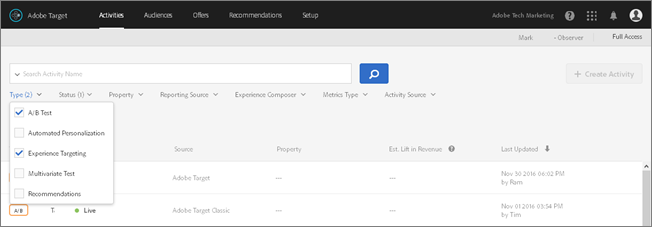

# Rapporti{#reports} 

I rapporti forniscono informazioni sull&#39;avanzamento e i risultati delle attività che consentono di prendere decisioni in base ai tuoi dati. I dati sui report possono aiutarti a decidere quando terminare un test, mostrare quale esperienza di offerta è vincente e fornire informazioni o esperienze per determinare le azioni successive.

>[!NOTE]
>
>Puoi fare in modo che i rapporti non conteggino i visitatori da indirizzi IP specificati. Contatta il Client Care per impostare i filtri IP. Questo filtro non si applica quando utilizzi  [Analytics for Target](../c-integrating-target-with-mac/a4t/a4t.md#concept_7540C8C04259434AB6EE33B09F47A1DE) (A4T) come fonte dei rapporti.

## Informazioni di reporting per tipi di attività specifici {#section_DFE037B9E1C345D3B3BDFCB3AC0359CA}

Oltre alle informazioni di reporting generali presenti in questo argomento e nei relativi sottoargomenti, altrove nella guida sono disponibili ulteriori informazioni specifiche sui singoli tipi di attività:

| Tipo di attività | Dettagli |
|--- |--- |
| [Test A/B](/help/c-activities/t-test-ab/test-ab.md) | Per comprendere l’incremento, l’affidabilità e gli approcci statistici utilizzati in [!DNL Target], consulta [Pianificare un test A/B](/help/c-activities/t-test-ab/sample-size-determination.md). |
| [Targeting automatico](/help/c-activities/auto-target-to-optimize.md) (AT) | Informazioni sul rapporto di [!UICONTROL Riepilogo] per le attività di AT. Per ulteriori informazioni, consulta [Rapporto di riepilogo del Targeting automatico](/help/c-reports/auto-target-summary-report.md). Informazioni sui due rapporti [!UICONTROL Approfondimenti personalizzazione] per le attività di AT e AP: [!UICONTROL Segmenti automatizzati] e [!UICONTROL Attributi importanti]. Per ulteriori informazioni, consulta [Rapporti Approfondimenti personalizzazione](/help/c-reports/c-personalization-insights-reports/personalization-insights-reports.md). |
| [Personalizzazione automatizzata](/help/c-activities/t-automated-personalization/automated-personalization.md) (AP) | Informazioni sui due [!UICONTROL rapporti di riepilogo per Personalizzazione automatizzata] per le attività di AP: [!UICONTROL Livello di attività ] [!UICONTROL Livello di offerta]. Per ulteriori informazioni, consulta [Rapporti di riepilogo per Personalizzazione automatizzata](/help/c-reports/reports-ap.md). Informazioni sui due rapporti [!UICONTROL Approfondimenti personalizzazione] per le attività di AT e AP: [!UICONTROL Segmenti automatizzati] e [!UICONTROL Attributi importanti]. Per ulteriori informazioni, consulta [Rapporti Approfondimenti personalizzazione](/help/c-reports/c-personalization-insights-reports/personalization-insights-reports.md). |
| [Test multivariato](/help/c-activities/c-multivariate-testing/multivariate-testing.md) (MVT) | Informazioni sui due rapporti per attività di MVT: [!UICONTROL Prestazioni esperienza] e [!UICONTROL Contributo posizione]. Per ulteriori informazioni, consulta [Rapporto Prestazioni esperienza](/help/c-reports/experience-performance-report.md) (MVT) e [Rapporto Contributo posizione](/help/c-reports/location-contribution-report.md) (MVT). |
| [Adobe Analytics come origine per la generazione di rapporti per Adobe Target](/help/c-integrating-target-with-mac/a4t/a4t.md) (A4T) | Informazioni sull’utilizzo di [!DNL Adobe Analytics] come origine per la generazione di rapporti per [!DNL Target]. A4T consente di accedere ai rapporti di [!DNL Analytics] per le attività di [!DNL Target]. Per ulteriori informazioni, consulta [Creazione di rapporti di Analytics for Target (A4T)](/help/c-reports/analytics-for-target-a4t-reporting.md). |

## Visualizzazione di un rapporto {#section_C4591A32F6D04C95A1AD5A377C27C28B}

1. Fai clic su **[!UICONTROL Attività]**, quindi sull’attività desiderata tra quelle elencate.

   Se hai numerose attività, puoi filtrare l’elenco selezionando le opzioni che ti interessano dagli elenchi a discesa [!UICONTROL Tipo], [!UICONTROL Stato], [!UICONTROL Origine per i rapporti], [!UICONTROL Compositore esperienza], [!UICONTROL Tipo di metrica] e [!UICONTROL Origine attività].

   Ad esempio, puoi selezionare [!UICONTROL Test A/B] e [!UICONTROL Targeting esperienza] dall’elenco a discesa [!UICONTROL Tipo] e [!UICONTROL Live] dall’elenco a discesa [!UICONTROL Stato] per visualizzare solo i test A/B e le attività di targeting di esperienza che si trovano in uno stato attivo.

   Nella figura seguente viene mostrato l’elenco a discesa [!UICONTROL Tipo] con due tipi selezionati:

   

1. Fai clic sulla scheda **[!UICONTROL Rapporti]**.

   Ogni rapporto include una legenda che ne facilita la comprensione.

   

   Nella legenda vengono visualizzate le seguenti informazioni:

   * Lo stato dell’attività, compreso l’intervallo di date in cui l’attività è stata eseguita.
   * Una proiezione relativa all’esperienza vincente.
   * L’origine dell’attività, ad esempio [!DNL Adobe Target] o [!DNL Adobe Target Classic].
   >[!NOTE]
   >
   >I risultati dell’esperienza compaiono dopo che questa è stata vista almeno da un partecipante.

1. (Facoltativo) [Configura il rapporto](../c-reports/c-report-settings/report-settings.md#concept_4BB6A7FDAB6F4806A632F9CD989B8BFA) come desideri.
1. (Facoltativo) [Scarica il rapporto in formato CSV](../c-reports/downloading-data-in-csv-file.md#concept_3F276FF2BBB2499388F97451D6DE2E75) per l&#39;analisi in Excel e altri programmi.

   Sono disponibili le seguenti opzioni:

   * [!UICONTROL Esportare un rapporto in formato CSV]
   * [!UICONTROL Esportare i dettagli ordine in CSV]

1. (Facoltativo) Fai clic su **[!UICONTROL Vista tabella]** e **[!UICONTROL Vista grafico]** per passare da un formato di reporting all’altro.

   Solo per i test multivariati, fai clic sull’icona **[!UICONTROL Contributo posizione]** (icona ) per far sì che il rapporto mostri il contributo in base alla posizione.
