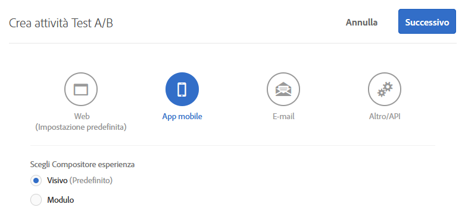
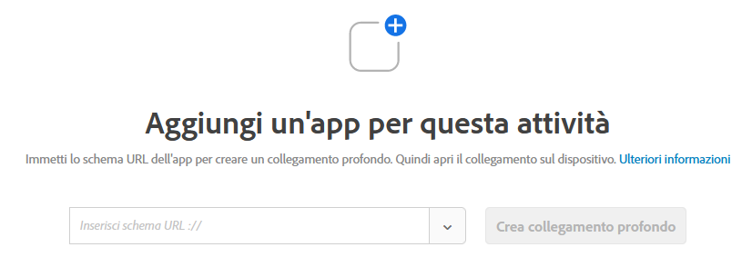
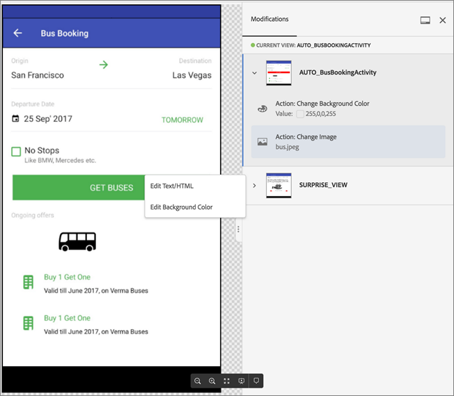

# Compositore esperienza visivo per app mobile{#mobile-app-visual-experience-composer}

Il Compositore esperienza visivo (VEC) per app mobile native ti permette di creare attività e personalizzare contenuti in app mobile native in modo fai da te senza dover dipendere dalle continue modifiche degli sviluppatori e dai cicli di rilascio delle app.

Il [Compositore esperienza visivo](../../c-experiences/experiences.md#section_34265986611B4AB8A0E4D6ACC25EF91D) esistente ti offre la possibilità, in modo del tutto autonomo, di creare attività e personalizzare esperienze che possono essere consegnate in maniera dinamica alle tue proprietà web tramite l&#39;mbox globale di Target senza alcun intervento degli sviluppatori. Da questo momento, puoi sfruttare il Compositore esperienza visivo per compiere la stessa azione con le applicazioni mobile native. La VEC App mobile, disponibile su [AEP SDK v 5](https://aep-sdks.gitbook.io/docs/using-mobile-extensions/adobe-target-vec), può essere utilizzata per creare [attività A/B Test](/help/c-activities/t-test-ab/test-ab.md) e [Targeting delle esperienze (XT)](/help/c-activities/t-experience-target/experience-target.md) per le app mobili. Il supporto per gli altri tipi di attività sarà disponibile in futuro.

La VEC App mobile supporta i browser elencati nei [browser supportati](../../c-implementing-target/c-considerations-before-you-implement-target/supported-browsers.md#reference_01B4BF99E7D545A7998773202A2F6100).

## Utilizzo del Compositore esperienza visivo per le app mobile native  {#using-the-mobile-vec}

L&#39;illustrazione seguente rappresenta il processo di utilizzo della VEC App mobile:

| Processo | Dettagli |
|--- |--- |
| Associazione | Autorizza in modo sicuro la tua app e il tuo dispositivo mobile perché funzionino con Target. Questo passaggio è necessario solo una volta per un dispositivo. |
| Creazione | Creare un [Attività Target](/help/c-activities/activities.md) con una visualizzazione in anteprima e in tempo reale delle azioni eseguite nell’interfaccia utente di Target. |
| Consegna | Target consegna automaticamente le attività nella tua app mobile nativa. |

**Associazione:**

La VEC App mobile si collega in tempo reale all&#39;app mobile dell&#39;esperto di marketing per la creazione di attività Target. Per poter abilitare questa funzione, il primo passo è associare in modo sicuro (autorizzare) il dispositivo e l’app mobile con Target.

1. Durante la creazione di un’attività di test A/B, ad esempio, seleziona **[!UICONTROL App mobile]**, seleziona **[!UICONTROL Visiva (predefinita)]**, quindi fai clic su **[!UICONTROL Successivo]**.

   

1. Inserisci l’URL dell’app, quindi fai clic su **[!UICONTROL Crea collegamento diretto]**.

   

Il processo di associazione contiene i seguenti passaggi:

1. Inserisci lo schema URL dell’app che può essere utilizzato per generare un collegamento diretto. Un tipico collegamento diretto potrebbe essere il seguente:

   `mymobileapp://path?params`

1. Il collegamento diretto è disponibile come codice QR o come URL. Gli utenti possono effettuare la scansione del codice QR dal telefono oppure inviarlo via e-mail o messaggio all&#39;URL. L’URL del collegamento diretto possiede un token di autorizzazione che viene utilizzato per associare in modo sicuro l’app e il dispositivo mobile con Target.
1. Apri l’URL del collegamento diretto sul tuo dispositivo mobile. Questa operazione avvia l&#39;applicazione mobile. L’SDK rileva che l’app viene avviata per l’associazione e la creazione nel Compositore esperienza visivo.

   L’SDK fa una richiesta al server di Target e si auto-registra. Il server di Target autorizza il token e stabilisce una connessione in tempo reale con il dispositivo (attualmente utilizza WebSocket).

   Una volta che la connessione è stata stabilita, appare una visualizzazione dell’app in tempo reale nell’interfaccia di Target. L’app possiede una sovrapposizione con un limite rosso che indica la connessione dell’app a Target, come mostrato nella figura di seguito.

   

   I dispositivi che sono già stati associati possono essere riconnessi avviando l’app e aprendo l’interfaccia di creazione.

**Creazione:**

una volta che l’app è stata connessa ed è apparsa una visualizzazione di questa in tempo reale nel Compositore esperienza visivo, puoi iniziare a creare l’attività. A questo punto vengono supportate le seguenti azioni:

| Azione | Dettagli |
|--- |--- |
| Scambia immagine | Per sostituire un&#39;immagine con un altro, fate clic su un&#39;altra offerta immagine o impostate direttamente l&#39;URL CDN di un&#39;immagine. Le offerte delle immagini in Target vengono servite tramite [Adobe Scene 7](/help/administrating-target/scene7-settings.md). |
| Modifica testo | Modificare il contenuto, il colore o le dimensioni del font in un elemento di testo, un pulsante o un&#39;etichetta. |
| Modifica sfondo | Modificate il contenuto o lo sfondo dell&#39;elemento per un&#39;area di testo o un pulsante. |

Le azioni eseguite nel Compositore esperienza visivo sono visibili in tempo reale nell’app, consentendo quindi la funzionalità di visualizzazione in anteprima e in tempo reale durante la creazione. Le azioni sono associate con schermate o visualizzazioni mobile correlate in modo appropriato.

## Risoluzione dei problemi {#troubleshooting}

**La VEC App mobile indica che la mia app è stata disconnessa.**

La tua connessione internet potrebbe essere scaduta. Riavvia l’applicazione quando internet ritorna disponibile e viene stabilita una nuova connessione. È consigliabile creare un&#39;attività VEC Mobile App su una connessione Wifi.

**La VEC App mobile non è sincronizzata con la mia app mobile.**

Fai clic sul pulsante [!UICONTROL Aggiorna] nel Compositore esperienza visivo per sincronizzare la visualizzazione.

## Visualizzazioni di destinazione e applicazioni mobile {#target-views}

La VEC App mobile sfrutta un nuovo concetto di visualizzazioni: un gruppo logico di elementi visivi che compongono un&#39;esperienza app mobile.

**Introduzione alle Visualizzazioni di destinazione**

Prendiamo come esempio un’app per l’acquisto di fiori. Questa app permette agli utenti di eseguire le seguenti attività:

* Elencare i fiori e i bouquet disponibili
* Visualizzare i dettagli
* Ordinare i fiori
* Controllare le impostazioni, ad esempio le opzioni di pagamento e gli indirizzi

In questa applicazione, ognuna di queste attività si può eseguire in uno schermo separato dell&#39;app mobile. Mentre gli utenti navigano all’interno dell’app, viene eseguito il rendering di uno schermo che consente loro di effettuare una delle seguenti attività. Se sei uno sviluppatore Android, molto probabilmente vorrai creare quattro diverse classi di attività, associando ognuna di queste a una delle attività.

In questo caso, ogni attività può essere considerata come una visualizzazione attraverso cui transita l’app mobile. Verranno citati come visualizzazioni Target, ciascuno caratterizzato in modo univoco. Una Visualizzazione di destinazione, o Visualizzazione in breve, è un contenitore logico di elementi visivi che vengono mostrati sullo schermo mobile. Un esempio di Visualizzazione è uno schermo o una classe di attività in Android.

Tuttavia, le app mobile sono raramente così semplici. Rendiamo l’esempio un po’ più realistico. Aggiungiamo alla prima attività, che elenca i fiori e i bouquet disponibili, la capacità di creare più layout e, quindi, diversi schermi. Ad esempio, aggiungiamo una funzione &quot;Ordina per&quot; con tre opzioni:

* Per popolarità
* Prezzo: da basso a alto
* Prezzo: da alto a basso

In questo esempio, ogni volta che un utente seleziona una diversa opzione di “Ordina per”, viene visualizzato un nuovo schermo, anche quando la classe di attività è la stessa. Ognuno di questi schermi può quindi essere considerato una Visualizzazione di destinazione diversa.

In qualità di addetto al marketing, ti interessa creare diverse esperienze e lanciare diverse offerte in ognuna di queste visualizzazioni, senza dover chiedere agli sviluppatori di configurare mbox locali o utilizzare un ciclo di rilascio dell&#39;app.

## Configurazione della VEC App mobile di Target {#setting-up}

Per abilitare l&#39;app mobile per dispositivi mobili, gli sviluppatori devono effettuare le seguenti operazioni:

* Configurare l&#39;estensione Adobe Target VEC in Launch
   * L&#39;estensione VEC dipende dall&#39;estensione [Adobe Target](/help/c-implementing-target/c-implementing-target-for-client-side-web/how-to-deployatjs/cmp-implementing-target-using-adobe-launch.md). Verificate che l&#39;estensione Adobe Target sia già configurata e abilitata.
* Aggiungete l&#39;estensione VEC Target all&#39;app.
   * [Android: configurazione dell&#39;app mobile](/help/c-target-mobile-app/c-mobile-visual-experience-composer/mobile-visual-experience-composer-android.md)
   * [iOS: configurazione dell&#39;app mobile](/help/c-target-mobile-app/c-mobile-visual-experience-composer/mobile-visual-experience-composer-ios.md)

## Metodi di implementazione per la VEC Target

L&#39;estensione VEC di Target recupera le esperienze Target rilevanti per l&#39;app tramite una richiesta di rete. Le offerte vengono recuperate tramite questa chiamata di rete e applicate automaticamente sugli schermi mirati. Non vengono eseguite richieste di rete successive per recuperare esperienze VEC quando l&#39;utente naviga tra più schermi dell&#39;app.

Il comportamento predefinito dell&#39;estensione consiste nell&#39;effettuare una richiesta di rete sincrona (chiamata di blocco) al momento dell&#39;avvio dell&#39;applicazione. Potete utilizzare Launch per controllare il comportamento di questa richiesta di rete per soddisfare il comportamento dell&#39;applicazione.

### Attività di recupero automatico di Target

Questo è il comportamento predefinito in cui viene avviata automaticamente una richiesta di rete dall&#39;estensione Target VEC. Potete utilizzare una delle opzioni seguenti per richiedere una chiamata di blocco o una richiesta asincrona.

* Recupera in una chiamata sincrona (lo sfondo è disattivato)

   Quando è selezionata, l&#39;estensione Target VEC effettua una richiesta di rete come chiamata di blocco al lancio dell&#39;applicazione. Le offerte vengono applicate immediatamente e nell&#39;app non è presente alcuno sfarfallio. Questo è il comportamento predefinito dell&#39;estensione.

* Recupera in una chiamata asincrona (lo sfondo è attivato)

   Quando è selezionata, l&#39;estensione di Target VEC effettua una richiesta di rete in background all&#39;avvio dell&#39;applicazione, ma non blocca il caricamento dell&#39;app. Se le esperienze vengono create nella schermata iniziale dell&#39;app, le offerte potrebbero non essere valide per la schermata iniziale se viene eseguito il rendering dello schermo prima del completamento della chiamata. Il rendering dello schermo dell&#39;app viene generalmente identificato mediante gli eventi `didFinishLaunchingWithOptions` del ciclo di vita e `onActivityResumed` rispettivamente su iOS e Android. Le offerte vengono applicate automaticamente in tutte le schermate successive.

### Recupero di attività Target a livello di programmazione

Potete disattivare l&#39;estensione VEC di Target per effettuare automaticamente la richiesta di rete e decidere di richiamare a livello di programmazione l&#39;API Extension. Questo offre agli sviluppatori il controllo su come desiderano integrare le offerte VEC di Target nell&#39;app. L&#39;estensione VEC di Target dispone di due metodi statici `prefetchOffers` che `prefetchOffersBackground` possono essere utilizzati per recuperare in modo programmatico le offerte VEC Target.

* Il `prefetchOffers` metodo nasconde la schermata corrente fino al recupero delle offerte VEC Target. Le offerte vengono applicate automaticamente alla schermata corrente, se applicabile, e la schermata è nuovamente visibile.
* Il `prefetchOffersBackground` metodo non nasconde la schermata corrente e viene effettuata una chiamata per recuperare le offerte Target pertinenti. Le offerte di destinazione *non* vengono applicate alla schermata corrente e non si verifica alcuno sfarfallio. Quando l&#39;utente passa agli schermi successivi, le offerte vengono applicate automaticamente, a seconda delle necessità.

### Gestione delle limitazioni dell&#39;area di lavoro Target

Puoi impostare `at_property` il valore per l&#39;area di lavoro utilizzando l&#39;interfaccia di Launch. Questo garantisce che solo le attività nell&#39;area di lavoro vengano inviate all&#39;app mobile.

## Linee guida generali per le chiamate API di Target {#section_C7276795F02540DCA230AEEDF882A833}

Per aggiungere in modo appropriato le per Android, qui trovi una semplice tabella che evidenzia le posizioni corrette dove collocare le chiamate `targetView`targetView:

| Posizioni accettabili per le TargetView | Sotto le aggiunte corrette |
|--- |--- |
| Alla fine di `Activity::onStart`, `Activity::onResume` | Spetta allo sviluppatore decidere se considerare `OnStart` e `OnResume` come `targetViews` uguali o diverse. Se vengono considerate uguali, utilizza lo stesso `viewName`. Se vengono considerate diverse, utilizza diversi `viewNames`. Questi eventi vengono aggiunti automaticamente dall’SDK. |
| Immediatamente dopo una chiamata `Activity::SetContent` | Se l&#39;interfaccia utente non viene modificata, possiamo inserire una chiamata `targetView`. |
| Dentro `View::willAppear` | Se la visualizzazione selezionata che appare si trova unicamente una specifica gerarchia di visualizzazione. |
| Immediatamente dopo una chiamata `Activity::SetContentView` | Se l&#39;attività non modifica uno dei suoi contenuti nel codice che segue. |

Per Android, qui trovi una tabella delle posizioni non corrette per le chiamate `targetView`:

| Posizioni per le targetView non accettabili | Motivo |
|--- |--- |
| All’interno di `Activity::onCreate` | L&#39;attività è stata creata, ma la vista associata all&#39;attività non è garantita e/o associata alla finestra. Questo posizionamento potrebbe fare sì che lo schermo di creazione non sia campionato o non lo sia in modo completo e/o che le offerte siano applicate in modo non deterministico. |
| Dentro `View::didAppear` | La visualizzazione è già apparsa e l&#39;applicazione dell&#39;offerta creerà un&#39;esperienza interfaccia utente di bassa qualità con visualizzazioni momentanee. |
| Dentro `View::didLoad` | La visualizzazione non è collegata alla gerarchia di visualizzazione principale e potrebbe essere creata un’istanza; tuttavia, è possibile che non venga mostrata sull’interfaccia utente dell&#39;app. |

## Consegna {#delivery}

Le attività Target create tramite la VEC app mobile vengono distribuite automaticamente nelle app mobili. Queste attività vengono preacquisite al lancio dell&#39;app (basate sulla configurazione di avvio) e applicate quando l&#39;utente si sposta in diverse viste Target, spesso mappate direttamente alle schermate.

Quando si chiama il `TargetVEC.prefetchOffersBackground()` metodo API, le offerte Target vengono recuperate dal Target Target e memorizzate nella cache locale. Ciò consente un’esperienza utente più fluida, poiché le offerte Target vengono immediatamente applicate dalla cache quando vengono attivate le visualizzazioni di Target con chiamate `targetView()`, anziché essere recuperate sulla rete.

Per una flessibilità aggiuntiva, puoi anche richiamare l&#39; `TargetVEC.prefetchOffers()` API, che prenasconde il layout corrente finché le offerte Target non vengono preacquisite e applicate per rendere visibile la vista Target (potrebbe causare sfarfallii).

`TargetVEC.prefetchOffersBackground()` può anche essere chiamato ripetutamente quando l&#39;utente sposta un&#39;applicazione per il cliente per aggiornare la cache dell&#39;offerta di Target locale con il contenuto più appropriato (seguendo gli ultimi aggiornamenti del profilo di Target dell&#39;utente corrente).

Tieni presente che ogni volta che un’offerta di Target viene precaricata, vengono applicate le offerte per l’ultima visualizzazione Target attivata con `AdobeTargetMobile.targetView()`, se possibile.

## Limitazioni noti {#limitations}

* Il VEC App mobile può essere utilizzato al momento per creare [attività A/B Test](/help/c-activities/t-test-ab/test-ab.md) e [Targeting delle esperienze (XT)](/help/c-activities/t-experience-target/experience-target.md) per le app mobili. Il supporto per gli altri tipi di attività sarà disponibile in futuro.
* La funzione Anteprima non è ancora supportata. Sarà resa disponibile in una prossima release.
* Quando tentate di ricollegare l&#39;app alla VEC App mobile, dovete uscire completamente dall&#39;app e riavviarla.

   Se l&#39;applicazione mobile è già aperta durante uno degli scenari elencati di seguito, devi chiudere l&#39;applicazione e quindi riaprirla. Tuttavia, *è necessario* chiudere l&#39;applicazione dalla sezione delle applicazioni recenti e *senza* premere il pulsante Indietro. Se l&#39;applicazione viene chiusa premendo il pulsante Indietro, potrebbero verificarsi problemi di connessione.

   In diverse situazioni è necessario riavviare l&#39;app per collegarsi al VEC App mobile se l&#39;app è già aperta:

   * Quando crei una nuova attività, dopo aver selezionato l&#39;applicazione mobile, viene visualizzata la finestra di dialogo dell&#39;elenco dei dispositivi. Se l&#39;applicazione è già aperta, è necessario chiuderla e riavviarla per ottenere il proprio dispositivo disponibile per la selezione.
   * La finestra di dialogo del dispositivo viene visualizzata quando si inizia a modificare un&#39;attività. Se l&#39;applicazione è già aperta, è necessario chiuderla e riavviarla per ottenere il proprio dispositivo disponibile per la selezione.
   * La finestra di dialogo del dispositivo viene visualizzata quando si passa dal passaggio “Obiettivi e impostazioni” al passaggio “Creazione” (passaggio 1). Se l&#39;app è già aperta, devi chiudere e riavviare l&#39;app per connetterti alla VEC App mobile.
   Accertati di chiudere l&#39;applicazione dalla sezione delle applicazioni recenti e non premendo il pulsante [!UICONTROL Indietro].

## Video formazione: Adobe Target Mobile App Visual Composer (3:33) {#video}

>[!VIDEO](https://video.tv.adobe.com/v/27528)