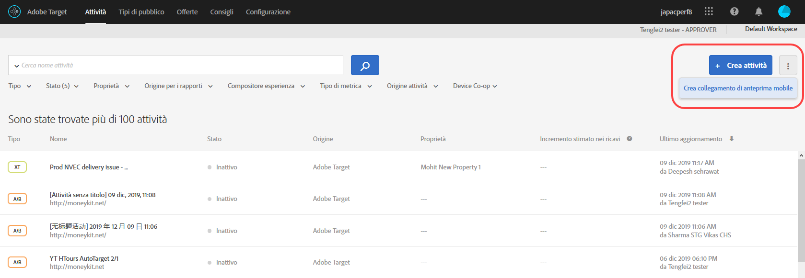
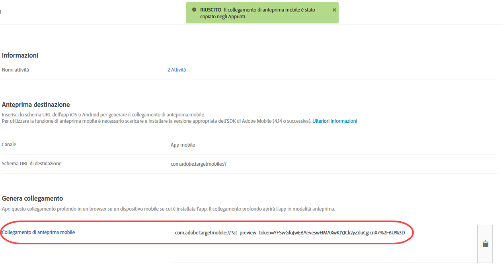

# Anteprima mobile di Target{#target-mobile-preview}

Il collegamento di anteprima su dispositivi mobili ti permette di verificare il funzionamento delle attività nell’app mobile e di iscriverti a diverse esperienze direttamente dal tuo dispositivo, senza dover utilizzare particolari dispositivi di prova.

>[!NOTE]
>
>La funzionalità di anteprima mobile richiede che si scarichi e si installi la versione appropriata 4.14 (o successiva) dell&#39;SDK Adobe Mobile.

## Panoramica {#section_981D6FA4AEE64098809EA606E89E4A5E}

La funzionalità di anteprima mobile consente di testare completamente le attività dell&#39;app mobile prima di avviarle in diretta.

## Prerequisiti {#section_A763C564C9E84B0EB448237B5B1E4068}

1. **Utilizzare una versione supportata dell&#39;SDK:** la funzionalità di anteprima mobile richiede che si scarichi e si installi la versione 4.14 (o successiva) appropriata dell&#39;SDK Adobe Mobile nelle applicazioni corrispondenti.

   Per istruzioni su come scaricare l&#39;SDK appropriato, vedi:

   * **iOS:** [Prima di iniziare](https://experienceleague.adobe.com/docs/mobile-services/ios/getting-started-ios/requirements.html) nella Guida *di* Mobile Services iOS.
   * **Android:** [Prima di iniziare](https://experienceleague.adobe.com/docs/mobile-services/android/getting-started-android/requirements.html) da *Mobile Services Android Help*.

1. **Impostazione di uno schema URL:** il collegamento di anteprima utilizza uno schema URL per aprire l&#39;app. È necessario specificare uno schema URL univoco per l&#39;anteprima.

   L&#39;illustrazione seguente è un esempio su iOS:

   

   La seguente illustrazione è un esempio su Android:

   

1. **Traccia Adobe DeepLink**

   **iOS:** nel delegato dell’app, chiama `[ADBMobile trackAdobeDeepLink:url` quando al delegato viene richiesto di aprire la risorsa con lo schema URL specificato nel passaggio precedente.

   Il seguente frammento di codice è un esempio:

   ```javascript
   - (BOOL) application:(UIApplication *)app openURL:(NSURL *)url 
                options:(NSDictionary<NSString *,id> *)options { 
   
       if ([[url scheme] isEqualToString:@"com.adobe.targetmobile"]) { 
           [ADBMobile trackAdobeDeepLink:url]; 
           return YES; 
       } 
       return NO; 
   } 
   ```

   **Android:** nell’app, chiama `Config.trackAdobeDeepLink(URL);` quando al chiamante viene richiesto di aprire la risorsa con lo schema URL specificato nel passaggio precedente.

   ```javascript
    private Boolean shouldOpenDeeplinkUrl() { 
        Intent appLinkIntent = getIntent(); 
        String appLinkAction = appLinkIntent.getAction(); 
        Uri appLinkData = appLinkIntent.getData; 
        if (appLinkData.toString().startsWith("com.adobe.targetmobile")) { 
            Config.trackAdobeDeepLink(appLinkData); 
            return true; 
        } 
        return false; 
     }
   ```

   Per il corretto funzionamento dell&#39;anteprima mobile su Android, è necessario aggiungere anche il seguente frammento di codice nel file [!DNL AndroidManifest.xml]:

   ```javascript
   <activity android:name="com.adobe.marketing.mobile.FullscreenMessageActivity" />
   ```

## Generazione di un link di anteprima {#section_D9D58173FFF34E9BB75EBF357273F128}

1. Nell&#39;interfaccia utente di Target, fai clic sull&#39;icona **[!UICONTROL Altre opzioni]** (tre puntini di sospensione verticali), quindi seleziona **[!UICONTROL Crea anteprima mobile]**.

   

1. Seleziona le attività da visualizzare in anteprima, quindi fai clic su **[!UICONTROL Genera collegamento di anteprima mobile]**.

   >[!NOTE]
   >
   >Possono essere selezionate solo le attività AB ed XT basate su moduli.

   

1. Specifica lo schema URL dell&#39;app.

   Deve essere lo stesso presente nell&#39;app iOS o Android. Ripeti questo processo separatamente per iOS e Android, se necessario.

   

1. Fai clic su **[!UICONTROL Genera collegamento di anteprima mobile]**, quindi copia il collegamento.

   

## Anteprima sul dispositivo {#section_521F0D46F3DE4A2A98283A1B73FF69F6}

Apri il link in un browser mobile su un dispositivo in cui hai installato l&#39;app. Questa applicazione può essere l&#39;applicazione di produzione che hai scaricato dall&#39;Apple App Store o dal Google Play Store. Non deve essere una build speciale. Se si dispone di un collegamento di anteprima attivo, sarà possibile visualizzare le esperienze sul dispositivo.

1. Apri il link nel tuo browser mobile.

   Condividi il link copiato nel passaggio precedente dall&#39;interfaccia utente di Target al dispositivo mobile in modo conveniente, ad esempio utilizzando SMS, e-mail o Slack.

   |||

   L&#39;app apre e avvia la Modalità anteprima mobile di Target.

1. Seleziona la combinazione di esperienze da visualizzare, quindi fai clic su **[!UICONTROL Avvia esperienze]**.

   ||||
||||

## Limitazioni {#section_4E9BDED0F718485292527EFB508305BD}

* La visualizzazione deve caricare nuovamente per il nuovo contenuto da visualizzare dopo aver fatto clic sul pulsante [!UICONTROL Avvia esperienze]. Il modo più semplice è quello di passare a una schermata diversa e poi tornare alla schermata in cui si prevede che il cambiamento avvenga.
* L&#39;anteprima mobile non è supportata per le versioni Android prima di API-19 (KitKat).