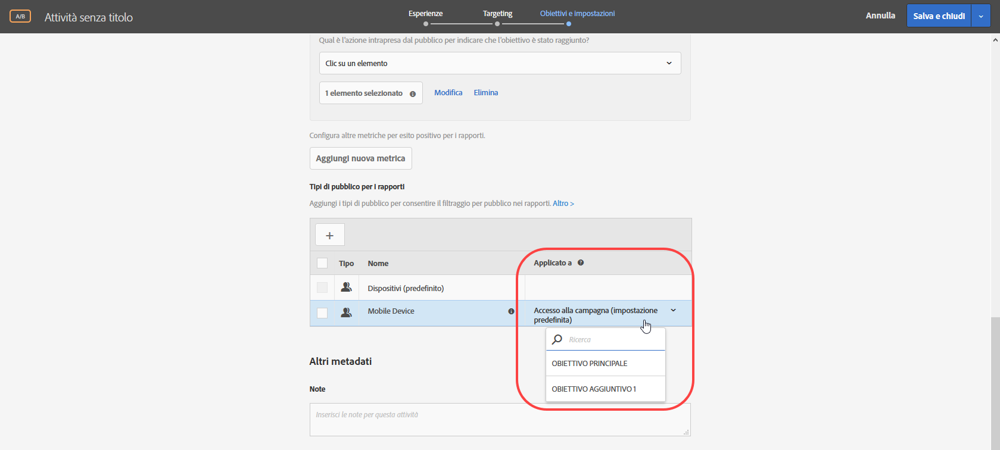
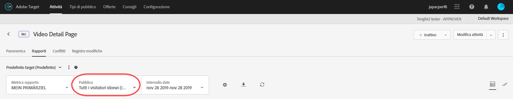

# Applicare un pubblico di reportistica a una metrica di successo{#apply-a-reporting-audience-to-a-success-metric}

Scegli una metrica di successo che qualifichi l’utente per il pubblico di reportistica.

Per tutte le attività, l’elenco a discesa [!UICONTROL Applicato a] consente di applicare un pubblico a una metrica di successo in modo da poter visualizzare i numeri per i rapporti una volta conseguita tale metrica e per le azioni successive.

Ad esempio, supponi di aver creato un’attività per tutti i visitatori che accedono all’attività dalla pagina principale e arrivano alla pagina di conversione; inoltre, desideri approfondire l’analisi per i visitatori che hanno aggiunto al carrello articoli per un valore superiore ai 50 $ prima della conversione.

L’elenco a discesa Applicato a fornisce potenzialmente tre categorie: tutti i visitatori dell’attività, solo i visitatori che raggiungono un certo passo nell’attività o solo i visitatori che arrivano alla conversione. Oppure, per formularlo in altro modo, è possibile specificare che un visitatore deve aver raggiunto una mbox sulla pagina di accesso all’attività, una mbox che definisce un certo punto nel mezzo dell’attività o la mbox di conversione alla fine dell’attività.

[Le metriche di successo](/help/c-activities/r-success-metrics/success-metrics.md#reference_D011575C85DA48E989A244593D9B9924) sono disponibili solo se sono state configurate per l’attività. Se non hai definito la metrica di successo, vedrai solo due opzioni nell’elenco a discesa: Accesso alla campagna e Conversione.

Considera le seguenti informazioni quando applichi un pubblico per la reportistica a una metrica di successo:

* Per le azioni prima dell’azione a cui è stata applicata la metrica di successo, Target non applica un pubblico segmentato.
* Per le azioni dopo l’applicazione della metrica di successo, Target applica un pubblico segmentato.

Per visualizzare la segmentazione nel rapporto, selezionare il pubblico desiderato dall’elenco a discesa Pubblico nel rapporto dell’attività.

