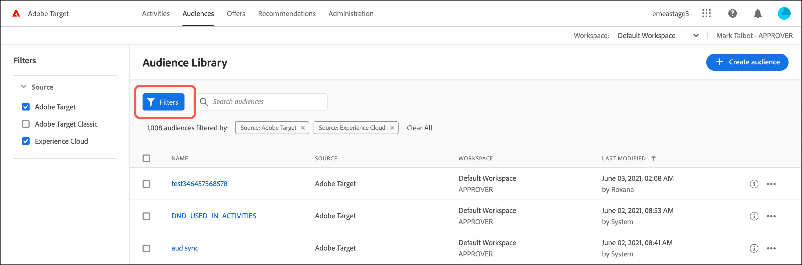

# Creazione di un pubblico

I tipi di pubblico in [!DNL Adobe Target] determinano chi visualizza contenuti ed esperienze in un’attività con targeting.

I tipi di pubblico sono utilizzati in tutte le situazioni in cui è disponibile il targeting. Quando esegui il targeting di un’attività, hai le seguenti opzioni:

* Selezionare un pubblico riutilizzabile dall&#39;elenco [!UICONTROL Tipi di pubblico]
* [Creare un ](/help/c-target/creating-activity-only-audience.md) pubblico specifico per l’attività ed eseguirne il targeting
* [Combinare più ](/help/c-target/combining-multiple-audiences.md#concept_A7386F1EA4394BD2AB72399C225981E5) tipi di pubblico per creare un pubblico specifico

Puoi inoltre utilizzare i dati sul pubblico raccolti da [!DNL Adobe Analytics] per il targeting in tempo reale e la personalizzazione in [!DNL Target] e in altre applicazioni [!DNL Adobe Experience Cloud]. Consulta [Experience Cloud Audiences](https://experienceleague.adobe.com/docs/core-services/interface/audiences/audience-library.html?lang=it) nella guida *Experience Cloud Central Interface Components* .

Esistono due tipi di pubblico in [!DNL Target]:

* **Tipi di pubblico di targeting:**  per fornire contenuti diversi a diversi tipi di visitatori.
* **Tipi di pubblico per reportistica:**  per determinare come diversi tipi di visitatori rispondono allo stesso contenuto e analizzare i risultati dei test.

   In [!DNL Target], è possibile configurare i tipi di pubblico per reportistica solo se [!DNL Target] è utilizzato come origine per la generazione di rapporti. Se utilizzi [ Adobe Analytics come origine per la generazione di rapporti](/help/c-integrating-target-with-mac/a4t/a4t.md) (A4T), devi configurare i tipi di pubblico per la generazione di rapporti in [!DNL Analytics].

## Utilizza l&#39;elenco [!UICONTROL Tipi di pubblico]

Per accedere all’elenco [!UICONTROL Tipi di pubblico], fai clic su **[!UICONTROL Tipi di pubblico]** nella barra dei menu superiore:

L&#39;elenco [!UICONTROL Tipi di pubblico] contiene i tipi di pubblico che puoi utilizzare nelle attività. Utilizza l&#39;elenco [!UICONTROL Tipi di pubblico] per creare, modificare, duplicare, copiare o combinare i tipi di pubblico. L’elenco mostra anche l’origine in cui è stato creato il pubblico:

* [!DNL Adobe Target]
* [!DNL Adobe Target Classic]
* [!DNL Experience Cloud]
* [!DNL Adobe Experience Platform]

   >[!NOTE]
   >
   >L&#39;origine [!DNL Adobe Experience Platform] si trova in un programma di test Beta, ma è disponibile per tutti i clienti [!DNL Target] che utilizzano [Adobe Experience Platform Web SDK](/help/c-implementing-target/c-implementing-target-for-client-side-web/aep-web-sdk.md). I tipi di pubblico disponibili dal [!DNL Adobe Experience Platform] possono essere utilizzati così come sono o [combinati con i tipi di pubblico esistenti](/help/c-target/combining-multiple-audiences.md).

I tipi di pubblico predefiniti, come &quot;[!UICONTROL Nuovi visitatori]&quot; e &quot;[!UICONTROL Visitatori di ritorno]&quot;, non possono essere rinominati.

Quando si lavora con tipi di pubblico originariamente creati in [!DNL Experience Cloud] o [!DNL Adobe Experience Platform], [!DNL Target] avvisa se si fa riferimento a un pubblico in attività [!DNL Target] successivamente eliminate in [!DNL Experience Cloud] o [!DNL Adobe Experience Platform].

* Se un pubblico è stato eliminato in [!DNL Experience Cloud] o [!DNL Adobe Experience Platform], viene visualizzata un&#39;icona di avviso sia nell&#39;elenco [!UICONTROL Pubblico] che nel selettore del pubblico. Una descrizione comandi nell’ [!DNL Target] interfaccia utente indica anche che il pubblico è stato eliminato in [!DNL Experience Cloud] o [!DNL Adobe Experience Platform].
* Se si tenta di combinare più tipi di pubblico con un pubblico eliminato o se si tenta di salvare un&#39;attività che fa riferimento a un pubblico eliminato, viene visualizzato un messaggio di avviso.

Puoi inoltre eseguire il targeting di parametri di profilo personalizzati e parametri `user.`. Quando crei un pubblico, trascina gli attributi che desideri utilizzare per eseguire il targeting dell’attività nella finestra di audience builder. Se l&#39;attributo desiderato non viene visualizzato, non è stato attivato da una mbox. Sono disponibili altri parametri mbox personalizzati nellʼelenco a discesa [!UICONTROL Parametri personalizzati].

Utilizza il pulsante [!UICONTROL Filtri] per filtrare l&#39;elenco [!UICONTROL Tipi di pubblico] in base all&#39;origine: [!DNL Adobe Target], [!DNL Adobe Target Classic], [!DNL Experience Cloud] e [!DNL Adobe Experience Platform].

Utilizza la casella [!UICONTROL Cerca tipi di pubblico] per cercare nell&#39;elenco [!UICONTROL Tipi di pubblico]. Puoi cercare qualsiasi parte del nome di un pubblico, oppure racchiudere tra virgolette una stringa specifica.

Puoi ordinare lʼelenco [!UICONTROL Tipi di pubblico] in base al nome o alla data dellʼultima modifica. Per ordinare in base al nome o alla data, fai clic sull’intestazione di colonna, quindi seleziona la visualizzazione dei tipi di pubblico in ordine crescente o decrescente.

## Visualizzare le definizioni dei tipi di pubblico {#section_11B9C4A777E14D36BA1E925021945780}

Puoi visualizzare i dettagli della definizione del pubblico in una scheda a comparsa in varie posizioni nell’ [!DNL Target] interfaccia utente senza aprire il pubblico. Questa funzionalità si applica ai tipi di pubblico creati in [!DNL Target Standard/Premium] e importati da [!DNL Target Classic] o creati tramite API.

Ad esempio, per accedere alla scheda di definizione del pubblico seguente, fai clic sull&#39;icona [!UICONTROL Visualizza dettagli] per il pubblico desiderato:

Per accedere alla scheda di definizione del pubblico seguente, fai clic sull&#39;icona [!UICONTROL Visualizza dettagli] nella pagina [!UICONTROL Panoramica] di un&#39;attività:

La scheda di definizione del pubblico mostra il tipo, la sorgente e gli attributi del pubblico. Fai clic su **[!UICONTROL Visualizza tutti i dettagli]** per visualizzare altre attività che fanno riferimento a tale pubblico, se applicabile. Se visualizzi una scheda di definizione del pubblico dalla pagina [!UICONTROL Panoramica] di un&#39;attività, fai clic su **[!UICONTROL Utilizzo del pubblico]**.

Le informazioni sull’utilizzo del pubblico possono aiutarti a evitare un impatto accidentale su altre attività durante la modifica dei tipi di pubblico. Le informazioni includono [!UICONTROL Attività live], [!UICONTROL Attività inattive], [!UICONTROL Attività archiviate] e [!UICONTROL Attività di sincronizzazione]. Questa funzione è disponibile per tutti i tipi di pubblico (pubblico della libreria e [pubblico per sola attività](/help/c-target/creating-activity-only-audience.md#concept_A6BADCF530ED4AE1852E677FEBE68483)).

Se un pubblico è [combinato con un altro pubblico](/help/c-target/combining-multiple-audiences.md) e il pubblico combinato viene utilizzato per creare un&#39;attività, le informazioni di utilizzo per entrambi i tipi di pubblico elencano la nuova attività creata.

<!--The following audience definition card is for an audience imported from the Adobe Experience Cloud. In this instance, the audience was imported from Adobe Audience Manager (AAM).

The following details are available for these imported audience types:

| Audience Type | Details |
|--- |--- |
|Mobile audience|Marketing Name, Vendor, and Model. The `matches | does not match` operator displays instead of `equals | does not equal` .|
|Visitor-behavior audience|**user.categoryAffinity:** `categoryAffinity` with `FAVORITE` parameter.  **Monitoring:** Monitoring service equals true. **No Monitoring Service:** Monitoring service equals false. |
|Audiences using the NOT operator|**Single Rule:** Target displays the audience in the format `[All Visitor AND [NOT [rule]`. Single NOT rule displays with AND with `AllVisitor` audience. |

Keep the following points in mind as you work with imported audiences:

* Expression target audiences are no longer supported in Target Standard/Premium. 
* Target Standard/Premium does not support some deprecated audiences or has improved operators for ease of use. Because of this, the definition of an imported audience, although working as per definition, does not mean that same is now available for creation in the Standard/Premium interface. For example, Social Audiences are visible with their rules but Target Standard/Premium does not allow social audiences to be created.-->

## Video di formazione: Utilizzo di Audiences 

Questo video include informazioni sull&#39;utilizzo dei tipi di pubblico.

* Spiegazione del termine “pubblico”
* Spiegazione dei due modi in cui il pubblico viene utilizzato per lʼottimizzazione
* Trovare un pubblico nellʼelenco Tipi di pubblico
* Indirizzare unʼattività a un pubblico
* Utilizzare i tipi di pubblico per la reportistica passiva in un’attività

>[!VIDEO](https://video.tv.adobe.com/v/17398)
