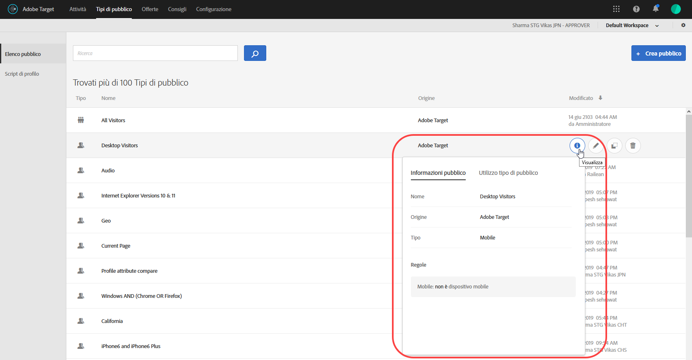
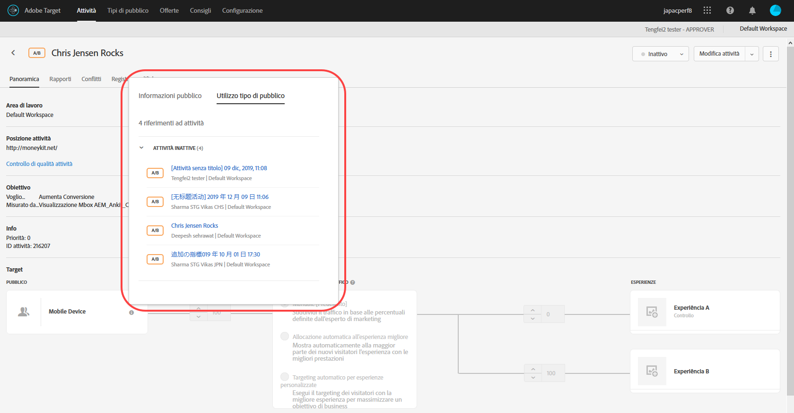
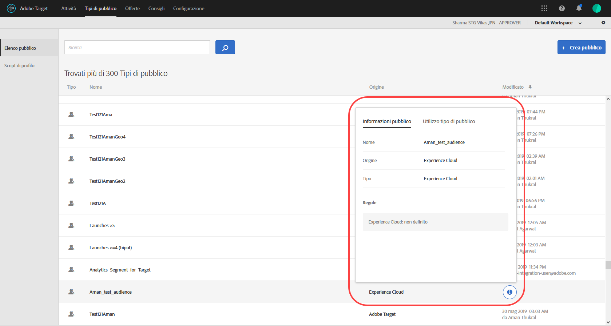

# Creazione di un pubblico

I tipi di pubblico in [!DNL Adobe Target] determinano chi visualizza contenuti ed esperienze in un’attività con targeting.

I tipi di pubblico sono utilizzati in tutte le situazioni in cui è disponibile il targeting. Quando esegui il targeting di un’attività, puoi avere le seguenti opzioni:

* Selezionare un pubblico riutilizzabile dall&#39;elenco [!UICONTROL Tipi di pubblico]
* [Creare un ](/help/c-target/creating-activity-only-audience.md) pubblico specifico per l’attività ed eseguirne il targeting
* [Combinare più ](/help/c-target/combining-multiple-audiences.md#concept_A7386F1EA4394BD2AB72399C225981E5) tipi di pubblico per creare un pubblico specifico

Puoi inoltre utilizzare i dati sul pubblico raccolti da [!DNL Adobe Analytics] per il targeting in tempo reale e la personalizzazione in [!DNL Target] e in altre applicazioni [!DNL Adobe Experience Cloud]. Consulta [Experience Cloud Audiences](https://experienceleague.adobe.com/docs/core-services/interface/audiences/audience-library.html?lang=it) nella guida *Experience Cloud Central Interface Components* .

[!DNL Target] definisce due tipi di pubblico:

* **Tipi di pubblico di targeting:** per fornire contenuti diversi a diversi tipi di visitatori.
* **Tipi di pubblico per reportistica:** per determinare come diversi tipi di visitatori rispondono allo stesso contenuto e analizzare i risultati dei test.

   In [!DNL Target], è possibile configurare i tipi di pubblico per reportistica solo se [!DNL Target] è utilizzato come origine per la generazione di rapporti. Se utilizzi [ Adobe Analytics come origine per la generazione di rapporti](/help/c-integrating-target-with-mac/a4t/a4t.md) (A4T), devi configurare i tipi di pubblico per la generazione di rapporti in [!DNL Analytics].

## Utilizza l&#39;elenco [!UICONTROL Tipi di pubblico]

Per accedere all’elenco [!UICONTROL Tipi di pubblico], fai clic su **[!UICONTROL Tipi di pubblico]** nella barra dei menu superiore:

Nell&#39;elenco [!UICONTROL Tipi di pubblico] sono inclusi tutti i gruppi di destinazione che puoi utilizzare nelle attività. Puoi usare l&#39;elenco [!UICONTROL Tipi di pubblico] per creare, modificare, eliminare, copiare o combinare i tipi di pubblico. L’elenco mostra anche l’origine in cui è stato creato il pubblico ([!DNL Target], [!DNL Target Classic] e [!DNL Experience Cloud]. I tipi di pubblico predefiniti, come &quot;[!UICONTROL Nuovi visitatori]&quot; e &quot;[!UICONTROL Visitatori di ritorno]&quot;, non possono essere rinominati.

Quando lavori con tipi di pubblico originariamente creati in [!DNL Experience Cloud], Target ti avvisa se fai riferimento a un pubblico in attività [!DNL Target] che sono state successivamente eliminate in [!DNL Experience Cloud].

* Se un pubblico è stato eliminato in [!DNL Experience Cloud], viene visualizzata un&#39;icona di avviso sia nell&#39;elenco [!UICONTROL Pubblico] che nel selettore del pubblico. Un suggerimento nell&#39;interfaccia utente indica inoltre che il pubblico è stato eliminato in [!DNL Experience Cloud].
* Se si tenta di combinare più tipi di pubblico con un pubblico eliminato o se si tenta di salvare un&#39;attività che fa riferimento a un pubblico eliminato, viene visualizzato un messaggio di avviso.

Puoi inoltre eseguire il targeting di parametri di profilo personalizzati e parametri `user.`. Quando aggiungi un pubblico, fai clic sull’attributo da utilizzare per eseguire il targeting dell’attività. Se l’attributo desiderato non viene visualizzato, non è stato attivato da una mbox. Sono disponibili altri parametri mbox personalizzati nellʼelenco a discesa [!UICONTROL Parametri personalizzati].

Utilizza il pulsante [!UICONTROL Filtri] per filtrare l&#39;elenco [!UICONTROL Tipi di pubblico] in base all&#39;origine: [!DNL Adobe Target], [!DNL Adobe Target Classic] e [!DNL Experience Cloud].

Utilizza la casella [!UICONTROL Cerca tipi di pubblico] per cercare nell&#39;elenco [!UICONTROL Tipi di pubblico]. Puoi cercare qualsiasi parte del nome di un pubblico, oppure racchiudere tra virgolette una stringa specifica.

Puoi ordinare lʼelenco [!UICONTROL Tipi di pubblico] in base al nome o alla data dellʼultima modifica. Per ordinare in base al nome o alla data, fai clic sull’intestazione di colonna, quindi seleziona la visualizzazione dei tipi di pubblico in ordine crescente o decrescente.

## Visualizzare le definizioni dei tipi di pubblico {#section_11B9C4A777E14D36BA1E925021945780}

Puoi visualizzare i dettagli della definizione del pubblico in una scheda a comparsa in diverse aree nell&#39;interfaccia utente di Target, senza aprire il pubblico. Questa funzionalità si applica ai tipi di pubblico creati in [!DNL Target Standard/Premium] e importati da [!DNL Target Classic] o creati tramite API.

Ad esempio, per accedere alla scheda di definizione del pubblico seguente, fai clic sull&#39;icona [!UICONTROL Visualizza dettagli] per il pubblico desiderato:

Per accedere alla scheda di definizione del pubblico seguente, fai clic sull&#39;icona [!UICONTROL Visualizza dettagli] nella pagina [!UICONTROL Panoramica] di un&#39;attività:

La scheda di definizione del pubblico mostra il tipo, la sorgente e gli attributi del pubblico. Fai clic su **[!UICONTROL Visualizza tutti i dettagli]** per visualizzare altre attività che fanno riferimento a tale pubblico, se applicabile. Se visualizzi una scheda di definizione del pubblico dalla pagina [!UICONTROL Panoramica] di un&#39;attività, fai clic su **[!UICONTROL Utilizzo del pubblico]**.

Le informazioni sull’utilizzo del pubblico possono aiutarti a evitare un impatto accidentale su altre attività durante la modifica dei tipi di pubblico. Le informazioni includono attività live, inattive, archiviate e di sincronizzazione. Questa funzione è disponibile per tutti i tipi di pubblico (pubblico della libreria e [pubblico per sola attività](/help/c-target/creating-activity-only-audience.md#concept_A6BADCF530ED4AE1852E677FEBE68483)).

Se un pubblico viene combinato con un altro pubblico e il pubblico combinato viene utilizzato per creare un&#39;attività, le informazioni di utilizzo per entrambi i tipi di pubblico elencano la nuova attività creata.

La scheda di definizione seguente è per un pubblico importato da Adobe Experience Cloud. In questo caso, il pubblico è stato importato da Adobe Audience Manager (AAM).

Per questi tipi di pubblico importati sono disponibili i seguenti dettagli:

| Tipo di pubblico | Dettagli |
|--- |--- |
| Pubblico mobile | Nome marketing, produttore e modello. L’operatore `matches | does not match` viene visualizzato invece del `equals | does not equal` . |
| Pubblico con comportamento del visitatore | **user.categoryAffinity:** `categoryAffinity` con parametro `FAVORITE`.  **Monitoraggio:** il servizio di monitoraggio è uguale a vero. **Nessun servizio di monitoraggio:** il servizio di monitoraggio è uguale a falso.  |
| Tipi di pubblico con operatore NOT | **Regola singola:** Target mostra il pubblico nel formato `[All Visitor AND [NOT [rule]`. Viene visualizzata una singola regola NOT con AND con pubblico `AllVisitor`.  |

Quando lavori con tipi di pubblico importati, considera i seguenti punti:

* Il pubblico di destinazione con espressioni non è più supportato in Target Standard/Premium.
* In Target Standard/Premium non sono supportati alcuni tipi di pubblico obsoleti o sono stati migliorati alcuni operatori per facilitarne l&#39;uso. Per questo motivo, anche se un pubblico importato funziona in base alla sua definizione, potrebbe non essere disponibile per la creazione di un pubblico nell&#39;interfaccia Standard/Premium. Ad esempio, i tipi di pubblico Social sono visibili con le loro regole, ma Target Standard/Premium non consente di creare un pubblico Social.

## Video di formazione: Utilizzo dei tipi di pubblico 

Questo video include informazioni sull&#39;utilizzo dei tipi di pubblico.

* Spiegazione del termine “pubblico”
* Spiegazione dei due modi in cui il pubblico viene utilizzato per lʼottimizzazione
* Trovare un pubblico nellʼelenco Tipi di pubblico
* Indirizzare unʼattività a un pubblico
* Utilizzare i tipi di pubblico per la reportistica passiva in un’attività

>[!VIDEO](https://video.tv.adobe.com/v/17398)
