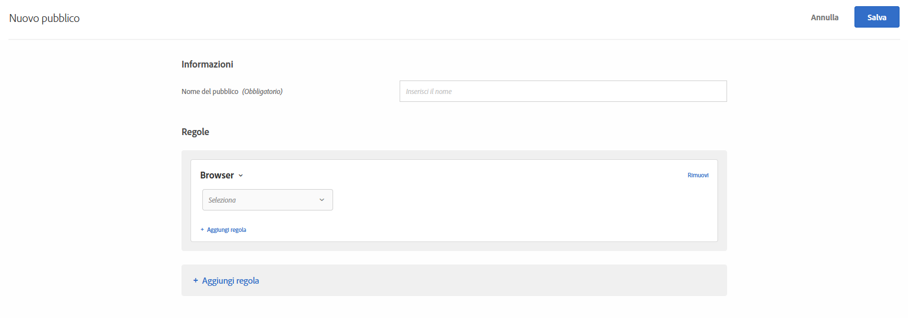

# Browser{#browser}

Puoi indirizzare l’attività agli utenti che visitano la pagina utilizzando un browser specifico o opzioni specifiche del browser.

È possibile indirizza l’attività ai seguenti browser:

* Chrome
* Microsoft Edge
* Firefox
* Opera
* Safari
* iPad
* Internet Explorer
* iPhone|

Esistono due modi per indirizzare i browser:

**Pubblico predefinito:** il pubblico predefinito è utile se desideri indirizzare un’attività solo ai visitatori che utilizzano un browser specifico per visitare il tuo sito. Ad esempio, se stai offrendo un’estensione per Chrome, puoi rivolgerti ai soli utenti di Chrome.

1. Quando imposti l’attività, seleziona il browser dall’elenco a discesa Tipi di pubblico.

   Questa opzione indirizza l’attività solo ai visitatori che utilizzano il browser specificato.

**Regola di pubblico personalizzato per browser:** un pubblico personalizzato consente di rivolgerti agli utenti di più browser o di impostare regole o esclusioni per specifici browser, versioni o lingue del browser. Ciò offre molta flessibilità per indirizzare una campagna basata sugli attributi del browser.

1. Nell’interfaccia di [!DNL Target] fai clic su **[!UICONTROL Pubblico]** > **[!UICONTROL Crea pubblico]**.
1. Dai un nome al pubblico.
1. Fai clic su **[!UICONTROL Aggiungi regola]** > **[!UICONTROL Browser]**.

   

1. Fai clic su **[!UICONTROL Seleziona]**, quindi scegli una delle seguenti opzioni:

   * **Tipo**: Includi o escludi gli utenti che usano un determinato browser. Consulta [Tipo](/help/c-target/c-audiences/c-target-rules/browser.md#section_6ADC758F23F145B3A310151546D83D56).
   * **Lingua:** includi o escludi i browser impostati per una specifica lingua. Consulta [Lingua](/help/c-target/c-audiences/c-target-rules/browser.md#section_7520D1AA464A45A6843EABE2D2B431A1).
   * **Versione:** includi o escludi una determinata versione del browser. Consulta [Versione](/help/c-target/c-audiences/c-target-rules/browser.md#section_37CC8CE45DA04E8682AE6388321BA6EF).

1. (Facoltativo) Fai clic su **[!UICONTROL Aggiungi regola]** per impostare regole aggiuntive per il pubblico.
1. Fai clic su **[!UICONTROL Salva]**.

L’esempio seguente illustra un pubblico che include gli utenti delle versioni 10 o 11 di Internet Explorer:

## Opzioni browser {#concept_221D8EEF53CC45AEACEB17CF336A3658}

Per un’attività, puoi includere o escludere i partecipanti in base al tipo, alla lingua o alla versione del browser utilizzato.

### Tipo {#section_6ADC758F23F145B3A310151546D83D56}

Includi o escludi gli utenti che usano un determinato browser.

Seleziona **[!UICONTROL Tipo]**, quindi scegli “è uguale a” o “è diverso da”.

* È uguale a: includi nell’attività i browser selezionati.
* È diverso da: escludi dall’attività i browser selezionati.

Seleziona uno o più browser. Le opzioni multiple sono collegate con l’operatore O.

### Lingua  {#section_7520D1AA464A45A6843EABE2D2B431A1}

Includi o escludi alcuni browser impostati per una specifica lingua.

Ad esempio, se un’offerta è disponibile solo in inglese, puoi indirizzarla ai soli browser impostati per la lingua inglese. Oppure, se la pagina non è abilitata per caratteri a doppio byte, puoi escludere i browser impostati per lingue orientali.

L’inclusione o l’esclusione in base alla lingua del browser può permetterti di definire meglio i visitatori a cui ti rivolgi rispetto a parametri basati sulla località geografica nei casi in cui la lingua riveste un ruolo più importante della posizione geografica. Ad esempio, se offri un articolo scritto in inglese, puoi destinarlo ai paesi di lingua inglese oppure a chi utilizza browser impostati in lingua inglese. Con il targeting in base al browser, l’articolo sarà disponibile per gli anglofoni che si collegano da paesi in cui l’inglese non è la lingua principale.

Seleziona **[!UICONTROL Lingua]**, quindi scegli “è uguale a” o “è diverso da”.

* È uguale a: includi nell’attività i browser nelle lingue selezionate.
* È diverso da: escludi dall’attività i browser nelle lingue selezionate.

Seleziona una o più lingue. Le opzioni multiple sono collegate con l’operatore O.

È possibile includere o escludere le seguenti lingue del browser:

* Inglese
* Francese
* Tedesco
* Giapponese
* Coreano
* Portoghese
* Russo
* Spagnolo
* Cinese tradizionale

### Versione  {#section_37CC8CE45DA04E8682AE6388321BA6EF}

Includi o escludi una determinata versione del browser.

Se, ad esempio, la pagina non può essere visualizzata correttamente in Internet Explorer versione 11 o precedente, puoi creare un pubblico escludendo tali versioni. In tal caso, è necessario impostare una regola in cui il tipo di browser è uguale a Internet Explorer e aggiungere una seconda regola in cui la versione è minore o uguale a 11.

Seleziona **[!UICONTROL Versione]**, quindi scegli un operatore:

* È uguale a
* È diverso da
* È maggiore di
* È maggiore o uguale a
* È minore di
* È minore o uguale a

Digita il numero della versione.

In questo campo di testo è possibile immettere solo le versioni principali. La versione specificata include tutte le eventuali versioni secondarie di tale versione principale. Ad esempio, se specifichi la versione 10, verrano inclusi anche i visitatori che usano la versione 10.1.

Le opzioni multiple sono collegate con l’operatore O.

## Video di formazione: Creazione di tipi di pubblico  

Questo video contiene informazioni sull&#39;utilizzo delle categorie di pubblico.

* Creazione di un pubblico
* Definizione delle categorie di pubblico

>[!VIDEO](https://video.tv.adobe.com/v/17392)