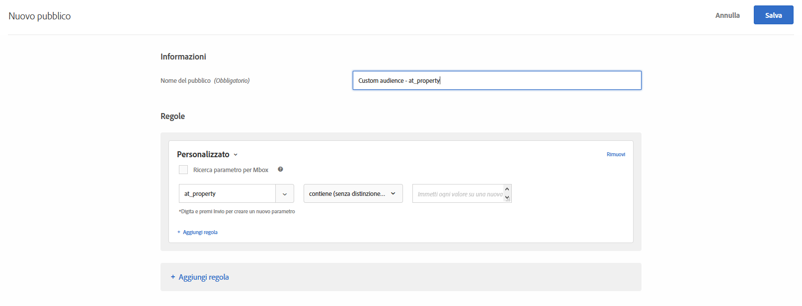

# Parametri personalizzati

I parametri personalizzati sono parametri mbox in [!DNL Adobe Target]. Se trasmetti parametri mbox alle mbox o utilizzi la funzione `targetPageParams` , questi parametri vengono visualizzati qui per l&#39;utilizzo nei tipi di pubblico.

Per ulteriori informazioni, consulta [Trasmettere parametri a una mbox globale](/help/c-implementing-target/c-implementing-target-for-client-side-web/t-mbox-download/c-understanding-global-mbox/pass-parameters-to-global-mbox.md).

Durante la creazione di un pubblico personalizzato basato su un parametro mbox, `mboxParameter` non richiede più di specificare `mboxName`. Il nome dell’elemento mbox è ora facoltativo. Questa modifica consente di utilizzare parametri da più elementi mbox o di fare riferimento a un parametro che non è ancora stato registrato nella rete Edge.

1. Nell’interfaccia di [!DNL Target] fai clic su **[!UICONTROL Pubblico]** > **[!UICONTROL Crea pubblico]**.
1. Assegna un nome al pubblico e aggiungi una descrizione facoltativa.
1. Trascina **[!UICONTROL Personalizzato]** nel riquadro di Generatore di pubblico.

   Per selezionare il parametro desiderato:

   * Durante la creazione di un pubblico, seleziona un nome di parametro dall’elenco, inizia a digitare i primi caratteri del nome di parametro desiderato o il nome completo del parametro desiderato.
   * Se ricordi il nome mbox ma non il nome del parametro, utilizza l&#39;elenco a discesa [!UICONTROL Filtra per] per filtrare una mbox nota trasmettendo il parametro desiderato.

   Con uno di questi metodi, non esiste alcun collegamento tra mbox e il parametro. Il pubblico funziona in base al parametro per tutte le mbox che trasmettono quel parametro.

   Se modifichi un pubblico esistente, i criteri di filtraggio vengono visualizzati con il nome mbox fornito durante la creazione.

1. Scegli un valutatore:

   * Contiene (senza distinzione maiuscole/minuscole)
   * Non contiene (senza distinzione maiuscole/minuscole)
   * È uguale a
   * È diverso da
   * È maggiore di
   * È maggiore o uguale a
   * È minore di
   * È minore o uguale a
   * Parametro presente
   * Parametro non presente
   * Valore parametro presente
   * Il valore del parametro non è presente
   * Parametro o valore non presente
   * Inizia con
   * Termina con

   

1. Inserisci ciascun valore in una nuova riga.
1. (Facoltativo) Imposta regole aggiuntive per il pubblico.
1. Fai clic su **[!UICONTROL Fine]**.

I [dettagli della definizione di una scheda a comparsa](/help/c-target/c-audiences/audiences.md#section_11B9C4A777E14D36BA1E925021945780) del pubblico visualizzano il nome del parametro nella sezione Regole. Non esiste un riferimento al mbox utilizzato per il filtraggio.

>[!NOTE]
>
>Per i tipi di pubblico personalizzati creati prima della versione [!DNL Target] 18.5.1 (22 maggio 2018), i nomi mbox non vengono visualizzati nella scheda a comparsa di definizione del pubblico. Salva nuovamente il pubblico personalizzato per ottenere il nome mbox da visualizzare nella scheda .

## Considerazioni {#considerations}

* I tipi di pubblico e le attività vengono valutati per una mbox specifica. Ad esempio, se la mbox globale trasmette un determinato parametro, ma la mbox regionale no, il targeting di attività/pubblico per tale parametro non è qualificato per la mbox regionale.
* Il targeting non viene valutato su parametri mbox interni, come mboxPC, mboxSession, mbox3rdPartyId, mboxMCSDID, mboxMCAVID, mboxMCGVID, mboxCount, mboxId e mboxVersion.

## Video di formazione: Creazione di tipi di pubblico 

Questo video contiene informazioni sull&#39;utilizzo delle categorie di pubblico.

* Creazione di un pubblico
* Definizione delle categorie di pubblico

>[!VIDEO](https://video.tv.adobe.com/v/17392)
