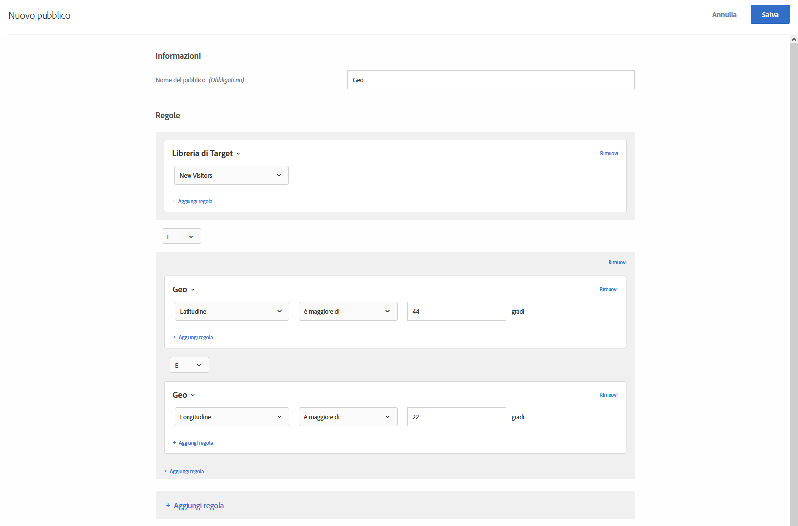

# Geo{#geo}

Utilizza i tipi di pubblico per indirizzare l’attività a specifici utenti in base alla loro posizione geografica, compreso paese, stato/provincia, città, CAP, DMA o gestore mobile.

I parametri di geolocalizzazione consentono di eseguire il targeting di campagne ed esperienze in base alla posizione geografica dei visitatori. Puoi includere o escludere i visitatori in base al relativo paese, Stato/provincia, città, codice postale, latitudine, longitudine, DMA o gestore di telefonia mobile. Questi dati vengono inviati con ogni richiesta di Target e si basano sull’indirizzo IP del visitatore. Seleziona questi parametri come qualsiasi altro valore di targeting.

## Creare un pubblico con il geotargeting {#section_49CBFFAAC8694C4AAD3DE4B2DB7B05DE}

1. Nell’interfaccia di [!DNL Target] fai clic su **[!UICONTROL Pubblico]** > **[!UICONTROL Crea pubblico]**.
1. Dai un nome al pubblico.
1. Fai clic su **[!UICONTROL Aggiungi regola]** > **[!UICONTROL Geo]**.

1. Fai clic su **[!UICONTROL Seleziona]**, quindi scegli una delle seguenti opzioni:

   * Paese
   * Stato
   * Città
   * Codice postale
   * Latitudine
   * Longitudine
   * DMA
   * Gestore di telefonia mobile

   Per risolvere i parametri di geotargeting per quel visitatore, viene trasmesso il relativo indirizzo IP con una richiesta mbox, una volta per ogni visita (sessione).

   Per il gestore di telefonia mobile, in [!DNL Target] vengono utilizzati i dati di registrazione dell’indirizzo IP (chi possiede il blocco di indirizzi IP) per determinare il gestore di telefonia mobile appropriato utilizzando i [codici nazionali (MCC, Mobile Country Code) e i codici di rete mobile (MCC, Mobile Network Code)](https://www.mcc-mnc.com).

1. Specificare un operatore e il valore appropriato.
1. (Facoltativo) Fai clic su **[!UICONTROL Aggiungi regola]** per impostare regole aggiuntive per il pubblico.
1. Fai clic su **[!UICONTROL Salva]**.

L’illustrazione seguente mostra un pubblico che include gli utenti che accedono all’attività da una latitudine maggiore di 44° e una longitudine minore di 22°.

## Precisione {#section_D63D5FFCB49C42F9933AFD0BD7C79DF1}

La precisione del geotargeting dipende da diversi fattori. Le connessioni Wi-Fi sono più accurate delle reti cellulari. Quando il visitatore utilizza una connessione dati cellulare, la precisione della ricerca geografica può essere influenzata dalla posizione, dal rapporto dati del provider con [DeviceAtlas](https://deviceatlas.com/device-data/user-agent-tester) e da altri fattori. Le connessioni di rete basate su stazioni cellulari possono essere meno precise delle connessioni cablate o Wi-Fi. Inoltre, l&#39;indirizzo IP di un visitatore può essere mappato alla relativa posizione ISP, che può non coincidere con la posizione effettiva del visitatore. Some mobile geo-location issues can be solved using the [Geolocation API](https://developer.mozilla.org/en-US/docs/Web/API/Geolocation_API).

Nella seguente tabella viene mostrata la precisione delle informazioni geografiche basate su IP da [DigitalEnvoy](https://www.digitalelement.com/solutions/) per connessioni internet cablate o Wi-Fi. DigitalEnvoy fornisce i dati più precisi del settore. La precisione globale è superiore al 99,9% a livello di paese e fino al 97% a livello di città. Le informazioni di precisione non si applicano alle reti basate su stazioni cellulari.

| Paese | Stato | Città | Area geografica |
|--- |--- |--- |--- |
| Stati Uniti | 99,99% | 96% | 94% |
| Canada | 99,99% | 96% | 94% |
| Europa | 99,99% |  |  |
| Regno Unito | 99,99% |  | 87% |
| Germania | 99,99% | 95% | 93% |
| Scandinavia | 99% | Circa 90-93% | Circa 84-86% |
| Spagna | 99,99% | Circa 90% | Circa 95-99% |
| Asia | 99% | Circa 94-96% | Circa 90-93% |
| Giappone | 99,99% | Circa 94-96% | Circa 90-93% |
| Australia | 99,99% | 94% | 91% |

## Utilizzo del geotargeting negli script di profilo {#section_92C93138542C4A94997E3F4BE3F5DA28}

Puoi utilizzare le informazioni geografiche per gli script di profilo.

Ad esempio, utilizza:

* `profile.geolocation.country`
* `profile.geolocation.state`
* `profile.geolocation.city`
* `profile.geolocation.zip`
* `profile.geolocation.dma`
* `profile.geolocation.domainName`
* `profile.geolocation.ispName`
* `profile.geolocation.connectionSpeed`
* `profile.geolocation.mobileCarrier`

Pertanto, è possibile scrivere un&#39;espressione di targeting denominata “Proveniente da America del Nord” con il codice seguente:

`return profile.geolocation.country == 'united states' || profile.geolocation.country == 'canada' || profile.geolocation.country == 'mexico';`

## Utilizzo dei valori di geotargeting come token {#section_E7F7FDF62C3B4934A6565D04B24655F6}

È ora possibile utilizzare i valori `profile.geolocation` direttamente come token in offerte, plug-in e così via.

Ad esempio, utilizza:

* `${profile.geolocation.country}`
* `${profile.geolocation.state}`
* `${profile.geolocation.city}`
* `${profile.geolocation.zip}`
* `${profile.geolocation.dma}`
* `${profile.geolocation.domainName}`
* `${profile.geolocation.ispName}`
* `${profile.geolocation.connectionSpeed}`
* `${profile.geolocation.mobileCarrier}`
* `${profile.geolocation.latitude}`
* `${profile.geolocation.longitude}`

## Domande frequenti sul geotargeting {#section_DD308A53AF0F48FA8C81423580561FE7}

**Come posso specificare latitudine e longitudine?**

* Il valore per latitudine e longitudine deve essere un valore numerico espresso in gradi.
* Il valore per latitudine e longitudine può avere una precisione massima di cinque posizioni decimali.
* Il valore della latitudine deve essere compreso tra -90 e 90.
* Il valore della longitudine deve essere compreso tra -180 e 180.

**Come funziona il geotargeting per i dispositivi mobili?**

La stragrande maggioranza degli utenti che usa dispositivi mobili accede al contenuto via Wi-Fi, il che significa che il geotargeting basato su IP di Target è preciso quanto quello basato sulla posizione di un computer desktop. Le connessioni basate su stazioni cellulari possono essere meno precise in quanto l&#39;indirizzo IP del visitatore si basa sulla stazione dalla quale viene prelevato il segnale. Some mobile geo-location issues can be solved using the [Geolocation API](https://developer.mozilla.org/en-US/docs/Web/API/Geolocation_API).

**Come vengono gestiti i visitatori provenienti da AOL nella funzione Geo?**

A causa del modo in cui il traffico viene mascherato da AOL, possiamo eseguire il targeting dei relativi utenti solo a livello di paese. Ad esempio, una campagna destinata alla Francia verrà indirizzata correttamente agli utenti di AOL in Francia. Contrariamente, una campagna destinata a Parigi non verrà indirizzata correttamente agli utenti di AOL a Parigi. Se l&#39;intento è quello di eseguire il targeting specifico degli utenti di AOL, puoi impostare il campo regione su “AOL”. Invero, puoi eseguire il targeting degli utenti di AOL degli Stati Uniti specificando due condizioni di targeting: corrispondenza esatta di paese con “Stati Uniti” e corrispondenza esatta di regione con “AOL”.

**Qual è il livello di dettaglio sulla posizione fornito dal geotargeting?**

* Paese: globale
* Stato/provincia/regione: globale
* Città: globale
* Codice postale: Stati Uniti, Germania, Canada
* DMA/ITV (Regno Unito): Stati Uniti, Regno Unito
* Gestore di telefonia mobile: globale

**Come posso testare le mie attività simulando di essere un utente proveniente da una posizione diversa?**

È possibile sovrascrivere l’indirizzo IP con un indirizzo IP di una posizione diversa e utilizzare il parametro `mboxOverride.browserIp url`. Quindi, se la tua azienda è nel Regno Unito ma la campagna globale è indirizzata a visitatori di Aukland in Nuova Zelanda, utilizza lo stile di URL proposto di seguito supponendo che `60.234.0.39` sia un indirizzo IP di Auckland:

`https://www.mycompany.com?mboxOverride.browserIp=60.234.0.39`

Prima di eseguire questa operazione è necessario eliminare i cookie.

>[!NOTE]
>
>`mboxOverride.browserIp` è supportato solo in at.js 1.*jx* . Questa funzionalità non è supportata in at.js 2.*x*.

**Come vengono mappati territori come Porto Rico e Hong Kong nella struttura di geotargeting?**

Porto Rico, Hong Kong e altri territori vengono considerati valori “Paese” separati.

**Acquisisce (e archivia) [!DNL Target] informazioni come i codici ZIP quando l&#39;attività è mirata con le funzionalità di targeting geografico?**

No, [!DNL Target] utilizza dati geografici solo per la durata della sessione, quindi i dati vengono scartati.

## Video di formazione: Creazione del contrassegno 

Questo video contiene informazioni sull&#39;utilizzo delle categorie di pubblico.

* Creazione di un pubblico
* Definizione delle categorie di pubblico

>[!VIDEO](https://video.tv.adobe.com/v/17392)
