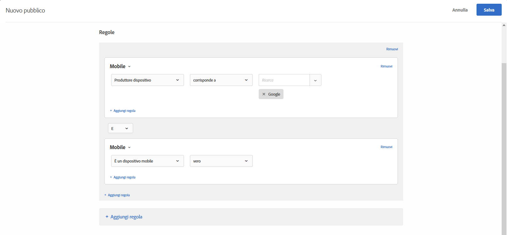

# Dispositivi mobili

Crea dei tipi di pubblico per indirizzare l’attività a chi usa specifici dispositivi mobili, in base a parametri come dispositivo mobile, tipo di dispositivo, fornitore, dimensioni dello schermo (in pixel) e altro ancora.

Ad esempio, potrebbe essere utile mostrare contenuti diversi agli utenti che arrivano sulla pagina utilizzando un telefono o un computer. In questo caso, è possibile selezionare il tipo di pubblico per dispositivi mobili, quindi selezionare l’opzione **[!UICONTROL È un telefono cellulare]** e aggiungere eventuali dettagli specifici rilevanti, come tipo di telefono, dimensioni dello schermo (in pixel) e così via.

Il targeting per i dispositivi mobili è fornito da [DeviceAtlas](https://deviceatlas.com/device-data/user-agent-tester), un servizio di dotMobi. DeviceAtlas è un database completo di dispositivi mobili basato su dati compilati da numerose fonti, inclusi produttori e operatori di rete. Questi dati vengono poi verificati, incrociati e convalidati per generare un database ampio e accurato dei dispositivi mobili.

Il rilevamento del dispositivo viene eseguito analizzando le stringhe Utente-Agente. Alcuni produttori di dispositivi, come ad esempio Apple, disabilitano questa funzionalità (non forniscono informazioni sufficienti nel documentazione per gli utenti).

Ad esempio, i dispositivi Apple non condividono token specifici del modello di dispositivo nell&#39;UA. Pertanto non è possibile rilevare i modelli di iPhone (come iPhone 5S, iPhone SE, iPhone 6, e così via) utilizzando un semplice metodo basato su parole chiave.

Per risolvere questo problema, Target raccoglie dati aggiuntivi per rilevare accuratamente iPhone e altri dispositivi Apple utilizzando i seguenti parametri:

| Parametro | Tipo | Descrizione |
|--- |--- |--- |
| devicePixelRatio | Stringa | Rapporto tra pixel fisici e pixel indipendenti dalla periferica (dips) nel browser.  per es. “1,5” o “2” |
| screenOrientation | Stringa | Il motore JavaScript del dispositivo e del browser supportano l&#39;Orientamento del Dispositivo. Può essere orizzontale o verticale. |
| webGLRenderer | Stringa | Rendering del browser del driver grafico. |

>[!NOTE]
>
>I clienti che usano SDK mobile non hanno necessità di utilizzare questa funzione. I clienti che utilizzano at.js devono [eseguire l’aggiornamento alla versione 1.5.0 di at.js](/help/c-implementing-target/c-implementing-target-for-client-side-web/target-atjs-versions.md#reference_DBB5EDB79EC44E558F9E08D4774A0F7A) (o successiva).

È possibile scegliere più di una proprietà per i dispositivi mobili. Le selezioni multiple sono collegate tra loro mediante l&#39;operatore O.

I clienti che utilizzano un&#39;integrazione personalizzata (non con at.js o l&#39;SDK mobile) possono raccogliere questi parametri e trasmetterli come parametri mbox.

1. Nell’interfaccia di [!DNL Target] fai clic su **[!UICONTROL Pubblico]** > **[!UICONTROL Crea pubblico]**.
1. Dai un nome al pubblico.
1. Fai clic su **[!UICONTROL Aggiungi regola]** > **[!UICONTROL Mobile]**.
1. Fai clic su **[!UICONTROL Seleziona]**, quindi scegli una delle seguenti opzioni:

   * Nome marketing del dispositivo
   * Modello dispositivo
   * Produttore dispositivo
   * È un dispositivo mobile
   * È un telefono cellulare
   * È un tablet
   * Sistema operativo
   * Altezza schermo (px)
   * Larghezza schermo (px)

   >[!NOTE]
   >
   >Le nuove modifiche introdotte in iOS 12.2 incidono sulla creazione di un pubblico con regole definite dai modelli Nome marketing del dispositivo e Modello dispositivo che specificano modelli di iPhone. Non è più possibile impostare come destinazione gli utenti che utilizzano iPhone con iOS 12.2. Tuttavia il targeting funziona correttamente per gli utenti di iPhone con una versione di iOS diversa da 12.2.
   >
   >L’aggiornamento iOS 12.2 non influenza l’identificazione dei seguenti modelli, poiché questi non supportano l’aggiornamento a iOS 12.2: iPhone, iPhone 3G, iPhone 3GS, iPhone 4, iPhone 4s, iPhone 5, iPhone 5c, iPad, iPad 2, iPad con display Retina, iPad Retina (4a generazione), iPod Touch 4 e iPod Touch 5.

   >[!NOTE]
   >
   >Puoi eseguire il targeting per gestore di telefonia mobile utilizzando le [impostazioni Geo](/help/c-target/c-audiences/c-target-rules/geo.md#concept_5B4D99DE685348FB877929EE0F942670).

1. (Facoltativo) Fai clic su **[!UICONTROL Aggiungi regola]** per impostare regole aggiuntive per il pubblico.
1. Fai clic su **[!UICONTROL Salva]**.

L’illustrazione seguente mostra un pubblico che include i visitatori che utilizzano dispositivi mobili prodotti da Google.

## Video di formazione: Creazione di tipi di pubblico

Questo video contiene informazioni sull&#39;utilizzo delle categorie di pubblico.

* Creazione di un pubblico
* Definizione delle categorie di pubblico

>[!VIDEO](https://video.tv.adobe.com/v/17392)
