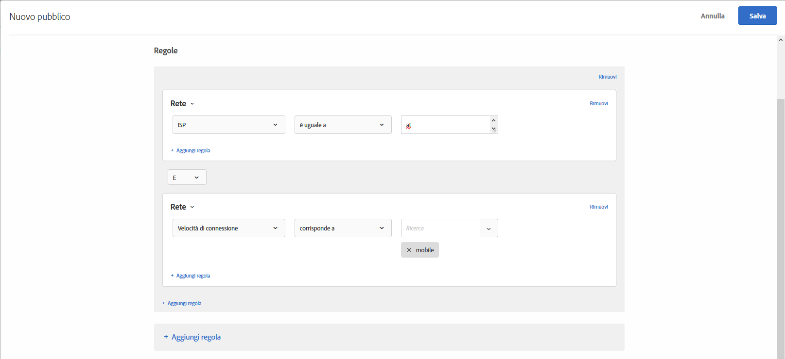

# Rete{#network}

Puoi creare un pubblico in base ai dettagli della rete.

1. Nell’interfaccia di [!DNL Target] fai clic su **[!UICONTROL Pubblico]** > **[!UICONTROL Crea pubblico]**.
1. Dai un nome al pubblico.
1. Fai clic su **[!UICONTROL Aggiungi regola]** > **[!UICONTROL Rete]**.
1. Fai clic su **[!UICONTROL Seleziona]**, quindi scegli una delle seguenti opzioni:

   * **ISP:** un ISP è un’organizzazione che fornisce accesso a Internet ai suoi abbonati, di solito ad una tariffa mensile o annuale. Molti ISP forniscono servizi aggiuntivi, come web hosting o e-mail. Il campo ISP è un ISP commerciale o un&#39;altra entità come un business o un istituto scolastico.

      Di seguito sono riportati alcuni esempi di ISP popolari negli Stati Uniti:

      | Nome comune | Nome dell&#39;ISP | Nome di dominio | Indirizzo IP di esempio |
      |---|---|---|---|
      | Cablevision | Cablevision Systems Corp. | *.optonline.net | 68.196.130.239 |
      | CenturyLink | Qwest Communications Company, LLC | *.centurylink.net | 64.40.65.0 |
      | Charter Communications | Charter Communications | *.charter.com | 71.85.225.124 |
      | Comcast | Comcast Cable Communications, Inc. | *.comcast.net | 76.27.24.28 |
      | Cox | Cox Communications Inc. | *cox.net | 68.224.174.22 |
      | Speakeasy | MegaPath Corporation | *.speakeasy.net | 66.93.240.0 |
      | Time Warner | Time Warner Cable Internet LLC | *.res.rr.com | 72.229.28.185 |
      | Verizon FiOS | MCI Communications Services, Inc. d/b/a Verizon Business | *.fios.verizon.net | 173.68.112.34 |
      | Vivint | Smartrove Inc. | *.vivintwireless.net | 170.72.26.105 |
      | AT&amp;T Wireless | AT | *.mycingular.net |  |
      | Sprint mobile | Sprint Personal Communications Systems | Indirizzo IP |  |
      | T-Mobile | T-Mobile USA, Inc. | Indirizzo IP | 208.54.86.0 |
      | Verizon Wireless | Cellco Parternship DBA Verizon Wireless | *.myvzw.com | 70.195.74.199 |

      >[!NOTE]
      >
      >Quando esegui il targeting basato su ISP, utilizza il nome ISP, non il nome comunemente diffuso. Assicurati di creare la regola senza distinzione tra maiuscole e minuscole o di utilizzare sempre le minuscole.

      Puoi verificare l’ISP e i valori dei nomi di dominio. https://www.whoismyisp.org è una buona risorsa a scopo di targeting. Puoi utilizzare gli indirizzi IP di esempio riportati nella tabella precedente oppure immettere il tuo. Quindi inserisci il parametro `mboxOverride.browserIp= URL` per simulare l&#39;indirizzo IP.

   * **Nome di dominio:** è il nome di dominio per l’indirizzo IP del visitatore. Non è il nome di dominio del sito web che utilizzi con [!DNL Target]. Questo nome di dominio è correlato all&#39;indirizzo IP del visitatore ed è talvolta chiamato hostname. Di solito è molto simile al nome dell&#39;ISP. A volte il nome host fa riferimento ai nomi più vecchi delle aziende che hanno modificato il loro nome ISP ma non il dominio.
   * **Velocità di connessione:** questa è la velocità di connessione del visitatore a Internet. Le opzioni includono: banda larga, cavo, dialup, mobile, oc3, oc12, satellite, t1, t2, wireless, e xdsl.

      Questo campo si basa sul tipo di connessione e non sulla velocità effettiva. [!DNL Target] non può determinare la velocità di connessione esatta. Il tipo di connessione a banda larga viene utilizzato quando non è presente alcuna indicazione di altri tipi di connessione e quindi non è possibile scegliere un tipo specifico.

1. (Facoltativo) Fai clic su **[!UICONTROL Aggiungi regola]** per impostare regole aggiuntive per il pubblico.
1. Fai clic su **[!UICONTROL Salva]**.

L’illustrazione seguente mostra un pubblico che include i visitatori con una connessione AT&amp;T e velocità di connessione [!UICONTROL Mobile].

## Video di formazione: Creazione di tipi di pubblico

Questo video contiene informazioni sull&#39;utilizzo delle categorie di pubblico.

* Creazione di un pubblico
* Definizione delle categorie di pubblico

>[!VIDEO](https://video.tv.adobe.com/v/17392)