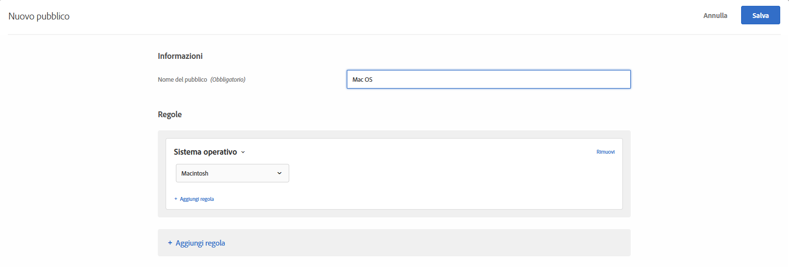

# Sistema operativo{#operating-system}

Puoi indirizzare l’attività ai visitatori che utilizzano un determinato sistema operativo.

1. Nell’interfaccia di [!DNL Target] fai clic su **[!UICONTROL Pubblico]** > **[!UICONTROL Crea pubblico]**.
1. Dai un nome al pubblico.
1. Fai clic su **[!UICONTROL Aggiungi regola]** > **[!UICONTROL Sistema operativo]**.
1. Fai clic su **[!UICONTROL Seleziona]**, quindi scegli una delle seguenti opzioni:

   * Linux
   * Macintosh
   * Windows

1. (Facoltativo) Fai clic su **[!UICONTROL Aggiungi regola]** per impostare regole aggiuntive per il pubblico.
1. Fai clic su **[!UICONTROL Salva]**.

Le illustrazioni seguenti mostrano un pubblico che include i visitatori che utilizzano un sistema MacOS.

## Video di formazione: Creazione di tipi di pubblico

Questo video contiene informazioni sull&#39;utilizzo delle categorie di pubblico.

* Creazione di un pubblico
* Definizione delle categorie di pubblico

>[!VIDEO](https://video.tv.adobe.com/v/17392)
