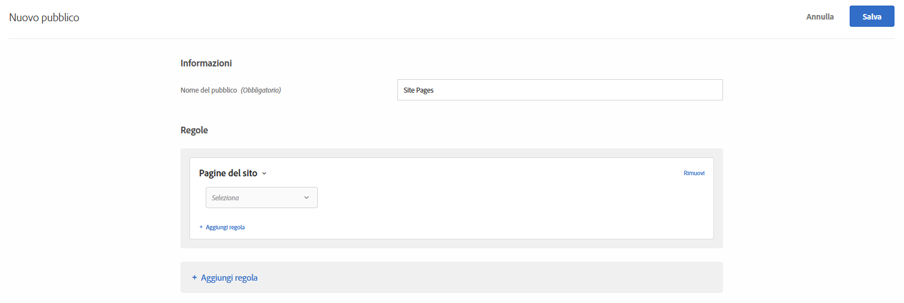
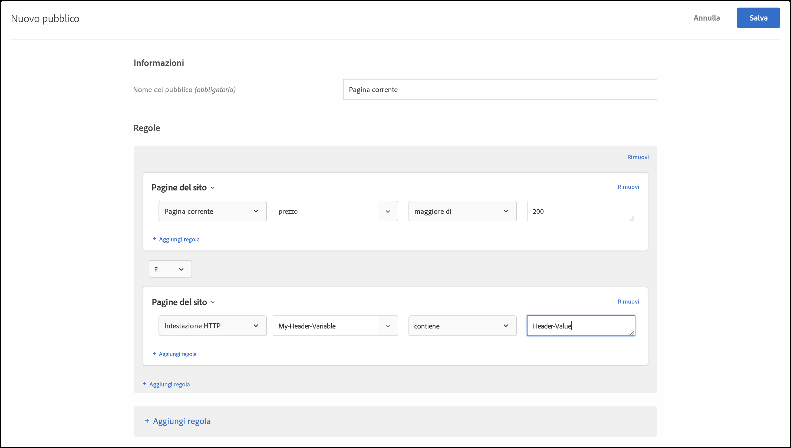

# Pagine del sito{#site-pages}

Potete eseguire il targeting dei visitatori che si trovano su una pagina specifica del sito.

1. Nell’interfaccia di [!DNL Target] fai clic su **[!UICONTROL Pubblico]** > **[!UICONTROL Crea pubblico]**.
1. Dai un nome al pubblico.
1. Fai clic su **[!UICONTROL Aggiungi regola]** > **[!UICONTROL Pagine del sito]**.

   

1. Fare clic sull&#39;elenco a discesa **[!UICONTROL Seleziona]** , selezionare una delle opzioni seguenti, quindi configurare la regola come desiderato.

   Le opzioni disponibili e i valutatori negli elenchi a discesa successivi della regola variano in base all&#39;opzione scelta. L&#39;illustrazione seguente mostra le opzioni disponibili se scegliete Pagina corrente:

   

   Le seguenti opzioni sono disponibili nell’elenco a discesa iniziale quando scegliete [!UICONTROL Seleziona].

   * **Pagina corrente:** La pagina sulla quale si trova l’utente.

      Le seguenti opzioni sono disponibili nel secondo elenco a discesa se scegliete questa opzione:

      * URL (per ulteriori informazioni sul modo in cui Target valuta gli URL, consultate [Domande frequenti](/help/c-target/c-troubleshooting-targets-and-audiences/troubleshooting-targets-and-audiences.md)su Target e audience.)
      * Dominio
      * Query
      * Sottodominio
      * Dominio di primo livello
      * Percorso
      * Frammento hash (#)
   * **Pagina precedente:** la pagina sulla quale si trovava l’utente prima di fare clic per passare alla pagina corrente. (L’utente deve fare clic dalla pagina precedente a quella corrente, affinché la pagina venga tracciata. La pagina precedente non viene tracciata se l’utente digita un nuovo URL nel browser). Il contenuto effettivo di questa pagina dipende dalla progettazione del sito. Ad esempio, se la pagina corrente mostra informazioni su un prodotto specifico, quella precedente potrebbe essere una pagina di categoria in cui il visitatore seleziona l’elemento specifico (ad esempio, una pagina contenente più telecamere di un certo tipo) o la pagina principale che porta alla pagina finale.

      Le seguenti opzioni sono disponibili nel secondo elenco a discesa se scegliete questa opzione:

      * URL (per ulteriori informazioni sul modo in cui Target valuta gli URL, consultate [Domande frequenti](/help/c-target/c-troubleshooting-targets-and-audiences/troubleshooting-targets-and-audiences.md)su Target e audience.)
      * Dominio
      * Query
      * Sottodominio
      * Dominio di primo livello
      * Percorso
   * **Pagina di destinazione:** è la prima pagina che il visitatore vede quando accede al tuo sito. Ad esempio, se il visitatore fa clic su un collegamento su Google che porta a una pagina di categoria, la pagina di categoria è la pagina di destinazione. Se il collegamento rimanda alla pagina principale, quest’ultima corrisponde alla pagina di destinazione. La pagina di destinazione viene memorizzata per la sessione del visitatore. Puoi eseguire un targeting più approfondito nel sito in base alla pagina di destinazione del visitatore nella sessione.

      Le seguenti opzioni sono disponibili nel secondo elenco a discesa se scegliete questa opzione:

      * URL (per ulteriori informazioni sul modo in cui Target valuta gli URL, consultate [Domande frequenti](/help/c-target/c-troubleshooting-targets-and-audiences/troubleshooting-targets-and-audiences.md)su Target e audience.)
      * Dominio
      * Query
      * Sottodominio
      * Dominio di primo livello
      * Percorso
      * Frammento hash (#)

      >[!NOTE]
      >
      >L’oggetto `landing.url` viene reimpostato in caso di modifica del sottodominio o di sostituzione diretta dell’URL.

   * **Intestazione HTTP:** Questa opzione valuta le informazioni nell&#39;intestazione HTTP della richiesta Target. Ad esempio, se l&#39;intestazione HTTP contiene informazioni sulla lingua, potete creare una regola che contiene la `Accept-Language: es` condizione per i visitatori target che accedono alla pagina in spagnolo.

      Le seguenti opzioni sono disponibili nel secondo elenco a discesa se scegliete questa opzione:

      * Accetta
      * Accept-Charset
      * Accept-Encoding
      * Accept-Language
      * Autorizzazione
      * Cache-Control
      * Connessione
      * Content-Length
      * Content-MDS
      * Content-Type
      * Data
      * Aspettare
      * Da
      * Host
      * If-Match
      * If-Modified-Since
      * If-None-Match
      * If-Range
      * If-Unmodified-Since
      * Max-Forwards
      * Praga
      * Proxy-Authorization
      * Intervallo
      * Referente
      * TE
      * Aggiornamento
      * Agente utente
      * Via
      * Attenzione

   Se scegliete Pagina corrente, Pagina precedente o Pagina [!UICONTROL di]destinazione, sono disponibili le opzioni [!UICONTROL Dominio] e [!UICONTROL Query] . Quando si scelgono queste opzioni, tenere presente quanto segue:

   * **Dominio:** il dominio completo della pagina. Nella specificazione di un dominio, è consigliabile utilizzare “contiene”, perché se ad esempio usi “dominio è uguale a facebook.com”, non verranno accettati né `m.facebook.com` né `www.facebook.com`. Se invece utilizzi “dominio contiene facebook.com” verrà accettata qualsiasi variante di facebook.com.
   * **Query:** il contenuto dell’URL dopo il primo punto interrogativo (?).

      `foo.html?e0a72cb2a2c7`

1. (Facoltativo) Fai clic su **[!UICONTROL Aggiungi regola]** per impostare regole aggiuntive per il pubblico.
1. Fai clic su **[!UICONTROL Salva]**.

Puoi anche creare un pubblico per le pagine del sito utilizzando un “parametro di query definito dall’utente” o una “intestazione definita dall’utente”.

Utilizza:

* Un parametro di query se la regola selezionata è Pagina corrente, Pagina di destinazione o Pagina precedente.
* Intestazione se la regola selezionata dall&#39;utente è un&#39;intestazione HTTP.

Come illustrato di seguito:

## Risoluzione dei problemi {#ts}

* Affinché il pubblico della pagina di destinazione funzioni correttamente, le richieste devono avere il `mboxReferrer` parametro impostato (per l&#39;API di consegna il `context.address.referringUrl` parametro) che la libreria JavaScript at.js prende dalla pagina utilizzando l&#39; `document.referrer` attributo. Questo `HTMLDocument` attributo restituisce l’URI della pagina da cui l’utente ha navigato. Il valore di questo attributo è una stringa vuota quando l&#39;utente si sposta direttamente sulla pagina (non attraverso un collegamento, ma, ad esempio, tramite un segnalibro).

   Se questo comportamento non soddisfa i requisiti dell&#39;utente, effettuare una delle seguenti operazioni:

   * Trasmettete i parametri  mbox da [!DNL Target] utilizzare per il targeting.
   * Utilizzate un&#39;attività [Test](/help/c-activities/t-test-ab/test-ab.md) A/B invece di un&#39;attività sulla pagina di destinazione. Le attività di test A/B non modificano le esperienze per lo stesso visitatore.
   * Utilizzate invece un profilo  visitatore.

* Quando si utilizzano i valutatori &quot;Inizia/Termina con&quot; su stringhe contenenti virgole, tenere presente che questi vengono valutati come una matrice di valori, in cui ogni valore separato da virgole viene valutato. Ad esempio, se si dispone del valore per un&#39;intestazione: `Accept-Language: en,zh;q=0.9,en-IN;q=0.8,zh-CN;q=0.7` saranno soddisfatte condizioni come:
   * inizia con zh,
   * inizia con en,
   * termina con 0,7,
   * termina con 0,8.

## Video di formazione: Creazione di tipi di pubblico

Questo video contiene informazioni sull&#39;utilizzo delle categorie di pubblico.

* Creazione di un pubblico
* Definizione delle categorie di pubblico

>[!VIDEO](https://video.tv.adobe.com/v/17392)
