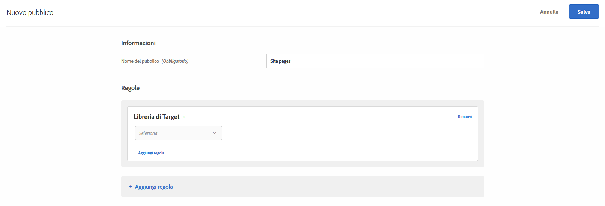

# Libreria di Target{#target-library}

Puoi indirizzare l’attività agli utenti in base a regole di targeting predefinite.

I tipi di pubblico predefiniti nella categoria Libreria di Target sono tipi di pubblico legacy e sono presenti in altre categorie. Per ulteriori informazioni e best practice, consulta [Domande frequenti su targeting e pubblico](/help/c-target/c-troubleshooting-targets-and-audiences/troubleshooting-targets-and-audiences.md#concept_C4EE4B8F4840430CBD798D579A8F208D).

1. Nell’interfaccia di [!DNL Target] fai clic su **[!UICONTROL Pubblico]** > **[!UICONTROL Crea pubblico]**.
1. Dai un nome al pubblico.
1. Fai clic su **[!UICONTROL Aggiungi regola]** > **[!UICONTROL Libreria di Target]**.

   

1. Fai clic su **[!UICONTROL Seleziona]**, quindi seleziona una regola di targeting predefinita.

   Alcune regole di targeting predefinite sono Sistema operativo Windows, Dispositivo tablet, Browser Safari, Visitatori di ritorno e Provenienti da Google.

   Il pubblico predefinito “Dispositivo tablet” è già idoneo quando l’agente utente contiene una delle seguenti stringhe (alcune delle quali sono numeri di modello di dispositivi). Non devi creare regole personalizzate di targeting per questi dispositivi.

   Kindle, Silk, iPad, Sony Tablet, TF101, GT-P1000, GT-P1000R, GT-P1000M, SGH-T849, SHW-M180S, GT-I9000T, BNTV250 e Tablet PC.

1. (Facoltativo) Fai clic su **[!UICONTROL Aggiungi regola]** per impostare regole aggiuntive per il pubblico.
1. Fai clic su **[!UICONTROL Salva]**.

## Video di formazione: Creazione di tipi di pubblico

Questo video contiene informazioni sull&#39;utilizzo delle categorie di pubblico.

* Creazione di un pubblico
* Definizione delle categorie di pubblico

>[!VIDEO](https://video.tv.adobe.com/v/17392)
