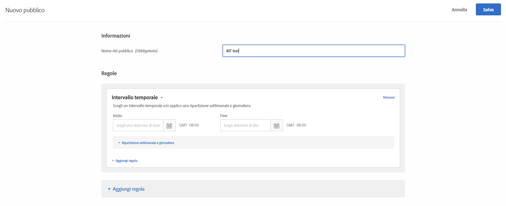
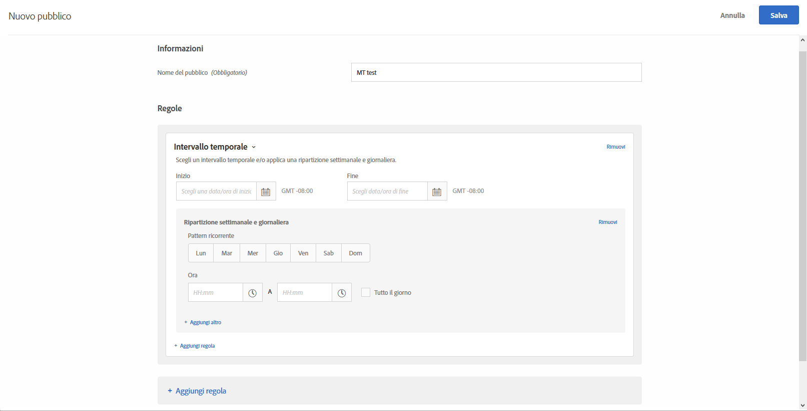

# Intervallo temporale{#time-frame}

Puoi aggiungere date e orari di inizio/fine per rivolgerti agli utenti che visitano il tuo sito durante un intervallo temporale specifico. Puoi anche impostare le opzioni Ripartizione settimanale e giornaliera per creare pattern ricorrenti per il targeting del pubblico.

Per esempio, utilizzando [la funzione tipi di pubblico combinati ad hoc](/help/c-target/combining-multiple-audiences.md#concept_A7386F1EA4394BD2AB72399C225981E5), è possibile indirizzare gli utenti che spendono meno su contenuti specifici nei tre giorni prima del Black Friday e su altri contenuti dopo il Black Friday.

1. Nell’interfaccia di [!DNL Target] fai clic su **[!UICONTROL Pubblico]** > **[!UICONTROL Crea pubblico]**.
1. Dai un nome al pubblico.
1. Fai clic su **[!UICONTROL Aggiungi regola]** > **[!UICONTROL Intervallo temporale]**.

   

1. Specifica le date e le ore di inizio e di fine per il pubblico.

   Lascia la data di inizio vuota per avviare il targeting in base alla pianificazione dellʼattività. Lascia la data di fine vuota per continuare il targeting fino alla data e allʼora di fine dellʼattività.

   Puoi anche lasciare vuote entrambe le date di inizio o di fine. In questo modo puoi utilizzare lo stesso pubblico in più attività (senza creare una copia del pubblico) controllando le date di inizio e di fine a livello di attività.

   >[!NOTE]
   >
   >Il fuso orario per le date di inizio/fine viene visualizzato come GMT +/- NN:NN, dove NN:NN è lo scostamento da GMT e corrisponde al fuso orario dell’account, non a quello del visitatore. Ad esempio, il fuso orario della California verrebbe visualizzato come GMT -08:00.

1. (Condizionale) Fai clic su **[!UICONTROL Ripartizione settimanale e giornaliera]** per impostare pattern ricorrenti, inclusi giorni della settimana e ore.

   

   Puoi utilizzare le opzioni Ripartizione settimanale e giornaliera, ad esempio, per mostrare ai visitatori lʼopzione “Avvia chat” solo durante i giorni e gli orari in cui è attivo il call center.

   Seleziona uno o più giorni della settimana, quindi imposta gli orari di inizio e fine. Se necessario, fai clic su **[!UICONTROL Aggiungi altro]** per specificare altri pattern.

   >[!NOTE]
   >
   >Il fuso orario per [!UICONTROL Ripartizione settimanale e giornaliera] viene visualizzato come GMT +/- NN:NN, dove NN:NN è lo scostamento da GMT e corrisponde al fuso orario dellʼaccount, non a quello del visitatore. Ad esempio, il fuso orario della California verrebbe visualizzato come GMT -08:00.

1. (Facoltativo) Fai clic su **[!UICONTROL Aggiungi regola]** per impostare regole aggiuntive per il pubblico.

   Se vuoi, puoi ripetere il passaggio 5 per ogni regola.

1. Fai clic su **[!UICONTROL Salva]**.

## Video di formazione: Creazione del contrassegno Panoramica 

Questo video contiene informazioni sull&#39;utilizzo delle categorie di pubblico.

* Creazione di un pubblico
* Definizione delle categorie di pubblico

>[!VIDEO](https://video.tv.adobe.com/v/17392)
