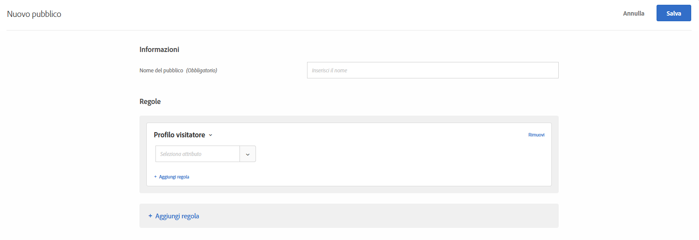

# Profilo visitatore

Crea tipi di pubblico per rivolgerti ai visitatori che soddisfano parametri di profilo specifici.

1. Nell’interfaccia di [!DNL Target] fai clic su **[!UICONTROL Pubblico]** > **[!UICONTROL Crea pubblico]**.
1. Dai un nome al pubblico.
1. Fai clic su **[!UICONTROL Aggiungi regola]** > **[!UICONTROL Profilo visitatore]**.

   

1. Fai clic su **[!UICONTROL Seleziona]**, quindi scegli una delle seguenti opzioni:

   I parametri del profilo del visitatore vengono trasmessi tramite mbox (profilo). Puoi eseguire il targeting dei visitatori nuovi o di ritorno, o includere tutti gli utenti.

   * Nuovo visitatore
   * Visitatore di ritorno
   * In altri test
   * Non in altri test
   * Prima pagina della sessione
   * Non la prima pagina della sessione
   * Affinità tra categorie

   Un profilo visitatore viene creato nella memoria Edge locale per ogni chiamata mbox con nuovo `mboxPC`. Dopo 30 minuti di inattività, il profilo viene salvato nel database di Target ed è accessibile da altri Edge.

   Quando un visitatore del sito accede a metà sessione e ottiene un `3rdpartyId`, tutti gli attributi di profilo precedentemente caricati associati a tale `3rdPartyId` sono immediatamente disponibili.

   Puoi eseguire il targeting di parametri di profilo personalizzati e parametri `user.`. Scegli il parametro che desideri utilizzare per eseguire il targeting dell’attività. Se il parametro desiderato non viene visualizzato, significa che non è stato attivato da una mbox.

1. (Facoltativo) Fai clic su **[!UICONTROL Aggiungi regola]** per impostare regole aggiuntive per il pubblico.
1. Fai clic su **[!UICONTROL Salva]**.

## Video di formazione: Creazione di tipi di pubblico 

Questo video contiene informazioni sull&#39;utilizzo delle categorie di pubblico.

* Creazione di un pubblico
* Definizione delle categorie di pubblico

>[!VIDEO](https://video.tv.adobe.com/v/17392)
