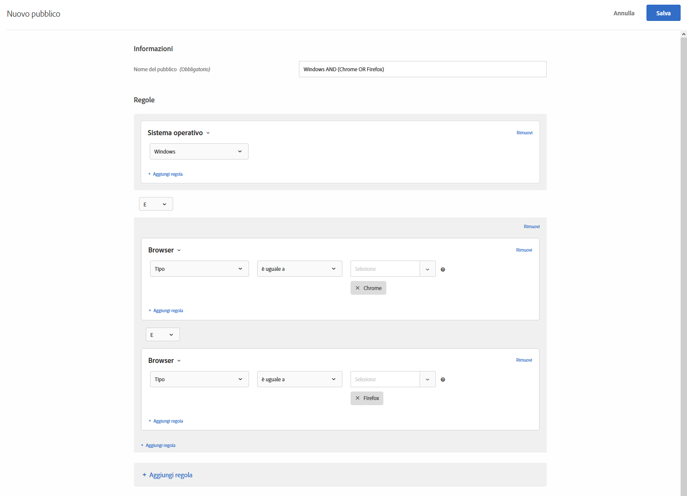
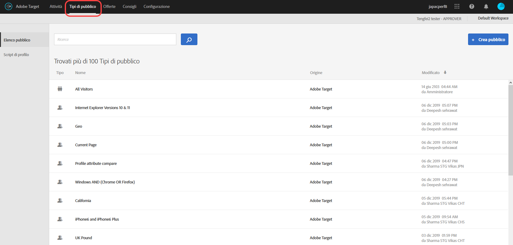

# Creare tipi di pubblico in Target{#build-audiences-in-target}

Puoi creare tipi di pubblico personalizzati e salvarli nella libreria di Target per utilizzarli nelle attività. Puoi copiare un pubblico esistente, modificarlo per crearne uno simile e combinare più tipi di pubblico.

## Panoramica sul pubblico

I tipi di pubblico sono definiti da regole che determinano chi è incluso o escluso da un&#39;attività di [!DNL Target]. Una definizione di pubblico può includere più regole e ogni regola può includere più parametri. Le definizioni di pubblico complesse utilizzano gli operatori booleani AND e OR (E/O) per combinare regole e parametri per poter controllare in modo dettagliato quali visitatori del sito vengono conteggiati come partecipanti all&#39;attività.

Quando si combinano regole o parametri con AND (E), qualsiasi membro potenziale del pubblico deve soddisfare *tutte* le condizioni definite per essere incluso come partecipante. Ad esempio, se si definisce una regola del sistema operativo e una regola del browser, solo i visitatori che utilizzano il sistema operativo definito *e* il browser definito sono inclusi nell&#39;attività.

Quando si combinano regole o parametri con OR, qualsiasi membro potenziale del pubblico deve soddisfare solo una singola condizione definita per essere incluso come partecipante. Ad esempio, se si definiscono più regole mobili connesse da OR, i visitatori che soddisfano *uno* dei criteri definiti sono inclusi nell&#39;attività.

È possibile combinare entrambi gli operatori booleani per creare regole complesse. Tuttavia, gli operatori allo stesso livello di regola devono corrispondere. L&#39;interfaccia utente applica automaticamente l&#39;operatore corretto.

Ad esempio, la regola seguente è destinata ai visitatori che utilizzano Chrome *oppure* Firefox su un computer Windows:

>[!NOTE]
>
>Fai attenzione a evitare la creazione di regole che escludano tutti i potenziali membri del pubblico. Ad esempio, non è possibile che qualcuno visiti una pagina utilizzando contemporaneamente i browser Chrome *e* Firefox.

## Creare un nuovo pubblico

1. Fai clic su **[!UICONTROL Tipi di pubblico]** nella barra superiore del menu.

   

1. Nellʼelenco [!UICONTROL Tipi di pubblico], fai clic su **[!UICONTROL + Crea pubblico]**.

   Oppure

   Per copiare un pubblico esistente, porta il cursore del mouse sul pubblico desiderato nellʼelenco [!UICONTROL Tipi di pubblico], quindi fai clic sullʼicona **[!UICONTROL Copia]**. Ora puoi modificare il pubblico per crearne uno simile.

1. Inserisci un nome descrittivo e univoco per il pubblico.
1. Fai clic su **[!UICONTROL + Aggiungi regola]**.

   Le regole consentono di limitare il pubblico a un sottoinsieme di visitatori del sito.
1. Seleziona un tipo di regola.

   Ogni tipo di regola ha i propri parametri. Consulta [Categorie di pubblico](/help/c-target/c-audiences/c-target-rules/target-rules.md#concept_E3A77E42F1644503A829B5107B20880D) per ulteriori informazioni su come configurare ogni tipo di regola per la definizione del pubblico.
1. Definisci i parametri della regola.
1. Fai clic su **[!UICONTROL Salva]**.

   Il pubblico appena creato viene visualizzato nell&#39;elenco dopo alcuni secondi di ritardo dovuti all&#39;elaborazione. Se il pubblico non viene visualizzato immediatamente nell&#39;elenco, prova a cercarlo o ad aggiornare l&#39;elenco.

## Video di formazione: Creazione di tipi di pubblico  

Questo video include informazioni su come creare i tipi di pubblico.

* Creazione di un pubblico
* Definizione delle categorie di pubblico

>[!VIDEO](https://video.tv.adobe.com/v/17392)