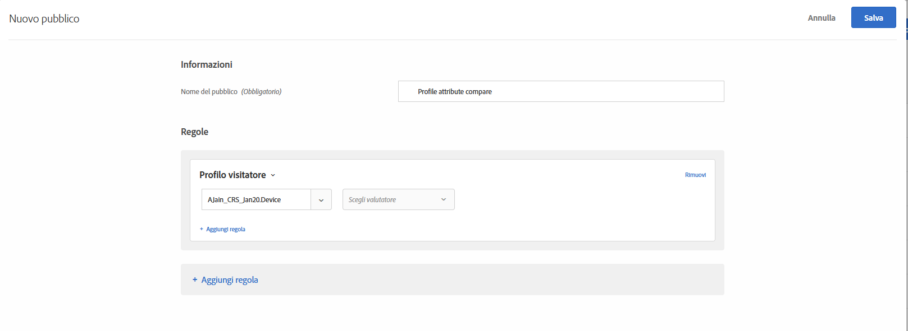
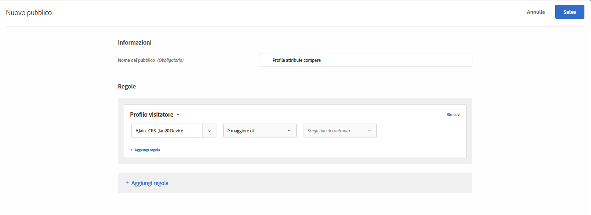
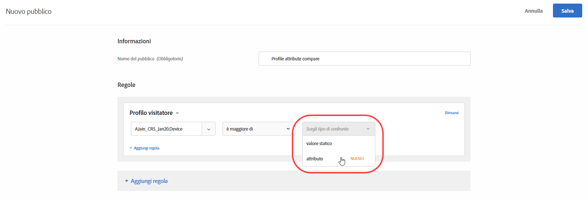
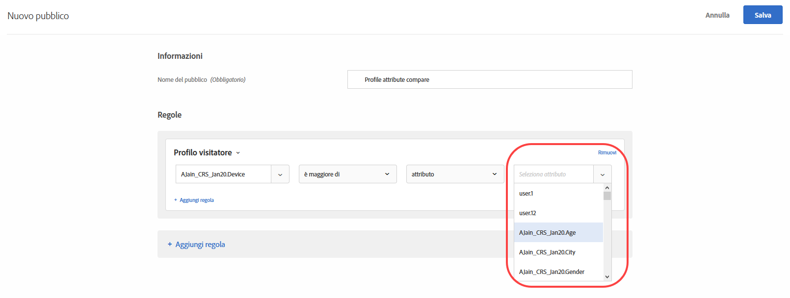

# Creare un pubblico per il confronto degli attributi di profilo{#create-a-profile-attribute-comparison-audience}

Define an audience to compare two profile attributes for your [Audience library](/help/c-target/c-audiences/audiences.md) or in an [activity-only audience](/help/c-target/creating-activity-only-audience.md). L&#39;uso degli operatori, quali maggiore di, minore o uguale a, definisce un pubblico per confrontare in modo dinamico i valori di due attributi di profilo diversi.

>[!NOTE]
>
>Questa funzionalità è disponibile solo per la categoria [Profilo visitatore](../../c-target/c-audiences/c-target-rules/visitor-profile.md#concept_E972690B9A4C4372A34229FA37EDA38E).

## Panoramica {#section_303CBC78194D49A2A004945D425441E1}

I tipi di pubblico sono definiti da regole che determinano chi è incluso o escluso da un&#39;attività di Target. Una definizione di pubblico può includere più regole e ogni regola può includere più parametri. Se una delle regole incluse utilizza la categoria profilo visitatore, puoi definire una regola basata sul valore specifico di un attributo profilo visitatore o confrontare il valore di tale attributo con un altro attributo del profilo visitatore.

Ad esempio, immagina di lavorare per una società di arredamento e di caricare due punteggi propensione cliente su Target:

* Probabilità di acquisto di mobili per la sala da pranzo nei prossimi 90 giorni
* Probabilità di acquisto di mobili per il soggiorno nei prossimi 90 giorni

Puoi creare un pubblico la cui propensione ad acquistare mobili per la sala da pranzo è maggiore della propensione ad acquistarne per il soggiorno. Target consente quindi di confrontare in modo dinamico il punteggio della propensione per la sala da pranzo e il soggiorno per un visitatore specifico per determinare se tale visitatore è destinato a questo pubblico.

Per ulteriori informazioni, consulta [Metodi per immettere i dati in Target](../../c-implementing-target/c-considerations-before-you-implement-target/c-methods-to-get-data-into-target/methods-to-get-data-into-target.md#concept_0069C0EFB56C4700BB33F2F35C2B9B17).

## Creare un pubblico per il confronto degli attributi di profilo {#section_7A62FD47D5C74C3EBC3417ACDBB85013}

1. Fai clic su **[!UICONTROL Pubblico]** &gt; **[!UICONTROL Crea pubblico]** &gt; **[!UICONTROL Aggiungi regola]** &gt; **[!UICONTROL Profilo visitatore]**.
1. Nell&#39;elenco a discesa **[!UICONTROL Profilo visitatore], seleziona un attributo:**

   

1. Scegli il tuo valutatore:

   

1. Dall&#39;elenco a discesa **[!UICONTROL Scegli il tipo di confronto]**, scegli **[!UICONTROL Attributo]**.

   Il tipo di confronto “valore statico” consente di confrontare l&#39;attributo del profilo del visitatore in base a valori specifici.

   

   >[!NOTE]
   >
   >Se utilizzi una delle categorie di profili visitatore predefiniti al passaggio 1 (ad esempio, Nuovo visitatore o Visitatore di ritorno), puoi scegliere solo l’opzione valore statico. Le opzioni di confronto dinamiche non sono disponibili per le categorie predefinite. Gli altri esempi in cui le opzioni di confronto dinamiche non sono disponibili includono “Prima pagina di sessione”, “Non in altri test”, “Diverso dalla prima pagina di sessione” e “Affinità categoria”.

1. Scegli l&#39;attributo da confrontare con l&#39;attributo iniziale.

   

## Video di formazione {#section_3BB8DBF3418F4520B3E274B6F40AF8F3}

Per ulteriori informazioni e uno scenario in cui potresti utilizzare questa funzione, guarda il seguente video:

>[!VIDEO](https://video.tv.adobe.com/v/23218/?captions=ita)