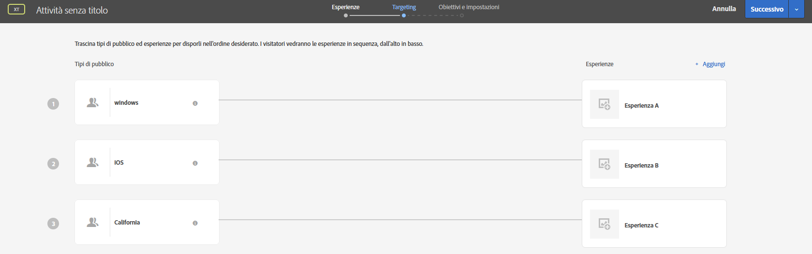

# Domande frequenti su destinazioni e pubblico

Elenco delle domande frequenti (FAQ) sul targeting delle esperienze e sui tipi di pubblico.

## In che modo [!DNL Target] valuta gli URL nel targeting? {#url}

Target valuta gli URL in modo diverso a seconda che tu utilizzi il targeting degli URL del pubblico durante la creazione di un&#39;attività o se utilizzi il targeting URL durante la creazione di un pubblico.

Considera il seguente URL:

`http://www.example.com/path1/path2/path3?queryStringParam1=test123&queryStringParam2=test7`

### Targeting dell’URL del pubblico

Per applicare il targeting dell&#39;URL del pubblico, durante la creazione di un&#39;attività, nella pagina Esperienze (passaggio uno del flusso di lavoro guidato in tre passaggi) fai clic sull&#39;icona a forma di ingranaggio, fai clic su Consegna pagine e specifica l&#39;URL desiderato.

Il targeting dell&#39;URL del pubblico cerca una corrispondenza esatta dell&#39;URL. Se l’URL corrisponde, Target non considera ulteriori logiche. Nell’URL di cui sopra, se l’attività è impostata per essere attivata su `www.example.com`, l’URL corrisponde ai seguenti URL perché il targeting dell’URL del pubblico è indipendente dalla query:

* `www.example.com?query=something`
* `www.example.com?query=anything`
* `www.example.com?query=nothing&qa=true&stuff=random&product=shoes&height=superTall`

Oltre al targeting del pubblico sull’URL, puoi anche specificare valori specifici che possono essere presenti nella query.

### Targeting URL

Per applicare il targeting URL, durante la creazione di un pubblico, fai clic su Aggiungi regola, fai clic su Pagine del sito, seleziona un’opzione dal primo elenco a discesa (Pagina corrente, Pagina precedente o Pagina di destinazione), seleziona URL dal secondo elenco a discesa, specifica un valutatore, quindi specifica l’URL desiderato.

Il targeting URL trasforma l’URL in un set di regole per valutare:

* Dominio URL = `example.com`
* Percorso = percorso1/percorso2/percorso3
* queryStringParam1 = test123
* queryStringParam2 = test7

## Quando crei stringhe URL complesse, [!DNL Target] valuta l’intero URL?

Se utilizzi lo stesso nome di parametro più di una volta in una stringa URL, HTTP considera il nome del primo parametro e ignora i parametri successivi con lo stesso nome.

Ad esempio, nella stringa URL seguente:

`https://www.adobe.com/SearchResults.aspx?sc=BM&fi=1&fr=1&ps=0&av=0&Category=C0010438&Category=C000047`

viene valutata la prima istanza del parametro `Category` e la seconda `Category` viene ignorata.

Si consiglia di associare più valori a una singola categoria, come illustrato di seguito:

`https://www.adobe.com/SearchResults.aspx?sc=BM&fi=1&fr=1&ps=0&av=0&Category=C0010438,C000047`

## Quando creo un pubblico, perché i tipi di pubblico predefiniti nella [!DNL Target]libreria di   si trovano in altre categorie? {#section_9EBF5B0F9DF94168A15B92B905CCF7E0}

I tipi di pubblico predefiniti nella categoria Libreria di Target sono tipi di pubblico legacy e sono presenti in altre categorie. Ad esempio, per il pubblico legacy Libreria di Target > Nuovi visitatori, è presente una controparte aggiornata: Profilo visitatore > Nuovo visitatore.

Come best practice, utilizza i tipi di pubblico più recenti, perché offrono prestazioni migliori. Poiché alcuni clienti potrebbero utilizzare tipi di pubblico predefiniti legacy, questi non sono stati rimossi dall’interfaccia di Target.

## Come faccio a sapere come verrà suddiviso il traffico tra i tipi di pubblico? {#section_067EEFB956E7465CBF77EC86834470AB}

Per impostazione predefinita, il traffico viene suddiviso in modo uniforme tra le varie esperienze. Tuttavia puoi specificare target basati su percentuali per ogni esperienza. In questo caso, viene generato un numero casuale, utilizzato per scegliere l’esperienza da visualizzare. Le percentuali risultanti potrebbero non corrispondere esattamente ai target specificati. Con l’aumentare del traffico, le esperienze risulteranno tuttavia suddivise in modo più rispondente agli obiettivi.

## Quale esperienza viene visualizzata se un utente è idoneo per unʼattività che contiene più esperienze con più di un pubblico ideoneo?  {#section_94A60B11212D48FD8AB0803C6C7E7253}

Lʼutente diventa idoneo per la prima esperienza/il primo pubblico che viene visualizzato nella pagina [!UICONTROL Destinazioni] dellʼattività.

Ad esempio, nellʼillustrazione seguente, un utente in California che utilizza un dispositivo Windows è idoneo sia per l’esperienza A (pubblico Windows) che per l’esperienza C (pubblico californiano). A questo utente verrà presentata lʼesperienza A perché è presente nellʼelenco sopra lʼesperienza C nella pagina Destinazioni.

## Perché esistono nomi diversi per uno stesso pubblico in [!DNL Target], Adobe Audience Manager (AAM) e nella libreria Pubblico nei servizi di base? {#section_F67E61A607B6444C8DAA4F99C3E95AED}

I nomi del pubblico in [!DNL Target] sono univoci. Tuttavia, in [!DNL AAM] e [!DNL Audience Library], è possibile usare lo stesso nome per più tipi di pubblico (se si trovano in cartelle diverse). Quando [!DNL Target] rileva un nome di pubblico che corrisponde a un pubblico [!DNL AAM] o [!DNL Audience Library], [!DNL Target] aggiunge “#&lt;numero>” al nome.

Ad esempio, potresti vedere i seguenti tipi di pubblico: “Utenti PC” (in [!DNL AAM]) e “Utenti PC #1” (in [!DNL Target]).

## Perché non posso rinominare un pubblico? {#section_54E420556F534D20836E261E253D8B97}

Alcuni tipi di pubblico di Target sono predefiniti, ad esempio “Nuovi visitatori” e “Visitatori di ritorno”. Questi non possono essere rinominati dagli utenti.

## Perché tutti i parametri di profilo non vengono visualizzati nell&#39;interfaccia utente [!DNL Target]? {#section_3CD947D15C984EE9AD19550220E0E8BD}

[!DNL Target] ha un limite di 50 attributi di profilo univoci per chiamata mbox. Se devi passare più di 50 attributi di profilo a [!DNL Target], puoi farlo utilizzando il metodo API [!UICONTROL Aggiornamento profilo]. Per ulteriori informazioni, vedi [Aggiornamento profilo](https://developers.adobetarget.com/api/#authentication-tokens) nella documentazione API di Adobe Target.

## Perché i visitatori vedono esperienze per unʼattività di personalizzazione automatizzata che non dovrebbero vedere? {#section_41CECEAE0881446A8D9F3B016857914B}

Le attività di personalizzazione automatizzata vengono valutate una volta per sessione. Se c’erano delle sessioni attive idonee per una particolare esperienza e ora sono state aggiunte nuove offerte, gli utenti vedranno il nuovo contenuto insieme alle offerte precedentemente mostrate. Poiché in precedenza sono stati considerati idonei per quelle esperienze, continueranno a vederle per tutta la durata della sessione. Per eseguire la valutazione per ogni singola visita, usa il tipo di attività Targeting esperienza (XT).

## Perché le modifiche apportate ai tipi di pubblico creati tramite API non vengono riportate nell’interfaccia utente di [!DNL Target]? {#section_6BEB237CAC004A06A290F9644E5BF0FB}

A differenza delle offerte e degli script di profilo, le modifiche apportate da API a tipi di pubblico creati tramite Target Standard non sono attualmente sincronizzate nell&#39;interfaccia utente di Target.

## Le stringhe che rappresentano numeri (compresi i numeri a virgola mobile) sono considerate numeri.{#strings-that-represent-numbers}

Se la parte sinistra e quella destra delle espressioni “uguale a” possono essere analizzate come un numero, le due parti vengono confrontate come numeri, non come stringhe.

Ad esempio:

| Valore | Criteri di targeting | Risultato |
| --- | --- | --- |
| 1,0 | è uguale a 1 | true |
| 1 | equalsIgnoreCase 1,0 | true |
| 1,230 | è uguale a 1 | true |
| 1,500 | è uguale a 1,5 | true |
| 1,200 | è inferiore a 2 | true |
| 2 | è maggiore di 3,0 | false |
| 045 | è uguale a 45 | true |

I numeri scritti con la notazione scientifica vengono sempre confrontati come stringhe.

Ad esempio,

“4e-2” è uguale solo a “4e-2”. *Non* sarà uguale a “0,04”.
