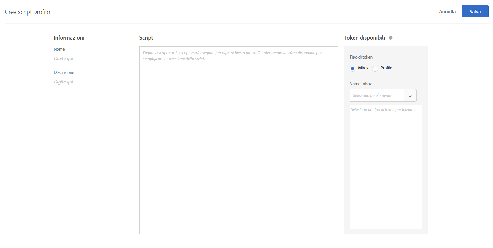
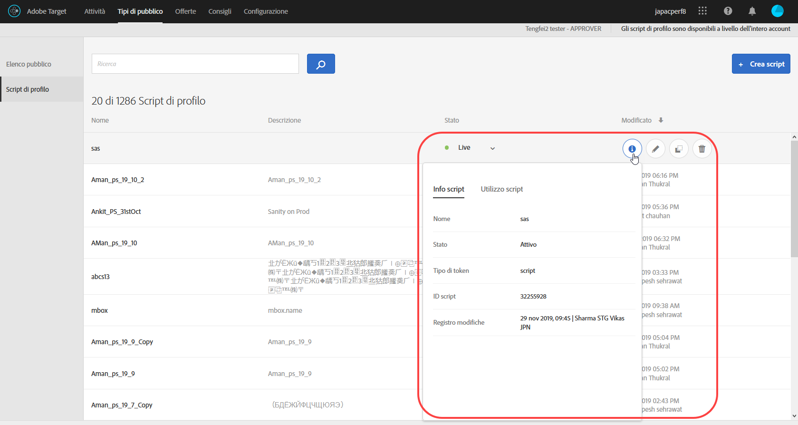
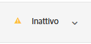

# Attributi del profilo{#profile-attributes}

Gli attributi del profilo sono parametri specifici di un visitatore. Tali attributi vengono memorizzati nel profilo del visitatore in modo da fornire informazioni che puoi usare nelle attività.

Un profilo utente contiene informazioni demografiche e comportamentali relative a un visitatore di una pagina Web, ad esempio età, genere, prodotti acquistati, ultima ora della visita e così via, utilizzati da Target per personalizzare il contenuto che serve al visitatore.

Quando un visitatore visita il sito Web o quando ritorna per un’altra sessione, gli attributi di profilo salvati nel profilo possono essere utilizzati per eseguire il targeting del contenuto o delle informazioni di registro per il filtraggio dei segmenti.

Per impostare gli attributi di profilo:

1. Fate clic su **[!UICONTROL Audiences]** (Audience) > **[!UICONTROL Profile Scripts (Script di profilo).]**

   

1. Fare clic su **[!UICONTROL Crea script]**.

   

   Sono disponibili i seguenti tipi di attributi di profilo:

   | Tipo di parametro | Descrizione |
   |--- |--- |
   | mbox | Passaggio diretto attraverso il codice della pagina quando viene creata la mbox. Consulta [Trasmettere parametri a una mbox globale](/help/c-implementing-target/c-implementing-target-for-client-side-web/t-mbox-download/c-understanding-global-mbox/pass-parameters-to-global-mbox.md).<br>**Nota **: Target ha un limite di 50 attributi univoci di profilo per chiamata mbox. Se devi passare più di 50 attributi di profilo a Target, puoi farlo utilizzando il metodo API Aggiornamento profilo. Per ulteriori informazioni, vedi[Aggiornamento profilo nella documentazione API di Adobe Target](http://developers.adobetarget.com/api/#updating-profiles). |
   | Profilo | Definito direttamente con uno snippet di codice JavaScript. Possono memorizzare i totali correnti come il denaro totale speso dal consumatore ed è eseguito dietro ogni richiesta mbox. Consulta Attributi degli script di profilo qui di seguito. |

## Attributi degli script di profilo {#concept_8C07AEAB0A144FECA8B4FEB091AED4D2}

Definizione di un attributo di script del profilo con il relativo frammento di codice JavaScript associato.

Puoi utilizzare gli script di profilo per acquisire gli attributi di un visitatore attraverso più visite. Gli script di profilo sono frammenti di codice definiti in Target mediante una forma di JavaScript lato server. Ad esempio, puoi utilizzare uno script di profilo per acquisire la frequenza con cui un visitatore visita il sito e quando è stata effettuata l’ultima visita.

Gli script di profilo sono diversi dai parametri di profilo. I parametri di profilo acquisiscono informazioni sui visitatori utilizzando l’implementazione del codice mbox di Target.

## Creare gli script di profilo {#section_CB02F8B97CAF407DA84F7591A7504810}

Gli script di profilo sono disponibili nella scheda [!UICONTROL Tipi di pubblico] dell’interfaccia di [!DNL Target].

Per aggiungere un nuovo script di profilo, fai clic sulla scheda **[!UICONTROL Script di profilo]**, **[!UICONTROL Crea script]**, quindi scrivi lo script.

Oppure

To copy an existing profile script, from the [!UICONTROL Profile Scripts] list, hover over the desired script, then click the **[!UICONTROL Copy]** icon: 

Ora puoi modificare il pubblico per crearne uno simile.



Gli script di profilo eseguono dei “catcher” per acquisire attributi di profilo per ogni richiesta di posizione. Quando viene ricevuta una richiesta di posizione, Target determina quale attività deve essere eseguita e visualizza il contenuto appropriato per l’attività e l’esperienza, tiene traccia del successo dell’attività ed esegue eventuali script di profilo rilevanti. Questo consente di monitorare le informazioni sulla visita, come la posizione del visitatore, l&#39;ora del giorno, il numero di volte in cui il visitatore è stato sul sito, se ha effettuato acquisti in passato e così via. Queste informazioni vengono poi aggiunte al profilo del visitatore, in modo da poter monitorare meglio la sua attività sul sito.

Gli attributi degli script di profilo hanno il tag `user.` inserito prima del nome dell’attributo. Ad esempio:

```
if (mbox.name == 'Track_Interest') { 
    if (profile.get('model') == "A5" &&; profile.get('subcat') == "KS6") { 
        return (user.get('A5KS6') || 0) + 1; 
    } 
}
```

Tenete presenti le seguenti informazioni:

* Fai riferimento agli attributi dello script di profilo (incluso se stesso) nel codice con `user.get('parameterName')`
* Salva le variabili che possono essere accessibili alla successiva esecuzione dello script (alla successiva richiesta mbox) con `user.setLocal('variable_name', 'value')`. Fai riferimento alla variabile con `user.getLocal('variable_name')`. Questo è utile nelle situazioni in cui vuoi fare riferimento alla data e all’ora dell’ultima richiesta.
* I parametri e i valori sono sensibili all’uso di maiuscole e minuscole. Usa le stesse maiuscole e minuscole dei parametri e dei valori che verranno ricevuti durante l’attività o il test.
* Per ulteriore sintassi JavaScript, vedi la sezione “Riferimento JavaScript per i parametri del profilo di script”, più avanti.
* Il parametro rimane nel profilo dopo la disattivazione dello script. Gli utenti i cui profili già contengono un parametro utilizzato nell&#39;audience di un&#39;attività saranno qualificati in tale attività.
* Gli script di profilo non possono essere eliminati mentre vengono utilizzati in un&#39;attività.
* Non è consigliabile creare script di profilo dipendenti che utilizzano il risultato di uno script di profilo in un altro script di profilo. L&#39;ordine di esecuzione dello script di profilo non è garantito.

## Visualizzazione delle schede di informazioni sugli script di profilo {#section_18EA3B919A8E49BBB09AA9215E1E3F17}

Puoi visualizzare schede a comparsa di script di profilo simili come schede informative. Queste schede informative sullo script di profilo ti permettono di visualizzare l’elenco delle attività che si riferiscono allo script di profilo selezionato, insieme ad altri metadati utili.

Ad esempio, se si passa il cursore su uno script di profilo nell&#39;Elenco script di profilo (Destinatari > Script di profilo) e poi si fa clic sull&#39;icona Informazioni, si accede alla seguente scheda di informazioni sullo script di profilo.

La scheda [!UICONTROL Informazioni script] contiene le seguenti informazioni: Nome, Stato, Tipo token, ID script, Sostituisci registro e Descrizione.



La scheda [!UICONTROL Utilizzo script] elenca le attività (e aree di lavoro) relative allo script di profilo selezionato.


>[!NOTE]
>
>La scheda Utilizzo script non visualizza le attività che fanno riferimento allo script di profilo selezionato nelle situazioni seguenti:
>
> * L&#39;attività è nello stato Bozza.
> * Il contenuto o l&#39;offerta utilizzato/a nell&#39;attività impiega variabili di script (o un&#39;offerta in linea all&#39;interno dell&#39;attività o un&#39;offerta nel catalogo Offerte).


## Target disabilita gli script di profilo in determinate situazioni {#section_C0FCB702E60D4576AD1174D39FBBE1A7}

[!DNL Target] disattiva automaticamente gli script di profilo in alcune situazioni, ad esempio se l&#39;esecuzione degli script richiede troppo tempo o se contengono troppe istruzioni.

Quando uno script di profilo è disabilitato, viene contrassegnato da un’icona gialla di avviso nell’interfaccia utente di Target, come illustrato di seguito:



Al passaggio del mouse puoi visualizzare dettagli sugli errori, come illustrato di seguito:


Il sistema disabilita gli script di profilo in alcune circostanze. I motivi più frequenti sono:

* Riferimento a una variabile non definita.
* Riferimento a un valore non valido. Questo fatto è spesso causato dal riferimento a valori URL e ad altri dati immessi dall’utente senza una corretta convalida.
* Troppe istruzioni JavaScript. Target ha un limite di 2.000 istruzioni JavaScript per ogni script, ma è difficile calcolarle con la semplice lettura manuale del codice JavaScript. Ad esempio, Rhino tratta tutte le chiamate di funzione e le chiamate “nuove” come 100 istruzioni. Ciò significa che qualsiasi chiamata a una funzione richiede 100 istruzioni. Inoltre, la dimensione dei dati immessi, ad esempio i valori URL, può influire sul conteggio delle istruzioni.
* Mancato rispetto delle istruzioni evidenziate nella sezione [Best practice](../../c-target/c-visitor-profile/profile-parameters.md#section_64AFE5D2B0C8408A912FC2A832B3AAE0) qui sotto.

## Best practice {#best}

Le seguenti linee guida hanno lo scopo di facilitare la scrittura di script di profilo semplificati, il più possibile privi di errori, mediante la scrittura di codice che genera un errore controllato in modo da consentire l’elaborazione degli script senza determinare un blocco di sistema. Queste linee guida sono il risultato di best practice collaudate in termini di efficienza. Applica queste linee guida unitamente ai principi e alle raccomandazioni stilati dalla community di sviluppo Rhino.

* Impostate il valore dello script corrente su una variabile locale nello script utente, impostate un failover su una stringa vuota.
* Convalida la variabile locale verificando che non si tratti di una stringa vuota.
* Utilizzate funzioni di manipolazione basate su stringhe piuttosto che espressioni regolari.
* Utilizza cicli limitati “for” invece di cicli aperti “for” o “while”.
* Non superare 1.300 caratteri o 50 iterazioni di ciclo.
* Non superare 2.000 istruzioni JavaScript. Target ha un limite di 2.000 istruzioni JavaScript per ogni script, ma è difficile calcolarle con la semplice lettura manuale del codice JavaScript. Ad esempio, Rhino tratta tutte le chiamate di funzione e le chiamate “nuove” come 100 istruzioni. Inoltre, la dimensione dei dati immessi, ad esempio i valori URL, può influire sul conteggio delle istruzioni.
* Presta attenzione non solo alle prestazioni dello script, ma anche alle prestazioni combinate di tutti gli script. Come procedura ottimale, si consigliano meno di 5.000 istruzioni in totale. Il conteggio del numero di istruzioni non è ovvio, ma la cosa importante da notare è che gli script superiori a 2.000 istruzioni vengono automaticamente disattivati. Il numero di script di profilo attivi non deve superare i 300. Ogni script viene eseguito con ogni singola chiamata mbox. Esegui solo il numero di script necessario.
* In un’espressione regex, non è quasi mai necessario iniziare con punto-asterisco (ad esempio: `/.*match/`, `/a|.*b/`). La ricerca regex inizia da tutte le posizioni in una stringa (a meno che non sia delimitata con `^`), e punto-asterisco è quindi implicito. L’esecuzione dello script può essere interrotta se a un’espressione regex corrispondono dati di input sufficientemente lunghi (anche solo di qualche centinaia di caratteri).
* In caso di esito negativo, inserisci lo script in un try/catch.
* Le raccomandazioni seguenti possono essere utili per limitare la complessità degli script di profilo. Gli script di profilo possono eseguire un numero limitato di istruzioni.

   Come best practice:

   * Mantenere gli script di profilo il più possibile piccoli e semplici.
   * Evitate espressioni regolari o utilizzate solo espressioni regolari molto semplici. Anche le espressioni semplici possono richiedere molte istruzioni da valutare.
   * Evitare la ricorsione.
   * Gli script di profilo devono essere sottoposti a test delle prestazioni prima di essere aggiunti a Target. Tutti gli script di profilo vengono eseguiti su ogni richiesta mbox. Se gli script di profilo non vengono eseguiti correttamente, l&#39;esecuzione delle richieste mbox richiederà più tempo. Ciò potrebbe influire sul traffico e sulla conversione.
   * Se gli script di profilo diventano troppo complessi, è consigliabile utilizzare i token [di](/help/administrating-target/response-tokens.md) risposta.

* See the JS Rhino engine documentation for more information: [https://www.mozilla.org/rhino/doc.html](https://www.mozilla.org/rhino/doc.html).

## Debug degli script di profilo {#section_E9F933DE47EC4B4E9AF2463B181CE2DA}

Per eseguire il debug degli script di profilo possono essere utilizzati i seguenti metodi:

>[!NOTE]
>
>L’uso di [!DNL console.log] all’interno di uno script di profilo non genera il valore del profilo, perché gli script di profilo vengono eseguiti dal lato server.

* **Aggiungi script di profilo come token di risposta per eseguire il debug degli script di profilo:**

   In Target, click **[!UICONTROL Administration]**, click **[!UICONTROL Response Tokens]**, then enable the profile script you want to debug.

   Ogni volta che carichi una pagina del sito con Target, una parte della risposta di Target conterrà il valore dello script di profilo specificato, come illustrato di seguito:

   

* **Utilizza lo strumento di debug mboxTrace per eseguire il debug degli script di profilo.**

   This method requires an authorization token that you can generate by clicking **[!UICONTROL Target]** > **[!UICONTROL Administration]** > **[!UICONTROL Implementation]** > **[!UICONTROL Generate Authorization Token]** in the [!UICONTROL Debugger tools] section.

   Poi aggiungi questi due parametri all&#39;URL della tua pagina dopo il &quot;?&quot;: `mboxTrace=window&authorization=YOURTOKEN`.

   In questo modo si ha qualche informazione in più rispetto al token di risposta, perché si ottiene un&#39;istantanea del profilo precedente all&#39;esecuzione e una successiva. Vengono inoltre visualizzati tutti i profili disponibili.

   

## Domande frequenti sugli script di profilo {#section_1389497BB6D84FC38958AE43AAA6E712}

**È possibile utilizzare script di profilo per acquisire informazioni da una pagina che si trova in un livello di dati?**

Gli script di profilo non sono in grado di leggere la pagina direttamente poiché vengono eseguiti lato server. I dati devono essere trasmessi mediante una richiesta mbox o altri [metodi per l’immissione di dati in Target](../../c-implementing-target/c-considerations-before-you-implement-target/c-methods-to-get-data-into-target/methods-to-get-data-into-target.md#concept_0069C0EFB56C4700BB33F2F35C2B9B17). Una volta che i dati sono in Target, gli script di profilo possono leggerli come un parametro mbox o un parametro di profilo.

## Riferimento JavaScript per parametri del profilo di script

È necessaria una semplice conoscenza JavaScript per utilizzare efficacemente i parametri dei profili di script. Questa sezione serve come riferimento rapido per consentirti di utilizzare questa funzionalità in pochi minuti.

I parametri del profilo di script si trovano nella scheda mbox/profiles. È possibile scrivere programmi JavaScript che restituiscono qualsiasi tipo di valore JavaScript (stringa, numero intero, array e così via).

### Esempi di parametri di profilo di script {#examples}

**Nome:** *user.recency*

```
var dayInMillis = 3600 * 24 * 1000;
if (mbox.name == 'orderThankyouPage') {
    user.setLocal('lastPurchaseTime', new Date().getTime());
}
var lastPurchaseTime = user.getLocal('lastPurchaseTime');
if (lastPurchaseTime) {
    return ((new Date()).getTime() - lastPurchaseTime) / dayInMillis;
}
```

Crea una variabile per il giorno misurato in millisecondi. Se il nome della mbox è `orderThankyouPage`, imposta un attributo locale (invisibile) del profilo utente denominato `lastPurchaseTime` per ottenere il valore della data e dell’ora corrente. Il valore dell’ultimo orario di acquisto viene letto e, se è definito, si ottiene il tempo trascorso dall’ultimo acquisto, diviso per il numero di millisecondi in un giorno (che si traduce nel numero di giorni dall’ultimo acquisto).

**Nome:** *user.frequency*

```
var frequency = user.get('frequency') || 0;
if (mbox.name == 'orderThankyouPage') {
    return frequency + 1;
}
```

Creates a variable called `frequency`, initializing it to either the previous value or 0, if there was no previous value. Se il nome della mbox è `orderThankyouPage`, viene restituito il valore incrementale.

**Nome:** *user.monetaryValue*

```
var monetaryValue = user.get('monetaryValue') || 0;
if (mbox.name == 'orderThankyouPage') {
    return monetaryValue + parseInt(mbox.param('orderTotal'));
}
```

Crea una variabile chiamata `monetaryValue`, che cerca il valore corrente per un visitatore specificato (o impostata su 0 in assenza di un valore precedente). Se il nome della mbox è `orderThankyouPage`, viene restituito nuovo valore monetario aggiungendo il precedente e il valore del parametro `orderTotal` trasmesso alla mbox.

**Nome:** adobeQA

```
if (page.param("adobeQA"))
     return page.param("adobeQA");
else if (page.param("adobeqa"))
     return page.param("adobeqa");
else if (mbox.param("adobeQA"))
     return mbox.param("adobeQA");
```

Crea una variabile chiamata `adobeQA` per monitorare un utente per il QA [dell&#39;](/help/c-activities/c-activity-qa/activity-qa.md)attività.

### Oggetti e metodi

I parametri del profilo di script possono fare riferimento alle proprietà e ai metodi seguenti:

| Oggetto o metodo | Dettagli |
| --- | --- |
| `page.url` | L’URL corrente. |
| `page.protocol` | Il protocollo utilizzato per la pagina (http o https). |
| `page.domain` | Il dominio dell’URL corrente (tutto ciò che precede la prima barra). Ad esempio, `www.acme.com` in `http://www.acme.com/categories/men_jeans?color=blu e&size=small`. |
| `page.query` | La stringa di query per la pagina corrente. Tutto ciò che segue il segno “?”. Ad esempio, `blue&size=small` in `http://www.acme.com/categories/mens_jeans?color=blue&size=small`. |
| `page.param(‘<par_name>’)` | Il valore del parametro indicato da `<par_name>`. Se l’URL corrente è la pagina di ricerca di Google e hai inserito `page.param('hl')`, riceverai “en” per l’URL `http://www.google.com/search?hl=en& q=what+is+asdf&btnG=Google+Search`. |
| `page.referrer` | Le stesse operazioni di cui sopra valgono per la pagina di provenienza e la destinazione (ad esempio referrer.url sarà l’indirizzo URL della pagina di provenienza). |
| `landing.url`, `landing.protocol`, `landing.query` e `landing.param` | Simile a quella della pagina, ma per la pagina di destinazione. |
| `mbox.name` | Il nome della mbox attiva. |
| `mbox.param(‘<par_name>’)` | Un parametro mbox in base al nome specificato nella mbox attiva. |
| `profile.get(‘<par_name>’)` | Il parametro del profilo utente creato dal client in base al nome `<par_name>`. Ad esempio, se l’utente imposta un parametro di profilo denominato “gender”, il valore può essere estratto utilizzando “profile.gender”. Restituisce il valore del “`profile.<par_name>`” impostato per il visitatore corrente; restituisce null se non è stato impostato alcun valore. Nota che `profile.get(<par_name>)` è qualificata come chiamata di funzione. |
| `user.get(‘<par_name>’)` | Restituisce il valore del “`user.<par_name>`” impostato per il visitatore corrente; restituisce null se non è stato impostato alcun valore. |
| `user.categoryAffinity` | Restituisce il nome della categoria migliore. |
| `user.categoryAffinities` | Restituisce un array con le categorie migliori. |
| `user.isFirstSession` | Restituisce true se è la prima sessione del visitatore. |
| `user.browser` | Restituisce l’agente utente nell’intestazione HTTP. Ad esempio, puoi creare una destinazione dell’espressione rivolta solo agli utenti Safari: `if (user.browser != null && user.browser.indexOf('Safari') != -1) { return true; }` |

### Operatori comuni


Tutti gli operatori JavaScript standard sono presenti e utilizzabili. Gli operatori JavaScript possono essere utilizzati su stringhe e numeri (oltre che su altri tipi di dati). Una rapida descrizione:

| Operatore | Descrizione |
| --- | --- |
| `==` | Indica uguaglianza. È vero se gli operandi da entrambe le parti sono uguali. |
| `!=` | Indica disuguaglianza. È vero se gli operandi da entrambe le parti non sono uguali. |
| `<` | Indica che la variabile a sinistra è inferiore alla variabile a destra. Restituisce false se le variabili sono uguali. |
| `>` | Indica che la variabile a sinistra è maggiore della variabile a destra. Restituisce false se le variabili sono uguali. |
| `<=` | Come `<` a meno che le variabili non siano uguali, nel qual caso la valutazione è true. |
| `>=` | Come `>` a meno che le variabili non siano uguali, nel qual caso la valutazione è true. |
| `&&` | Stabilisce una relazione logica di tipo “AND” tra le espressioni alla sua sinistra e alla sua desta: restituisce true solo quando entrambe le parti sono vere (in caso contrario restituisce false). |
| `||` | Stabilisce una relazione logica di tipo “OR” tra le espressioni alla sua sinistra e alla sua desta: restituisce true solo quando una delle parti è vera (in caso contrario restituisce false). |
| `//` | Controlla se la sorgente contiene tutti gli elementi del formato booleano di destinazione (origine Array, destinazione Array).<br>`//` estrae la sottostringa dalla destinazione (corrispondente a regexp) e la decodifica `Array/*String*/ decode(String encoding, String regexp, String target)`.<br>La funzione supporta anche l’uso di valori stringa costanti, raggruppamenti (`condition1 || condition2) && condition3` ed espressioni regolari (`/[^a-z]$/.test(landing.referring.url)`. |

## Video di formazione: Badge 

Questo video include informazioni sull&#39;utilizzo e sulla creazione degli script di profilo.

* Cos’è uno script di profilo
* Differenza tra script di profilo e parametro di profilo
* Creare uno script di profilo semplice
* Utilizzare il menu Token disponibile per accedere alle opzioni disponibili
* Abilitare e disabilitare gli script di profilo

>[!VIDEO](https://video.tv.adobe.com/v/17394)
