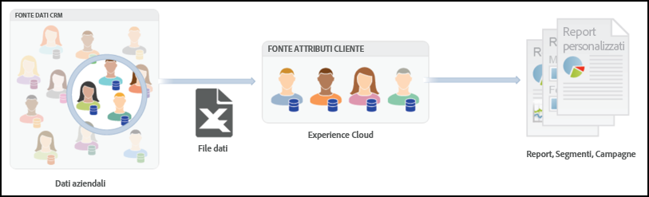

# Attributi del cliente{#customer-attributes}

Informazioni sull’utilizzo dei dati relativi a clienti Enterprise da un database Customer Relationship Management (CRM) per il targeting del contenuto in Adobe Target utilizzando gli attributi del cliente nel servizio principale Adobe Profiles &amp; Audiences.

I dati dei clienti aziendali raccolti attraverso più fonti e memorizzati all&#39;interno di un database CRM possono essere utilizzati in [!DNL Target] per fornire in modo strategico il contenuto più pertinente ai clienti, specificatamente concentrandosi sui clienti fidelizzati. Il servizio di base [!DNL People] (già Profili e pubblico) unisce le funzioni di raccolta e analisi dei dati a quelle di test e ottimizzazione, rendendo immediatamente fruibili i dati e le informazioni.

## Panoramica degli attributi del cliente {#section_B4099971FA4B48598294C56EAE86B45A}

Il servizio Persone fa parte di [!DNL Adobe Experience Cloud] e fornisce alle aziende uno strumento per spingere i dati dei propri clienti sulla piattaforma [!DNL Experience Cloud]. I dati inseriti nell&#39;[!DNL Experience Cloud] sono disponibili per tutti i flussi di lavoro di [!DNL Experience Cloud]. [!DNL Adobe Target] utilizza questi dati per il targeting dei clienti fidelizzati in base agli attributi. [!DNL Adobe Analytics] utilizza questi attributi che possono essere utili per l&#39;analisi e la segmentazione.



Considera le seguenti informazioni mentre lavori con gli attributi del cliente e Target:

* Ci sono alcuni requisiti prerequisiti che è necessario soddisfare prima di poter utilizzare la funzionalità [!UICONTROL Attributi del cliente] nel servizio di base [!DNL People]. Per ulteriori informazioni, vedi “Prerequisites for Uploading Customer Attributes” (Prerequisiti per caricare gli attributi dei clienti) nella sezione [Attributi del cliente](https://marketing.adobe.com/resources/help/en_US/mcloud/attributes.html) nella *documentazione del prodotto Experience Cloud e servizi di base*. Si noti che è necessario [!DNL at.js] (qualsiasi versione) o [!DNL mbox.js] versione 58 o successiva è necessario.
* Adobe non garantisce che il 100% dei dati dell&#39;attributo del cliente (profilo visitatore) provenienti dai database CRM sia integrato nell&#39;Experience Cloud e sia quindi disponibile per l&#39;utilizzo per il targeting in Target. Nel nostro attuale layout, c&#39;è la possibilità che una piccola percentuale di dati non sia integrata.
* La validità dei dati degli attributi del cliente importati da Experience Cloud in Target dipende dalla validità del profilo del visitatore, che è di 14 giorni per impostazione predefinita. Per ulteriori informazioni, consulta  [Durata del profilo del visitatore](../../c-target/c-visitor-profile/visitor-profile-lifetime.md#concept_D9F21B416F1F49159F03036BA2DD54FD).
* Se i parametri `vst.*` sono l’unica cosa che identifica l’utente, il profilo “autenticato” esistente non verrà recuperato fintanto che `authState` è nello stato NON AUTENTICATO (0). Il profilo entra in gioco solo se `authState` viene modificato in NON AUTENTICATO (1).

   Ad esempio, se il parametro `vst.myDataSource.id` viene utilizzato per identificare l&#39;utente (dove `myDataSource` è l&#39;alias dell&#39;origine dati) e non esiste alcun ID MCID o di terze parti, l&#39;utilizzo del parametro `vst.myDataSource.authState=0` non permetterà di recuperare il profilo che potrebbe essere stato creato tramite un&#39;importazione di Attributi dei clienti. Se il comportamento desiderato è quello di recuperare il profilo autenticato, il `vst.myDataSource.authState` deve avere il valore 1 (AUTENTICATO).

* Non potete inviare i seguenti caratteri in `mbox3rdPartyID`: segno più (+) e barra (/).

## Flusso di lavoro dell&#39;attributo cliente per Target {#section_00DAE94DA9BA41398B6FD170BC7D38A3}

Completa i passaggi seguenti per utilizzare i dati CRM in [!DNL Target], come illustrato di seguito:


Le istruzioni dettagliate per il completamento di ciascuna delle seguenti attività sono reperibili in [Create a Customer Attribute Source and Upload the Data File](https://marketing.adobe.com/resources/help/en_US/mcloud/t_crs_usecase.html) (Creazione di un&#39;origine dell&#39;attributo del cliente e upload di file di dati) nella *documentazione del prodotto Experience Cloud e servizi di base*.

1. Creazione di un file di dati.

   Esporta i dati dei clienti dal tuo CRM in formato CSV per creare un file [!DNL .csv]. In alternativa, puoi creare un file zip o gzip per il caricamento. Assicurati che la prima riga di CSV sia l&#39;intestazione e tutte le righe (dati cliente) abbiano lo stesso numero di voci.

   

   

1. Creazione di una sorgente attributo e caricamento del file di dati.

   Specifica un nome e una descrizione dell&#39;origine dati e l&#39;ID dell&#39;alias. L&#39;ID alias è un ID univoco da utilizzare nel codice dell&#39;attributo del cliente in VisitorAPI.js.

   >[!IMPORTANT]
   >
   >Il nome dell’origine dati e il nome dell’attributo non possono contenere un punto.

   I file di dati fino a 100 MB possono essere caricati utilizzando il metodo HTTP. File di dimensioni superiori a 100 MB, fino a 4 GB possono essere caricati tramite FTP.

   * **HTTPS:** trascina il file di dati [!DNL .csv] o fai clic su [!UICONTROL Sfoglia] per caricare dal file system.
   * **FTP:** fai clic sul collegamento FTP per [caricare file tramite FTP](https://marketing.adobe.com/resources/help/en_US/mcloud/t_upload_attributes_ftp.html). Il primo passo è quello di fornire una password per il server FTP fornito da Adobe. Immetti la password, quindi fai clic su [!UICONTROL Fine].

      Ora puoi trasferire il file CSV/ZIP/GZIP al server FTP. Una volta che questo trasferimento di file è riuscito, crea un nuovo file con lo stesso nome ed estensione [!DNL .fin]. Trasferisci questo file vuoto al server. Questo indica la fine del trasferimento e l&#39;Experience Cloud inizia a elaborare file di dati.

1. Convalida dello schema.

   Il procedimento di convalida consente di mappare i nomi e le descrizioni visualizzati agli attributi caricati (stringhe, interi, numeri e così via). Mappa ogni attributo al tipo di dati corretto, al nome visualizzato e alla descrizione.

   Fai clic su [!UICONTROL Salva] dopo aver completato la convalida dello schema. Il tempo di upload dei file varia a seconda delle dimensioni.

   

   

1. Configurazione delle sottoscrizioni e attivazione dell&#39;origine attributo.

   Fai clic su **[!UICONTROL Aggiungi sottoscrizione]**, quindi seleziona la soluzione per sottoscrivere questi attributi. [La configurazione di una sottoscrizione](https://marketing.adobe.com/resources/help/en_US/mcloud/subscription.html) imposta il flusso di dati tra Experience Cloud e le soluzioni. Attivando l&#39;origine attributo consenti la trasmissione dei dati alle soluzioni sottoscritte. I record cliente che hai caricato vengono fatti corrispondere ai segnali ID in ingresso provenienti dal sito Web o dall&#39;applicazione.

   

   

   Durante l&#39;esecuzione di questo passaggio, tieni presente le limitazioni seguenti:

   * La dimensione massima del file per ogni caricamento tramite il metodo HTTP è 100 MB.
   * La dimensione massima del file per ogni caricamento tramite il metodo FTP è 4 GB.
   * Il numero di attributi ammessi per la sottoscrizione: 5 per [!DNL Target Standard] e 200 per [!DNL Target Premium].

## Uso degli attributi del cliente in Target {#section_107E3A0F0EC7478E82E6DBD17B30B756}

È possibile utilizzare gli attributi del cliente in [!DNL Target] nei modi seguenti:

### Creazione di targeting di pubblico

In [!DNL Target] puoi selezionare un attributo del cliente dalla sezione Profilo visitatore al momento della creazione di un tipo di pubblico. Tutti gli attributi del cliente hanno il prefisso &lt; data_ source_ name &gt; nell&#39;elenco. Per creare di tipi di pubblico combina questi attributi con altri attributi di dati.


### Creazione di script di profilo tramite token

Gli attributi dei clienti possono essere referenziati negli script di profilo utilizzando il formato `crs.get('<Datasource Name>.<Attribute name>')`.

Questo script di profilo può essere utilizzato direttamente nelle offerte per la consegna degli attributi che appartengono al visitatore corrente.

### Utilizzo di mbox3rdPartyID nel sito Web per una corretta implementazione e utilizzo

Passa mbox3rdPartyId come parametro per l’mbox globale all’interno del metodo `targetPageParams()`. Il valore di mbox3rdPartyId deve essere impostato sull&#39;ID cliente presente nel file di dati CSV.

```
<script type="text/javascript">
            function targetPageParams() {
               return 'mbox3rdPartyId=2000578';
            }
</script>
```

### Utilizzo del servizio Experience Cloud ID

Se utilizzi il servizio Experience Cloud ID, devi impostare un ID cliente e uno stato di autenticazione per utilizzare gli attributi del cliente nel targeting. Per ulteriori informazioni, consulta [Customer IDs and Authentication State](https://marketing.adobe.com/resources/help/en_US/mcvid/mcvid-authenticated-state.html) (ID cliente e stato di autenticazione) nella *documentazione del servizio Experience Cloud ID*.

Per ulteriori informazioni sull&#39;utilizzo degli attributi del cliente in [!DNL Target], consulta le risorse seguenti:

* [Create a Customer Attribute Source and Upload the Data File](https://marketing.adobe.com/resources/help/en_US/mcloud/t_crs_usecase.html) (Creazione di un&#39;origine dell&#39;attributo del cliente e caricamento del file di dati) nella *documentazione del prodotto Experience Cloud e servizi di base*
* [Customer Attributes: The More You Know, The Better You Connect](https://blogs.adobe.com/digitalmarketing/analytics/customer-attributes-know-better-connect/) (Attributi del cliente: più si conoscono, meglio ci si connette) nel *Digital Marketing Blog*

## Problemi incontrati frequentemente dai clienti {#section_BE0F70E563F64294B17087DE2BC1E74C}

È possibile che si verifichino i seguenti problemi quando si utilizzano gli attributi del cliente e [!DNL Target]:

| Problema | Dettagli |
|--- |--- |
| Gli attributi del cliente vengono rimossi perché il profilo è troppo grande | Non è presente alcun limite di carattere in un determinato campo nel profilo dell&#39;utente, ma se il profilo diventa più grande di 64 K, viene troncato rimuovendo gli attributi meno recenti finché il profilo non è di nuovo inferiore a 64 K. |
| Attributi non elencati nella libreria del pubblico in [!DNL Target], anche dopo molti giorni | Questo è di solito un problema di connessione della pipeline. Come risoluzione, chiedi al team degli Attributi dei clienti di ripubblicare il feed. |
| La consegna non funziona in base all&#39;attributo | Il profilo non è stato ancora aggiornato alla versione più recente. Come risoluzione, chiedi al team degli Attributi dei clienti di ripubblicare il feed. |
| Problemi di implementazione | Tieni conto dei seguenti problemi di implementazione:<ul><li>L&#39;ID del visitatore non è stato passato correttamente. L&#39;ID è stato passato in mboxMCGVID anziché in `setCustomerId`.</li><li>L&#39;ID del visitatore è stato passato correttamente, ma lo stato di autenticazione non è stato impostato su AUTENTICATO.</li><li>`mbox3rdPartyId` non è stato passato correttamente.</li> |
| `mboxUpdate` non eseguito correttamente | mboxUpdate non è stato eseguito correttamente con `mbox3rdPartyId`. |
| Gli attributi del cliente non vengono importati in Target. | Se non riesci a trovare i dati Attributi del cliente in Target, accertati di aver effettuato l’importazione entro gli ultimi x giorni, dove x è il valore di [Durata del profilo del visitatore](/help/c-target/c-visitor-profile/visitor-profile-lifetime.md) di Target (14 giorni per impostazione predefinita). |

I problemi nelle righe 1 e 2 causano circa il 60% dei problemi in questo ambito. I problemi nella riga 3 causano circa il 30% dei problemi. Il problema nella riga 4 causa circa il 5% dei problemi. Il restante 5% è dovuto a questioni varie.

## Video di formazione: Caricare dati offline utilizzando gli attributi del cliente {#section_9A4E0FA0D0934D06BD8D5BFA673E9BD8}

Questo video mostra come importare dati CRM offline, da help desk o punti vendita e altri dati di marketing nel servizio Experience Cloud People e associarli ai visitatori utilizzando i loro ID noti.

>[!VIDEO](https://video.tv.adobe.com/v/17802t1/)
