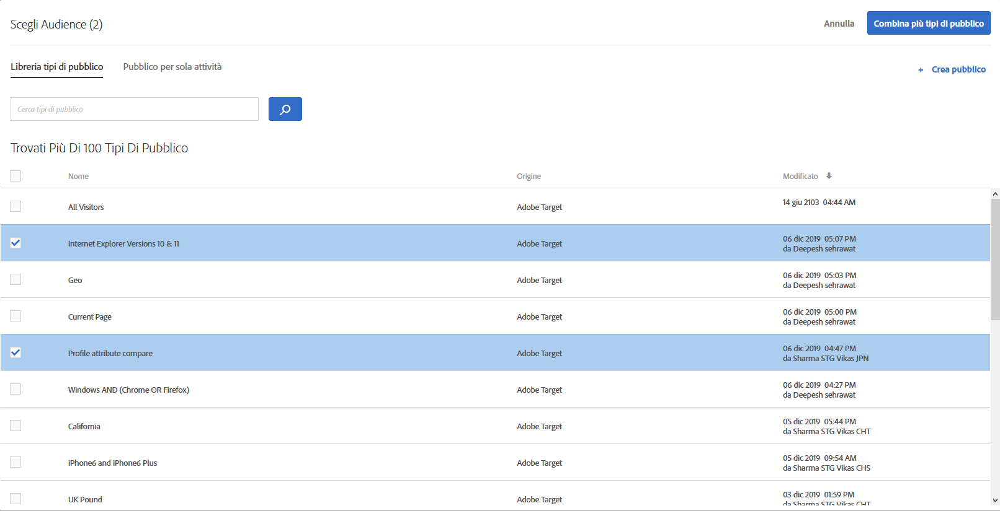
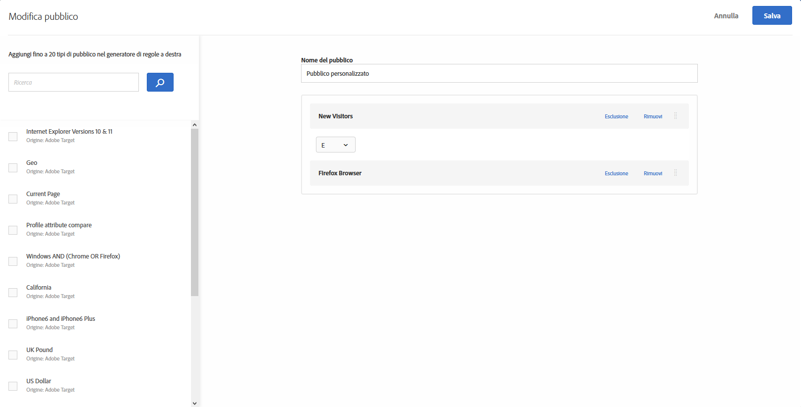
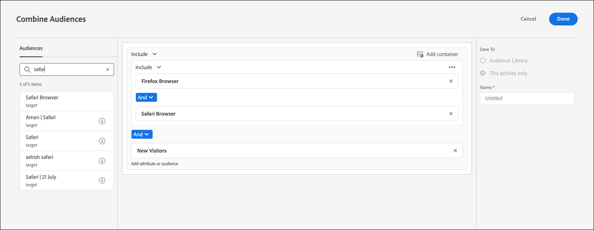
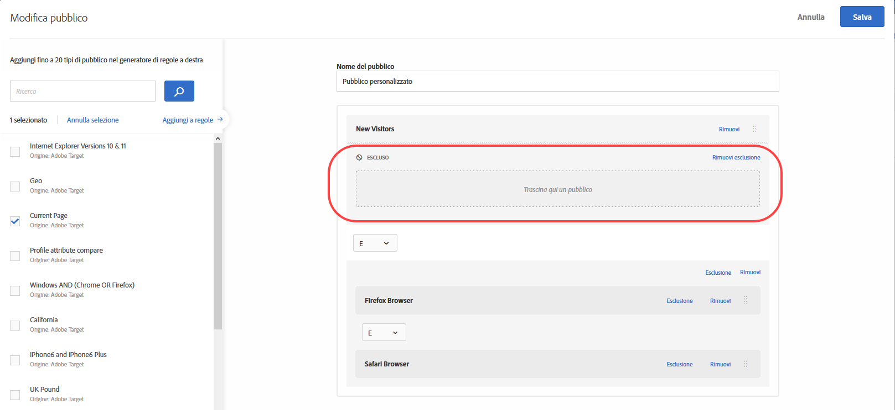
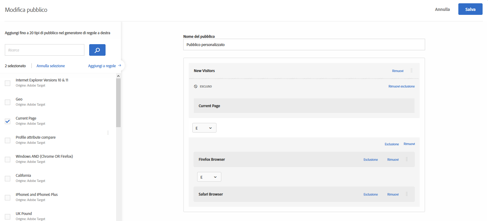
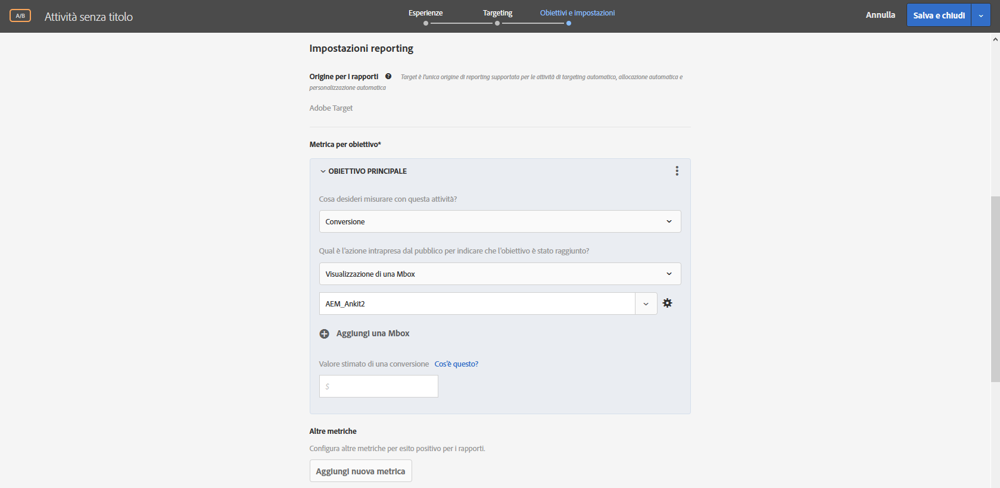
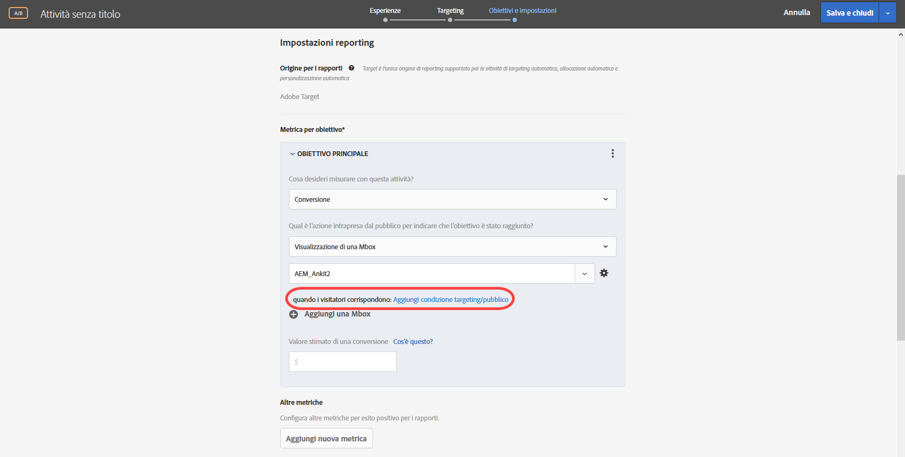
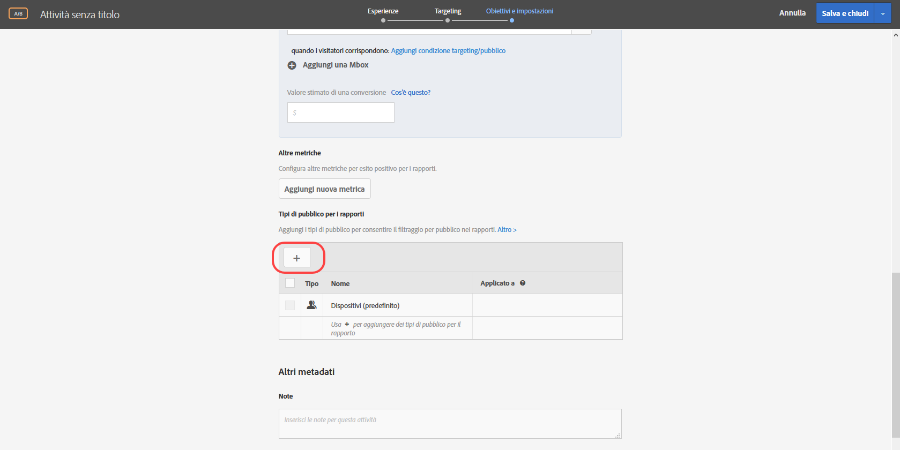

# Combinare più tipi di pubblico{#combine-multiple-audiences}

Combina al volo più tipi di pubblico (tra cui i tipi di pubblico di Adobe Experience Cloud e di Target) per creare un pubblico ad hoc. Puoi anche creare regole di esclusione ed escludere un determinato pubblico da una regola.

Supponi di avere un pubblico “Nuovi visitatori” e un pubblico “Utenti Chrome”. Per un&#39;attività specifica, è possibile combinare questi gruppi di pubblico esistenti per indirizzare nuovi visitatori che utilizzano browser Chrome. Anziché creare un terzo pubblico e archiviarlo nella libreria [!UICONTROL Pubblico], è possibile combinare questi due gruppi di pubblico durante la creazione dell&#39;attività o durante la modifica di un&#39;attività esistente.

Secondo un altro esempio, è possibile indirizzare tutti i clienti fidelizzati includendo uno specifico segmento di [!DNL Audience Manager] per lo stato di fedeltà e combinarli con un segmento di [!DNL Target] composto da persone che hanno firmato per il programma fedeltà durante la sessione corrente, invece di creare un terzo pubblico permanente.

È possibile combinare fino a dieci gruppi di pubblico utilizzando gli operatori AND/OR (E/O).

È possibile creare e utilizzare il pubblico combinato in varie posizioni in tutta l’interfaccia utente di [!DNL Target].

## Creare un pubblico combinato durante la creazione di un’attività {#section_2F1CE9434CC04174B4BA2BFC89B85D77}

Puoi creare un pubblico combinato specifico nella pagina di [!UICONTROL Target] dell’attività durante il flusso di lavoro guidato in tre passaggi.

1. Quando crei un’[attività](/help/c-activities/activities.md#concept_D317A95A1AB54674BA7AB65C7985BA03), nella pagina di **[!UICONTROL Target]**, fai clic sull’icona dei tre puntini di sospensione verticali e quindi su **[!UICONTROL Sostituisci pubblico]**.

   

1. Nella pagina [!UICONTROL Scegli pubblico] seleziona le caselle di controllo accanto ai gruppi di pubblico desiderati che desideri utilizzare come blocchi predefiniti per il pubblico combinato.

   

1. Fai clic su **[!UICONTROL Combina più gruppi di pubblico]** nell&#39;angolo in alto a destra.

   

1. (Condizionale) Modifica il nuovo pubblico combinato come desiderato.

   La finestra di dialogo [!UICONTROL Modifica pubblico] consente di trascinare e rilasciare ulteriori blocchi predefiniti del pubblico dal lato sinistro al nuovo pubblico, nonché di aggiungere regole di esclusione ed escludere gruppi di pubblico.

   1. È possibile utilizzare la funzionalità di trascinamento della selezione per aggiungere il pubblico all&#39;interno di una sezione esistente come modulo di livello 2. Per aggiungere un modulo di livello 1, seleziona la casella di controllo accanto al pubblico desiderato, quindi fai clic su **[!UICONTROL Aggiungi a regole]**.

      Ad esempio, riprendendo l’esempio precedente, supponiamo che ora desideri includere nel pubblico combinato anche gli utenti di Safari. Cerca e trascina il pubblico “Browser Safari” nella casella “Browser Firefox” a destra, come nell’esempio seguente:

      

      Osserva che l’operatore tra i due tipi di pubblico definiti dal browser è “AND” (E). Seleziona l’elenco a discesa e cambialo in “OR” (O) per creare un nuovo pubblico combinato per i nuovi visitatori che utilizzano Firefox o Safari. Fai attenzione a evitare la creazione di regole che escludano tutti i potenziali membri del pubblico. Ad esempio, non è possibile che qualcuno visiti una pagina utilizzando contemporaneamente i browser Firefox e Safari.

      >[!NOTE]
      >
      >L’operatore (AND oppure OR) deve rimanere lo stesso quando combini gruppi di pubblico. Non puoi combinare e abbinare gli operatori.

   1. Per aggiungere un&#39;esclusione a una regola, fai clic su **[!UICONTROL Esclusione]** > **[!UICONTROL Aggiungi esclusione]**.

      

      Trascina e rilascia un pubblico nella casella:

      

      Ad esempio, per escludere i visitatori dagli Stati Uniti dai nuovi visitatori, puoi trascinare nella casella il pubblico Mercato: Stati Uniti, come illustrato di seguito:

      

      Questo pubblico combinato include tutti i nuovi visitatori del tuo sito (esclusi quelli di San Francisco) che utilizzano Safari o Firefox.

   1. Per escludere un pubblico da una regola, fai clic su **[!UICONTROL Esclusione]** > **[!UICONTROL Escludi questo pubblico]**.

      Ad esempio, puoi creare un pubblico combinato che includa tutti i nuovi visitatori del sito, esclusi quelli che utilizzano Firefox. Escludere i visitatori con Firefox è più facile e veloce che creare un pubblico combinato che includa in modo esplicito più browser (Safari, Chrome e Internet Explorer), ma non includa Firefox.

1. Fornisci un nome descrittivo per il pubblico combinato, quindi fai clic su **[!UICONTROL Salva]**.

## Creare un pubblico combinato da utilizzare nel targeting metrico {#section_A42E795AFCBD4575809C5942039910F0}

Puoi creare un pubblico combinato specifico nella pagina [!UICONTROL Obiettivi e impostazioni] dell&#39;attività da utilizzare nel targeting metrico. Ad esempio, per creare un targeting basato sulla conversione utilizzando un pubblico combinato:

1. Durante la modifica o la creazione di un&#39; [attività](/help/c-activities/activities.md#concept_D317A95A1AB54674BA7AB65C7985BA03), nella pagina **[!UICONTROL Obiettivi e impostazioni]**, seleziona **[!UICONTROL Conversione]** per la metrica di successo, quindi seleziona **[!UICONTROL Visualizza una mbox]** come azione.
1. Seleziona la mbox desiderata nel campo **[!UICONTROL Ricerca mbox]**.

   

1. Fai clic sull&#39;icona, quindi fai clic su **[!UICONTROL Aggiungi targeting pubblico]**.
1. Fai clic sul collegamento **[!UICONTROL Aggiungi condizione di pubblico/targeting]** per visualizzare la finestra di dialogo [!UICONTROL Scegli pubblico].

   

1. Procedi con il [Passaggio 2](/help/c-target/combining-multiple-audiences.md#section_2F1CE9434CC04174B4BA2BFC89B85D77) in “Crea un pubblico combinato durante la creazione di un&#39;attività” per creare il pubblico combinato.

## Creare un pubblico combinato per l’utilizzo nel rapporto {#section_4682D342EFBB43C38E54B99B3A1E14CD}

Puoi creare un pubblico combinato specifico nella pagina dell&#39;attività [!UICONTROL Obiettivi e impostazioni] da utilizzare nel rapporto.

1. Durante la modifica o la creazione di un’ [attività](/help/c-activities/activities.md#concept_D317A95A1AB54674BA7AB65C7985BA03), nella pagina **[!UICONTROL Obiettivi e impostazioni]** fai clic sull&#39;icona **[!UICONTROL Aggiungi pubblico]** in [!UICONTROL Pubblico per la creazione di rapporti] per visualizzare la pagina [!UICONTROL Scegli pubblico].

   

1. Procedi con il [Passaggio 2](/help/c-target/combining-multiple-audiences.md#section_2F1CE9434CC04174B4BA2BFC89B85D77) in “Creare un pubblico combinato durante la creazione di un’attività” per creare il pubblico combinato.

## Creare un pubblico combinato durante la modifica di un’attività {#section_364A12CE96E04B61B7C18113AA586C2C}

Puoi creare un pubblico combinato specifico durante la modifica di un&#39;attività esistente.

1. Dalla pagina [!UICONTROL Attività], passa il mouse sull&#39;attività desiderata, quindi fai clic sull&#39;icona **[!UICONTROL Modifica]**.

   Oppure

   Fai clic sull&#39;attività desiderata per aprirla, quindi fai clic su **[!UICONTROL Modifica attività]**.

1. Fare clic su **[!UICONTROL Configura]** > **[!UICONTROL Audiences]** > **[!UICONTROL Multiple Audiences]**.

   

1. Fai clic sull’icona altre opzioni (tre puntini di sospensione verticali) accanto al pubblico corrente dell’attività, quindi fai clic su **[!UICONTROL Cambia pubblico]**.

   

1. Procedi con il [Passaggio 2](/help/c-target/combining-multiple-audiences.md#section_2F1CE9434CC04174B4BA2BFC89B85D77) in “Creare un pubblico combinato durante la creazione di un’attività” per creare il pubblico combinato.