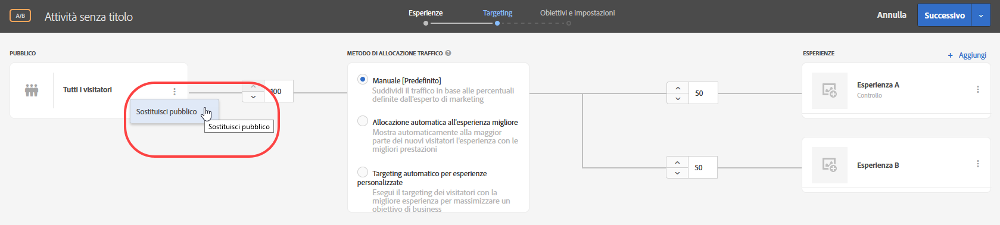

# Creare un pubblico per sola attività{#create-an-activity-only-audience}

Durante la creazione di un’attività puoi creare tipi di pubblico per sole attività dal flusso di lavoro guidato in tre passaggi. Questi tipi di pubblico specifici possono essere utilizzati in altre aree della stessa attività, ma non vengono memorizzati nella [!UICONTROL Libreria tipi di pubblico] e non possono quindi essere utilizzati in altre attività.

I tipi di pubblico per sola attività forniscono i seguenti vantaggi:

* È possibile utilizzare i tipi di pubblico per sola attività per creare un pubblico da utilizzare una sola volta, senza archiviarlo nella [!UICONTROL Libreria tipi di pubblico]. In tal modo si evita di riempire la [!UICONTROL Libreria] con tipi di pubblico che non verranno più utilizzati.
* I tipi di pubblico per sola attività non sono visibili nella [!UICONTROL Libreria tipi di pubblico]. In tal modo si evita il rischio che possano essere modificate da parte di altri membri della tua organizzazione.

1. Quando crei un’[attività](/help/c-activities/activities.md#concept_D317A95A1AB54674BA7AB65C7985BA03), nella pagina di **[!UICONTROL Target]**, fai clic sull’icona dei tre puntini di sospensione verticali e quindi su **[!UICONTROL Sostituisci pubblico]**.

   

1. Nella pagina [!UICONTROL Scegli il pubblico], fai clic su **[!UICONTROL Pubblico per sola attività]**.

   

1. Fai clic su **[!UICONTROL Crea pubblico]**.
1. Inserisci un nome descrittivo per il pubblico.
1. Fai clic su **[!UICONTROL + Aggiungi regola]**.

   Le regole consentono di limitare il pubblico a un sottoinsieme di visitatori del sito.

1. Seleziona un tipo di regola.

   Ogni tipo di regola ha i propri parametri. Consulta [Categorie di pubblico](/help/c-target/c-audiences/c-target-rules/target-rules.md#concept_E3A77E42F1644503A829B5107B20880D) per ulteriori informazioni su come configurare ogni tipo di regola per la definizione del pubblico.

1. Definisci i parametri della regola.
1. Fai clic su **[!UICONTROL Salva]**.

## Considerazioni

Quando lavori con tipi di pubblico per sola attività, considera quanto segue:

* È possibile creare tipi di pubblico per sola attività nel Compositore esperienza visivo o nel Compositore esperienza basato su moduli. Questa funzionalità sostituisce le regole di perfezionamento delle versioni precedenti di Target.
* Puoi creare un pubblico da archiviare nella [!UICONTROL Libreria tipi di pubblico] per riutilizzarlo in altre attività, oppure un pubblico per una sola attività. Dopo aver salvato il pubblico, non puoi cambiare tipo di pubblico.
* I perfezionamenti per le attività esistenti vengono trasferiti ai tipi di pubblico per sola attività.
* I tipi di pubblico per sola attività hanno lo stato [!UICONTROL Utilizzato] o [!UICONTROL Non utilizzato]. I tipi di pubblico per sola attività non utilizzati vengono visualizzate finché l’attività non viene salvata. Se restano inutilizzati e tenti di salvare l’attività, un messaggio di avvertenza ti informa che i tipi di pubblico per sola attività inutilizzati verranno eliminati.
* Puoi visualizzare i dettagli della definizione del pubblico in una scheda a comparsa dal selettore del pubblico, senza aprire il pubblico.
* È possibile [combinare più tipi di pubblico](/help/c-target/combining-multiple-audiences.md#concept_A7386F1EA4394BD2AB72399C225981E5) per creare un pubblico per sola attività.

