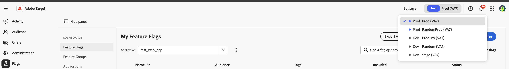

# Panoramica sugli ambienti {#environments-overview}

Flag è basato su Adobe Experience Platform. Prima di utilizzare i flag di funzione, seleziona la sandbox corrispondente all’ambiente corrente, esattamente come faresti con qualsiasi altra applicazione Adobe Experience Platform.

## Come selezionare una sandbox {#how-to}

Utilizza il selettore sandbox nella barra di navigazione superiore della console Contrassegni per selezionare la sandbox corretta prima di creare o modificare i contrassegni delle funzioni.

## Vedi anche {#see-also}

* [Accedi alla console](log-in-to-the-console.md)
* [Richiedi accesso](request-access.md)

<!-- -->
