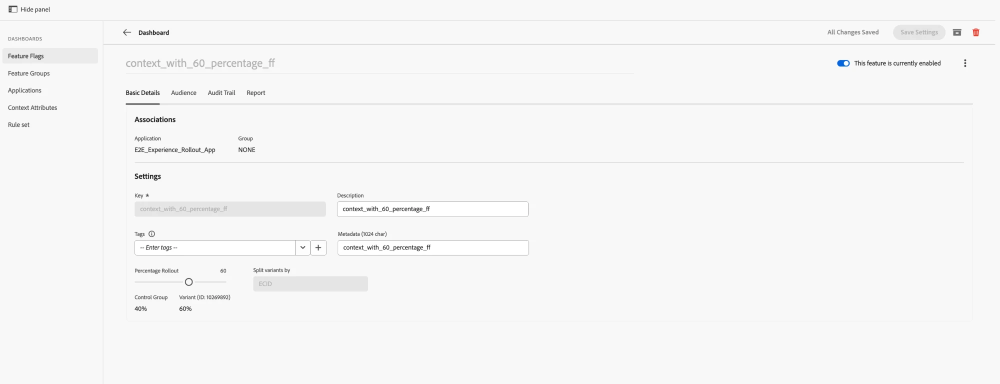
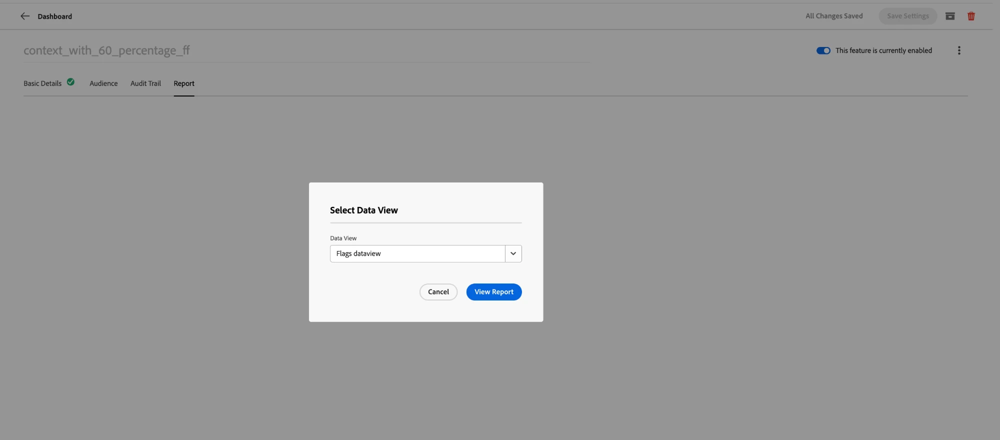
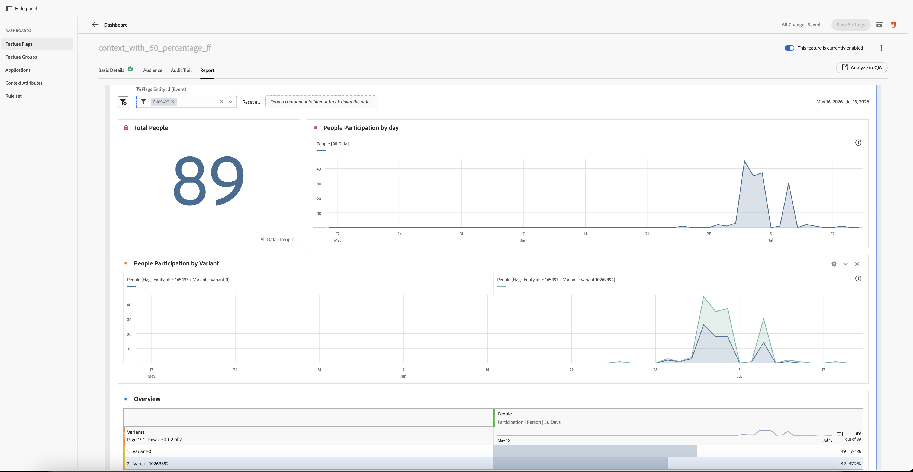
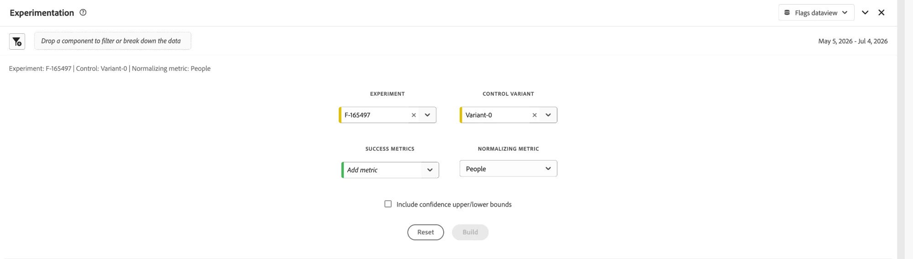
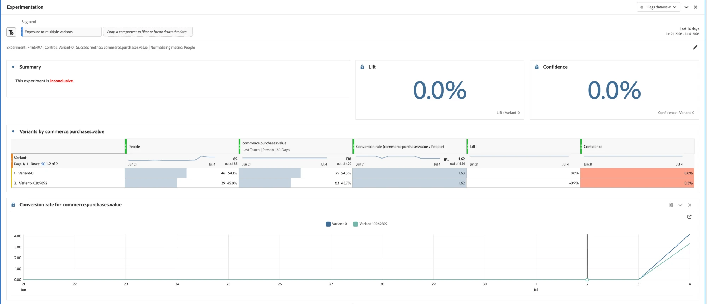
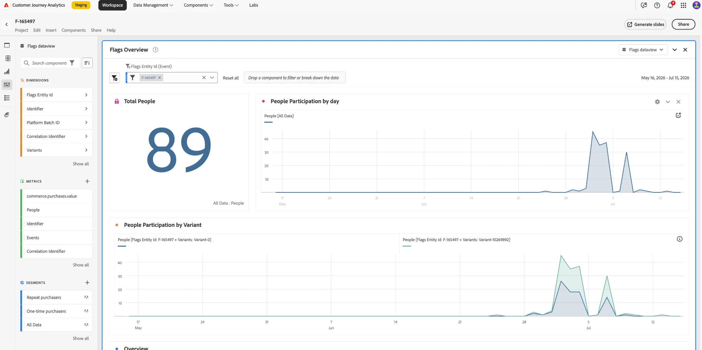
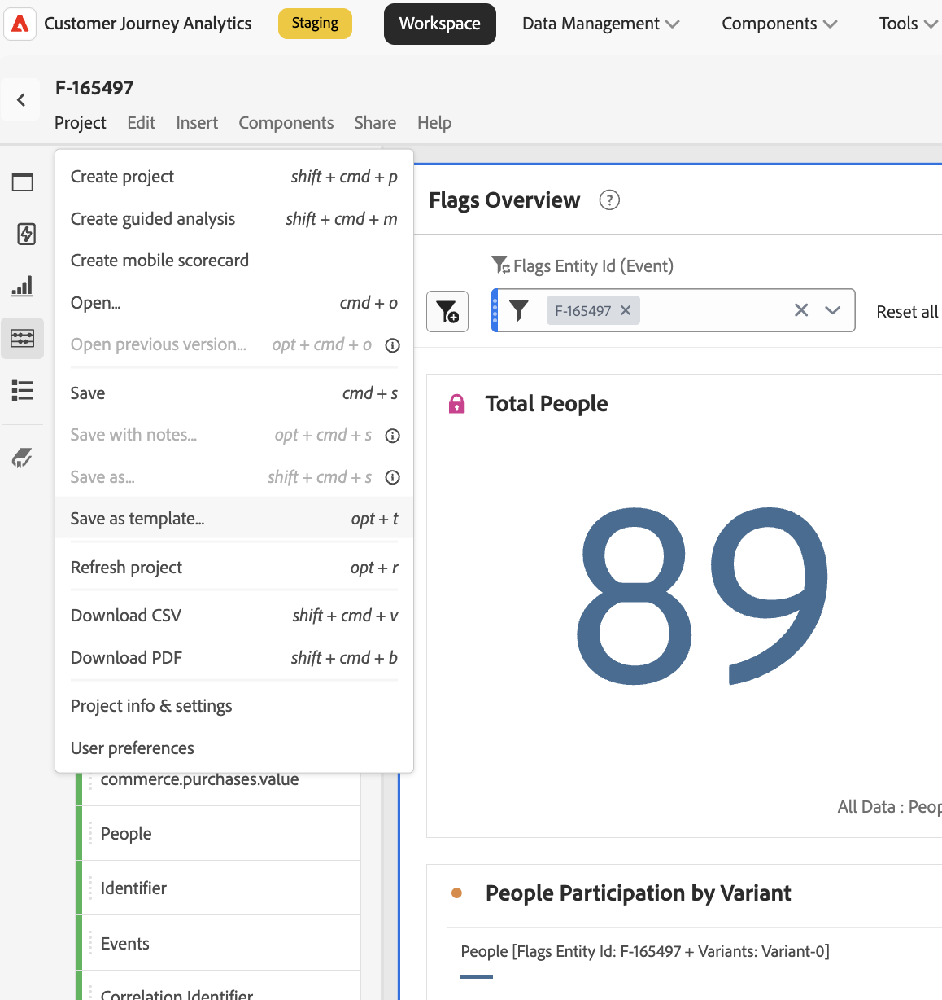

# Generazione di rapporti {#reporting}

I flag consentono la generazione di rapporti tramite **Customer Journey Analytics (CJA)**. Una scheda **Report** è disponibile in ogni flag di funzionalità e pagina dei dettagli del gruppo di funzionalità. Ti consente di visualizzare un rapporto di CJA con ambito specifico per tale flag o gruppo, incorporato direttamente nella pagina.

>[!NOTE]
>
>Report aperti con un intervallo di reporting di **30 giorni** per impostazione predefinita. Puoi regolare l’intervallo dall’intestazione del pannello.

## Prerequisiti {#prerequisites}

Prima di poter visualizzare i rapporti, assicurati che:

1. La creazione di report è impostata per l&#39;applicazione. Vedere [Configurare la creazione di report con Customer Journey Analytics](#setup).
1. Il flag di funzione o il gruppo di funzioni è attivo e contiene dati accumulati.

## Visualizzare un rapporto {#view-report}

### Aprire la scheda Report e scegliere una visualizzazione dati {#open-report-tab}

1. Apri un flag di funzionalità o un gruppo di funzionalità e seleziona la scheda **Report**.
1. Viene visualizzata una finestra di dialogo **Seleziona visualizzazione dati**, in cui sono elencate le visualizzazioni dati di CJA disponibili. Il primo è selezionato per impostazione predefinita.
1. Scegliere la visualizzazione dati desiderata e selezionare **Visualizza report**. Seleziona **Annulla** per chiudere la finestra di dialogo senza caricare un report.
1. Il report viene caricato all’interno della scheda, con ambito corrispondente all’ID entità del flag o del gruppo.

>[!NOTE]
>
>La finestra di dialogo elenca solo le visualizzazioni dati a cui hai accesso nella sandbox corrente. Se non ne è disponibile alcuna, nella finestra di dialogo viene visualizzato un messaggio e **Visualizza report** rimane disabilitato. Verificare le autorizzazioni di visualizzazione dati o cambiare sandbox.

### Visualizzare il rapporto sulle prestazioni {#view-performance-report}

Il dashboard **Flags Overview** incorporato visualizza:

* **Persone totali**, **Partecipazione persone per giorno** e **Partecipazione persone per variante** (ID gruppo di controllo vs. ID variante)
* Una tabella **Panoramica** che elenca ogni variante con il relativo numero di persone e la percentuale di partecipazione

Regola l’intervallo di date dall’intestazione del pannello per tracciare nuovamente per una finestra diversa (30 giorni predefiniti).

### Esplora i risultati della sperimentazione {#explore-experimentation-results}

1. Nel pannello **Sperimentazione**, sono preselezionati **Esperimento** (ID entità flag o gruppo) e **Variante controllo**.
1. Aggiungi una **metrica di successo** utilizzando **Aggiungi metrica** e scegli una **metrica di normalizzazione** (**Persone**) predefinita in base al grafico da tracciare.
1. Facoltativamente, abilita **Includi limiti superiori/inferiori dell&#39;affidabilità**.
1. Seleziona **Build** per calcolare **Lift**, **Confidence** e **Conversion rate** per variante per la metrica selezionata.

Per ulteriori dettagli sul calcolo di queste metriche, consulta la [documentazione del pannello Sperimentazione](https://experienceleague.adobe.com/it/docs/analytics-platform/using/cja-workspace/panels/experimentation).

### Analisi in CJA (opzionale) {#analyze-in-cja}

Una volta caricato un report, nella parte superiore destra della scheda Report viene visualizzato il pulsante **Analizza in CJA**. Selezionando questa opzione si apre la stessa pagina di report in Customer Journey Analytics in una nuova scheda del browser, in cui si dispone del set completo di strumenti di CJA per un’analisi più approfondita e ad hoc.

>[!IMPORTANT]
>
>Il report viene aperto come progetto temporaneo non salvato. Se lo personalizzi in CJA (aggiungi metriche, modifica pannelli, regola filtri e così via) e desideri mantenere tali modifiche, salvalo utilizzando **Progetto > Salva come modello**. In caso contrario, le modifiche andranno perse quando si chiude il report.

## Configurare la generazione di rapporti con Customer Journey Analytics {#setup}

Il reporting richiede un set di dati Customer Journey Analytics connesso all’applicazione Flags. Per abilitare il reporting per la tua applicazione, contatta il supporto dei flag o il tuo rappresentante Adobe.

>[!NOTE]
>
>L’identità passata nella richiesta di funzione non deve essere collegata a un profilo. La valutazione viene eseguita in fase di runtime e l’evento viene inviato a Customer Journey Analytics.

## Vedi anche {#see-also}

* [Creare il primo flag di funzione](create-your-first-feature-flag.md)
* [Test A/B con flag di funzione](a-b-testing.md)
* [Creare un gruppo di funzioni](create-a-feature-group.md)

<!-- -->
