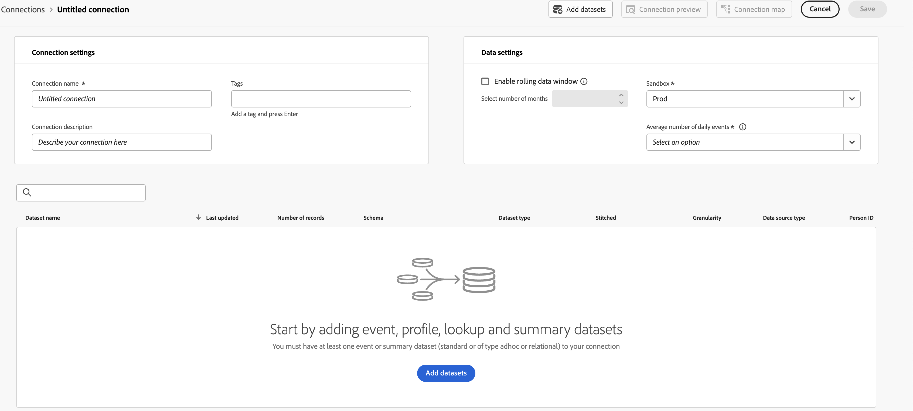
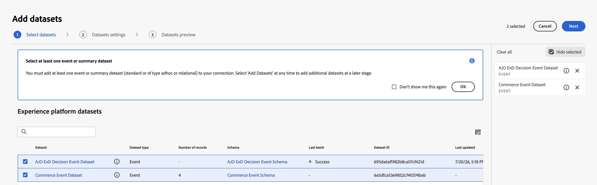
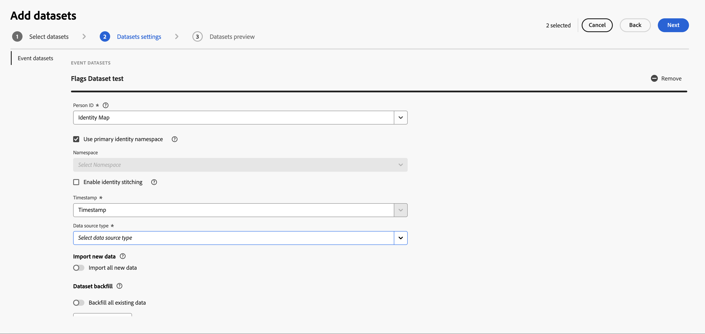
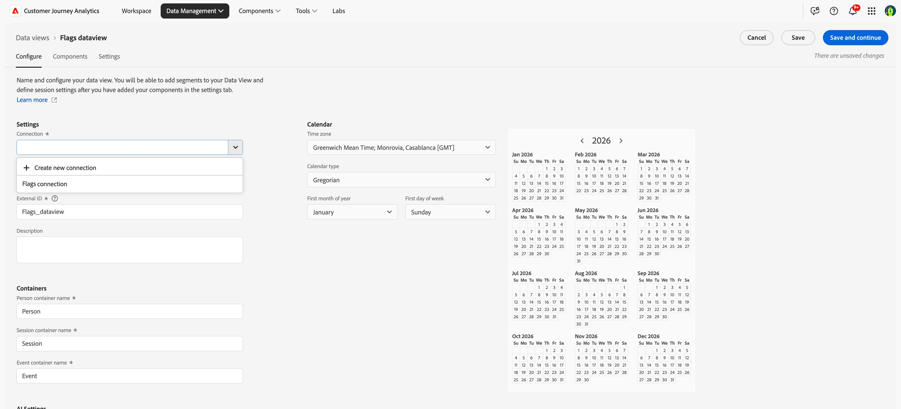
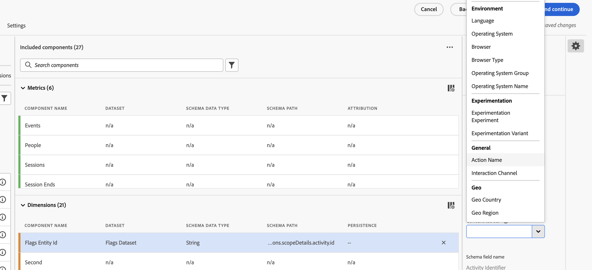

# Configurare CJA per la generazione di rapporti sui flag di funzione {#set-up-cja-reporting}

L’integrazione tra Flags e Adobe Customer Journey Analytics (CJA) offre un modo unificato per misurare l’impatto aziendale delle varianti dei flag di funzione. Applica le metriche di successo di CJA ai rapporti Flag in qualsiasi momento e sfrutta le funzionalità di Customer Journey Analytics, come il [pannello Sperimentazione](https://experienceleague.adobe.com/it/docs/analytics-platform/using/cja-workspace/panels/experimentation), per valutare le prestazioni dell&#39;esperimento e capire in che modo le varianti di funzionalità influenzano il comportamento del cliente.

## Considerazioni {#considerations}

Prima di utilizzare l’integrazione Customer Journey Analytics e Flags, considera le seguenti informazioni:

* Tu e la tua organizzazione dovete avere accesso ad Adobe Customer Journey Analytics (CJA).
* È necessario eseguire il provisioning del **set di dati evento decisione ExD di AJO** nella sandbox per gli eventi di esposizione dei flag.
* Deve essere disponibile un set di dati contenente gli eventi di conversione di successo che desideri utilizzare come metriche di successo.

## Configurare un flusso di dati {#set-up-datastream}

>[!NOTE]
>
>Questa guida utilizza un set di dati di Commerce Experience Event e `commerce.purchases.value` solo come esempi. Seleziona lo schema e il campo della metrica di successo mappato appropriato per il tuo caso d’uso.

1. In Raccolta dati, vai a **Flussi di dati** e crea o apri lo stream di dati di esposizione dei flag.
1. Imposta il relativo schema di mappatura su **Schema evento decisione ExD di AJO**.
1. Apri lo stream di dati e seleziona **Aggiungi servizio**.
1. Seleziona il **set di dati evento decisione ExD AJO** esistente come set di dati evento e salva.

>[!NOTE]
>
>L’ID dello stream di dati appena creato viene utilizzato per configurare l’estensione Flags nei tag di raccolta dati.

## Configurare una connessione Customer Journey Analytics {#set-up-connection}

Se disponi già di una connessione configurata, puoi utilizzare quella esistente e passare al passaggio 3 seguente. La connessione consente a Customer Journey Analytics di iniziare a estrarre dati dal set di dati per il reporting.

1. In Customer Journey Analytics, nella pagina **Connessioni**, selezionare **Crea una nuova connessione**.
1. Configura la [connessione e le impostazioni dei dati](https://experienceleague.adobe.com/it/docs/analytics-platform/using/cja-connections/overview) con le informazioni corrette.
1. Aggiungi il set di dati evento ExD utilizzato durante la configurazione dello stream di dati.
1. Aggiungi il set di dati da utilizzare come eventi di conversione, quindi seleziona **Successivo**.
1. Configura le [impostazioni per ciascuno dei set di dati selezionati](https://experienceleague.adobe.com/it/docs/analytics-platform/using/cja-connections/create-connection#dataset-settings), uno alla volta, nella finestra di dialogo **Aggiungi set di dati**.

## Impostare la visualizzazione dati {#set-up-data-view}

Configurare una visualizzazione dati in Customer Journey Analytics. Una visualizzazione dati garantisce che i dati della connessione possano essere utilizzati correttamente.

1. Configura la visualizzazione dati e accertati che punti alla connessione creata in precedenza. Per ulteriori informazioni, vedere [Creare o modificare una visualizzazione dati](https://experienceleague.adobe.com/it/docs/analytics-platform/using/cja-dataviews/create-dataview) nella *Guida di Adobe Customer Journey Analytics*.
1. Vai a **Gestione dati** > **Visualizzazioni dati**.
1. Seleziona **Crea nuova visualizzazione dati** e scegli i flag di connessione CJA.
1. Immetti un nome per la visualizzazione dati e un ID esterno stabile.
1. Confermare le impostazioni relative al fuso orario e al calendario, quindi passare a **Componenti**.

### Configurare le dimensioni dell’esperimento e della variante {#configure-experiment-variant-dimensions}

1. Aggiungi `_experience.decisioning.propositions.scopeDetails.activity.id` (mappato a **ID entità flag**) alle dimensioni e rinominalo in &quot;ID entità flag&quot; o in un altro nome descrittivo per gli analisti.
1. Imposta l’etichetta di contesto su &quot;Sperimentazione&quot;.
1. Aggiungi `_experience.decisioning.propositions.scopeDetails.experience.id` (mappato a variante di flag di funzionalità o gruppo di funzionalità) alle dimensioni.
1. Imposta l’etichetta di contesto su &quot;Variante sperimentazione&quot;.

>[!WARNING]
>
>Senza entrambe le etichette di contesto di sperimentazione, il pannello Sperimentazione CJA non è in grado di identificare i flag di esperimenti e varianti.

### Configurare la persistenza e l’attribuzione {#configure-persistence-attribution}

Configurare le dimensioni e le metriche in modo che un’esposizione possa ricevere credito per una conversione successiva. Senza un’appropriata persistenza o attribuzione, CJA può associare solo i risultati che si verificano sullo stesso evento dell’esposizione.

1. Aggiungere il campo di conversione richiesto, ad esempio `commerce.purchases.value`, in Metriche.
1. Assegna alla metrica un nome chiaro, ad esempio **Valore acquisti**.
1. Abilita l’attribuzione e seleziona il modello richiesto dall’analisi: Ultimo contatto, Primo contatto, Partecipazione o Stesso contatto. Per ulteriori informazioni su modelli di attribuzione, contenitori e intervalli di lookback, consulta [Componenti di attribuzione](https://experienceleague.adobe.com/it/docs/analytics-platform/using/cja-workspace/attribution/models).
1. Seleziona un contenitore e un intervallo di lookback che corrispondono alla strategia dell’esperimento. Un contenitore Persona con un lookback in base alla visita o alla sessione è un punto di partenza comune, ma puoi convalidarlo per il tuo caso d’uso.
1. Salva la visualizzazione dati.

## Vedi anche {#see-also}

* [Reporting](reporting.md)

<!-- -->
