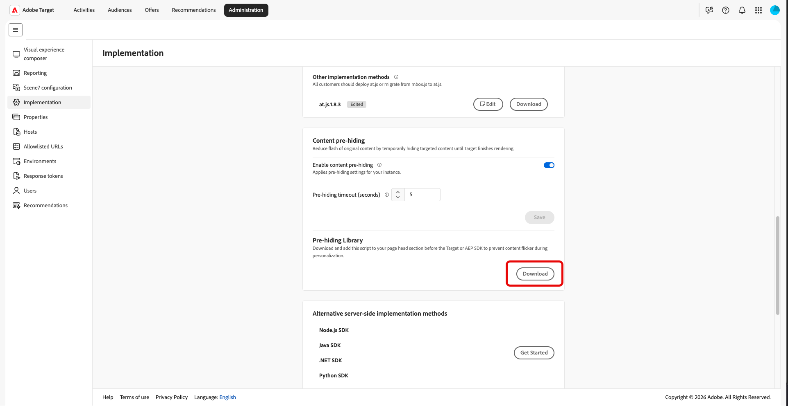
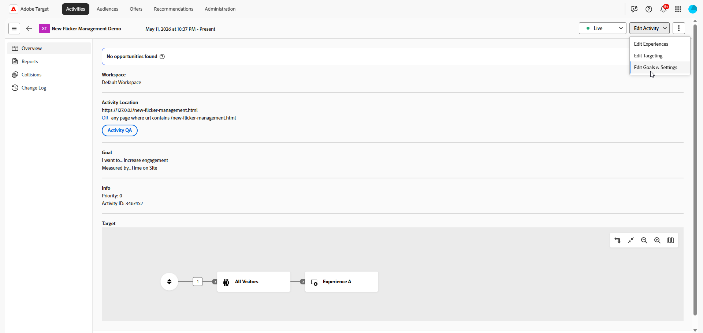

# Pre-hiding dei contenuti per esperienze personalizzate

>[!AVAILABILITY]
>
>Il pre-hiding dei contenuti personalizzati è disponibile come funzionalità **beta**.

Quando un visitatore carica una pagina, il contenuto predefinito può essere visualizzato brevemente e poi sostituito da contenuto personalizzato di [!DNL Adobe Target]. Tale opzione visibile è spesso denominata **visualizzazione momentanea di altri contenuti** ed è un problema comune per i programmi di personalizzazione.

Con il contenuto pre-hiding è possibile gestire lo sfarfallio nascondendo solo le parti della pagina che le attività personalizzano durante il caricamento della pagina, in modo che i clienti vedano meno sfarfallio e meno tempo di visualizzazione vuoto.

Ecco come funziona il pre-hiding del contenuto, dall’impostazione predefinita dell’account fino alle scelte di implementazione e per attività della pagina.

1. Abilita il pre-hiding del contenuto per il tuo account per impostare il valore predefinito globale. È disattivata per impostazione predefinita. [Ulteriori informazioni](#content-pre-hiding-enable-account)

1. Aggiungi la libreria per nascondere contenuti a `<head>` di tutte le pagine in cui esegui attività di personalizzazione.

1. [!DNL Target] crea un set di regole dalle attività live di [!UICONTROL Compositore esperienza visivo] e [!UICONTROL Compositore esperienza avanzato]. Il set di regole elenca i selettori e le aree che la consegna può modificare.

   [!UICONTROL Le attività del Compositore basato su moduli] non sono supportate.

1. La libreria recupera tale set di regole dalla rete CDN di Adobe e nasconde preventivamente gli elementi corrispondenti solo durante il caricamento del contenuto personalizzato.

1. In **[!UICONTROL Obiettivi e impostazioni]**, puoi disabilitare **[!UICONTROL Contenuto pre-hiding]** per singole attività, ma solo se è abilitato a livello di account. [Ulteriori informazioni](#content-pre-hiding-activity)

## Abilita pre-hiding del contenuto per l’istanza {#content-pre-hiding-enable-account}

>[!IMPORTANT]
>
>Per abilitare il contenuto per l&#39;istanza, è necessario essere un **amministratore**.

Il pre-hiding del contenuto è disattivato per la tua istanza fino a quando non lo abiliti. Utilizza **[!UICONTROL Amministrazione]** > **[!UICONTROL Implementazione]** per attivare la funzione, impostare le impostazioni predefinite e accedere al download per il team di implementazione.

1. In [!DNL Target], fare clic su **[!UICONTROL Amministrazione]** > **[!UICONTROL Implementazione]**.

1. Dal menu **[!UICONTROL Contenuto pre-hiding]**, abilita opzione di pre-hiding del contenuto.

   

1. Se necessario, aggiorna **[!UICONTROL Timeout per nascondere anticipatamente]** in secondi.

1. Fai clic su **[!UICONTROL Salva]**. Questo applicherà le impostazioni di gestione della visualizzazione momentanea di altri contenuti all’istanza.

1. Una volta attivato, fare clic su **[!UICONTROL Scarica]**, quindi aggiungere il file alla pagina `<head>` in modo che venga caricato prima di [!DNL at.js] o di [!DNL Web SDK]. Per istruzioni complete sull&#39;implementazione, vedere [Contenuto che nasconde preventivamente SDK](https://experienceleague.adobe.com/en/docs/target-dev/developer/client-side/prehide-sdk).

   

La tua istanza ora utilizza le impostazioni predefinite per il pre-hiding e il timeout del contenuto salvato per le attività che acconsentono.

## Abilita pre-hiding dei contenuti per l&#39;attività {#content-pre-hiding-activity}

Con il pre-hiding abilitato per la tua istanza, scegli se ciascuna attività lo utilizza in **[!UICONTROL Obiettivi e impostazioni]**. Le attività per le quali si abilita il pre-hiding sono incluse nel comportamento di destinazione quando sono live.

[!DNL Target] crea quindi un set di regole leggere dalle attività live create nel [!UICONTROL Compositore esperienza visivo] (VEC) e nel [!UICONTROL Compositore basato su moduli], descrivendo i selettori e le aree che la consegna può modificare.

Quando crei o modifichi un’attività:

1. Accedi all’attività per abilitare l’opzione di pre-hiding.

1. Accedi al menu a discesa **[!UICONTROL Modifica attività]** e seleziona **[!UICONTROL Modifica obiettivi e impostazioni]**.

   

1. Dal menu **[!UICONTROL Contenuto pre-hiding]**, attiva l&#39;opzione **[!UICONTROL Abilita pre-hiding del contenuto]** per attivare o disattivare questa attività di pre-hiding.

   

1. Al termine, fai clic su **[!UICONTROL Salva e chiudi]**.

Dopo il salvataggio e quando le attività vengono pubblicate o disattivate, il set di regole viene aggiornato in modo che il pre-hiding rimanga allineato con ciò che viene effettivamente consegnato, senza modifiche al codice della pagina per ogni lancio.

Sul lato visitatore, la libreria recupera il set di regole dalla rete CDN di Adobe a ogni caricamento di pagina e nasconde preventivamente gli elementi corrispondenti solo quando necessario, fino a quando il contenuto personalizzato non è pronto.
