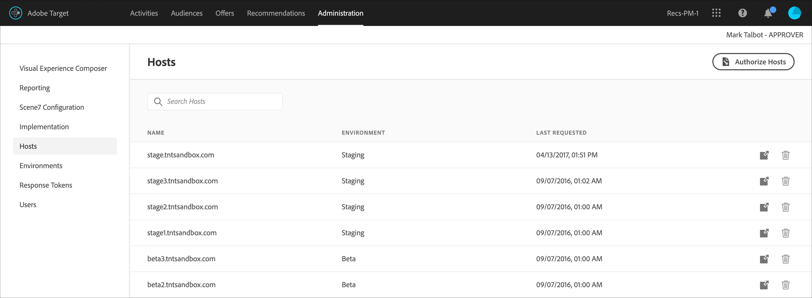

# Host

Organizza siti e ambienti di preproduzione per gestirli facilmente e per generare rapporti separati in [!DNL Adobe Target].

L’obiettivo principale della gestione host è quello di garantire che nessun contenuto inattivo venga visualizzato accidentalmente sui siti web. La gestione host consente inoltre di separare i dati dei rapporti per [ambiente](/help/main/administrating-target/environments.md).

Un host è qualsiasi dominio da cui un [!DNL Target] richiesta effettuata. Su un sito web, di solito è il `location.hostname` dell&#39;URL che crea la proprietà [!DNL Target] richiesta.

Per impostazione predefinita, [!DNL Target] non limita un host che può fare [!DNL Target] richieste e ricevi [!DNL Target] risposte. Quando i nuovi host eseguono richieste, queste funzionano automaticamente. Questo processo consente anche di eseguire test su domini diversi che non conosci o che non puoi prevedere. Se desideri ignorare questo comportamento predefinito, puoi impostare un inserire nell&#39;elenco Consentiti o un inserire nell&#39;elenco Bloccati per limitare con quali host lavorare [!DNL Target].

Per gestire gli host, fai clic su **[!UICONTROL Amministrazione]** > **[!UICONTROL Host]**.

## Riconoscere gli host {#concept_0D4B43E23AA9408F8B28A57ED754BF65}

Per riconoscere un host e aggiungerlo al [!UICONTROL Host] devono essere soddisfatte le seguenti condizioni:

* Almeno uno [!DNL Target] la richiesta deve esistere sull&#39;host
* Una pagina sull’host deve avere quanto segue:

   * Un preciso riferimento a at.js
   * A [!DNL Target] richiesta o un globale generato automaticamente [!DNL Target] richiesta

* La pagina con [!DNL Target] la richiesta deve essere visualizzata in un browser

Dopo la visualizzazione della pagina, l’host è elencato nella [!UICONTROL Host] ti consente di gestirlo in un ambiente e di visualizzare in anteprima e avviare attività e test.

>[!NOTE]
>
>Questo include tutti i server di sviluppo personali.

Dopo aver aggiunto un host all’elenco degli [!UICONTROL host], assicurati che l’host sia riconosciuto.

1. Fai clic su **[!UICONTROL Amministrazione]** > **[!UICONTROL Host]**.
1. Se l’host non è elencato, aggiorna il browser. 

   Per impostazione predefinita, un nuovo host riconosciuto viene posizionato nella [!UICONTROL Produzione] ambiente. La [!UICONTROL Produzione] l’ambiente è l’ambiente più sicuro perché non consente la visualizzazione delle attività inattive da questi host.

1. (Condizionale) Fai clic sul pulsante **[!UICONTROL Sposta]** icona (  ) per spostare l&#39;host in [!UICONTROL Sviluppo], [!UICONTROL Staging]o altro ambiente.

>[!NOTE]
>
>La [!UICONTROL Produzione] l’ambiente non può essere eliminato, anche se lo si rinomina. Si presume che in questo ambiente vengano eseguiti attività e test finali e attivi. L’ambiente predefinito non consente di visualizzare le campagne inattive.

## Ordinare o cercare l’elenco Host {#section_068B23C9D8224EB78BC3B7C8580251B0}

Per ordinare i [!UICONTROL Host] elenco, fai clic su un’intestazione di colonna ([!UICONTROL Nome], [!UICONTROL Ambiente]oppure [!UICONTROL Ultima richiesta]) per ordinare l’elenco in ordine crescente o decrescente.

Per cercare [!UICONTROL Host] elenco, digitare un termine di ricerca [!UICONTROL Ricerca host] scatola.

## Creare inseriti nell&#39;elenco Consentiti che specificano gli host autorizzati per l’invio [!DNL Target] richieste a [!DNL Target]. {#allowlist}

Puoi creare un inserire nell&#39;elenco Consentiti che specifichi gli host (domini) autorizzati a inviare [!DNL Target] richieste a [!DNL Target]. Tutti gli altri host che generano richieste ottengono una risposta di errore di autorizzazione con commento. Per impostazione predefinita, qualsiasi host che contiene un [!DNL Target] registri di richiesta con [!DNL Target] in [!UICONTROL Produzione] e ha accesso a tutte le attività attive e approvate. Se non desideri questo approccio, puoi invece utilizzare l’inserire nell&#39;elenco Consentiti per registrare host specifici idonei a [!DNL Target] richieste e ricevi [!DNL Target] contenuto. Tutti gli host continuano a essere visualizzati nella [!UICONTROL Host] elenco e ambienti possono ancora essere utilizzati per raggruppare questi host e assegnare livelli diversi a ciascuno di essi, ad esempio se l’host può visualizzare attività attive e/o inattive.

Per creare un inserì nell&#39;elenco Consentiti:

1. Da [!UICONTROL Host] elenco, fai clic su **[!UICONTROL Autorizzare gli host]**.
1. Abilita la **[!UICONTROL Abilitare gli host autorizzati per la distribuzione dei contenuti]** alternare.
1. Aggiungi gli host desiderati nel **[!UICONTROL L&#39;host contiene]** come desiderato.

   È possibile elencare più host, ciascuno sulla propria linea.

1. Aggiungi gli host desiderati nel **[!UICONTROL L&#39;host non contiene]** come desiderato.

   È possibile elencare più host, ciascuno sulla propria linea.

1. Fai clic su **[!UICONTROL Salva]**.

Se [!DNL Target] la richiesta viene effettuata su un host non autorizzato, la chiamata risponde con `/* no display - unauthorized mbox host */`.

>[!IMPORTANT]
>
>**Best practice sulla sicurezza**: Se utilizzi la funzionalità ubox di [!DNL Target], questo inserire nell&#39;elenco Consentiti controlla anche l’elenco dei domini a cui il tuo [redirector](https://developer.adobe.com/target/implement/email/working-with-redirectors/) può navigare. Assicurati di aggiungere eventuali domini a cui desideri reindirizzare quando utilizzi ubox come parte della tua implementazione. Se l&#39;inserire nell&#39;elenco Consentiti viene lasciato non specificato, [!DNL Adobe] non è in grado di verificare gli URL di reindirizzamento e di proteggerli da potenziali reindirizzamenti dannosi.
>
>L&#39;inserire nell&#39;elenco Consentiti ha la precedenza sugli ambienti. Elimina tutti gli host prima di utilizzare la funzione di inserire nell&#39;elenco Consentiti, nell’elenco degli host vengono visualizzati solo gli host consentiti dall’inserire nell&#39;elenco Consentiti. A questo punto puoi spostare gli host nell’ambiente desiderato.

A volte i domini da altri siti appaiono negli ambienti. Un dominio viene visualizzato nell’elenco se il dominio chiama at.js. Ad esempio, se qualcuno copia una delle tue pagine web sul suo server, tale dominio verrà visualizzato nel tuo ambiente. Potrebbe anche essere possibile vedere domini da motori spider, siti di traduzione linguistica o unità disco locali.

Nei casi in cui `mboxHost` viene passato in una chiamata API, la conversione viene registrata per l’ambiente passato. Se non viene passato alcun ambiente, l’host nella chiamata viene impostato automaticamente su [!UICONTROL Produzione].

Puoi anche creare un elenco Bloccati che specifichi gli host (domini) che non possono inviare [!DNL Target] richieste a [!DNL Target] aggiungendo gli host desiderati nel [!UICONTROL L&#39;host non contiene] scatola.

>[!NOTE]
>
>La [!UICONTROL Host autorizzati] elenco viene utilizzato per [!DNL Target] host e host di reindirizzamento predefiniti. Aggiungi tutti i domini esistenti approvati per utilizzare il [!DNL Adobe Target] SDK JavaScript (at.js) *E* tutti i domini utilizzati negli URL di reindirizzamento predefiniti di ubox. Aggiungi eventuali nuovi domini simili all’inserire nell&#39;elenco Consentiti in futuro.

## Eliminare un host {#section_F56355BA4BC54B078A1A8179BC954632}

Quando un host non è più necessario, è possibile eliminarlo.

1. Da [!UICONTROL Host] elenco, fai clic su **[!UICONTROL Elimina]** icona.
1. Fai clic su **[!UICONTROL Elimina]** per confermare l’eliminazione.

>[!NOTE]
>
>L’host viene elencato di nuovo se qualcuno passa a una pagina che contiene un [!DNL Target] richiesta all&#39;host.

## Risoluzione dei problemi relativi agli host {#concept_B3D7583FA4BB480382CC7453529FE1B7}

Se si verificano problemi con gli host, prova i seguenti suggerimenti di risoluzione:

**L’host non viene visualizzato nell’elenco dell’account.**

* Aggiorna la pagina [!UICONTROL Host] nel browser.
* Conferma che [!DNL Target] la richiesta è corretta, incluso il riferimento at.js.
* Prova a navigare in uno dei [!DNL Target] richieste sull&#39;host. È possibile che no [!DNL Target] la richiesta sull&#39;host non è mai stata resa in un browser.

**Domini casuali o sconosciuti vengono visualizzati nell&#39;elenco [!UICONTROL Host].**

Un dominio viene visualizzato in questo elenco se si richiede a [!DNL Target] è creato dal dominio . Spesso, è possibile vedere domini da motori spider, siti di traduzione linguistica o unità disco locali. Se il dominio elencato non è tra quelli utilizzati dal team, è possibile fare clic su [!UICONTROL Elimina] per rimuoverlo.

**My [!DNL Target] richiesta restituisce /&#42; no display - host mbox non autorizzati &#42;/.**

Se [!DNL Target] La richiesta viene effettuata su un host non autorizzato, la richiesta risponde con /&#42; no display - host mbox non autorizzati &#42;/.
