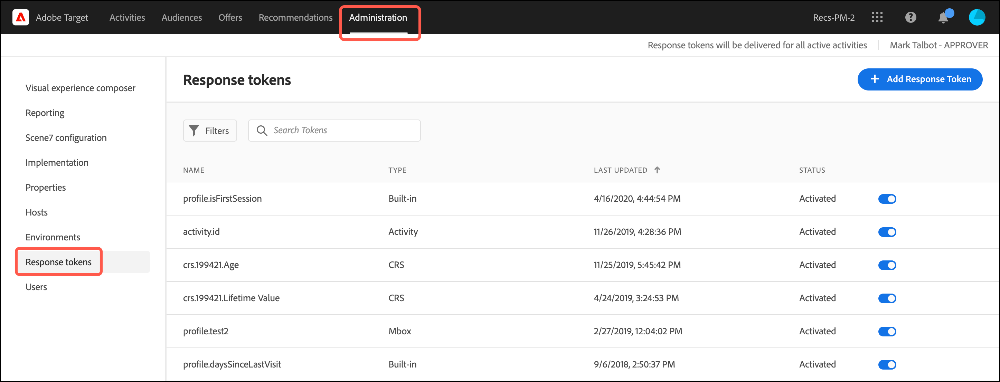
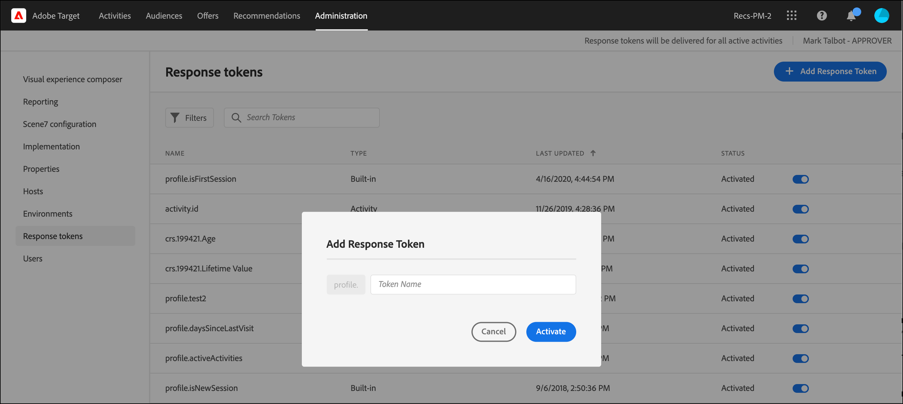

# Token di risposta

I token di risposta consentono di inviare automaticamente informazioni specifiche a [!DNL Adobe Target] alla pagina web del tuo marchio. Queste informazioni possono includere dettagli sull’attività, l’offerta, l’esperienza, il profilo utente, le informazioni geografiche e altro ancora. Questi dettagli forniscono dati di risposta aggiuntivi da condividere con strumenti interni o di terze parti o da utilizzare per il debug.

I token di risposta consentono di scegliere le variabili (in coppie di valori chiave) da utilizzare e quindi di inviarle come parte di un [!DNL Target] risposta. Abilita una variabile utilizzando lo switch e la variabile viene inviata con [!DNL Target] che possono essere convalidate nelle chiamate di rete. I token di risposta funzionano anche in [!UICONTROL Anteprima] modalità.

Una differenza chiave tra plug-in e token di risposta è che i plug-in forniscono JavaScript alla pagina che viene eseguita al momento della consegna. I token di risposta, tuttavia, forniscono un oggetto che può quindi essere letto e seguito utilizzando i listener di eventi. L’approccio del token di risposta è più sicuro e consente di sviluppare e mantenere più facilmente le integrazioni di terze parti.

>[!NOTE]
>
>I token di risposta sono disponibili con at.js versione 1.1 o successiva.

| SDK di Target | Azioni suggerite |
|--- |--- |
| [Adobe Experience Platform Web SDK](https://experienceleague.adobe.com/docs/target-dev/developer/client-side/aep-web-sdk.html){target=_blank} | Assicurati di utilizzare Platform Web SDK versione 2.6.0 o successiva. Per informazioni sul download dell’ultima versione di Platform Web SDK, consulta [Installare l’SDK](https://experienceleague.adobe.com/docs/experience-platform/edge/fundamentals/installing-the-sdk.html){target=_blank} nel *Panoramica di Platform Web SDK* guida. Per informazioni sulle nuove funzionalità in ogni versione di Platform Web SDK, consulta [Note sulla versione](https://experienceleague.adobe.com/docs/experience-platform/edge/release-notes.html?lang=it) nel *Panoramica di Platform Web SDK* guida. |
| [at.js](https://experienceleague.adobe.com/docs/target-dev/developer/client-side/at-js-implementation/at-js/how-atjs-works.html){target=_blank} | Assicurati di utilizzare at.js nella versione 1.1 o successiva. Per informazioni su come scaricare l’ultima versione di at.js, consulta [Scaricare at.js](https://experienceleague.adobe.com/docs/target-dev/developer/client-side/at-js-implementation/deploy-at-js/implement-target-without-a-tag-manager.html?lang=en){target=_blank}. For information about new functionality in each version of at.js, see [at.js Version Details](https://experienceleague.adobe.com/docs/target-dev/developer/client-side/at-js-implementation/target-atjs-versions.html){target=_blank}.<br>I clienti che utilizzano at.js sono incoraggiati a utilizzare i token di risposta e ad abbandonare i plug-in. Alcuni plug-in che si basano su metodi interni esistenti in mbox.js (ora obsoleto), ma non in at.js, vengono consegnati ma non hanno esito positivo. |

## Utilizzo dei token di risposta {#section_A9E141DDCBA84308926E68D05FD2AC62}

1. Assicurati di utilizzare Platform Web SDK versione 2.6.0 (o successiva) o at.js versione 1.1 (o successiva).

   Per ulteriori informazioni:

   * **Platform Web SDK**: vedi [Installare l’SDK](https://experienceleague.adobe.com/docs/experience-platform/edge/fundamentals/installing-the-sdk.html) nel *Panoramica di Platform Web SDK* guida.
   * **at.js**: vedi [Scarica at.js](https://experienceleague.adobe.com/docs/target-dev/developer/client-side/at-js-implementation/deploy-at-js/implement-target-without-a-tag-manager.html){target=_blank}.

1. In entrata [!DNL Target], fai clic su **[!UICONTROL Amministrazione]** > **[!UICONTROL Token di risposta]**.

   

1. Attiva i token di risposta desiderati, ad esempio `activity.id` e `offer.id`.

   Per impostazione predefinita sono disponibili i seguenti parametri:

   | Tipo | Parametro | Note |
   |--- |--- |--- |
   | Profili incorporati | `profile.activeActivities` | Restituisce una matrice dei codici `activityIds` per i quali il visitatore si qualifica. Viene incrementato man mano che gli utenti si qualificano. Ad esempio, in una pagina con due [!DNL Target] richieste che distribuiscono due attività diverse; la seconda richiesta include entrambe le attività. |
   |  | `profile.isFirstSession` | Restituisce “vero” o “falso”. |
   |  | `profile.isNewSession` | Restituisce “vero” o “falso”. |
   |  | `profile.daysSinceLastVisit` | Restituisce il numero di giorni dall’ultima visita del visitatore. |
   |  | `profile.tntId` | Restituisce il codice tntID del visitatore. |
   |  | `profile.marketingCloudVisitorId` | Restituisce l’ID visitatore di Experience Cloud per il visitatore in oggetto. |
   |  | `profile.thirdPartyId` | Restituisce l’ID di terze parti del visitatore. |
   |  | `profile.categoryAffinity` | Restituisce la categoria preferita del visitatore. |
   |  | `profile.categoryAffinities` | Restituisce una matrice delle 5 categorie principali del visitatore, sotto forma di stringhe. |
   | Attività | `activity.name`<br>`activity.id`<br>`experience.name`<br>`experience.id`<br>`offer.name`<br>`offer.id` | Dettagli dell’attività corrente.<br> I valori dei parametri dell’offerta vengono valutati a livello di esperienza. |
   | Geo | `geo.country`<br>`geo.state`<br>`geo.city`<br>`geo.zip`<br>`geo.dma`<br>`geo.domainName`<br>`geo.ispName`<br>`geo.connectionSpeed`<br>`geo.mobileCarrier` | Consulta [Geo](/help/main/c-target/c-audiences/c-target-rules/geo.md) per ulteriori informazioni sull’utilizzo del geotargeting nelle attività. |
   | Metodo di allocazione traffico<br>(Si applica a [!UICONTROL Targeting automatico] e [!UICONTROL Automated Personalization] solo attività). | `experience.trafficAllocationId` | Restituisce 0 se un visitatore ha ricevuto un’esperienza dal traffico &quot;di controllo&quot; e 1 se un visitatore ha ricevuto un’esperienza dalla distribuzione del traffico &quot;mirata&quot;. |
   |  | `experience.trafficAllocationType` | Restituire &quot;di controllo&quot; o &quot;mirato&quot;. |

   Nell’elenco vengono visualizzati anche gli attributi del profilo utente e gli attributi del cliente.

   >[!NOTE]
   >
   >I parametri con caratteri speciali non vengono visualizzati nell’elenco. Sono supportati solo caratteri alfanumerici e il trattino basso.

1. (Condizionale) Per utilizzare un parametro di profilo come token di risposta, ma il parametro non è stato trasmesso tramite un [!DNL Target] e non è stato quindi caricato in [!DNL Target] UI, puoi utilizzare il [!UICONTROL Aggiungi token di risposta] per aggiungere il profilo all’interfaccia utente.

   Clic **[!UICONTROL Aggiungi token di risposta]**, specifica il nome del token, quindi fai clic su **[!UICONTROL Attiva]**.

   

1. Crea un’attività.

## Ascoltare le risposte e leggere i token di risposta

Processo utilizzato per l&#39;ascolto [!DNL Target] risposte e token di risposta di lettura variano a seconda che si disponga di un [!DNL Platform Web SDK] o implementazione at.js.

###  [!DNL Platform Web SDK] utilizzo della classe oggetto Handle {#platform-web-sdk}

Utilizzare la classe Handle object, che dispone di un oggetto metadati e di un oggetto dati da ascoltare [!DNL Target] e leggere i token di risposta.

L’esempio di risposta seguente aggiunge una [!DNL Platform Web SDK] gestore eventi personalizzato direttamente nella pagina HTML (la tabella spiega gli oggetti utilizzati nel codice):

| Oggetto | Informazioni |
| --- | --- |
| Tipo: Personalization.decision | Se la decisione sia stata presa dal [!DNL Target] o dal provider di Offer decisioning. |
| DecisionProvider - TGT | TGT-[!DNL Target]. [!DNL Target] fornisce alla pagina i metadati e i valori del token di risposta. |
| Meta | Metadati passati alla pagina. |
| Dati | Valori dei metadati passati alla pagina. |

```html
<html>

<head>
 ...
 <script src="alloy.js"></script>
 <script>
  {
   "requestId": "4d0a7cfd-952c-408c-b3b8-438edc38250a",
   "handle": [{
    "type": "personalization:decisions",
    "payload": [{
     "id": "....",
     "scope": "__view__",
     "scopeDetails": {
      "decisionProvider": "TGT",
      "activity": {
       "id": "..."
      },
      "experience": {
       "id": "...."
      }
     },
     "items": [{
      "id": "123",
      "schema": "https://ns.adobe.com/personalization/dom-action",
      "meta": {
       "activity.id": "...",
       "activity.name": "...",
       "profile.foo": "...",
       "profile.bar": "..."
      },
      "data": {
       "id": "123",
       "type": "setHtml",
       "selector": "#foo",
       "prehidingSelector": "#foo",
       "content": "<div>Hello world</div>"
      }
     }]
    }]
   }]
  }
  });
 </script>
</head>

<body>
 ...
</body>

</html>
```

###  at.js utilizzando eventi personalizzati

Usa gli [eventi personalizzati di at.js](https://experienceleague.adobe.com/docs/target-dev/developer/client-side/at-js-implementation/functions-overview/atjs-custom-events.html?lang=en) per ascoltare la risposta della e leggere i token di risposta.{target=_blank}[!DNL Target]

Il codice di esempio seguente aggiunge un gestore di eventi personalizzati di [!DNL at.js] direttamente alla pagina HTML:

```html
<html> 
  <head> 
    .... 
    <script src="at.js"></script> 
    <script> 
      document.addEventListener(adobe.target.event.REQUEST_SUCCEEDED, function(e) { 
        console.log("Request succeeded", e.detail); 
      }); 
    </script> 
  <head> 
  <body> 
  ... 
  </body> 
</html>
```

## Domande frequenti sui token di risposta {#section_3DD5F32C668246289CDF9B4CDE1F536D}

**Quale ruolo è autorizzato ad attivare o disattivare i token di risposta?**

I token di risposta possono essere attivati o disattivati solo dagli utenti con [!DNL Target] [!UICONTROL Amministratore] ruolo.

**Cosa succede se eseguo [!DNL Platform Web SDK] 2.6.0 (o precedente)?**

Non hai accesso ai token di risposta.

**Cosa succede se eseguo at.js 1.0 (o versione precedente)?**

Puoi visualizzare i token di risposta, ma at.js non può utilizzarli.

**[!DNL Target Classic]È possibile avere attivi allo stesso tempo sia plug-in di che i token di risposta?**

Plug-in e token di risposta sono disponibili in parallelo; tuttavia, i plug-in diventeranno obsoleti in futuro.

**I token di risposta vengono consegnati tramite tutti [!DNL Target] risposte o solo tramite [!DNL Target] risposte che forniscono un’attività?**

I token di risposta vengono consegnati solo tramite [!DNL Target] le risposte che forniscono un’attività.

**I miei [!DNL Target Classic] Il plug-in include JavaScript. Come posso riprodurne la funzionalità utilizzando i token di risposta?**

Durante la migrazione ai token di risposta, questo tipo di JavaScript deve essere mantenuto nella soluzione di base di codice o di gestione dei tag. Puoi attivare questo codice utilizzando [!DNL Platform Web SDK] o [!DNL at.js] personalizza gli eventi e passa i valori del token di risposta alle funzioni JavaScript.

**Perché il mio parametro profilo/attributi del cliente non viene visualizzato nell’elenco dei token di risposta?**

[!DNL Target] in genere aggiorna i parametri ogni 15 minuti. Questo aggiornamento dipende dall’azione dell’utente e i dati vengono aggiornati solo quando viene visualizzata la pagina dei token di risposta. Se i parametri non vengono visualizzati nell’elenco dei token di risposta, [!DNL Target] non ha ancora aggiornato i dati.

Inoltre, se il parametro contiene solo caratteri non alfanumerici o simboli diversi dai caratteri di sottolineatura, il parametro non viene visualizzato nell&#39;elenco. Attualmente sono supportati solo caratteri alfanumerici e il trattino basso.

**Il token di risposta fornisce ancora contenuto se utilizza uno script di profilo eliminato o un parametro di profilo?**

I token di risposta estraggono informazioni dai profili utente e quindi recapitano tali informazioni. Se elimini uno script o un parametro di profilo, le informazioni non vengono necessariamente rimosse dai profili utente. I profili utente dispongono ancora di dati corrispondenti allo script del profilo. Il token di risposta continua a distribuire il contenuto. Per gli utenti che non hanno tali informazioni salvate nei loro profili o per i nuovi visitatori, tale token non viene consegnato perché i dati non sono presenti nei loro profili.

[!DNL Target] non disattiva automaticamente il token. Se elimini uno script di profilo e non desideri più che il token venga consegnato, devi disattivare il token manualmente.

**Ho rinominato il mio script di profilo, ma il token che utilizza lo script è ancora attivo con il vecchio nome. Perché?**

Come accennato in precedenza, i token di risposta funzionano sulle informazioni del profilo salvate per gli utenti. Anche se hai rinominato lo script di profilo, gli utenti che hanno visitato il tuo sito web hanno il valore dello script di profilo precedente salvato nei loro profili. Il token continua a raccogliere il vecchio valore già salvato nei profili utente. Se ora desideri consegnare il contenuto del nuovo nome, devi disattivare il token precedente e attivare quello nuovo.

**Se gli attributi sono stati modificati, quando verranno rimossi dall&#39;elenco?**

[!DNL Target] esegue un aggiornamento degli attributi a intervalli regolari. Qualsiasi attributo non attivato viene rimosso durante il successivo aggiornamento. Tuttavia, se l&#39;attributo è stato attivato e rimosso, lo script non viene rimosso dall&#39;elenco degli attributi fino a quando non viene disattivato. Ad esempio, hai rimosso uno script di profilo utilizzato come token. [!DNL Target] rimuove dall’elenco solo gli attributi disattivati quando vengono eliminati o rinominati.

## Invia dati a Google Analytics

Le sezioni seguenti descrivono come inviare [!DNL Target] dati alle Google Analytics. I dati inviati dai token di risposta possono essere inviati anche ad altre integrazioni di terze parti.

###  Invio di dati a Google Analytics tramite Platform Web SDK

È possibile inviare i dati alle Google Analytics tramite Platform Web SDK versione 2.6.0 (o successiva) aggiungendo il seguente codice nella pagina di HTML.

>[!NOTE]
>
>Assicurati che la coppia di valori chiave del token di risposta sia sotto `alloy("sendEvent"` oggetto.

```
<script type="text/javascript"> 
   (function(i, s, o, g, r, a, m) { 
   i['GoogleAnalyticsObject'] = r; 
   i[r] = i[r] || function() { 
   (i[r].q = i[r].q || []).push(arguments) 
   }, i[r].l = 1 * new Date(); 
   
   
   a = s.createElement(o), 
   m = s.getElementsByTagName(o)[0]; 
   a.async = 1; 
   a.src = g; 
   m.parentNode.insertBefore(a, m) 
   })(window, document, 'script', 'https://www.google-analytics.com/analytics.js', 'ga'); 
   ga('create', 'Google Client Id', 'auto'); 
</script> 
<script type="text/javascript">
   alloy("sendEvent", {
   
   
   })
   .then(({ renderedPropositions, nonRenderedPropositions }) => {
   // concatenate all the propositions
   const propositions = [...renderedPropositions, ...nonRenderedPropositions];
   // extractResponseTokens() extract the meta from item -> meta
   const tokens = extractResponseTokens(propositions);
   const activityNames = []; 
   const experienceNames = []; 
   const uniqueTokens = distinct(tokens); 
   
   
   uniqueTokens.forEach(token => { 
   activityNames.push(token["activity.name"]); 
   experienceNames.push(token["experience.name"]); 
   }); 
   
   
   ga('send', 'event', { 
   eventCategory: "target", 
   eventAction: experienceNames, 
   eventLabel: activityNames 
   }); 
   
   
   });
</script>
```

###  Invio di dati a Google Analytics tramite at.js {#section_04AA830826D94D4EBEC741B7C4F86156}

Puoi inviare dati a Google Analytics tramite at.js aggiungendo il seguente codice alla pagina HTML:

```javascript
<script type="text/javascript"> 
  (function(i, s, o, g, r, a, m) { 
    i['GoogleAnalyticsObject'] = r; 
    i[r] = i[r] || function() { 
      (i[r].q = i[r].q || []).push(arguments) 
    }, i[r].l = 1 * new Date(); 
    a = s.createElement(o), 
      m = s.getElementsByTagName(o)[0]; 
    a.async = 1; 
    a.src = g; 
    m.parentNode.insertBefore(a, m) 
  })(window, document, 'script', 'https://www.google-analytics.com/analytics.js', 'ga'); 
  ga('create', 'Google Client Id', 'auto'); 
</script> 
 
<script type="text/javascript"> 
  document.addEventListener(adobe.target.event.REQUEST_SUCCEEDED, function(e) { 
    var tokens = e.detail.responseTokens; 
 
    if (isEmpty(tokens)) { 
      return; 
    } 
 
    var activityNames = []; 
    var experienceNames = []; 
    var uniqueTokens = distinct(tokens); 
 
    uniqueTokens.forEach(function(token) { 
      activityNames.push(token["activity.name"]); 
      experienceNames.push(token["experience.name"]); 
    }); 
 
    ga('send', 'event', { 
      eventCategory: "target", 
      eventAction: experienceNames, 
      eventLabel: activityNames 
    }); 
  }); 
 
  function isEmpty(val) { 
    return (val === undefined || val == null || val.length <= 0) ? true : false; 
  } 
 
  function key(obj) { 
     return Object.keys(obj) 
    .map(function(k) { return k + "" + obj[k]; }) 
    .join(""); 
  } 
 
  function distinct(arr) { 
    var result = arr.reduce(function(acc, e) { 
      acc[key(e)] = e; 
      return acc; 
    }, {}); 
   
    return Object.keys(result) 
    .map(function(k) { return result[k]; }); 
  } 
</script>
```

## Eseguire il debug

Le sezioni seguenti forniscono informazioni sul debug dei token di risposta:

###  Google Analytics e debug

Il codice seguente consente di eseguire il debug utilizzando le Google Analytics:

```javascript
<script type="text/javascript"> 
  (function(i, s, o, g, r, a, m) { 
    i['GoogleAnalyticsObject'] = r; 
    i[r] = i[r] || function() { 
      (i[r].q = i[r].q || []).push(arguments) 
    }, i[r].l = 1 * new Date(); 
    a = s.createElement(o), 
      m = s.getElementsByTagName(o)[0]; 
    a.async = 1; 
    a.src = g; 
    m.parentNode.insertBefore(a, m) 
  })(window, document, 'script', 'https://www.google-analytics.com/analytics.js', 'ga'); 
  ga('create', 'Google Client Id', 'auto'); 
</script> 
 
<script type="text/javascript"> 
  document.addEventListener(adobe.target.event.REQUEST_SUCCEEDED, function(e) { 
    var tokens = e.detail.responseTokens; 
 
    if (isEmpty(tokens)) { 
      return; 
    } 
 
    var activityNames = []; 
    var experienceNames = []; 
    var uniqueTokens = distinct(tokens); 
 
    uniqueTokens.forEach(function(token) { 
      activityNames.push(token["activity.name"]); 
      experienceNames.push(token["experience.name"]); 
    }); 
 
    ga('send', 'event', { 
      eventCategory: "target", 
      eventAction: experienceNames, 
      eventLabel: activityNames 
    }); 
  }); 
 
  function isEmpty(val) { 
    return (val === undefined || val == null || val.length <= 0) ? true : false; 
  } 
 
  function key(obj) { 
     return Object.keys(obj) 
    .map(function(k) { return k + "" + obj[k]; }) 
    .join(""); 
  } 
 
  function distinct(arr) { 
    var result = arr.reduce(function(acc, e) { 
      acc[key(e)] = e; 
      return acc; 
    }, {}); 
   
    return Object.keys(result) 
    .map(function(k) { return result[k]; }); 
  } 
```

### Debug con l’equivalente del plug-in ttMeta

L’equivalente del plug-in ttMeta per scopi di debug può essere creato aggiungendo il seguente codice alla pagina HTML:

```javascript
<script type="text/javascript" > 
  document.addEventListener(adobe.target.event.REQUEST_SUCCEEDED, function (e) { 
    window.ttMETA= typeof(window.ttMETA)!="undefined" ? window.ttMETA : []; 
 
    var tokens=e.detail.responseTokens; 
 
    if (isEmpty(tokens)) { 
      return; 
    } 
     
    var uniqueTokens = distinct(tokens); 
 
    uniqueTokens.forEach(function(token) { 
      window.ttMETA.push({ 
        'CampaignName': token["activity.name"], 
        'CampaignId' : token["activity.id"], 
        'RecipeName': token["experience.name"], 
        'RecipeId': token["experience.id"], 
        'OfferId': token["offer.id"], 
        'OfferName': token["offer.name"], 
        'MboxName': e.detail.mbox}); 
      console.log(ttMETA); 
    }); 
  }); 
 
  function isEmpty(val){ 
    return (val === undefined || val == null || val.length <= 0) ? true : false; 
  } 
 
  function key(obj) { 
     return Object.keys(obj) 
    .map(function(k) { return k + "" + obj[k]; }) 
    .join(""); 
  } 
 
  function distinct(arr) { 
    var result = arr.reduce(function(acc, e) { 
      acc[key(e)] = e; 
      return acc; 
    }, {}); 
   
    return Object.keys(result) 
    .map(function(k) { return result[k]; }); 
  } 
</script>
```

##  Video di formazione: Token di risposta ed eventi personalizzati at. js {#section_3AA0A6C8DBD94A528337A2525E3E05D5}

Il video seguente spiega come utilizzare i token di risposta e gli eventi personalizzati at.js per condividere le informazioni del profilo da [!DNL Target] a sistemi di terze parti.

>[!NOTE]
>
>L’interfaccia utente di [!DNL Target] del menu [!UICONTROL Amministrazione] (precedentemente [!UICONTROL Configurazione]) è stato riprogettato per fornire prestazioni migliori, ridurre il tempo di manutenzione necessario durante il rilascio di nuove funzioni e migliorare l’esperienza utente nel prodotto. Le informazioni contenute nel video seguente sono corrette; tuttavia, le opzioni si trovano in posizioni leggermente diverse.
>
>Il video menziona `option.name` e `option.id`, che sono stati sostituiti con `offer.name` e `offer.id`, rispettivamente.

>[!VIDEO](https://video.tv.adobe.com/v/23253/)
